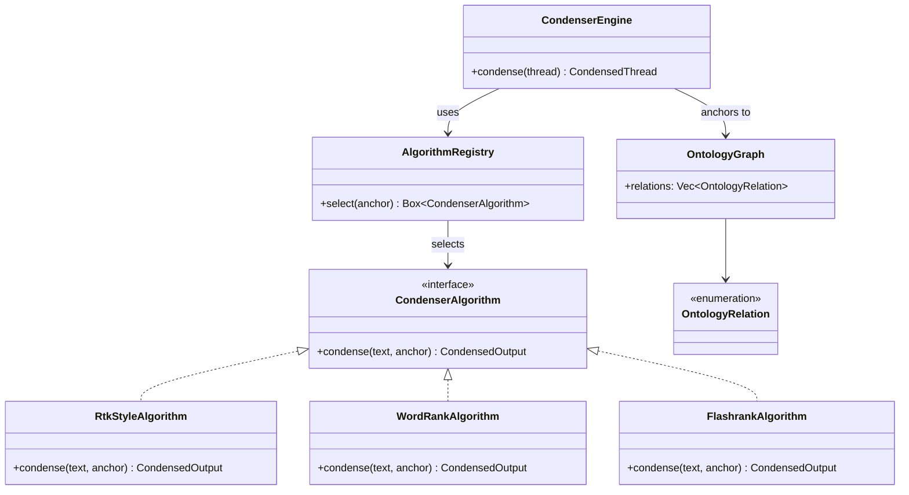

# hkask-condenser — Reference

`hkask-condenser` implements thread condensation for hKask. It compresses
agent conversation threads by extracting salient passages using domain
saliency, persona scoring, and ontology-anchored keyword matching. The crate
provides three condensation algorithms and an `AlgorithmRegistry` that selects
among them.

## Source citations

| Symbol | Location |
|--------|----------|
| `CondenserEngine` | `kask/crates/hkask-condenser/src/engine.rs:39` |
| `CondenserAlgorithm` trait | `kask/crates/hkask-condenser/src/algorithms.rs:33` |
| `RtkStyleAlgorithm` | `kask/crates/hkask-condenser/src/algorithms.rs:49` |
| `WordRankAlgorithm` | `kask/crates/hkask-condenser/src/algorithms.rs:119` |
| `FlashrankAlgorithm` | `kask/crates/hkask-condenser/src/algorithms.rs:429` |
| `AlgorithmRegistry` | `kask/crates/hkask-condenser/src/algorithms.rs:576` |
| `domain_saliency` fn | `kask/crates/hkask-condenser/src/algorithms.rs:231` |
| `classify_tool` fn | `kask/crates/hkask-condenser/src/algorithms.rs:654` |
| `derive_ontology_anchor` | `kask/crates/hkask-condenser/src/algorithms.rs:680` |
| `OntologyGraph` | `kask/crates/hkask-condenser/src/ontology_graph.rs:43` |
| `OntologyRelation` enum | `kask/crates/hkask-condenser/src/ontology_graph.rs:28` |
| `score_against_persona` | `kask/crates/hkask-condenser/src/saliency.rs:52` |
| `extract_query_words` | `kask/crates/hkask-condenser/src/saliency.rs:91` |
| `score_memory_results` | `kask/crates/hkask-condenser/src/saliency.rs:104` |
| `format_conversation_text` | `kask/crates/hkask-condenser/src/inference.rs:22` |
| `build_summarization_prompt` | `kask/crates/hkask-condenser/src/inference.rs:36` |

## Algorithm model

The `CondenserAlgorithm` trait (`algorithms.rs:33`) defines the interface for
condensation algorithms. Three implementations are provided:
`RtkStyleAlgorithm` (`algorithms.rs:49`), `WordRankAlgorithm`
(`algorithms.rs:119`), and `FlashrankAlgorithm` (`algorithms.rs:429`). The
`AlgorithmRegistry` (`algorithms.rs:576`) selects among them.

<!-- DIAGRAM_ALIGNMENT
id: DIAG-DIA-COND-001
verified_date: 2026-07-27
verified_against: kask/crates/hkask-condenser/src/algorithms.rs:33,49,119,429,576; kask/crates/hkask-condenser/src/engine.rs:39; kask/crates/hkask-condenser/src/ontology_graph.rs:43,28
status: VERIFIED
-->

## Saliency functions

The `domain_saliency` function (`algorithms.rs:231`) scores a text line
against an optional `OntologyAnchor`. The `score_against_persona` function
(`saliency.rs:52`) scores text against persona keywords. The
`extract_query_words` function (`saliency.rs:91`) extracts query terms from
text. The `score_memory_results` function (`saliency.rs:104`) scores memory
recall results by count.

## Ontology graph

The `OntologyGraph` (`ontology_graph.rs:43`) holds the ontology relation
structure used for anchoring. The `OntologyRelation` enum
(`ontology_graph.rs:28`) defines the relation types. The `graph()` function
(`ontology_graph.rs:310`) returns a static graph instance. The
`anchor_keywords` function (`ontology_graph.rs:316`) returns keywords for a
given anchor.

## Tool classification

The `classify_tool` function (`algorithms.rs:654`) maps a tool name to a
`ContextCategory`. The `derive_ontology_anchor` function
(`algorithms.rs:680`) derives an `OntologyAnchor` from a tool name. These
functions connect tool invocations to the ontology graph for saliency
scoring.

## See also

- [hkask-condenser Explanation](./explanation.md): state diagram of the
  2-phase condensation process.
- [`kask/docs/architecture/salience-specification.md`](../../architecture/salience-specification.md):
  the passage salience algorithm specification.
- [hkask-types Reference](../hkask-types/reference.md): the `MemoryPort`
  trait that consumes condensed threads.

---

[^salience]: Itti, L., Koch, C., & Niebur, E. (1998). *A model of saliency-based visual attention for rapid scene analysis.* IEEE Transactions on Pattern Analysis and Machine Intelligence, 20(11), 1254-1259. <https://ieeexplore.ieee.org/document/730558>. The saliency model that the domain_saliency function adapts for text.
