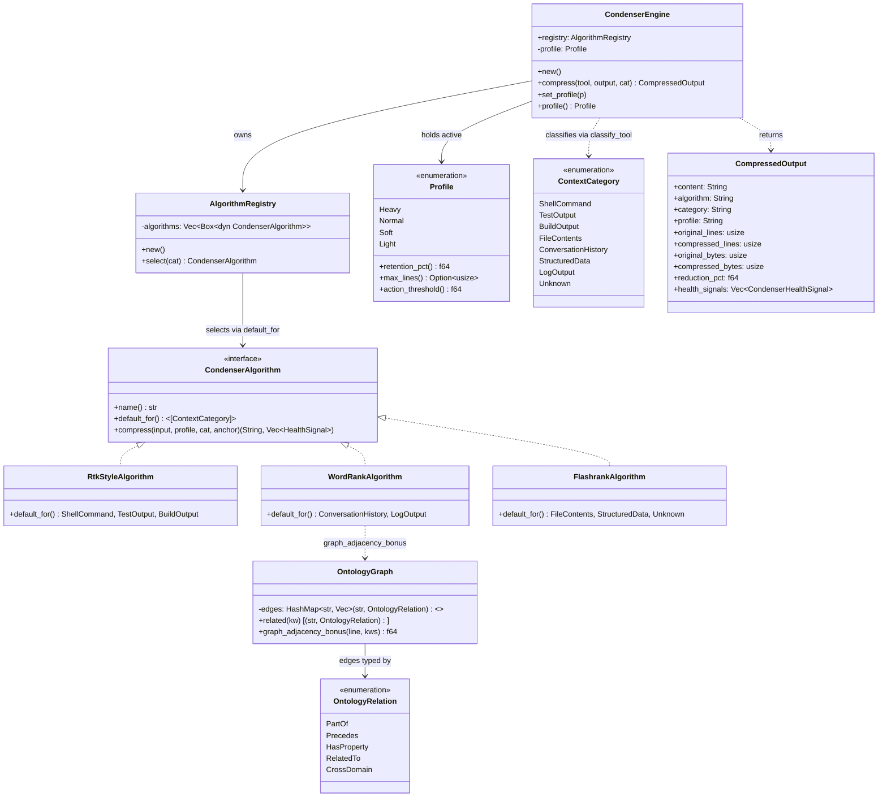

# hkask-condenser — Reference

`hkask-condenser` is the pure domain crate for context condensation. It
classifies each tool result into a `ContextCategory`, derives an
`OntologyAnchor` from the tool name, selects a `CondenserAlgorithm` via
the `AlgorithmRegistry`, and scores lines by TF-IDF word frequency,
structural bonuses, and domain saliency. The crate provides three
algorithms and a `CondenserEngine` that dispatches compression via the
static `default_for()` mapping. No MCP, no HTTP, no async — the crate is
fully testable in-process.

## Source citations

All line numbers re-verified against the current tree on 2026-08-28 via
`grep -n`. Surfaces that earlier revisions described —
`derive_ontology_anchor`, `score_against_persona`, `extract_query_words`,
`score_memory_results`, `PersistRequest`, `ThreadSummaryRequest`, and a
`Contains` variant on `OntologyRelation` — do not exist in the current
tree and are intentionally absent. The ontology types
(`OntologyAnchor`, `OntologyAxis`, `OntologyNamespace`,
`select_ontology_anchor`) live in the shared `hkask-bridge-ontology`
crate and are re-exported `pub(crate)` from `types.rs:19-21`.

| Symbol | Location |
|--------|----------|
| `CondenserEngine` | `kask/crates/hkask-condenser/src/engine.rs:29` |
| `CondenserEngine::new` | `kask/crates/hkask-condenser/src/engine.rs:41` |
| `CondenserEngine::compress` | `kask/crates/hkask-condenser/src/engine.rs:48` |
| `CondenserEngine::set_profile` | `kask/crates/hkask-condenser/src/engine.rs:100` |
| `CondenserEngine::profile` | `kask/crates/hkask-condenser/src/engine.rs:105` |
| `CondenserAlgorithm` trait (`pub(crate)`) | `kask/crates/hkask-condenser/src/algorithms.rs:33` |
| `RtkStyleAlgorithm` | `kask/crates/hkask-condenser/src/algorithms.rs:48` |
| `WordRankAlgorithm` (`pub(crate)`) | `kask/crates/hkask-condenser/src/algorithms.rs:115` |
| `FlashrankAlgorithm` | `kask/crates/hkask-condenser/src/algorithms.rs:319` |
| `AlgorithmRegistry` (`pub(crate)`) | `kask/crates/hkask-condenser/src/algorithms.rs:463` |
| `AlgorithmRegistry::new` | `kask/crates/hkask-condenser/src/algorithms.rs:474` |
| `AlgorithmRegistry::select` | `kask/crates/hkask-condenser/src/algorithms.rs:483` |
| `compute_budget` (`pub(crate)`) | `kask/crates/hkask-condenser/src/algorithms.rs:26` |
| `line_score` (WordRank, private) | `kask/crates/hkask-condenser/src/algorithms.rs:124` |
| `domain_saliency` (`pub(crate)`) | `kask/crates/hkask-condenser/src/algorithms.rs:224` |
| `KEYWORD_CATEGORIES` const | `kask/crates/hkask-condenser/src/algorithms.rs:498` |
| `classify_tool` | `kask/crates/hkask-condenser/src/algorithms.rs:518` |
| `join_with_ellipsis` (private) | `kask/crates/hkask-condenser/src/algorithms.rs:6` |
| `OntologyRelation` (`pub(crate)`) | `kask/crates/hkask-condenser/src/ontology_graph.rs:27` |
| `OntologyGraph` (`pub(crate)`) | `kask/crates/hkask-condenser/src/ontology_graph.rs:41` |
| `OntologyGraph::build` (private) | `kask/crates/hkask-condenser/src/ontology_graph.rs:48` |
| `OntologyGraph::related` | `kask/crates/hkask-condenser/src/ontology_graph.rs:250` |
| `OntologyGraph::graph_adjacency_bonus` | `kask/crates/hkask-condenser/src/ontology_graph.rs:260` |
| `GRAPH` OnceLock | `kask/crates/hkask-condenser/src/ontology_graph.rs:275` |
| `graph()` | `kask/crates/hkask-condenser/src/ontology_graph.rs:278` |
| `anchor_keywords` (`pub(crate)`) | `kask/crates/hkask-condenser/src/ontology_graph.rs:284` |
| `word_frequencies` (`pub(crate)`) | `kask/crates/hkask-condenser/src/saliency.rs:13` |
| `Profile` enum | `kask/crates/hkask-condenser/src/types.rs:29` |
| `Profile::retention_pct` | `kask/crates/hkask-condenser/src/types.rs:39` |
| `Profile::action_threshold` | `kask/crates/hkask-condenser/src/types.rs:62` |
| `Profile::max_lines` | `kask/crates/hkask-condenser/src/types.rs:71` |
| `ContextCategory` enum | `kask/crates/hkask-condenser/src/types.rs:110` |
| `CompressedOutput` | `kask/crates/hkask-condenser/src/types.rs:154` |
| `CondenserHealthSignal` | `kask/crates/hkask-condenser/src/types.rs:177` |
| `OntologyAnchor` (bridge re-export) | `kask/crates/hkask-bridge-ontology/src/axis.rs:126` |
| `OntologyAxis` | `kask/crates/hkask-bridge-ontology/src/axis.rs:33` |
| `OntologyNamespace` | `kask/crates/hkask-bridge-ontology/src/axis.rs:47` |
| `select_ontology_anchor` | `kask/crates/hkask-bridge-ontology/src/axis.rs:210` |

## Class diagram

The `CondenserAlgorithm` trait (`algorithms.rs:33`) defines the
compression interface: `name`, `default_for`, and `compress` (there is no
`description` method). Three implementations are registered in
`AlgorithmRegistry` (`algorithms.rs:463`). `CondenserEngine`
(`engine.rs:29`) owns the registry and the active `Profile`. The ontology
graph (`ontology_graph.rs:41`) supplies the adjacency bonus used by
`domain_saliency`.



<!-- DIAGRAM_ALIGNMENT
id: DIAG-COND-003
verified_date: 2026-08-28
verified_against: kask/crates/hkask-condenser/src/algorithms.rs:33,48,115,319,463,483; kask/crates/hkask-condenser/src/engine.rs:29,48,100,105; kask/crates/hkask-condenser/src/ontology_graph.rs:27,41,250,260; kask/crates/hkask-condenser/src/types.rs:29,110,154
status: VERIFIED
-->

## Algorithms

### RtkStyleAlgorithm (`algorithms.rs:48`)

Head/tail ellipsis truncation. Keeps the first N and last M lines with a
`...` separator. The head/tail split is ontology-aware: the anchor's
`density_factor` (`kask/crates/hkask-bridge-ontology/src/axis.rs:162`)
adjusts the head ratio via `(0.3 / density_factor).clamp(0.15, 0.5)`
(`algorithms.rs:77`), so FIBO financial data (density 1.3) gets more
tail. Emits a `negative_compression` health signal if the result is
larger than the input (`algorithms.rs:95-110`).

### WordRankAlgorithm (`algorithms.rs:115`)

TF-IDF bag-of-words compression with structural bonus and ontology
anchoring. Scores every line via `line_score` (`algorithms.rs:124`):

```
score = TF-IDF_average + structural_bonus + domain_saliency
```

- **TF-IDF_average:** mean word frequency across the input — rare words
  score higher. Word frequencies are computed by
  `saliency::word_frequencies` (`saliency.rs:13`), the canonical
  implementation the algorithm delegates to.
- **structural_bonus:** error/warning/heading/list weights in the
  `line_score` body (`algorithms.rs:124-153`).
- **domain_saliency:** direct domain keyword scoring plus the graph
  adjacency bonus via `domain_saliency` (`algorithms.rs:224`).

Emits a `low_signal` health signal when most lines score 0.0 (see the
`signal_type` field documentation, `types.rs:180`).

### FlashrankAlgorithm (`algorithms.rs:319`)

Greedy marginal-utility selection under a token budget, balancing
relevance, novelty, and brevity. Emits a `budget_shortfall` health signal
when fewer lines than the budget are selected (`signal_type` doc,
`types.rs:180`). It is the universal fallback: registered last, and
`AlgorithmRegistry::select` (`algorithms.rs:483`) returns the last
algorithm when no `default_for()` matches (`algorithms.rs:489-492`).

## Saliency module

The `saliency` module (`saliency.rs`) exposes a single canonical helper —
`word_frequencies` (`saliency.rs:13`): lowercase word → normalized
frequency (0.0–1.0) for words with length > 2. `WordRankAlgorithm`
delegates here instead of maintaining a copy. There are no other public
saliency functions in the current tree.

## Ontology graph

The `OntologyGraph` (`ontology_graph.rs:41`) is a lightweight
cross-domain concept relationship index built once at startup via the
`GRAPH` `OnceLock` (`:275`, initialized through `graph()` at `:278`). It
encodes relationships across PKO, SUMO, FIBO, GOLEM, ML-Schema, and
cross-domain bridges. The `OntologyRelation` enum (`:27`) defines five
relation types: `PartOf`, `Precedes`, `HasProperty`, `RelatedTo`,
`CrossDomain` (module doc table, `ontology_graph.rs:12-20`).

`anchor_keywords` (`:284`) maps an `OntologyAnchor` to the keywords used
for graph lookup. `graph_adjacency_bonus` (`:260`) adds 0.15 per related
concept found in a line, capped at 0.5 (doc comment, `:258-259`).

## Tool classification and anchor derivation

`classify_tool` (`algorithms.rs:518`) maps a tool name to a
`ContextCategory` in two phases: exact token match on `_`/`-`-split
parts (`:522-529`), then substring fallback (`:531-538`). The keyword
table is `KEYWORD_CATEGORIES` (`:498`).

The anchor is derived inside `CondenserEngine::compress`
(`engine.rs:60`) by calling `select_ontology_anchor`
(`kask/crates/hkask-bridge-ontology/src/axis.rs:210`) directly — there is
no `derive_ontology_anchor` wrapper in the current tree. The anchor
exposes `confidence_modifier` (`axis.rs:149`), `density_factor`
(`axis.rs:162`), `axis` (`axis.rs:181`), and `tier_label` (`axis.rs:190`).

## Telemetry spans

The `hkask.condenser` tracing spans emitted at `engine.rs:68` and
`engine.rs:84` are diagnostic logging for human inspection, NOT
cybernetic feedback signals — which is why they ride the `hkask.*`
prefix rather than the reserved `reg.*` prefix (module doc,
`engine.rs:8-14`). Promoting a health signal to a ν-event would require
registering a `reg.*` namespace and wiring a consumer — neither exists
today (`types.rs:170-175`).

| Span | Fields | When |
|------|--------|------|
| `hkask.condenser` compress | `algorithm`, `category`, `tool_name`, `ontology_tier` | Every compression (`engine.rs:68`) |
| `hkask.condenser` compression_ratio | `reduction_pct`, `original_bytes`, `compressed_bytes`, `latency_ms` | Every compression (`engine.rs:84`) |

## Consumers

- `kask_bridge` — `BridgeThreadCondenser`
  (`kask/crates/kask_bridge/src/condenser_bridge.rs:22`): the runtime
  tool-result compression path wired into the agent turn loop via
  `agent::set_thread_condenser` (`crates/agent/src/agent.rs:3136`),
  gated on `kask.condenser.auto_compress_tool_results` (default off,
  `kask/crates/kask_bridge/src/settings.rs:279`).

## See also

- [hkask-condenser Explanation](./explanation.md): state diagram of the
  compression process and the ontology anchoring rationale.
- [hkask-condenser How-to](./how-to.md): tuning profiles and keyword
  weights.
- [hkask-condenser Tutorial](./tutorial.md): compressing your first tool
  output.

---

[^salience]: Itti, L., Koch, C., & Niebur, E. (1998). *A model of saliency-based visual attention for rapid scene analysis.* IEEE Transactions on Pattern Analysis and Machine Intelligence, 20(11), 1254–1259. <https://ieeexplore.ieee.org/document/730558>. The saliency model that the `domain_saliency` function adapts for text.
