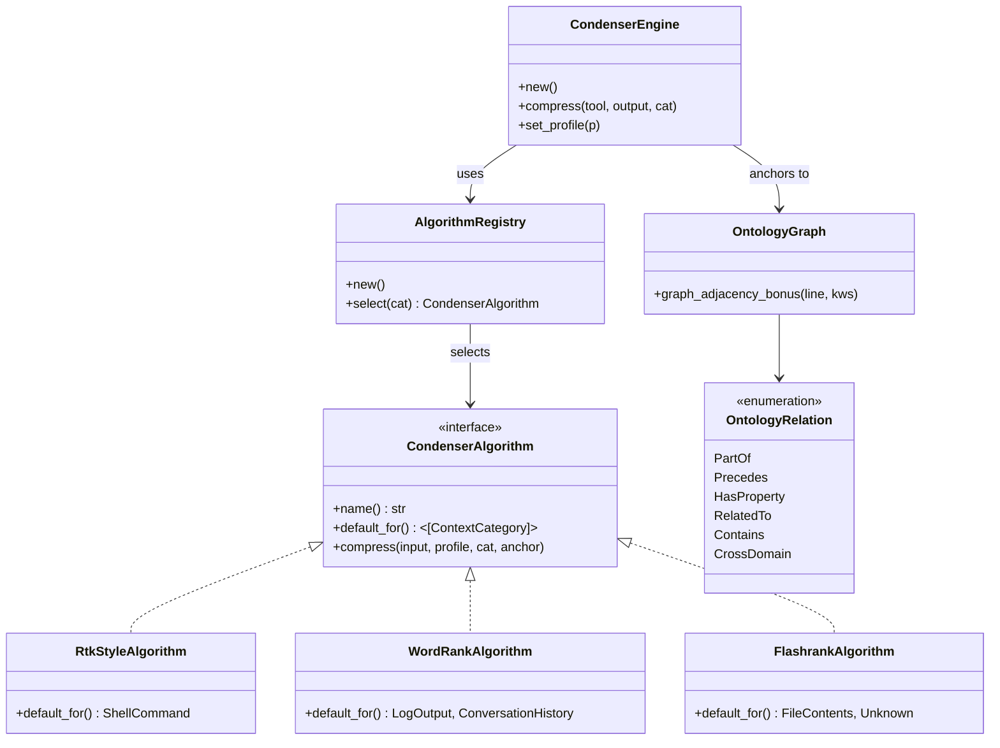

# hkask-condenser — Reference

`hkask-condenser` compresses agent tool-result output to fit the model's
context window. It classifies each tool result into a `ContextCategory`,
derives an `OntologyAnchor`, selects a `CondenserAlgorithm` via the
`AlgorithmRegistry`, and scores lines by domain saliency, persona keywords,
and structural bonuses. The crate provides three algorithms and a
`CondenserEngine` that dispatches compression via the static `default_for()`
mapping.

## Source citations

| Symbol | Location |
|--------|----------|
| `CondenserEngine` | `kask/crates/hkask-condenser/src/engine.rs:39` |
| `CondenserEngine::new` | `kask/crates/hkask-condenser/src/engine.rs:53` |
| `CondenserEngine::compress` | `kask/crates/hkask-condenser/src/engine.rs:62` |
| `CondenserAlgorithm` trait | `kask/crates/hkask-condenser/src/algorithms.rs:33` |
| `RtkStyleAlgorithm` | `kask/crates/hkask-condenser/src/algorithms.rs:49` |
| `WordRankAlgorithm` | `kask/crates/hkask-condenser/src/algorithms.rs:119` |
| `FlashrankAlgorithm` | `kask/crates/hkask-condenser/src/algorithms.rs:429` |
| `AlgorithmRegistry` | `kask/crates/hkask-condenser/src/algorithms.rs:576` |
| `AlgorithmRegistry::select` | `kask/crates/hkask-condenser/src/algorithms.rs:596` |
| `domain_saliency` fn | `kask/crates/hkask-condenser/src/algorithms.rs:231` |
| `classify_tool` fn | `kask/crates/hkask-condenser/src/algorithms.rs:654` |
| `derive_ontology_anchor` | `kask/crates/hkask-condenser/src/algorithms.rs:580` |
| `OntologyGraph` | `kask/crates/hkask-condenser/src/ontology_graph.rs:43` |
| `OntologyRelation` enum | `kask/crates/hkask-condenser/src/ontology_graph.rs:28` |
| `graph()` fn | `kask/crates/hkask-condenser/src/ontology_graph.rs:310` |
| `anchor_keywords` fn | `kask/crates/hkask-condenser/src/ontology_graph.rs:316` |
| `score_against_persona` | `kask/crates/hkask-condenser/src/saliency.rs:52` |
| `extract_query_words` | `kask/crates/hkask-condenser/src/saliency.rs:91` |
| `score_memory_results` | `kask/crates/hkask-condenser/src/saliency.rs:104` |
| `format_conversation_text` | `kask/crates/hkask-condenser/src/inference.rs:22` |
| `build_summarization_prompt` | `kask/crates/hkask-condenser/src/inference.rs:36` |
| `OntologyAnchor` enum | `kask/crates/hkask-condenser/src/types.rs:23` |
| `Profile` enum | `kask/crates/hkask-condenser/src/types.rs:217` |
| `ContextCategory` enum | `kask/crates/hkask-condenser/src/types.rs:298` |
| `CompressedOutput` | `kask/crates/hkask-condenser/src/types.rs:342` |

## Algorithm model

The `CondenserAlgorithm` trait (`algorithms.rs:33`) defines the interface for
compression algorithms. The trait method is `compress` (not `condense`); it
returns `(compressed_content, health_signals)`. Three implementations are
provided: `RtkStyleAlgorithm` (`algorithms.rs:49`),
`WordRankAlgorithm` (`algorithms.rs:119`), and `FlashrankAlgorithm`
(`algorithms.rs:429`). The `AlgorithmRegistry` (`algorithms.rs:576`) selects
among them via `select(category)` (`algorithms.rs:596`).

<!-- DIAGRAM_ALIGNMENT
id: DIAG-DIA-COND-001
verified_date: 2026-08-02
verified_against: kask/crates/hkask-condenser/src/algorithms.rs; kask/crates/hkask-condenser/src/engine.rs; kask/crates/hkask-condenser/src/ontology_graph.rs; kask/crates/hkask-condenser/src/types.rs
status: VERIFIED (v2 — learning subsystem removed; select_by_name/recommend_algorithm removed)
-->

## Saliency functions

The `domain_saliency` function (`algorithms.rs:231`) scores a text line
against an optional `OntologyAnchor`. It returns `direct + graph_bonus`:
`direct` is a per-namespace keyword-containment score (FIBO, SUMO, PKO,
GOLEM, ML-Schema), and `graph_bonus` is computed via
`OntologyGraph::graph_adjacency_bonus` using `anchor_keywords`
(`ontology_graph.rs:316`). The `score_against_persona` function
(`saliency.rs:52`) scores text against persona keywords. The
`extract_query_words` function (`saliency.rs:91`) extracts query terms from
text. The `score_memory_results` function (`saliency.rs:104`) scores memory
recall results by count.

## Ontology graph

The `OntologyGraph` (`ontology_graph.rs:43`) holds the ontology relation
structure used for anchoring. The `OntologyRelation` enum
(`ontology_graph.rs:28`) defines six relation types: `PartOf`, `Precedes`,
`HasProperty`, `RelatedTo`, `Contains`, `CrossDomain`. The `graph()` function
(`ontology_graph.rs:310`) returns a static `OntologyGraph` instance. The
`anchor_keywords` function (`ontology_graph.rs:316`) returns keywords for a
given anchor.

## Tool classification

The `classify_tool` function (`algorithms.rs:654`) maps a tool name to a
`ContextCategory` (`types.rs:298`) via exact token match, then substring
fallback. The `derive_ontology_anchor` function (`algorithms.rs:580`) derives
an `OntologyAnchor` (`types.rs:23`) from a tool name. These functions connect
tool invocations to the ontology graph for saliency scoring.

## See also

- [hkask-condenser Explanation](./explanation.md): state diagram of the
  compression process.
- [hkask-condenser How-to](./how-to.md): tuning salience weights.
- [hkask-types Reference](../hkask-types/reference.md): the `MemoryPort`
  trait that consumes compressed output.

---

[^salience]: Itti, L., Koch, C., & Niebur, E. (1998). *A model of saliency-based visual attention for rapid scene analysis.* IEEE Transactions on Pattern Analysis and Machine Intelligence, 20(11), 1254-1259. <https://ieeexplore.ieee.org/document/730558>. The saliency model that the domain_saliency function adapts for text.
