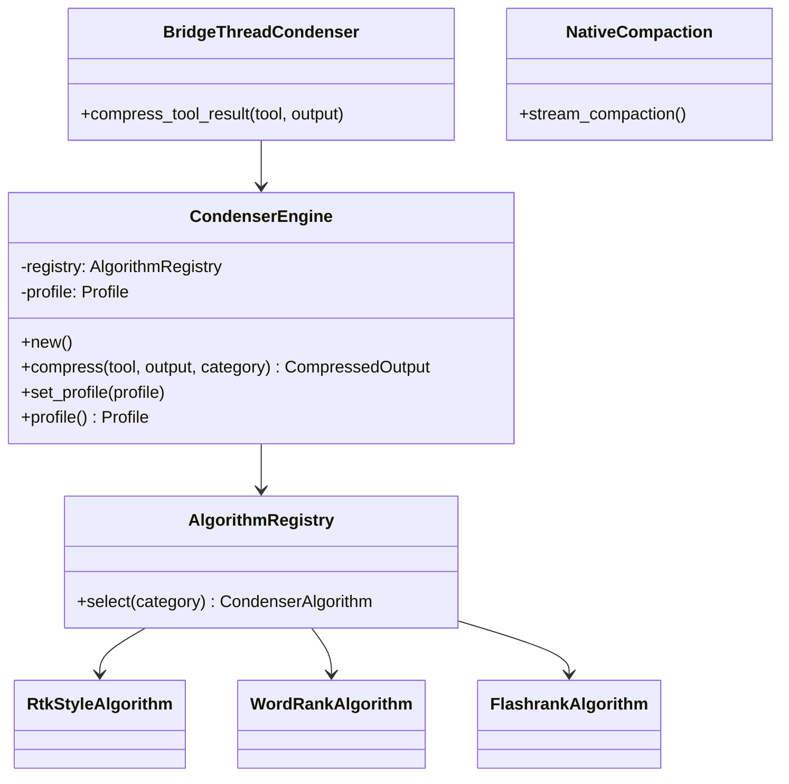
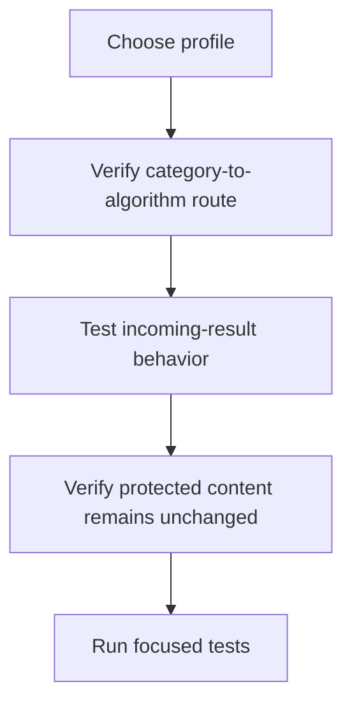

# hkask-condenser — Reference

`hkask-condenser` exposes synchronous compression domain logic. Public modules
are `engine` and `types`; algorithms, ontology graph, and saliency remain
crate-private (`kask/crates/hkask-condenser/src/hkask_condenser.rs:40-44`).

## Public types and methods

| Surface | Purpose | Evidence |
| --- | --- | --- |
| `CondenserEngine::new` | create a normal-profile engine | `kask/crates/hkask-condenser/src/engine.rs:40-46` |
| `CondenserEngine::compress` | classify, select, compress, and report metrics | `kask/crates/hkask-condenser/src/engine.rs:48-98` |
| `CondenserEngine::set_profile` / `profile` | mutate/read the active profile | `kask/crates/hkask-condenser/src/engine.rs:100-107` |
| `Profile` | heavy, normal, soft, light budgets | `kask/crates/hkask-condenser/src/types.rs:27-82` |
| `ContextCategory` | eight dispatch categories | `kask/crates/hkask-condenser/src/types.rs:84-96` |
| `CompressedOutput` | content, route, profile, size, reduction, signals | `kask/crates/hkask-condenser/src/types.rs:129-145` |
| `CondenserHealthSignal` | non-fatal algorithm anomaly data | `kask/crates/hkask-condenser/src/types.rs:147-169` |

## Class and integration diagram

```mermaid
classDiagram
    class CondenserEngine {
        -registry: AlgorithmRegistry
        -profile: Profile
        +new()
        +compress(tool, output, category) CompressedOutput
        +set_profile(profile)
        +profile() Profile
    }
    class AlgorithmRegistry {
        +select(category) CondenserAlgorithm
    }
    class RtkStyleAlgorithm
    class WordRankAlgorithm
    class FlashrankAlgorithm
    class BridgeThreadCondenser {
        +compress_tool_result(tool, output)
    }
    class NativeCompaction {
        +stream_compaction()
    }
    CondenserEngine --> AlgorithmRegistry
    AlgorithmRegistry --> RtkStyleAlgorithm
    AlgorithmRegistry --> WordRankAlgorithm
    AlgorithmRegistry --> FlashrankAlgorithm
    BridgeThreadCondenser --> CondenserEngine
```

<!-- DIAGRAM_ALIGNMENT
id: DIAG-COND-003
verified_date: 2026-09-28
verified_against: kask/crates/hkask-condenser/src/engine.rs:20-108; kask/crates/hkask-condenser/src/algorithms.rs:33-45; kask/crates/hkask-condenser/src/algorithms.rs:463-492; kask/crates/kask_bridge/src/condenser_bridge.rs:19-125; crates/agent/src/thread.rs:3687-3715
status: VERIFIED
-->

## Profiles

| Profile | Retention | Maximum lines | Evidence |
| --- | ---: | ---: | --- |
| `Heavy` | 0.10 | 30 | `kask/crates/hkask-condenser/src/types.rs:39-55` |
| `Normal` | 0.20 | 80 | `kask/crates/hkask-condenser/src/types.rs:39-55` |
| `Soft` | 0.60 | 200 | `kask/crates/hkask-condenser/src/types.rs:39-55` |
| `Light` | 0.95 | none | `kask/crates/hkask-condenser/src/types.rs:39-55` |

## Algorithm routes

| Algorithm | Default categories | Evidence |
| --- | --- | --- |
| `RtkStyleAlgorithm` | shell command, test output, build output | `kask/crates/hkask-condenser/src/algorithms.rs:46-60` |
| `WordRankAlgorithm` | conversation history, log output | `kask/crates/hkask-condenser/src/algorithms.rs:156-166` |
| `FlashrankAlgorithm` | file contents, structured data, unknown | `kask/crates/hkask-condenser/src/algorithms.rs:365-375` |

`classify_tool` performs exact token matching before substring fallback
(`kask/crates/hkask-condenser/src/algorithms.rs:516-546`). The engine derives
an ontology anchor from the tool name before invoking the selected algorithm
(`kask/crates/hkask-condenser/src/engine.rs:54-71`).

## Runtime bridge contract

`BridgeThreadCondenser` owns a mutex-protected engine and the incoming-result
auto-compression flag
(`kask/crates/kask_bridge/src/condenser_bridge.rs:19-39`). Its single method's
gate:

| Method | Gate | Mutation target | Evidence |
| --- | --- | --- | --- |
| `compress_tool_result` | `auto_compress_tool_results` must be true | incoming stored result text | `kask/crates/kask_bridge/src/condenser_bridge.rs:42-73` |

The exact protected source-tool list is at `crates/agent/src/thread.rs`
(`NO_COMPRESS_TOOLS`) — an ingestion policy.

## Compaction

Compaction does not use this package. The deterministic pre-shrink
(run-length collapse + head+tail windowing) is owned by
`crates/agent/src/kask_compaction.rs`, runs in-process on the summarizer's
request copy for both manual and automatic compaction, and is specified in
`kask/docs/architecture/compaction-pipeline-spec.md`. The composition root
installs the bridge for ingestion only
(`crates/zed/src/main.rs`).

## Diagnostics

The engine emits diagnostic `hkask.condenser` events for routing and reduction;
these are not `reg.*` feedback signals
(`kask/crates/hkask-condenser/src/engine.rs:8-14,63-97`). Health signals are
returned with content and describe anomalies rather than turning them into
compression failures (`kask/crates/hkask-condenser/src/types.rs:141-169`).

## Procedures

### Tune compression

Use this procedure to change compression aggressiveness and verify the runtime
entry point without changing native summary persistence.

```mermaid
flowchart TD
    A[Choose profile] --> B[Verify category-to-algorithm route]
    B --> C[Test incoming-result behavior]
    C --> D[Verify protected content remains unchanged]
    D --> E[Run focused tests]
```

<!-- DIAGRAM_ALIGNMENT
id: DIAG-COND-002
verified_date: 2026-09-28
verified_against: kask/crates/hkask-condenser/src/types.rs:27-78; kask/crates/hkask-condenser/src/engine.rs:40-108; kask/crates/kask_bridge/src/condenser_bridge.rs:42-125; crates/agent/src/thread.rs:3687-3715
status: VERIFIED
-->

#### 1. Choose a profile

Set `kask.condenser.profile` to one of the four values parsed by `Profile`
(`kask/crates/hkask-condenser/src/types.rs:27-82`):

| Profile | Retention | Maximum lines |
| --- | ---: | ---: |
| `heavy` | 10% | 30 |
| `normal` | 20% | 80 |
| `soft` | 60% | 200 |
| `light` | 95% | none |

The bridge defaults to `normal`; incoming-result compression defaults off
(`kask/crates/kask_bridge/src/settings.rs:301-327`). The composition root
installs the condenser even when that flag is false so enabling it later needs
no restart beyond the settings observer
(`crates/zed/src/main.rs`).

#### 2. Verify algorithm selection

Run a representative output through `CondenserEngine::compress`. Tool names are
classified by `classify_tool`, and the registry selects the category's static
default (`kask/crates/hkask-condenser/src/engine.rs:48-71`;
`kask/crates/hkask-condenser/src/algorithms.rs:516-546`). Expected routes are:

- shell/test/build → `rtk_style`;
- conversation/log → `word_rank`;
- file/structured/unknown → `flashrank`.

The mappings are declared at
`kask/crates/hkask-condenser/src/algorithms.rs:46-60,156-166,365-375`.

#### 3. Test incoming tool-result compression

With `auto_compress_tool_results = false`, verify
`compress_tool_result(tool, output)` returns the original. Enable it and verify
the result is no larger than the source. The gate and dispatch are at
`kask/crates/kask_bridge/src/condenser_bridge.rs:42-73`; focused tests are at
`kask/crates/kask_bridge/src/condenser_bridge.rs:202-249`.

#### 4. Verify preservation boundaries

Confirm the following remain byte-for-byte unchanged at ingestion:

- user and assistant prose (never routed through the condenser);
- tools in `NO_COMPRESS_TOOLS` (`crates/agent/src/thread.rs`);
- non-text content.

#### 5. Validate

Run focused tests for `hkask-condenser` and `kask_bridge` condenser behavior.
Inspect `CompressedOutput.reduction_pct` and
`health_signals`, defined at
`kask/crates/hkask-condenser/src/types.rs:129-169`. A smaller line-level output
is evidence of reduction, not proof that the provider's token ceiling is met.
For the compaction pipeline's own validation, see
`kask/docs/architecture/compaction-pipeline-spec.md`.

## Further reading

- [Condenser explanation](./explanation.md)
