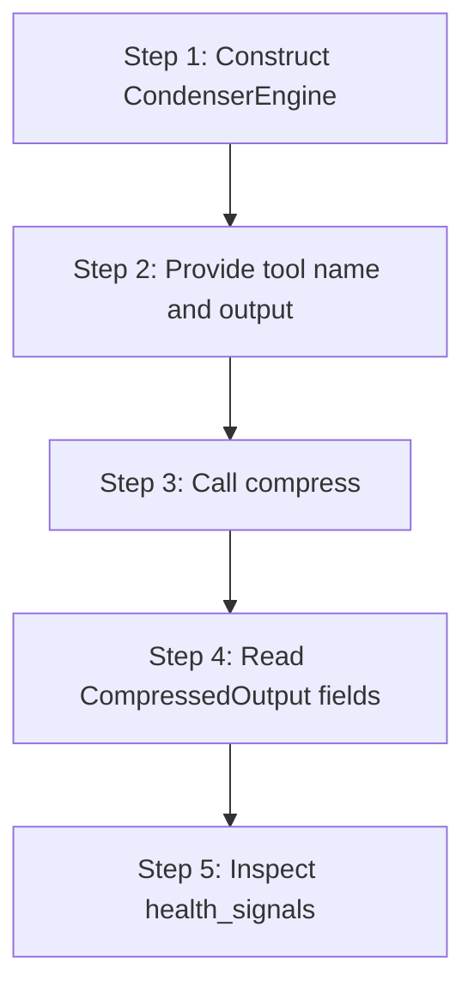

# hkask-condenser — Tutorial: Compressing Your First Tool Output

This tutorial walks through compressing an agent tool-result output with
the `CondenserEngine`. The condenser reduces verbose tool output (shell
commands, logs, file dumps) to a smaller form that fits the model's context
window while preserving salient lines. The crate is pure domain logic —
no MCP, no HTTP, no async — so the tutorial runs entirely in-process.

## Learning path



<!-- DIAGRAM_ALIGNMENT
id: DIAG-COND-001
verified_date: 2026-08-13
verified_against: kask/crates/hkask-condenser/src/engine.rs:40,47,85; kask/crates/hkask-condenser/src/types.rs:174,195
status: VERIFIED
-->

## Step 1: Construct the engine

Construct a `CondenserEngine` via `CondenserEngine::new()`
(`kask/crates/hkask-condenser/src/engine.rs:40`). The engine owns an
`AlgorithmRegistry` (`kask/crates/hkask-condenser/src/algorithms.rs:473`)
constructed once and immutable, plus the active `Profile`
(`kask/crates/hkask-condenser/src/types.rs:49`), which defaults to
`Profile::Normal` (`kask/crates/hkask-condenser/src/engine.rs:43`).

```rust
use hkask_condenser::engine::CondenserEngine;

let mut engine = CondenserEngine::new();
```

## Step 2: Provide the tool name and output

The engine takes the tool name and the raw output string. The tool name
drives two derivations: the `ContextCategory`
(`kask/crates/hkask-condenser/src/types.rs:130`) via `classify_tool`
(`kask/crates/hkask-condenser/src/algorithms.rs:528`), and the
`OntologyAnchor` via `derive_ontology_anchor`
(`kask/crates/hkask-condenser/src/algorithms.rs:559`). You do not pass
either explicitly — both are derived from the tool name inside `compress`.

## Step 3: Call compress

Call `engine.compress(tool_name, output, category)`
(`kask/crates/hkask-condenser/src/engine.rs:47`). Pass `None` for
`category` to let `classify_tool` derive it; pass a `Some(ContextCategory)`
to override classification. The engine selects an algorithm via
`AlgorithmRegistry::select` (`kask/crates/hkask-condenser/src/algorithms.rs:493`),
which walks the registry in registration order and returns the first
algorithm whose `default_for()` contains the category.

```rust
let output = "line1\nline2\nline3\n".repeat(20);
let result = engine.compress("bash_execute", &output, None);
```

## Step 4: Read the CompressedOutput

The returned `CompressedOutput` (`kask/crates/hkask-condenser/src/types.rs:174`)
carries:

| Field | Meaning |
|-------|---------|
| `content` | The compressed text |
| `algorithm` | Algorithm name (`rtk_style`, `word_rank`, `flashrank`) |
| `category` | Resolved `ContextCategory` label |
| `profile` | Active `Profile` label |
| `original_lines` / `compressed_lines` | Line counts before/after |
| `original_bytes` / `compressed_bytes` | Byte counts before/after |
| `reduction_pct` | `100 * (1 - compressed_bytes / original_bytes)` |
| `health_signals` | Diagnostics for unexpected algorithm behavior |

The reduction is computed at `kask/crates/hkask-condenser/src/engine.rs:76`
and the `CompressedOutput` is assembled at
`kask/crates/hkask-condenser/src/engine.rs:85`.

## Step 5: Inspect health_signals

`health_signals` (`kask/crates/hkask-condenser/src/types.rs:195`) is empty
when the algorithm performed within expected bounds. The three signal types
are `negative_compression` (rtk_style), `low_signal` (word_rank), and
`budget_shortfall` (flashrank). They are diagnostic ν-event candidates for
the Regulation layer — they indicate deviation, not failure (content is
still returned).

## Source citations

| Symbol | Location |
|--------|----------|
| `CondenserEngine::new` | `kask/crates/hkask-condenser/src/engine.rs:40` |
| `CondenserEngine::compress` | `kask/crates/hkask-condenser/src/engine.rs:47` |
| `AlgorithmRegistry` | `kask/crates/hkask-condenser/src/algorithms.rs:473` |
| `AlgorithmRegistry::select` | `kask/crates/hkask-condenser/src/algorithms.rs:493` |
| `classify_tool` | `kask/crates/hkask-condenser/src/algorithms.rs:528` |
| `derive_ontology_anchor` | `kask/crates/hkask-condenser/src/algorithms.rs:559` |
| `Profile` enum | `kask/crates/hkask-condenser/src/types.rs:49` |
| `ContextCategory` enum | `kask/crates/hkask-condenser/src/types.rs:130` |
| `CompressedOutput` | `kask/crates/hkask-condenser/src/types.rs:174` |
| `CondenserHealthSignal` | `kask/crates/hkask-condenser/src/types.rs:195` |

## See also

- [hkask-condenser Reference](./reference.md): class diagram of algorithms and types.
- [hkask-condenser How-to](./how-to.md): tuning salience weights and profiles.
- [hkask-condenser Explanation](./explanation.md): the compression cycle and ontology anchoring rationale.

---

[^salience]: Itti, L., Koch, C., & Niebur, E. (1998). *A model of saliency-based visual attention for rapid scene analysis.* IEEE Transactions on Pattern Analysis and Machine Intelligence, 20(11), 1254–1259. <https://ieeexplore.ieee.org/document/730558>. The saliency model adapted for text compression.
