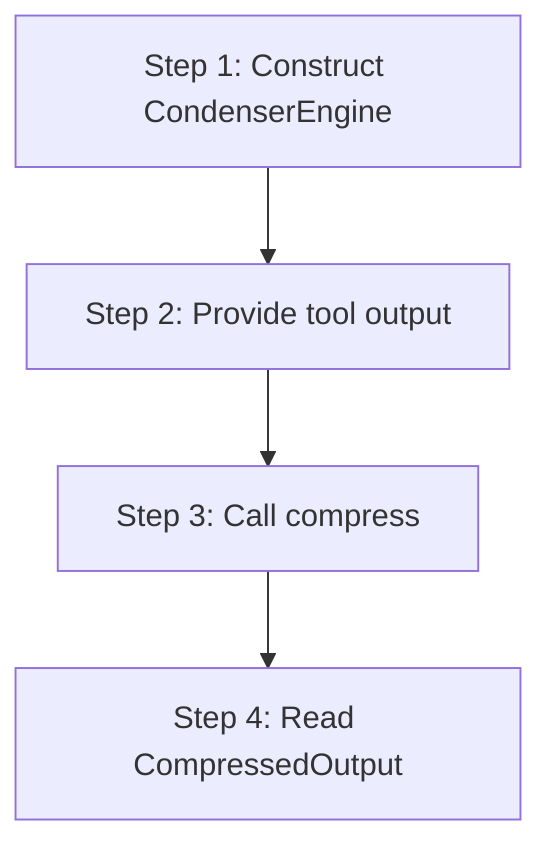

# hkask-condenser — Tutorial: Compressing Your First Tool Output

This tutorial walks through compressing an agent tool-result output using
the `CondenserEngine`. The condenser reduces verbose tool output (shell
commands, logs, file contents) to a smaller form that fits the model's context
window while preserving salient lines.

## Learning path

<!-- DIAGRAM_ALIGNMENT
id: DIAG-DIA-COND-003
verified_date: 2026-07-29
verified_against: kask/crates/hkask-condenser/src/engine.rs:39,75; kask/crates/hkask-condenser/src/algorithms.rs:576; kask/crates/hkask-condenser/src/types.rs:342
status: VERIFIED
-->

## Steps 1-2: Construct the engine and provide output

Construct a `CondenserEngine` (`engine.rs:39`) via `CondenserEngine::new()`
(`engine.rs:53`). The engine holds an `AlgorithmRegistry` (`algorithms.rs:576`)
that selects the compression algorithm based on the tool's
`ContextCategory`. Provide the tool name and its raw output string.

## Steps 3-4: Compress and read output

Call `engine.compress(tool_name, output, category)` (`engine.rs:75`). The
engine classifies the tool via `classify_tool` (`algorithms.rs:654`), derives
an `OntologyAnchor` via `derive_ontology_anchor` (`algorithms.rs:680`),
selects an algorithm, and calls `algorithm.compress(...)` (`algorithms.rs:33`).
Read the `CompressedOutput` (`types.rs:342`) — it carries `content`,
`algorithm`, `category`, `original_bytes`, `compressed_bytes`,
`reduction_pct`, and `health_signals`.

## See also

- [hkask-condenser Reference](./reference.md): class diagram of algorithms.
- [hkask-condenser How-to](./how-to.md): tuning salience weights.
- [hkask-condenser Explanation](./explanation.md): the two-phase compression cycle.

---

[^salience]: Itti, L., Koch, C., & Niebur, E. (1998). *A model of saliency-based visual attention.* IEEE TPAMI, 20(11), 1254-1259. <https://ieeexplore.ieee.org/document/730558>.
