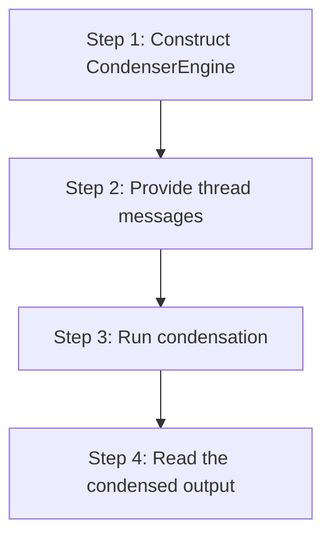

# hkask-condenser — Tutorial: Condensing Your First Thread

This tutorial walks through condensing an agent conversation thread using
the `CondenserEngine`.

## Learning path

<!-- DIAGRAM_ALIGNMENT
id: DIAG-DIA-COND-003
verified_date: 2026-07-27
verified_against: kask/crates/hkask-condenser/src/engine.rs:39; kask/crates/hkask-condenser/src/algorithms.rs:576
status: VERIFIED
-->

## Steps 1-2: Construct the engine and provide messages

Construct a `CondenserEngine` (`engine.rs:39`). The engine holds an
`AlgorithmRegistry` (`algorithms.rs:576`) that selects the condensation
algorithm. Provide the thread messages as a JSON array.

## Steps 3-4: Run condensation and read output

Call the engine's condense method. The engine classifies each tool result,
scores passages against the ontology anchor, ranks them, and selects the
top-k. Read the condensed output.

## See also

- [hkask-condenser Reference](./reference.md): class diagram of algorithms.
- [hkask-condenser How-to](./how-to.md): tuning salience weights.

---

[^salience]: Itti, L., Koch, C., & Niebur, E. (1998). *A model of saliency-based visual attention.* IEEE TPAMI, 20(11), 1254-1259. <https://ieeexplore.ieee.org/document/730558>.
