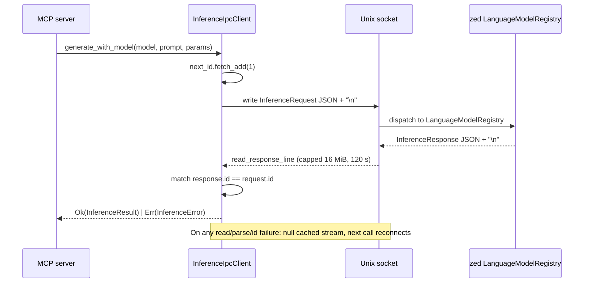

# hkask-inference — Explanation: Why Inference Routes Through the IPC Bridge

`hkask-inference` is an IPC-bridge facade. MCP server child processes route
chat, vision, embedding, tool dispatch, and worktree spawn back to zed's
`LanguageModelRegistry` over a Unix socket (`HKASK_INFERENCE_SOCKET`), rather
than holding API keys or speaking HTTP directly. At startup an MCP server
calls `resolve_inference_port()` (`hkask_inference.rs:94`) or
`resolve_ports()` (`hkask_inference.rs:290`); both return an
`InferenceIpcClient`-backed trait object when the socket is reachable, or a
socket-named `Unavailable*` stub when it is not. There is no second
`InferencePort` implementation and no in-process media-provider registry in
this crate — those were removed in the IPC-bridge refactor. This document
explains why the bridge is the single path, why the stubs are never silent,
and why provider selection is prefix-based.

## Source citations

| Symbol | Location |
|--------|----------|
| `resolve_inference_port` | `kask/crates/hkask-inference/src/hkask_inference.rs:94` |
| `resolve_ports` | `kask/crates/hkask-inference/src/hkask_inference.rs:290` |
| `InferencePorts` struct | `kask/crates/hkask-inference/src/hkask_inference.rs:277` |
| `connect_bridge` | `kask/crates/hkask-inference/src/hkask_inference.rs:55` |
| `UnavailableInference` | `kask/crates/hkask-inference/src/hkask_inference.rs:112` |
| `UnavailableWorktreeSpawn` | `kask/crates/hkask-inference/src/hkask_inference.rs:240` |
| `InferenceIpcClient` struct | `kask/crates/hkask-inference/src/inference_ipc_client.rs:173` |
| `InferenceIpcClient::from_env` | `kask/crates/hkask-inference/src/inference_ipc_client.rs:197` |
| `ipc_roundtrip` | `kask/crates/hkask-inference/src/inference_ipc_client.rs:218` |
| `MAX_IPC_LINE_BYTES` | `kask/crates/hkask-inference/src/inference_ipc_client.rs:67` |
| `IPC_READ_TIMEOUT` | `kask/crates/hkask-inference/src/inference_ipc_client.rs:76` |
| `ProviderId::parse_from_model` | `kask/crates/hkask-inference/src/config.rs:59` |
| `resolve_api_key` | `kask/crates/hkask-inference/src/config.rs:211` |

## Startup selection state

```mermaid
stateDiagram-v2
    [*] --> CheckSocket: MCP server startup
    CheckSocket --> SocketSet: HKASK_INFERENCE_SOCKET set
    CheckSocket --> SocketUnset: env var unset or empty
    SocketSet --> Connect: InferenceIpcClient::connect
    Connect --> IpcBridge: connect Ok
    Connect --> Stubs: connect Err (warn)
    SocketUnset --> Stubs: info log
    IpcBridge --> [*]: chat/vision/embed/tools/worktree via zed
    Stubs --> [*]: socket-named errors, never silent
```

<!-- DIAGRAM_ALIGNMENT
id: DIAG-INF-004
verified_date: 2026-08-20
verified_against: kask/crates/hkask-inference/src/hkask_inference.rs:55-103,229-309; kask/crates/hkask-inference/src/inference_ipc_client.rs:184-201
status: VERIFIED
-->

`connect_bridge(label)` (`hkask_inference.rs:55`) is the single match+log
site shared by all three resolvers. On `Some(Ok(client))` it logs at `info`
that the port is routed through the bridge; on `Some(Err(e))` it warns with
the error; on `None` (env var unset) it logs at `info`. Every `None` branch
returns the resolver's own socket-named stub, so a missing bridge is never
reported as an empty success.

## Why the IPC bridge is the single path

In zed-kask, the zed process is the trust boundary for inference credentials.
It holds the API keys in its `CredentialsProvider` keychain
(`kask://credentials/<key>`) and the guard that governs tool dispatch and
worktree spawn. When zed launches an MCP server child process, it injects
the API keys the child needs as environment variables via
`kask_bridge::build_mcp_server_env`, and it passes a Unix socket path via
`HKASK_INFERENCE_SOCKET` so the child can route inference back to zed's
`LanguageModelRegistry`.

Routing through the IPC bridge gives the MCP server three properties it
cannot get standalone:

1. **Credential isolation.** The child process holds only the env-var keys
   zed chose to inject; it never touches the keychain directly. The
   `resolve_api_key` helper (`config.rs:211`) reads only the environment —
   it does **not** fall back to the `hkask` keychain namespace, which is
   reserved for sovereignty keys (db passphrase). Reading inference keys
   from the `hkask` namespace was a spec violation that produced silent
   "API key not configured" errors; the doc comment at `config.rs:211`
   records why.
2. **Governed tool dispatch / worktree spawn.** These capabilities only
   exist on the zed side. `resolve_tool_dispatch_port`
   (`hkask_inference.rs:189`) and `resolve_worktree_spawn_port`
   (`hkask_inference.rs:229`) return the IPC bridge client when the socket
   is available, or an `Unavailable*` stub that returns a clear error naming
   the missing socket. There is no standalone fallback for these — they
   require the zed process.
3. **Unified model routing.** Chat, vision, and embedding all route through
   zed's `LanguageModelRegistry`, which resolves provider prefixes
   (`OpenRouter/`, `ollama/`, `RunPod/`) to the configured provider. The MCP
   server does not need to know how zed maps prefixes to credentials; it
   just sends a model name.

## Why the stubs are never silent

`UnavailableInference` (`hkask_inference.rs:112`) overrides `generate`,
`generate_vision`, `embed`, **and** `list_models` with socket-named
`Connection` errors. This is deliberate: the `InferencePort` trait's default
`list_models` returns `Ok(Vec::new())`, which a missing bridge would
otherwise read as an empty model registry — the `.rules`
broken-feedback-loop trap (`unwrap_or(0)`-class, where a broken bridge reads
as "no models"). `UnavailableToolDispatch` (`hkask_inference.rs:201`) and
`UnavailableWorktreeSpawn` (`hkask_inference.rs:240`) likewise return
`Connection` errors naming the missing socket
(`IPC_BRIDGE_UNAVAILABLE`, `hkask_inference.rs:44`). The error tells the
operator exactly what to fix: set `HKASK_INFERENCE_SOCKET` and ensure zed is
running.

`UnavailableWorktreeSpawn` is `pub(crate)` because `LazyLocalSwarmRuntime` names
the type when it falls back to in-memory delegation; the other two stubs are
private because every call site goes through the `Arc<dyn …Port>` trait
object.

## Why `resolve_ports` shares one connection

`resolve_ports` (`hkask_inference.rs:290`) connects to the bridge **once**
and clones the single `InferenceIpcClient` into the three trait objects of
`InferencePorts` (`hkask_inference.rs:277`). The `InferenceIpcClient` is
`#[derive(Clone)]` (`inference_ipc_client.rs:173`); the clone shares the
`Arc<Mutex<Option<UnixStream>>>` socket and the `Arc<AtomicU64>` id counter,
so the three objects multiplex on one connection, serialized by the stream
mutex. This avoids the three separate socket connections that calling
`resolve_inference_port` + `resolve_tool_dispatch_port` +
`resolve_worktree_spawn_port` independently would open. Servers that need
only one port can still call the per-port resolver directly.

## Why prefix-based provider selection

Provider selection is prefix-based: a caller chooses the provider by
prefixing the model name (`OpenRouter/...`, `ollama/...`, `RunPod/...`).
`ProviderId::parse_from_model` (`config.rs:59`) parses the prefix; an
unprefixed name uses `default_provider` (OpenRouter by default). This keeps
the provider choice explicit and auditable — a span that records the model
name also records the provider. A configuration-based approach (where the
provider is selected by a separate setting) would hide the provider from
the model name, making audit harder.

Unrecognized prefixes are not rejected — the model name is passed through to
zed's `LanguageModelRegistry` (via the IPC bridge), which does the actual
provider routing. `from_prefix_segment` (`config.rs:94`) classifies a model
name's provider prefix segment for model-listing labels; it does not gate
routing.

## IPC request-response sequence



<!-- DIAGRAM_ALIGNMENT
id: DIAG-INF-005
verified_date: 2026-08-20
verified_against: kask/crates/hkask-inference/src/inference_ipc_client.rs:218-300,67,76
status: VERIFIED
-->

The protocol is newline-delimited JSON over a Unix socket. Each request is a
single line; each response is a single line. The `id` field correlates
responses to requests. The client holds a single socket connection protected
by a `Mutex` so only one request is in flight at a time. If the connection
drops, the next call returns `InferenceError::Connection`; the caller can
retry by constructing a new client. `MAX_IPC_LINE_BYTES` (16 MiB,
`inference_ipc_client.rs:67`) caps unbounded `read_line` growth (CWE-400);
`IPC_READ_TIMEOUT` (120 s, `inference_ipc_client.rs:76`) prevents the MCP
server from blocking forever if zed hangs.

## See also

- [hkask-inference Reference](./reference.md): class diagram and the full
  citation table.
- [hkask-inference Tutorial](./tutorial.md): routing your first request.
- [hkask-inference How-to](./how-to.md): wiring an MCP server to the bridge
  and adding a chat provider.
- [hkask-types Reference](../hkask-types/reference.md): the `InferencePort`,
  `ToolDispatchPort`, and `WorktreeSpawnPort` traits the client implements.

---

[^hexagonal]: Cockburn, A. (2005). *Hexagonal Architecture.* <https://alistair.cockburn.us/hexagonal-architecture/>. The port-trait boundary that lets the IPC-bridge client and the unavailable stubs be swapped at startup.

[^cwe400]: MITRE. (n.d.). *CWE-400: Uncontrolled Resource Consumption.* <https://cwe.mitre.org/data/definitions/400.html>. The unbounded `read_line` growth that `MAX_IPC_LINE_BYTES` caps.