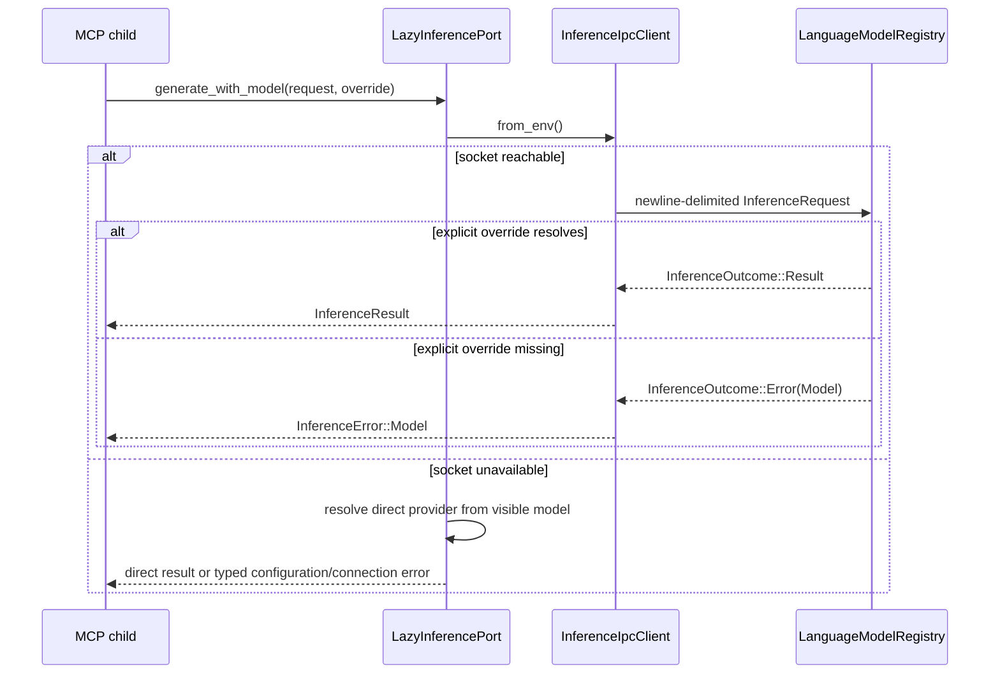
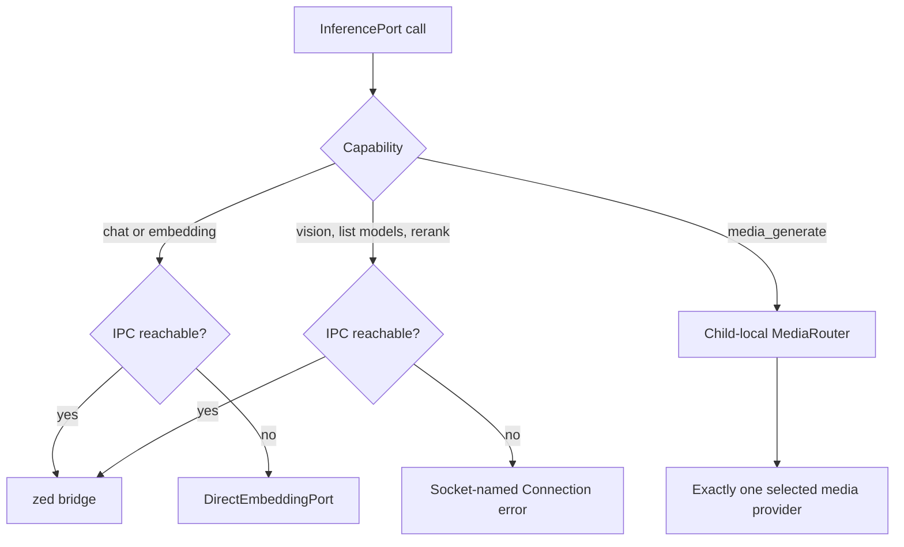

# hkask-inference — Explanation: Bridge-First Inference and Visible Failure

`hkask-inference` gives MCP server processes one inference-facing boundary while keeping zed's `LanguageModelRegistry` as the primary model authority. The crate supplies the lazy inference port, the Unix-socket client, direct chat/embedding fallback, child-local media routing, and bridge-only tool/worktree ports (`kask/crates/hkask-inference/src/hkask_inference.rs:3-20`, `kask/crates/hkask-inference/src/hkask_inference.rs:88-105`, `kask/crates/hkask-inference/src/hkask_inference.rs:816-895`). This is a ports-and-adapters boundary: callers depend on `hkask_types` traits while the active adapter can be the bridge, direct HTTP, or an explicit unavailable stub.[^hexagonal]

## Why the bridge is primary

MCP children receive `HKASK_INFERENCE_SOCKET` and send newline-delimited JSON requests to the zed process. `InferenceIpcClient` opens a fresh Unix-socket connection for every request, correlates request and response IDs, and separates transport errors from typed inference outcomes (`kask/crates/hkask-inference/src/inference_ipc_client.rs:10-48`, `kask/crates/hkask-inference/src/inference_ipc_client.rs:299-313`, `kask/crates/hkask-inference/src/inference_ipc_client.rs:351-422`). The fresh-connection design permits concurrent requests instead of serializing them behind one stream lock (`kask/crates/hkask-inference/src/inference_ipc_client.rs:16-28`, `kask/crates/hkask-inference/src/inference_ipc_client.rs:351-382`).

The bridge keeps model lookup in zed. An explicit model override is resolved through `LanguageModelRegistry`; if it cannot be resolved, the bridge warns and returns no model rather than substituting the default (`kask/crates/kask_bridge/src/inference_chat.rs:579-621`). The completion path converts that miss into `InferenceError::Model("model_override '…' not found; no default substitution")` (`kask/crates/kask_bridge/src/inference_chat.rs:674-690`). This typed failure matters most for vision: substituting a text default can discard image input and make a configuration mistake look like a provider outage.

<!-- DIAGRAM_ALIGNMENT
id: DIAG-INF-004
verified_date: 2026-09-16
verified_against: kask/crates/hkask-inference/src/hkask_inference.rs:210-244; kask/crates/hkask-inference/src/inference_ipc_client.rs:351-450; kask/crates/kask_bridge/src/inference_chat.rs:579-621,674-690
status: VERIFIED
-->

## Why inference resolution is lazy

`resolve_inference_port()` returns a `LazyInferencePort` without connecting at construction time (`kask/crates/hkask-inference/src/hkask_inference.rs:88-105`). Each chat, vision, embedding, model-list, or rerank call retries `InferenceIpcClient::from_env()` (`kask/crates/hkask-inference/src/hkask_inference.rs:190-207`, `kask/crates/hkask-inference/src/hkask_inference.rs:228-244`, `kask/crates/hkask-inference/src/hkask_inference.rs:288-355`). A child that starts before the socket therefore begins using the bridge as soon as it becomes reachable; it does not preserve a startup-time failure forever.

Fallbacks are deliberately capability-specific:

- Chat and embeddings can use `DirectEmbeddingPort`, whose provider is selected from the per-call or configured model prefix (`kask/crates/hkask-inference/src/hkask_inference.rs:123-152`, `kask/crates/hkask-inference/src/hkask_inference.rs:288-309`, `kask/crates/hkask-inference/src/hkask_inference.rs:389-490`).
- Vision, model listing, and reranking require the bridge and return socket-named `Connection` errors when it is absent (`kask/crates/hkask-inference/src/hkask_inference.rs:172-207`, `kask/crates/hkask-inference/src/hkask_inference.rs:312-355`).
- Media generation is always child-local because its API keys are injected into the child process. `LazyInferencePort::media_generate` uses a process-local `MediaRouter`, not the IPC client (`kask/crates/hkask-inference/src/hkask_inference.rs:107-116`, `kask/crates/hkask-inference/src/hkask_inference.rs:358-375`).
- Tool dispatch and worktree creation are zed-side capabilities. Their resolvers connect once and return socket-named unavailable stubs when the bridge cannot be reached (`kask/crates/hkask-inference/src/hkask_inference.rs:816-895`).

<!-- DIAGRAM_ALIGNMENT
id: DIAG-INF-005
verified_date: 2026-09-16
verified_against: kask/crates/hkask-inference/src/hkask_inference.rs:155-375,389-490; kask/crates/hkask-inference/src/media_router.rs:9-72; kask/crates/hkask-inference/src/provider.rs:218-288
status: VERIFIED
-->

## Why missing models remain typed

The implementation does not collapse every model problem into one fallback:

1. If a direct chat call has neither an explicit model nor a non-empty `HKASK_DEFAULT_MODEL`, it returns `InferenceError::NotConfigured` naming `kask.models.default_model` and the environment binding (`kask/crates/hkask-inference/src/hkask_inference.rs:123-143`, `kask/crates/hkask-inference/src/hkask_inference.rs:572-597`).
2. If an explicit bridge override is not present in zed's registry, the zed-side adapter returns `InferenceError::Model`; it does not run the default model (`kask/crates/kask_bridge/src/inference_chat.rs:579-621`, `kask/crates/kask_bridge/src/inference_chat.rs:674-690`).
3. The dedicated QA model resolver similarly distinguishes absent configuration (`NotConfigured`) from malformed provider-qualified identifiers (`Model`) and never consults the chat or training model (`kask/crates/hkask-inference/src/model_constants.rs:25-75`).
4. A missing or unrecognized direct provider path becomes a typed connection/configuration error naming the model or credential requirement (`kask/crates/hkask-inference/src/hkask_inference.rs:123-151`, `kask/crates/hkask-inference/src/hkask_inference.rs:288-307`).

This preserves the operator's ability to tell “no model selected,” “selected model does not exist,” and “selected provider cannot be reached” apart.

## Why `ProviderId` is small

`ProviderId` is a serialized identifier with three variants and one public method, `as_str()` (`kask/crates/hkask-inference/src/config.rs:34-64`). It is not the model parser. Chat/embedding fallback routing matches provider prefixes against `DIRECT_EMBEDDING_PROVIDERS` (`kask/crates/hkask-inference/src/hkask_inference.rs:409-455`), while media routing parses a `MediaOp` and resolves a provider-qualified model inside `ProviderRegistry::execute` (`kask/crates/hkask-inference/src/provider.rs:32-87`, `kask/crates/hkask-inference/src/provider.rs:218-288`). Keeping those decisions at their dispatch boundaries avoids turning a display/serialization enum into a second routing registry.

Media selection is strict: selectable operations require `OpenRouter/<model>` or `DeepInfra/<model>`, provider-local identifiers are URL-safety checked, exactly one matching provider may execute, and provider errors return unchanged (`kask/crates/hkask-inference/src/provider.rs:182-204`, `kask/crates/hkask-inference/src/provider.rs:218-288`). No cross-provider retry occurs.

## Why response reads are bounded

A response is one newline-terminated line capped at 16 MiB; a missing newline is treated as truncation or overflow (`kask/crates/hkask-inference/src/inference_ipc_client.rs:68-74`, `kask/crates/hkask-inference/src/inference_ipc_client.rs:201-237`). This bounds memory growth from an untrusted or broken peer, addressing uncontrolled resource consumption.[^cwe400] The read deadline is the published server timeout plus 30 seconds; unset, zero, or malformed timeout configuration uses a 600-second fallback, and malformed values are warned with their value (`kask/crates/hkask-inference/src/inference_ipc_client.rs:128-199`).

## See also

- [How-to: route and configure inference](./how-to.md)
- [Reference: current API surface](./reference.md)
- [hkask-types reference](../hkask-types/reference.md)

---

[^hexagonal]: Cockburn, A. (2005). *Hexagonal Architecture.* <https://alistair.cockburn.us/hexagonal-architecture/>.
[^cwe400]: MITRE. (n.d.). *CWE-400: Uncontrolled Resource Consumption.* <https://cwe.mitre.org/data/definitions/400.html>.
