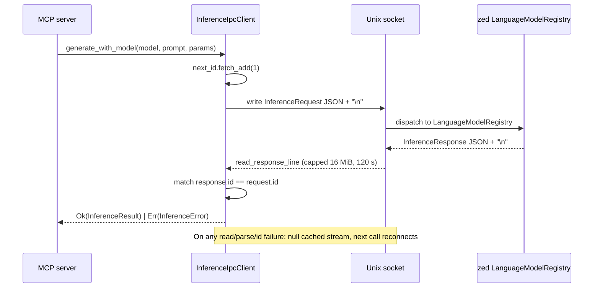

# hkask-inference — Explanation: Why the IPC Bridge Is Preferred

`hkask-inference` offers two `InferencePort` implementations selected at
startup by `resolve_inference_port()` (`hkask_inference.rs:184`):
`InferenceIpcClient` (the IPC bridge to zed's `LanguageModelRegistry`) and
`MediaRouter` (a standalone media-only fallback). This document explains why
the IPC bridge is the preferred path in zed-kask, when the `MediaRouter`
fallback is the right choice, and why the two implementations split
capabilities the way they do.

## Source citations

| Symbol | Location |
|--------|----------|
| `resolve_inference_port` | `kask/crates/hkask-inference/src/hkask_inference.rs:184` |
| `InferenceIpcClient` struct | `kask/crates/hkask-inference/src/inference_ipc_client.rs:99` |
| `InferenceIpcClient::from_env` | `kask/crates/hkask-inference/src/inference_ipc_client.rs:123` |
| `InferenceIpcClient::call` | `kask/crates/hkask-inference/src/inference_ipc_client.rs:132` |
| `MediaRouter` struct | `kask/crates/hkask-inference/src/media_router.rs:45` |
| `MediaRouter::new` | `kask/crates/hkask-inference/src/media_router.rs:64` |
| `BRIDGE_ERROR` | `kask/crates/hkask-inference/src/media_router.rs:242` |
| `MediaProvider` trait | `kask/crates/hkask-inference/src/provider.rs:82` |
| `ProviderRegistry::execute` | `kask/crates/hkask-inference/src/provider.rs:162` |
| `ProviderId::parse_from_model` | `kask/crates/hkask-inference/src/config.rs:61` |
| `resolve_api_key` | `kask/crates/hkask-inference/src/config.rs:263` |

## Startup selection state

```mermaid
stateDiagram-v2
    [*] --> CheckSocket: MCP server startup
    CheckSocket --> SocketSet: HKASK_INFERENCE_SOCKET set
    CheckSocket --> SocketUnset: env var unset or empty
    SocketSet --> Connect: InferenceIpcClient::connect
    Connect --> IpcBridge: connect Ok
    Connect --> MediaFallback: connect Err (warn)
    SocketUnset --> MediaFallback: info log
    IpcBridge --> [*]: chat/vision/embed/tools/skills via zed
    MediaFallback --> [*]: media-only via ProviderRegistry
```

<!-- DIAGRAM_ALIGNMENT
id: DIAG-INF-004
verified_date: 2026-08-13
verified_against: kask/crates/hkask-inference/src/hkask_inference.rs:184-209; kask/crates/hkask-inference/src/inference_ipc_client.rs:109,123
status: VERIFIED
-->

## Why the IPC bridge is preferred

In zed-kask, the zed process is the trust boundary for inference credentials.
It holds the API keys in its `CredentialsProvider` keychain
(`kask://credentials/<key>`) and the guard that governs tool dispatch, skill
execution, and worktree spawn. When zed launches an MCP server child process,
it injects the API keys the child needs as environment variables via
`kask_bridge::build_mcp_server_env`, and it passes a Unix socket path via
`HKASK_INFERENCE_SOCKET` so the child can route inference back to zed's
`LanguageModelRegistry`.

Routing through the IPC bridge gives the MCP server three properties it
cannot get standalone:

1. **Credential isolation.** The child process holds only the env-var keys
   zed chose to inject; it never touches the keychain directly. The
   `resolve_api_key` helper (`config.rs:263`) reads only the environment —
   it does **not** fall back to the `hkask` keychain namespace, which is
   reserved for sovereignty keys (db passphrase). The doc comment at
   `config.rs:252-260` records why: reading inference keys from the `hkask`
   namespace was a spec violation that produced silent "API key not
   configured" errors.
2. **Governed tool dispatch / skill execution / worktree spawn.** These
   capabilities only exist on the zed side. `resolve_tool_dispatch_port`
   (`hkask_inference.rs:222`), `resolve_skill_exec_port`
   (`hkask_inference.rs:283`), and `resolve_worktree_spawn_port`
   (`hkask_inference.rs:337`) return the IPC bridge client when the socket is
   available, or an `Unavailable*` stub that returns a clear error naming the
   missing socket. There is no standalone fallback for these — they require
   the zed process.
3. **Unified model routing.** Chat, vision, and embedding all route through
   zed's `LanguageModelRegistry`, which resolves provider prefixes
   (`DeepInfra/`, `OpenRouter/`, `ollama/`, `RunPod/`) to the configured
   provider. The MCP server does not need to know how zed maps prefixes to
   credentials; it just sends a model name.

## Why the `MediaRouter` fallback exists

The `MediaRouter` fallback (`media_router.rs:45`) exists for two cases:

- **Standalone operation.** An MCP server run outside zed (e.g. in a CI
  pipeline or a development shell) has no IPC socket. `resolve_inference_port`
  logs `HKASK_INFERENCE_SOCKET not set — using MediaRouter (media-only;
  chat/vision unavailable)` at `info` level (`hkask_inference.rs:201-206`) and
  constructs a `MediaRouter` from `InferenceConfig::from_env()`.
- **IPC bridge failure.** If the socket is set but the connection fails,
  `resolve_inference_port` logs a `warn` with the error and falls back to
  `MediaRouter` (`hkask_inference.rs:193-200`). This keeps media generation
  working when zed is restarting or the socket has been removed.

The `MediaRouter` handles **media generation only** — image, video, speech,
transcription. Its `InferencePort` impl returns the `BRIDGE_ERROR` constant
(`media_router.rs:242`) for `generate`, `generate_with_model`,
`generate_with_messages`, `generate_stream`, `generate_vision`, and `embed`.
The error message is explicit: *"Chat/vision/embed operations are routed
through the zed IPC bridge, not the MediaRouter. The IPC bridge is
unreachable — ensure HKASK_INFERENCE_SOCKET is set and zed is running."* This
is deliberate: a silent fallback to a dead keychain namespace would mask the
real failure. The error tells the operator exactly what to fix.

## Why media terminates in the `MediaRouter`, not the IPC bridge

Media generation uses non-chat APIs that zed's `LanguageModel`
(chat-completions-only) abstraction cannot represent: AtlasCloud's
submit+poll task routing, DeepInfra's inference/TTS/transcription endpoints
with binary returns. So media routed to zed via the IPC bridge terminates
back in the hKask `MediaRouter` (the `InferenceIpcServer` holds a
`MediaRouter` as its `media_router` and dispatches `media_generate` requests
to it). If zed later adds a media trait to its registry, this terminal can
delegate to it instead — until then the providers live in this crate.

## Why prefix-based provider selection

Provider selection is prefix-based: a caller chooses the provider by
prefixing the model name (`DeepInfra/...`, `OpenRouter/...`, `ollama/...`,
`RunPod/...`). `ProviderId::parse_from_model` (`config.rs:61`) parses the
prefix; an unprefixed name uses `default_provider` (DeepInfra by default,
`config.rs:166`). This keeps the provider choice explicit and auditable — a
span that records the model name also records the provider. A
configuration-based approach (where the provider is selected by a separate
setting) would hide the provider from the model name, making audit harder.

Unrecognized prefixes are not rejected — the model name is passed through to
zed's `LanguageModelRegistry` (via the IPC bridge), which does the actual
provider routing. `from_prefix_segment` (`config.rs:97`) classifies a model
name's provider prefix segment for model-listing labels; it does not gate
routing.

## Why the registry has a scored selection engine

When more than one registered provider supports a `MediaOp`, the
`ProviderRegistry` (`provider.rs:109`) does not just pick the first
registered provider. It selects the primary via a 7-dimension scored engine
(`crate::scoring::select_scored`), which emits a `reg.media.select` span, and
orders the fallback chain by descending weighted score
(`provider.rs:185-206`). With a single candidate there is no selection to make
— the lone provider is used directly so single-provider ops don't emit a
spurious selection span. The default score table reproduces the prior
registration-order policy (DeepInfra-first / AtlasCloud-fallback), so
dispatch behavior is preserved while leaving room for cost- or
latency-aware routing later.

## IPC request-response sequence



<!-- DIAGRAM_ALIGNMENT
id: DIAG-INF-005
verified_date: 2026-08-13
verified_against: kask/crates/hkask-inference/src/inference_ipc_client.rs:132-217,54,63
status: VERIFIED
-->

The protocol is newline-delimited JSON over a Unix socket. Each request is a
single line; each response is a single line. The `id` field correlates
responses to requests. The client holds a single socket connection protected
by a `Mutex` so only one request is in flight at a time. If the connection
drops, the next call returns `InferenceError::Connection`; the caller can
retry by constructing a new client. `MAX_IPC_LINE_BYTES` (16 MiB,
`inference_ipc_client.rs:54`) caps unbounded `read_line` growth (CWE-400);
`IPC_READ_TIMEOUT` (120 s, `inference_ipc_client.rs:63`) prevents the MCP
server from blocking forever if zed hangs.

## See also

- [hkask-inference Reference](./reference.md): class diagram and backend
  inventory.
- [hkask-inference Tutorial](./tutorial.md): routing your first request.
- [hkask-inference How-to](./how-to.md): adding a new provider.
- [hkask-types Reference](../hkask-types/reference.md): the `InferencePort`
  trait that both implementations satisfy.

---

[^hexagonal]: Cockburn, A. (2005). *Hexagonal Architecture.* <https://alistair.cockburn.us/hexagonal-architecture/>. The `InferencePort` boundary that allows the IPC bridge and the `MediaRouter` to be swapped at startup.

[^cwe400]: MITRE. (n.d.). *CWE-400: Uncontrolled Resource Consumption.* <https://cwe.mitre.org/data/definitions/400.html>. The unbounded `read_line` growth that `MAX_IPC_LINE_BYTES` caps.
