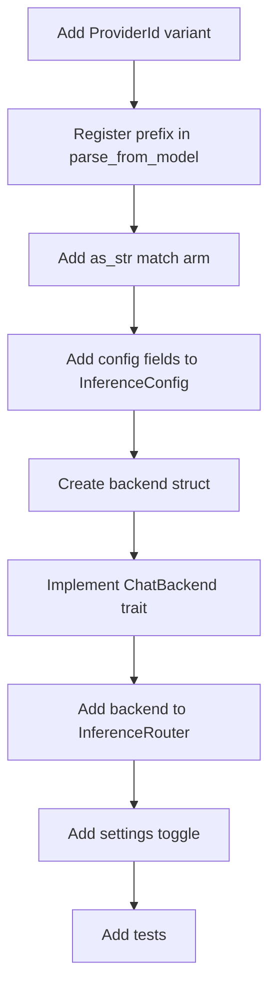

# hkask-inference — How-to: Configure a New Provider

This guide shows how to add a new inference provider to the `InferenceRouter`.
The router dispatches chat and embedding requests to provider-specific
backends. Adding a provider requires a new `ProviderId` variant, a new backend
struct, configuration fields in `InferenceConfig`, and a settings toggle in
`kask_bridge`.

## Source citations

| Symbol | Location |
|--------|----------|
| `ProviderId` enum | `kask/crates/hkask-inference/src/config.rs:44` |
| `InferenceConfig` struct | `kask/crates/hkask-inference/src/config.rs:192` |
| `InferenceRouter` struct | `kask/crates/hkask-inference/src/inference_router/mod.rs:52` |
| `ChatBackend` trait | `kask/crates/hkask-inference/src/inference_router/backend.rs:51` |
| `VisionBackend` trait | `kask/crates/hkask-inference/src/inference_router/backend.rs:101` |
| `KaskInferenceProvidersSettings` | `kask/crates/kask_bridge/src/settings.rs:143` |

## Procedure

<!-- DIAGRAM_ALIGNMENT
id: DIAG-DIA-INF-002
verified_date: 2026-07-29
verified_against: kask/crates/hkask-inference/src/config.rs:44,86,128,152,192; kask/crates/hkask-inference/src/inference_router/mod.rs:52; kask/crates/hkask-inference/src/inference_router/backend.rs:51,101; kask/crates/kask_bridge/src/settings.rs:143
status: VERIFIED
-->

### Step 1: Add a ProviderId variant

Add a new variant to the `ProviderId` enum in `config.rs:44`. Include a
`#[serde(rename = "XX")]` attribute with a two-letter serialization code
(e.g. `"DI"` for DeepInfra). This code is the serde tag, *not* the
model-name prefix — the prefix is registered separately in Step 2.

### Step 2: Register the prefix in parse_from_model

Add an entry to the `PREFIXES` const in `ProviderId::parse_from_model`
(`config.rs:86`). The prefix is the full provider name followed by `/`
(e.g. `"DeepInfra/"`, `"fal.ai/"`). This is what the router matches
against model-name strings.

### Step 3: Add the as_str match arm

Add a match arm to `ProviderId::as_str` (`config.rs:152`) returning the
full provider name (e.g. `"DeepInfra"`). This is used by `prefix_model`
(`config.rs:142`) to construct canonical prefixed names.

### Step 4: Add config fields

Add `base_url` and `api_key` fields to `InferenceConfig` in `config.rs:192`.
Initialize them from environment variables in `InferenceConfig::from_env`
(`config.rs:271`) or the kask settings system.

### Step 5: Create the backend struct

Create a new file `src/<provider>_backend.rs` with a struct holding the base
URL and API key. Follow the pattern in `deepinfra_backend.rs:21`.

### Step 6: Implement ChatBackend

Implement the `ChatBackend` trait (`backend.rs:51`) for the new struct. The
`generate` method calls the provider's chat completion endpoint. The
`generate_stream` method returns an SSE stream. If the provider supports
vision, also implement `VisionBackend` (`backend.rs:101`).

### Step 7: Add to InferenceRouter

Add an `Option<NewBackend>` field to `InferenceRouter` in
`inference_router/mod.rs:52`. Construct the backend in `InferenceRouter::new`
(`inference_router/mod.rs:94`) when the API key is present, following the
`and_then(|c| NewBackend::new(&config, Arc::clone(c)).ok())` pattern.

### Step 8: Add settings toggle

Add a `<provider>_enabled: bool` field to `KaskInferenceProvidersSettings`
in `kask/crates/kask_bridge/src/settings.rs:143` so users can configure
the provider in their `settings.json` under the `kask.inference_providers`
section.

## See also

- [hkask-inference Reference](./reference.md): class diagram of the router
  and backends.
- [kask_bridge Reference](../kask_bridge/reference.md): the
  `KaskInferenceProvidersSettings` struct.

---

[^hexagonal]: Cockburn, A. (2005). *Hexagonal Architecture.* <https://alistair.cockburn.us/hexagonal-architecture/>. The backend-trait pattern that makes adding a provider a localized change.
