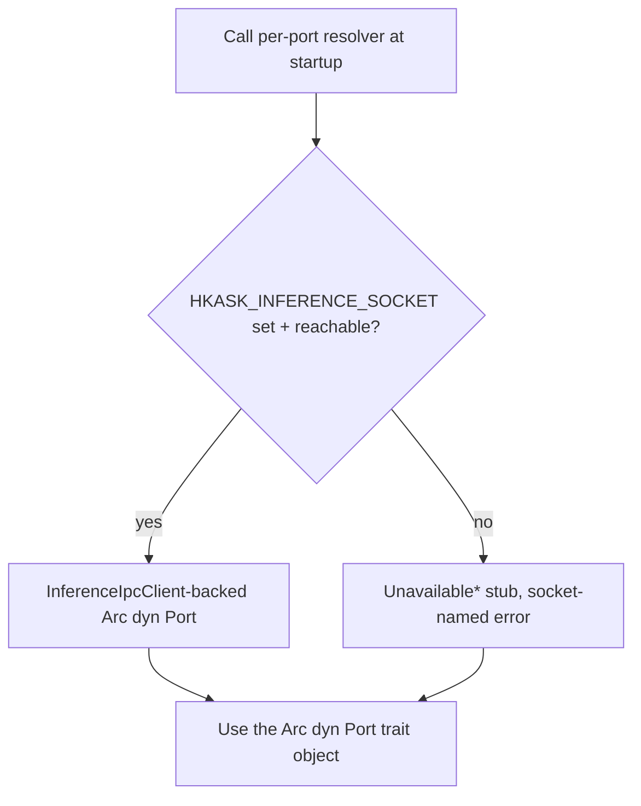
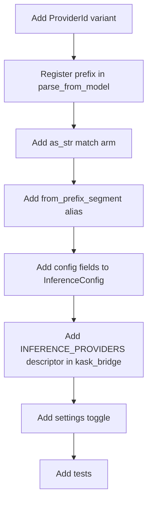

# hkask-inference — How-to: Route Inference Through the IPC Bridge

`hkask-inference` is an IPC-bridge facade, not a multi-provider HTTP router.
MCP server child processes do **not** hold API keys or speak HTTP; they route
chat, vision, embedding, tool dispatch, and worktree spawn back to zed's
`LanguageModelRegistry` over a Unix socket (`HKASK_INFERENCE_SOCKET`). This
guide covers the two things a developer still configures in this crate:
**adding a chat provider** (a `ProviderId` variant + prefix + config fields,
served by zed — no backend struct in this crate) and **wiring an MCP server
to the bridge** via `resolve_ports`.

> **Retired premise.** An earlier version of this how-to described adding a
> `MediaProvider` backend struct and calling
> `openai_compatible_generate[_messages]` over direct HTTP. That
> architecture was removed in the IPC-bridge refactor — there is no
> `MediaProvider` trait, `ProviderRegistry`, `MediaRouter`, or direct-HTTP
> chat path in this crate anymore. Do not follow any procedure that tells
> you to create a `<provider>_backend.rs` or call `openai_compatible_*`
> helpers; they do not exist. The `openai_compat` module now holds only the
> `sanitize_error_body` response-body redaction utility.

## Source citations

| Symbol | Location |
|--------|----------|
| `ProviderId` enum | `kask/crates/hkask-inference/src/config.rs:34` |
| `ProviderId::parse_from_model` (`PREFIXES`) | `kask/crates/hkask-inference/src/config.rs:59` |
| `ProviderId::from_prefix_segment` | `kask/crates/hkask-inference/src/config.rs:94` |
| `ProviderId::prefix_model` | `kask/crates/hkask-inference/src/config.rs:110` |
| `ProviderId::as_str` | `kask/crates/hkask-inference/src/config.rs:120` |
| `InferenceConfig` struct | `kask/crates/hkask-inference/src/config.rs:135` |
| `impl Default for InferenceConfig` | `kask/crates/hkask-inference/src/config.rs:150` |
| `InferenceConfig::from_env` | `kask/crates/hkask-inference/src/config.rs:172` |
| `ProviderConfig::from_env` | `kask/crates/hkask-inference/src/config.rs:275` |
| `resolve_api_key` | `kask/crates/hkask-inference/src/config.rs:211` |
| `parse_provider_code` | `kask/crates/hkask-inference/src/config.rs:237` |
| `resolve_inference_port` | `kask/crates/hkask-inference/src/hkask_inference.rs:94` |
| `resolve_ports` | `kask/crates/hkask-inference/src/hkask_inference.rs:290` |
| `InferencePorts` struct (`pub(crate)`) | `kask/crates/hkask-inference/src/hkask_inference.rs:277` |
| `InferenceIpcClient::from_env` | `kask/crates/hkask-inference/src/inference_ipc_client.rs:197` |

## Procedure A: Wire an MCP server to the bridge



<!-- DIAGRAM_ALIGNMENT
id: DIAG-INF-WIRE
verified_date: 2026-08-24
verified_against: kask/crates/hkask-inference/src/hkask_inference.rs:94 (resolve_inference_port), :189 (resolve_tool_dispatch_port), :229 (resolve_worktree_spawn_port), :277 (InferencePorts), :290 (resolve_ports), kask/crates/hkask-inference/src/inference_ipc_client.rs:197 (from_env)
status: VERIFIED
-->

### Step 1: Resolve the port(s) at startup

An MCP server calls the per-port resolver it needs once at startup. The
real hKask MCP servers (`hkask-mcp-corpus`, `hkask-mcp-training`,
`hkask-mcp-prediction-markets`, `hkask-mcp-swarm`) call
`resolve_inference_port()` (`hkask_inference.rs:94`); servers that also need
tool dispatch or worktree spawn call `resolve_tool_dispatch_port()`
(`hkask_inference.rs:189`) or `resolve_worktree_spawn_port()`
(`hkask_inference.rs:229`) alongside it. Each resolver returns an
`Arc<dyn …Port>` backed by the IPC bridge client when
`HKASK_INFERENCE_SOCKET` is set and reachable, or by its `Unavailable*` stub
when it is not.

```rust
use hkask_inference::resolve_inference_port;

let inference = resolve_inference_port().await; // Arc<dyn InferencePort>
```

The crate-internal convenience `resolve_ports()` (`hkask_inference.rs:290`)
connects once and clones the single client into `InferencePorts`
(`hkask_inference.rs:277`, `pub(crate)`) for kask-internal consumers that
need all three ports — external MCP server crates use the per-port resolvers
above (the `InferencePorts` type is `pub(crate)`, so it is not nameable
outside the crate).

When `HKASK_INFERENCE_SOCKET` is unset or unreachable, each per-port resolver
returns its own unavailable stub (`UnavailableInference`,
`UnavailableToolDispatch`, `UnavailableWorktreeSpawn`). Every stub method
returns a `Connection` error naming the missing socket — never an empty
success. In particular `UnavailableInference::list_models` returns `Err`
(not `Ok(Vec::new())`) so a missing bridge is not misread as an empty model
registry.

### Step 2: Call port methods

With the resolved `Arc<dyn InferencePort>`, the MCP server calls the trait
methods defined by `hkask_types::InferencePort` (`generate`,
`generate_with_model`, `generate_with_messages`, `generate_vision`, `embed`,
`list_models`). Each call is serialized as a newline-delimited JSON
`InferenceRequest` over the Unix socket; the response is a single
`InferenceResponse` line correlated by `id`. `MAX_IPC_LINE_BYTES` (16 MiB)
caps unbounded `read_line` growth (CWE-400) and `IPC_READ_TIMEOUT` (120 s)
prevents blocking forever if zed hangs. Any read/parse/id-mismatch failure
nulls the cached stream so the next call reconnects.

The MCP server child process never holds the API keys directly. zed injects
the keys the child needs as env vars via `kask_bridge::build_mcp_server_env`,
and routes the actual inference through its `LanguageModelRegistry`, which
resolves provider prefixes (`OpenRouter/`, `ollama/`, `RunPod/`) to
credentials.

## Procedure B: Add a chat provider

Adding a chat provider is a routing-prefix change, not a backend struct.
zed's `LanguageModelRegistry` serves the calls; this crate only needs to
recognize the prefix so model-name routing and listing label correctly.



<!-- DIAGRAM_ALIGNMENT
id: DIAG-INF-PROVIDER
verified_date: 2026-08-24
verified_against: kask/crates/hkask-inference/src/config.rs:34 (ProviderId enum), kask/crates/kask_bridge/src/settings.rs (INFERENCE_PROVIDERS), kask/crates/kask_bridge/src/mcp_servers.rs
status: VERIFIED
-->

### Step 1: Add a `ProviderId` variant

Add a new variant to the `ProviderId` enum in `config.rs:34`. Include a
`#[serde(rename = "XX")]` attribute with a two-letter serialization code
(e.g. `"OR"` for OpenRouter). This code is the serde tag, *not* the
model-name prefix — the prefix is registered separately in Step 2.

### Step 2: Register the prefix in `parse_from_model`

Add an entry to the `PREFIXES` const in `ProviderId::parse_from_model`
(`config.rs:59`). The prefix is the full provider name followed by `/`
(e.g. `"OpenRouter/"`, `"ollama/"`). This is what zed's registry matches
against model-name strings. An empty remainder after stripping the prefix
returns `None`.

### Step 3: Add the `as_str` match arm

Add a match arm to `ProviderId::as_str` (`config.rs:120`) returning the full
provider name (e.g. `"RunPod"`, `"OpenRouter"`, `"ollama"`). This is used by
`prefix_model` (`config.rs:110`) to construct canonical prefixed names of the
form `"{prefix}/{model}"`.

### Step 4: Add the `from_prefix_segment` alias

Add a match arm to `ProviderId::from_prefix_segment` (`config.rs:94`)
classifying the prefix segment case-insensitively, including short aliases
(e.g. `"openrouter" | "or"`). Unrecognized segments fall back to
`OpenRouter`. Centralizing the alias table here keeps provider knowledge in
one place.

### Step 5: Add config fields

Add `base_url` and `api_key` fields to `InferenceConfig` in `config.rs:135`.
Initialize them in `Default::default()` (`config.rs:150`) and from
environment variables in `InferenceConfig::from_env` (`config.rs:172`). Use
`ProviderConfig::from_env` (`config.rs:275`) — it sanitizes the prefix to
uppercase and reads `{PREFIX}_BASE_URL` / `{PREFIX}_API_KEY` — or
`resolve_api_key` (`config.rs:211`) directly so the keychain-injected env var
resolves. Do **not** fall back to the `hkask` keychain namespace; that
namespace is reserved for sovereignty keys (see the `resolve_api_key` doc
comment, `config.rs:211`).

### Step 6: Add an `INFERENCE_PROVIDERS` descriptor

Add an `InferenceProviderDescriptor` to the `INFERENCE_PROVIDERS` static in
`kask/crates/kask_bridge/src/inference_providers.rs` with the provider `id`,
`api_url`, `env_var`, `credential_key`, and `dashboard_url`. This drives the
settings UI rows, credential-URL injection, and
`ensure_openai_compatible_entries` registration in zed's
`LanguageModelRegistry`.

### Step 7: Add the settings toggle

Add a `<provider>_enabled: bool` field to `KaskInferenceProvidersSettings`
in `kask/crates/kask_bridge/src/settings.rs` (and the matching `Option<bool>`
field to `KaskInferenceProvidersSettingsContent` in `crates/settings_content`),
wire it in `from_env()`, `From<Content>`, and the settings UI match arms in
`crates/settings_ui/src/pages/kask_page/inference_providers.rs`. This lets
users configure the provider under `kask.inference_providers` in
`settings.json`.

### Step 8: Add tests

Update the provider-count tests: `corpus_properties.rs`
(`ALL_PROVIDERS` / `ALL_PROVIDER_IDS` / `PROVIDER_ALIASES` / the
`arb_prefixed_name` strategy) and the `kask_bridge` settings tests. Add a
`parse_from_model` / `as_str` / `from_prefix_segment` / `parse_provider_code`
assertion for the new variant.

## See also

- [hkask-inference Reference](./reference.md): `InferenceIpcClient`,
  `resolve_ports`, and the `openai_compat` redaction utility.
- [kask_bridge Reference](../kask_bridge/reference.md): the
  `KaskInferenceProvidersSettings` struct and `INFERENCE_PROVIDERS` table.

---

[^hexagonal]: Cockburn, A. (2005). *Hexagonal Architecture.* <https://alistair.cockburn.us/hexagonal-architecture/>. The port-trait boundary that lets the IPC-bridge client and the unavailable stubs be swapped at startup — adding a chat provider is a prefix change, not a new backend.