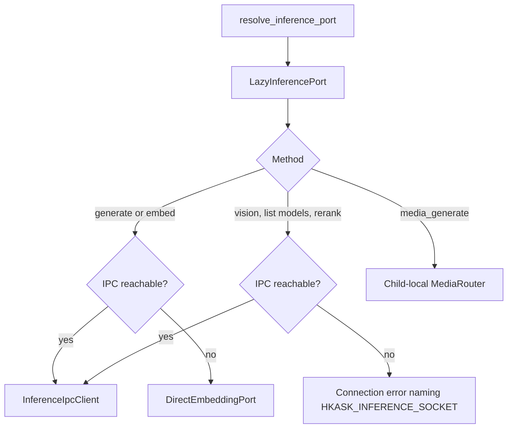
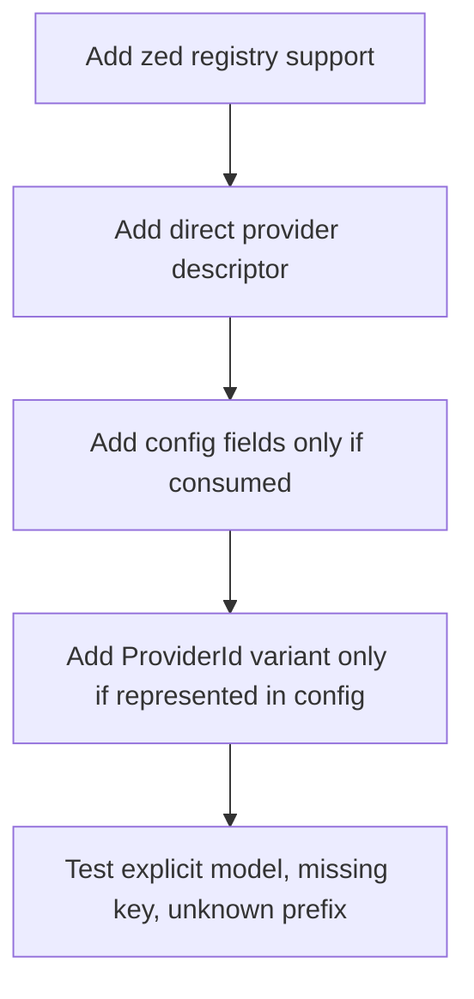

# hkask-inference — How-to: Route and Configure Inference

Use these recipes to wire an MCP server to the inference bridge, choose a model without hidden substitution, and configure strict media routing. The crate exposes port resolvers rather than provider-specific chat clients (`kask/crates/hkask-inference/src/hkask_inference.rs:41-43`, `kask/crates/hkask-inference/src/hkask_inference.rs:88-105`, `kask/crates/hkask-inference/src/hkask_inference.rs:816-895`).[^hexagonal]

## Route an MCP server through the lazy inference port

Resolve the inference port once when constructing the server:

```rust
use hkask_inference::resolve_inference_port;

let inference = resolve_inference_port().await;
```

The result is `Arc<dyn hkask_types::InferencePort>`. It does not connect immediately. Calls retry `InferenceIpcClient::from_env()` and use method-specific fallback behavior (`kask/crates/hkask-inference/src/hkask_inference.rs:88-105`, `kask/crates/hkask-inference/src/hkask_inference.rs:155-375`).



<!-- DIAGRAM_ALIGNMENT
id: DIAG-INF-WIRE
verified_date: 2026-09-16
verified_against: kask/crates/hkask-inference/src/hkask_inference.rs:88-105,155-375,389-490
status: VERIFIED
-->

Call the trait method that matches the task. The IPC adapter implements generation, message-preserving generation, vision, embedding, reranking, and model listing (`kask/crates/hkask-inference/src/inference_ipc_client.rs:679-814`). Every request uses a fresh socket connection and a correlated response ID (`kask/crates/hkask-inference/src/inference_ipc_client.rs:351-422`).

## Surface a missing default model

For chat generation without an explicit override, configure the visible default:

```sh
export HKASK_DEFAULT_MODEL='OpenRouter/vendor/model'
```

In zed-kask this value normally comes from `kask.models.default_model` and is injected into the child process. `InferenceConfig::from_env()` leaves `default_model` empty when the variable is absent (`kask/crates/hkask-inference/src/config.rs:109-135`). The direct generation path then returns `InferenceError::NotConfigured` with instructions to set the setting or pass an explicit model; it does not select a code constant (`kask/crates/hkask-inference/src/hkask_inference.rs:123-143`, `kask/crates/hkask-inference/src/hkask_inference.rs:572-597`).

When you do pass an explicit model, pass the complete registry name:

```rust
let result = inference
    .generate_with_model(&prompt, &parameters, Some("OpenRouter/vendor/model"), None)
    .await?;
```

If zed's `LanguageModelRegistry` cannot resolve that override, the bridge returns `InferenceError::Model("model_override '…' not found; no default substitution")` (`kask/crates/kask_bridge/src/inference_chat.rs:579-621`, `kask/crates/kask_bridge/src/inference_chat.rs:674-690`). Fix the provider/model configuration; do not retry without the override unless using the default model is the intended user-visible behavior.

## Configure the dedicated QA generation model

Choose either an explicit tool model or the dedicated setting/environment binding:

```sh
export HKASK_QA_GENERATION_MODEL='OpenRouter/vendor/qa-model'
```

Resolve it with:

```rust
let model = hkask_inference::model_constants::resolve_qa_generation_model(requested_model)?;
```

An explicit model wins. With neither source, the resolver returns `InferenceError::NotConfigured`; malformed or unqualified names return `InferenceError::Model`. The resolver never uses the chat default or a training base model (`kask/crates/hkask-inference/src/model_constants.rs`).

## Verify generated QA

There is no dedicated QA verification model: an LLM reviewing another
LLM is circular self-authorization, and the rejected `HKASK_QA_VERIFICATION_MODEL`
binding is deleted (`kask/crates/hkask-inference/src/model_constants.rs`).
Generation emits unverified candidates only, and acceptance is decided by the
corpus server's identity-bound external grounding gate at ingestion
(`kask/mcp-servers/hkask-mcp-corpus/src/services/qa_grounding.rs`) —
evidence citations checked against canonical source chunk bytes — never by a
second model call. Reviewed passage/level decisions are supplied to generation
as a required `prepared-qa-adjudication-v2` manifest.

## Add a direct chat or embedding provider

Bridge-routed model support belongs in zed's model registry. To add standalone direct fallback for another OpenAI-compatible provider:

1. Add a `DirectEmbeddingProvider { id, api_url, env_var }` entry to `DIRECT_EMBEDDING_PROVIDERS` (`kask/crates/hkask-inference/src/hkask_inference.rs:409-437`).
2. Keep the provider descriptor aligned with zed's registry integration; the table comment identifies the table as the embedding-capable SUBSET of `kask_bridge::inference_providers` — not a full mirror: RunPod (endpoint discovery) and KiloCode (chat-only, no embeddings endpoint) are deliberately absent (`kask/crates/hkask-inference/src/hkask_inference.rs:426-435`).
3. If configuration fields are required by other crate features, add them to `InferenceConfig::default` and `InferenceConfig::from_env` together (`kask/crates/hkask-inference/src/config.rs:66-135`).
4. Test an explicit provider-qualified model, a missing credential, and an unknown prefix. `DirectEmbeddingPort::try_new` accepts only a recognized prefix and required credentials (`kask/crates/hkask-inference/src/hkask_inference.rs:439-490`).

`ProviderId` needs a new variant only if the shared configuration must represent that provider. Its public behavior is the `as_str()` match (`kask/crates/hkask-inference/src/config.rs:34-64`); dispatch parsing remains in the direct-provider table or media registry.



<!-- DIAGRAM_ALIGNMENT
id: DIAG-INF-PROVIDER
verified_date: 2026-09-16
verified_against: kask/crates/hkask-inference/src/config.rs:34-135; kask/crates/hkask-inference/src/hkask_inference.rs:409-490; kask/crates/kask_bridge/src/inference_chat.rs:579-621
status: VERIFIED
-->

## Configure strict media routing

For selectable media operations, provide a full model name either in `MediaGenerateParams.model` or the operation's environment setting:

| Operations | Environment setting |
|---|---|
| `generate_image`, `image_to_image` | `HKASK_MEDIA_IMAGE_GEN_MODEL` |
| `generate_speech` | `HKASK_MEDIA_TTS_MODEL` |
| `transcribe`, `chat_audio`, `chat_json` | `HKASK_MEDIA_STT_MODEL` |
| `generate_video`, `image_to_video` | `HKASK_MEDIA_VIDEO_MODEL` |

The mapping is implemented by `MediaOp::model_env` (`kask/crates/hkask-inference/src/provider.rs:56-69`). Use `OpenRouter/<provider-local-model>` or `DeepInfra/<provider-local-model>`. `ProviderRegistry::execute` validates the identifier, selects exactly one registered provider, strips only the provider prefix, verifies operation support, and returns that provider's error unchanged (`kask/crates/hkask-inference/src/provider.rs:218-288`).

`remove_background` and `upscale` are fixed DeepInfra operations; pass no model override (`kask/crates/hkask-inference/src/provider.rs:57-68`, `kask/crates/hkask-inference/src/provider.rs:257-265`). Missing provider configuration returns `InferenceError::NotConfigured` naming the required key (`kask/crates/hkask-inference/src/provider.rs:266-275`).

## Resolve zed-side tool and worktree capabilities

Use the dedicated resolvers only when the server needs those capabilities:

```rust
let tools = hkask_inference::resolve_tool_dispatch_port().await;
let worktrees = hkask_inference::resolve_worktree_spawn_port().await;
```

These resolvers connect during resolution. If the bridge is absent, their stubs return `InferenceError::Connection` naming the missing socket; there is no direct HTTP fallback (`kask/crates/hkask-inference/src/hkask_inference.rs:816-895`).

## See also

- [Explanation: bridge-first inference and visible failure](./explanation.md)
- [Reference: current API surface](./reference.md)
- [hkask-types reference](../hkask-types/reference.md)

---

[^hexagonal]: Cockburn, A. (2005). *Hexagonal Architecture.* <https://alistair.cockburn.us/hexagonal-architecture/>.
