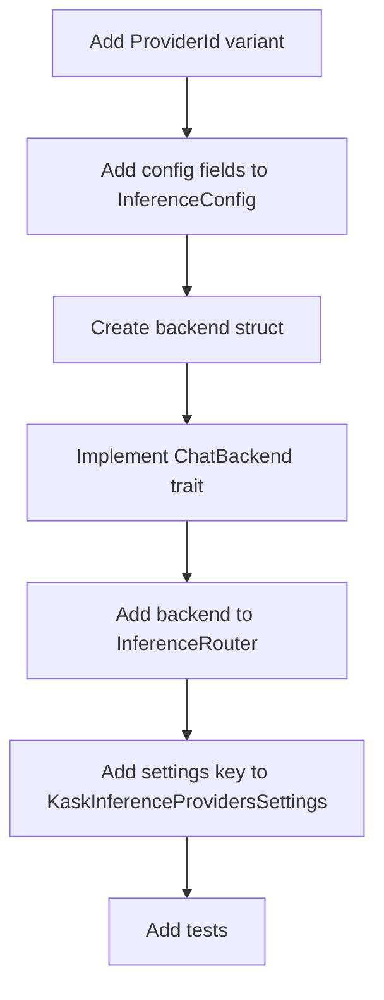

# hkask-inference — How-to: Configure a New Provider

This guide shows how to add a new inference provider to the `InferenceRouter`.
The router dispatches chat and embedding requests to provider-specific
backends. Adding a provider requires a new `ProviderId` variant, a new backend
struct, and configuration fields in `InferenceConfig`.

## Source citations

| Symbol | Location |
|--------|----------|
| `ProviderId` enum | `kask/crates/hkask-inference/src/config.rs:43` |
| `InferenceConfig` struct | `kask/crates/hkask-inference/src/config.rs:191` |
| `InferenceRouter` struct | `kask/crates/hkask-inference/src/inference_router/mod.rs:52` |
| `ChatBackend` trait | `kask/crates/hkask-inference/src/inference_router/backend.rs:51` |
| `KaskInferenceProvidersSettings` | `kask/crates/kask_bridge/src/settings.rs` |

## Procedure

<!-- DIAGRAM_ALIGNMENT
id: DIAG-DIA-INF-002
verified_date: 2026-07-27
verified_against: kask/crates/hkask-inference/src/config.rs:43,191; kask/crates/hkask-inference/src/inference_router/mod.rs:52; kask/crates/hkask-inference/src/inference_router/backend.rs:51
status: VERIFIED
-->

### Step 1: Add a ProviderId variant

Add a new variant to the `ProviderId` enum in `config.rs:43`. Include a
`#[serde(rename = "XX")]` attribute with a two-letter prefix tag. Add the
model-name prefix in the `prefix_model` and `looks_like_prefix` methods.

### Step 2: Add config fields

Add `base_url` and `api_key` fields to `InferenceConfig` in `config.rs:191`.
Initialize them from environment variables or the kask settings system.

### Step 3: Create the backend struct

Create a new file `src/<provider>_backend.rs` with a struct holding the base
URL and API key. Follow the pattern in `deepinfra_backend.rs:21`.

### Step 4: Implement ChatBackend

Implement the `ChatBackend` trait (`backend.rs:51`) for the new struct. The
`generate` method calls the provider's chat completion endpoint. The
`generate_stream` method returns an SSE stream.

### Step 5: Add to InferenceRouter

Add an `Option<NewBackend>` field to `InferenceRouter` in
`inference_router/mod.rs:52`. Construct the backend in the router's
initialization when the API key is present.

### Step 6: Add settings key

Add a field to `KaskInferenceProvidersSettings` in
`kask/crates/kask_bridge/src/settings.rs` so users can configure the provider
in their `settings.json` under the `kask.inference_providers` section.

## See also

- [hkask-inference Reference](./reference.md): class diagram of the router
  and backends.
- [kask_bridge Reference](../kask_bridge/reference.md): the
  `KaskInferenceProvidersSettings` struct.

---

[^hexagonal]: Cockburn, A. (2005). *Hexagonal Architecture.* <https://alistair.cockburn.us/hexagonal-architecture/>. The backend-trait pattern that makes adding a provider a localized change.
