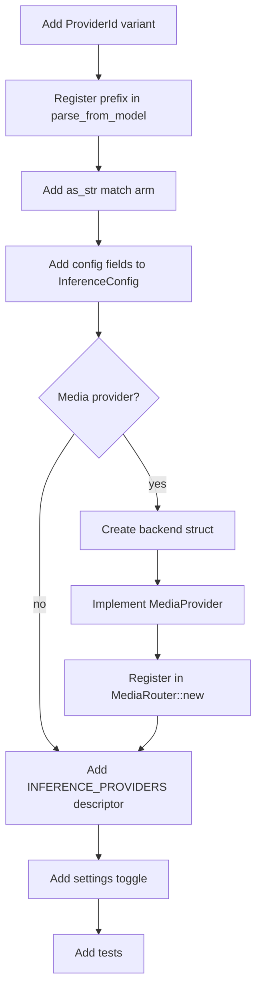

# hkask-inference — How-to: Configure a New Provider

This guide shows how to add a new inference provider. There are two shapes:

- **Chat provider** (routed by `ProviderId` prefix, served by zed's
  `LanguageModelRegistry` over the IPC bridge): add a `ProviderId` variant,
  a prefix, config fields, a settings toggle, and an
  `InferenceProviderDescriptor`. No backend struct is needed in this crate
  — zed serves the calls. OpenRouter / KiloCode / Ollama / Cline are this
  shape.
- **Media provider** (image/video/speech/transcription, served by
  `MediaRouter`): all of the chat-provider steps **plus** a backend struct
  that implements `MediaProvider`, registered in `MediaRouter::new`.
  DeepInfra / fal.ai / AtlasCloud are this shape.

## Source citations

| Symbol | Location |
|--------|----------|
| `ProviderId` enum | `kask/crates/hkask-inference/src/config.rs:38` |
| `parse_from_model` (`PREFIXES`) | `kask/crates/hkask-inference/src/config.rs:77` |
| `as_str` | `kask/crates/hkask-inference/src/config.rs:142` |
| `InferenceConfig` struct | `kask/crates/hkask-inference/src/config.rs:161` |
| `InferenceConfig::from_env` | `kask/crates/hkask-inference/src/config.rs:230` |
| `MediaProvider` trait | `kask/crates/hkask-inference/src/provider.rs:87` |
| `MediaRouter::new` | `kask/crates/hkask-inference/src/media_router.rs:66` |
| `INFERENCE_PROVIDERS` | `kask/crates/kask_bridge/src/inference_providers.rs:45` |
| `KaskInferenceProvidersSettings` | `kask/crates/kask_bridge/src/settings.rs:145` |

## Procedure

<!-- DIAGRAM_ALIGNMENT
id: DIAG-DIA-INF-002
verified_date: 2026-08-03
verified_against: kask/crates/hkask-inference/src/config.rs:38,77,142,161,230; kask/crates/hkask-inference/src/provider.rs:87; kask/crates/hkask-inference/src/media_router.rs:66; kask/crates/kask_bridge/src/inference_providers.rs:45; kask/crates/kask_bridge/src/settings.rs:145
status: VERIFIED
-->

### Step 1: Add a ProviderId variant

Add a new variant to the `ProviderId` enum in `config.rs:38`. Include a
`#[serde(rename = "XX")]` attribute with a two-letter serialization code
(e.g. `"DI"` for DeepInfra). This code is the serde tag, *not* the
model-name prefix — the prefix is registered separately in Step 2.

### Step 2: Register the prefix in parse_from_model

Add an entry to the `PREFIXES` const in `ProviderId::parse_from_model`
(`config.rs:77`). The prefix is the full provider name followed by `/`
(e.g. `"DeepInfra/"`, `"fal.ai/"`). This is what the router matches
against model-name strings.

### Step 3: Add the as_str match arm

Add a match arm to `ProviderId::as_str` (`config.rs:142`) returning the
full provider name (e.g. `"DeepInfra"`). This is used by `prefix_model`
(`config.rs:132`) to construct canonical prefixed names.

### Step 4: Add config fields

Add `base_url` and `api_key` fields to `InferenceConfig` in `config.rs:161`.
Initialize them in `Default::default()` and from environment variables in
`InferenceConfig::from_env` (`config.rs:230`) — use `ProviderConfig::from_env`
or `resolve_api_key` so the keychain-injected env var resolves.

### Step 5 (media providers only): Create the backend struct

Create a new file `src/<provider>_backend.rs` with a struct holding the
base URL, API key, and a shared `Arc<reqwest::Client>`. Follow the pattern
in `deepinfra_backend.rs` (`DeepInfraBackend::new` at
`deepinfra_backend.rs:40` returns `Err` when the API key is empty). Add
inherent `generate` / `generate_with_messages` / vision methods that call
the shared `openai_compat::openai_compatible_generate[_messages]` helper
for direct OpenAI-compatible chat (used on the standalone path).

### Step 6 (media providers only): Implement MediaProvider

Implement the `MediaProvider` trait (`provider.rs:87`) for the new struct:
`id()`, `supports(op)`, and `execute(op, params)`. `supports` declares
which `MediaOp`s the provider handles; the `ProviderRegistry`
(`provider.rs:114`) dispatches an op to the first supporting provider with
fallback.

### Step 7 (media providers only): Register in MediaRouter::new

Register the backend in `MediaRouter::new` (`media_router.rs:66`): push it
to the `providers` vec only when `Backend::new` returns `Ok` (API key
present), following the existing `match Backend::new(&config, client) { Ok(b) => providers.push(Arc::new(b)), Err(_) => warn }` pattern. Registry
order encodes the preference policy (preferred provider first).

### Step 8: Add an INFERENCE_PROVIDERS descriptor

Add an `InferenceProviderDescriptor` to the `INFERENCE_PROVIDERS` static in
`kask/crates/kask_bridge/src/inference_providers.rs:45` with the provider
`id`, `api_url`, `env_var`, `credential_key`, and `dashboard_url`. This
drives the settings UI rows, credential-URL injection, and
`ensure_openai_compatible_entries` registration in zed's
`LanguageModelRegistry`.

### Step 9: Add the settings toggle

Add a `<provider>_enabled: bool` field to `KaskInferenceProvidersSettings`
in `kask/crates/kask_bridge/src/settings.rs:145` (and the matching
`Option<bool>` field to `KaskInferenceProvidersSettingsContent` in
`crates/settings_content`), wire it in `from_env()`, `From<Content>`, and
the settings UI match arms in
`crates/settings_ui/src/pages/kask_page/inference_providers.rs`. This lets
users configure the provider under `kask.inference_providers` in
`settings.json`.

### Step 10: Add tests

Update the provider-count tests: `corpus_properties.rs`
(`ALL_PROVIDERS` / `ALL_PROVIDER_IDS` / `PROVIDER_ALIASES` / the
`arb_prefixed_name` strategy) and the `kask_bridge` settings tests. Add a
`parse_from_model` / `as_str` / `parse_provider_code` assertion for the
new variant.

## See also

- [hkask-inference Reference](./reference.md): `InferencePort` impls,
  `MediaProvider` trait, and the backend structs.
- [kask_bridge Reference](../kask_bridge/reference.md): the
  `KaskInferenceProvidersSettings` struct and `INFERENCE_PROVIDERS` table.

---

[^hexagonal]: Cockburn, A. (2005). *Hexagonal Architecture.* <https://alistair.cockburn.us/hexagonal-architecture/>. The `MediaProvider` trait + `ProviderRegistry` that makes adding a media provider a localized change.