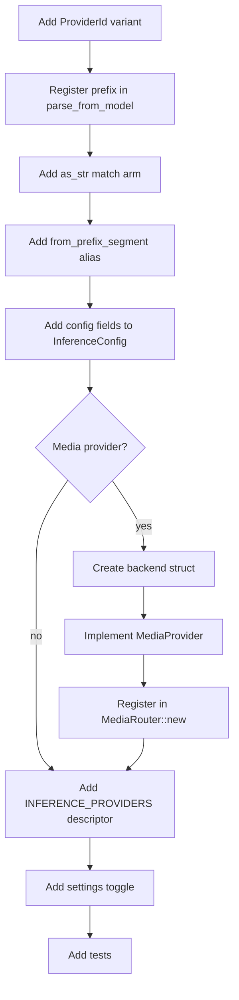

<!-- STALE — predates the hkask-inference refactor (Candidates A/B/C + follow-ups). The
`openai_compat::openai_compatible_generate[_messages]` helper it references was REMOVED — the
direct-HTTP chat path was deleted when inference routing moved to the IPC bridge (`InferenceIpcClient`).
`MediaProvider` backends and the `ProviderRegistry`/`MediaRouter` described here do not exist in the
current crate. Consult the source before following this how-to. -->

# hkask-inference — How-to: Configure a New Provider

This guide shows how to add a new inference provider to `hkask-inference`.
There are two shapes:

- **Chat provider** (routed by `ProviderId` prefix, served by zed's
  `LanguageModelRegistry` over the IPC bridge): add a `ProviderId` variant, a
  prefix, config fields, a settings toggle, and an
  `InferenceProviderDescriptor`. No backend struct is needed in this crate —
  zed serves the calls. OpenRouter / Ollama / RunPod are this shape.
- **Media provider** (image/video/speech/transcription, served by
  `MediaRouter`): all of the chat-provider steps **plus** a backend struct
  that implements `MediaProvider`, registered in `MediaRouter::new`.

## Source citations

| Symbol | Location |
|--------|----------|
| `ProviderId` enum | `kask/crates/hkask-inference/src/config.rs:33` |
| `parse_from_model` (`PREFIXES`) | `kask/crates/hkask-inference/src/config.rs:64` |
| `from_prefix_segment` | `kask/crates/hkask-inference/src/config.rs:97` |
| `as_str` | `kask/crates/hkask-inference/src/config.rs:124` |
| `prefix_model` | `kask/crates/hkask-inference/src/config.rs:114` |
| `InferenceConfig` struct | `kask/crates/hkask-inference/src/config.rs:140` |
| `InferenceConfig::default` | `kask/crates/hkask-inference/src/config.rs:164` |
| `InferenceConfig::from_env` | `kask/crates/hkask-inference/src/config.rs:191` |
| `ProviderConfig::from_env` | `kask/crates/hkask-inference/src/config.rs:354` |
| `resolve_api_key` | `kask/crates/hkask-inference/src/config.rs:263` |
| `parse_provider_code` | `kask/crates/hkask-inference/src/config.rs:289` |
| `MediaProvider` trait | `kask/crates/hkask-inference/src/provider.rs:82` |
| `MediaOp` enum | `kask/crates/hkask-inference/src/provider.rs:25` |
| `ProviderRegistry::execute` | `kask/crates/hkask-inference/src/provider.rs:162` |
| `MediaRouter::new` | `kask/crates/hkask-inference/src/media_router.rs:64` |
| `MediaRouter::media_generate` | `kask/crates/hkask-inference/src/media_router.rs:316` |
| `BRIDGE_ERROR` | `kask/crates/hkask-inference/src/media_router.rs:242` |
| `resolve_inference_port` | `kask/crates/hkask-inference/src/hkask_inference.rs:184` |

## Procedure

<!-- DIAGRAM_ALIGNMENT
id: DIAG-INF-002
verified_date: 2026-08-13
verified_against: kask/crates/hkask-inference/src/config.rs:33,64,97,114,124,140,164,191,263,289,354; kask/crates/hkask-inference/src/provider.rs:25,82,162; kask/crates/hkask-inference/src/media_router.rs:64,242,316
status: VERIFIED
-->

### Step 1: Add a `ProviderId` variant

Add a new variant to the `ProviderId` enum in `config.rs:33`. Include a
`#[serde(rename = "XX")]` attribute with a two-letter serialization code
(e.g. `"OR"` for OpenRouter, `"OM"` for Ollama). This
code is the serde tag, *not* the model-name prefix — the prefix is registered
separately in Step 2.

### Step 2: Register the prefix in `parse_from_model`

Add an entry to the `PREFIXES` const in `ProviderId::parse_from_model`
(`config.rs:64`). The prefix is the full provider name followed by `/`
(e.g. `"OpenRouter/"`, `"ollama/"`). This is what the router
matches against model-name strings. An empty remainder after stripping the
prefix returns `None` (`config.rs:72`).

### Step 3: Add the `as_str` match arm

Add a match arm to `ProviderId::as_str` (`config.rs:124`) returning the full
provider name (e.g. `"RunPod"`, `"OpenRouter"`, `"ollama"`).
This is used by `prefix_model` (`config.rs:114`) to construct canonical
prefixed names of the form `"{prefix}/{model}"`.

### Step 4: Add the `from_prefix_segment` alias

Add a match arm to `ProviderId::from_prefix_segment` (`config.rs:97`)
classifying the prefix segment case-insensitively, including short aliases
(e.g. `"openrouter" | "or"`). Unrecognized segments
fall back to `OpenRouter` (`config.rs:103`). Centralizing the alias table
here keeps provider knowledge in one place.

### Step 5: Add config fields

Add `base_url` and `api_key` fields to `InferenceConfig` in `config.rs:140`.
Initialize them in `Default::default()` (`config.rs:164`) and from environment
variables in `InferenceConfig::from_env` (`config.rs:191`). Use
`ProviderConfig::from_env` (`config.rs:354`) — it sanitizes the prefix to
uppercase and reads `{PREFIX}_BASE_URL` / `{PREFIX}_API_KEY` — or
`resolve_api_key` (`config.rs:263`) directly so the keychain-injected env var
resolves. Do **not** fall back to the `hkask` keychain namespace; that
namespace is reserved for sovereignty keys (see the `resolve_api_key` doc
comment, `config.rs:252-260`).

### Step 6 (media providers only): Create the backend struct

Create a new file `src/<provider>_backend.rs` with a struct holding the base
URL, API key, and a shared `Arc<reqwest::Client>`. The constructor should
return `Err` when the API key is empty. Add inherent `generate` /
`generate_with_messages` / vision
methods that call the shared `openai_compat::openai_compatible_generate[_messages]`
helper for direct OpenAI-compatible chat (the standalone path; zed-kask chat
routes through the IPC bridge instead).

### Step 7 (media providers only): Implement `MediaProvider`

Implement the `MediaProvider` trait (`provider.rs:82`) for the new struct:
`id()`, `supports(op)`, and `execute(op, params)`. `supports` declares which
of the eight `MediaOp` variants (`provider.rs:25`) the provider handles; the
`ProviderRegistry` (`provider.rs:109`) dispatches an op to the first
supporting provider with fallback.

### Step 8 (media providers only): Register in `MediaRouter::new`

Register the backend in `MediaRouter::new` (`media_router.rs:64`): push it to
the `providers` vec only when `Backend::new` returns `Ok` (API key present),
following the `match Backend::new(&config, client) { Ok(b) =>
providers.push(Arc::new(b)), Err(_) => warn }` pattern. Registry order encodes
the preference policy (preferred provider first).

### Step 9: Add an `INFERENCE_PROVIDERS` descriptor

Add an `InferenceProviderDescriptor` to the `INFERENCE_PROVIDERS` static in
`kask/crates/kask_bridge/src/inference_providers.rs` with the provider `id`,
`api_url`, `env_var`, `credential_key`, and `dashboard_url`. This drives the
settings UI rows, credential-URL injection, and
`ensure_openai_compatible_entries` registration in zed's
`LanguageModelRegistry`.

### Step 10: Add the settings toggle

Add a `<provider>_enabled: bool` field to `KaskInferenceProvidersSettings`
in `kask/crates/kask_bridge/src/settings.rs` (and the matching `Option<bool>`
field to `KaskInferenceProvidersSettingsContent` in `crates/settings_content`),
wire it in `from_env()`, `From<Content>`, and the settings UI match arms in
`crates/settings_ui/src/pages/kask_page/inference_providers.rs`. This lets
users configure the provider under `kask.inference_providers` in
`settings.json`.

### Step 11: Add tests

Update the provider-count tests: `corpus_properties.rs`
(`ALL_PROVIDERS` / `ALL_PROVIDER_IDS` / `PROVIDER_ALIASES` / the
`arb_prefixed_name` strategy) and the `kask_bridge` settings tests. Add a
`parse_from_model` / `as_str` / `from_prefix_segment` / `parse_provider_code`
assertion for the new variant. The existing tests in `config.rs:374-553`
(`parse_provider_prefix`, `parse_no_prefix_returns_none`,
`parse_empty_model_returns_none`, `parse_too_short_returns_none`,
`parse_unknown_prefix_returns_none`, `prefix_model_format`,
`parse_provider_code_all_codes`,
`parse_provider_code_unknown_defaults_to_openrouter`,
`resolve_api_key_primary_env`, `resolve_api_key_empty_when_missing`,
`resolve_api_key_no_keychain_fallback`,
`from_prefix_segment_classifies_aliases_case_insensitively`) are the
patterns to follow.

## See also

- [hkask-inference Reference](./reference.md): `InferencePort` impls,
  `MediaProvider` trait, and the backend structs.
- [kask_bridge Reference](../kask_bridge/reference.md): the
  `KaskInferenceProvidersSettings` struct and `INFERENCE_PROVIDERS` table.

---

[^hexagonal]: Cockburn, A. (2005). *Hexagonal Architecture.* <https://alistair.cockburn.us/hexagonal-architecture/>. The `MediaProvider` trait + `ProviderRegistry` that makes adding a media provider a localized change.
