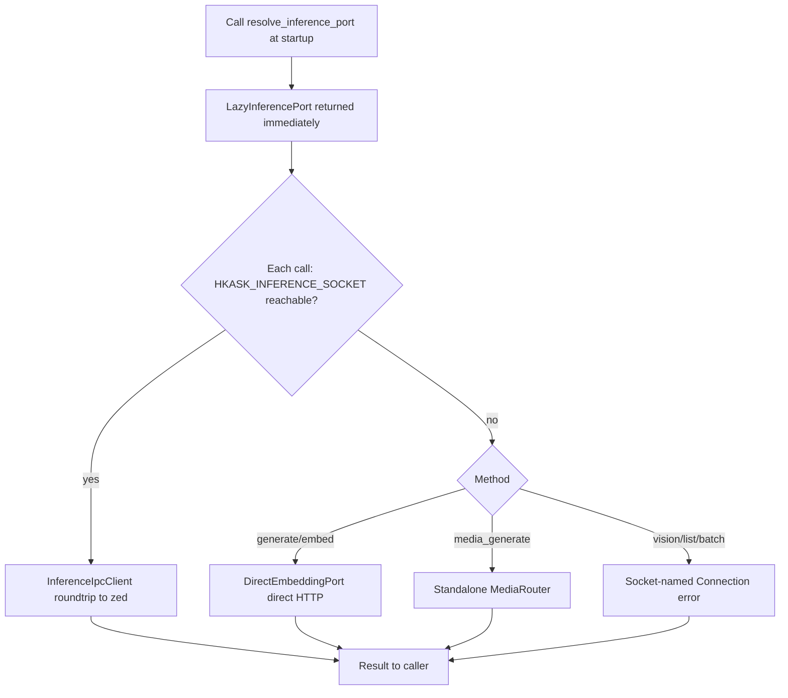
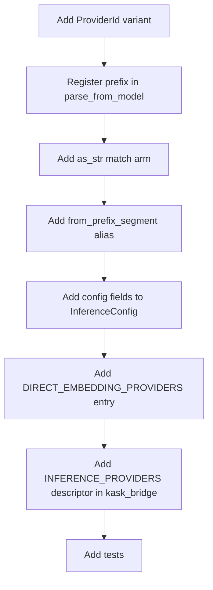

# hkask-inference — How-to: Route Inference Through the IPC Bridge

`hkask-inference` routes MCP-server inference to zed's
`LanguageModelRegistry` over a Unix socket (`HKASK_INFERENCE_SOCKET`),
with lazy direct-HTTP fallbacks for chat/embed and standalone media when
the bridge is unavailable. This guide covers the two things a developer
configures in this crate: **wiring an MCP server to the bridge** via the
per-port resolvers, and **adding a chat provider** (a `ProviderId`
variant + prefix + config fields — the backend is served by zed or the
direct-fallback table, not a new struct in this crate).

> **Retired premise.** An earlier version of this how-to described a
> `resolve_ports()` entry point sharing one connection across three
> ports, and an `UnavailableInference` stub returned at startup. Both were
> removed: `resolve_inference_port()` now returns a `LazyInferencePort`
> that retries the bridge per call and falls back to
> `DirectEmbeddingPort` (`kask/crates/hkask-inference/src/hkask_inference.rs:94-292`).
> Do not follow any procedure referencing `resolve_ports`, `InferencePorts`,
> or `UnavailableInference`; they do not exist.

## Source citations

| Symbol | Location |
|--------|----------|
| `resolve_inference_port` | `kask/crates/hkask-inference/src/hkask_inference.rs:94` |
| `resolve_tool_dispatch_port` | `kask/crates/hkask-inference/src/hkask_inference.rs:713` |
| `resolve_worktree_spawn_port` | `kask/crates/hkask-inference/src/hkask_inference.rs:753` |
| `connect_bridge` | `kask/crates/hkask-inference/src/hkask_inference.rs:59` |
| `LazyInferencePort` | `kask/crates/hkask-inference/src/hkask_inference.rs:102` |
| `DIRECT_EMBEDDING_PROVIDERS` | `kask/crates/hkask-inference/src/hkask_inference.rs:359` |
| `InferenceIpcClient::from_env` | `kask/crates/hkask-inference/src/inference_ipc_client.rs:330` |
| `ProviderId` enum | `kask/crates/hkask-inference/src/config.rs:34` |
| `ProviderId::parse_from_model` (`PREFIXES`) | `kask/crates/hkask-inference/src/config.rs:59` |
| `ProviderId::from_prefix_segment` | `kask/crates/hkask-inference/src/config.rs:94` |
| `ProviderId::as_str` | `kask/crates/hkask-inference/src/config.rs:120` |
| `InferenceConfig` struct | `kask/crates/hkask-inference/src/config.rs:135` |
| `InferenceConfig::from_env` | `kask/crates/hkask-inference/src/config.rs:179` |
| `ProviderConfig::from_env` | `kask/crates/hkask-inference/src/config.rs:285` |
| `resolve_api_key` | `kask/crates/hkask-inference/src/config.rs:221` |
| `INFERENCE_PROVIDERS` (kask_bridge) | `kask/crates/kask_bridge/src/inference_providers.rs:55` |
| `InferenceProviderDescriptor` | `kask/crates/kask_bridge/src/inference_providers.rs:30` |

## Procedure A: Wire an MCP server to the bridge



<!-- DIAGRAM_ALIGNMENT
id: DIAG-INF-WIRE
verified_date: 2026-08-28
verified_against: kask/crates/hkask-inference/src/hkask_inference.rs:94 (resolve_inference_port), :102-292 (LazyInferencePort per-method fallbacks), :713 (resolve_tool_dispatch_port), :753 (resolve_worktree_spawn_port); kask/crates/hkask-inference/src/inference_ipc_client.rs:330 (from_env)
status: VERIFIED
-->

### Step 1: Resolve the port(s) at startup

Call the per-port resolver your server needs once at startup. Current
callers: the corpus server
(`kask/mcp-servers/hkask-mcp-corpus/src/hkask_mcp_corpus.rs:288`), curator
(`.../hkask-mcp-curator/src/hkask_mcp_curator.rs:1430`), media
(`.../hkask-mcp-media/src/hkask_mcp_media.rs:474`), prediction-markets
(`.../hkask-mcp-prediction-markets/src/hkask_mcp_prediction_markets.rs:1545`),
training (`.../hkask-mcp-training/src/hkask_mcp_training.rs:370`), and
swarm (`kask/mcp-servers/hkask-mcp-swarm/src/local_runtime.rs:186-187`,
which also calls `resolve_tool_dispatch_port`). The kata-kanban server
calls `resolve_worktree_spawn_port()`
(`kask/mcp-servers/hkask-mcp-kata-kanban/src/hkask_mcp_kata_kanban.rs:1743`).

```rust
use hkask_inference::resolve_inference_port;

let inference = resolve_inference_port().await; // Arc<dyn InferencePort>
```

`resolve_inference_port` returns a `LazyInferencePort`
(`hkask_inference.rs:102`) — no connection is attempted at startup. Each
trait method retries `InferenceIpcClient::from_env()`
(`inference_ipc_client.rs:330`) and falls back per-method (chat/embed →
`DirectEmbeddingPort`, media → standalone `MediaRouter`, vision/list/batch
→ socket-named `Err`). This is deliberate: a server that starts before
the IPC socket exists picks the bridge up on its next call without a
restart (`hkask_inference.rs:86-93`).

`resolve_tool_dispatch_port` (`hkask_inference.rs:713`) and
`resolve_worktree_spawn_port` (`hkask_inference.rs:753`) are
resolve-once: they call `connect_bridge` (`hkask_inference.rs:59`) and,
when the bridge is down, return `UnavailableToolDispatch` (`:725`) /
`UnavailableWorktreeSpawn` (`:764`) stubs whose every method returns a
`Connection` error naming the missing socket
(`IPC_BRIDGE_UNAVAILABLE`, `:48`). Tool dispatch and worktree spawn have
no standalone fallback — they require the zed process.

### Step 2: Call port methods

With the resolved `Arc<dyn InferencePort>`, call the trait methods defined
by `hkask_types::InferencePort`
(`kask/crates/hkask-types/src/ports/inference_port.rs:147`):
`generate`, `generate_with_model`, `generate_with_messages`,
`generate_vision`, `embed`, `list_models`, `generate_batch`,
`media_generate`. Each bridge call opens a fresh connection
(`ipc_roundtrip`, `inference_ipc_client.rs:352`), writes one
newline-delimited JSON request, and reads one response line capped at
16 MiB (`MAX_IPC_LINE_BYTES`, `:74`) under a server-aligned deadline
(`ipc_read_timeout`, `:147` — `HKASK_INFERENCE_TIMEOUT_SECS` + 30 s grace,
600 s fallback). Batch calls use a 6 h + 60 s deadline
(`IPC_BATCH_READ_TIMEOUT`, `:183`).

The MCP server child process never holds the provider API keys for
bridge-routed calls. zed injects the keys the child needs as env vars and
resolves the actual inference through its `LanguageModelRegistry`, which
maps provider prefixes (`OpenRouter/`, `ollama/`, `RunPod/`) to
credentials. The direct fallback (`DirectEmbeddingPort`) does read
env-var keys itself — that is its purpose: standalone operation.

## Procedure B: Add a chat provider

Adding a chat provider is a routing-prefix change, not a backend struct.
zed's `LanguageModelRegistry` serves bridge-routed calls; the direct
fallback table serves standalone calls.



<!-- DIAGRAM_ALIGNMENT
id: DIAG-INF-PROVIDER
verified_date: 2026-08-28
verified_against: kask/crates/hkask-inference/src/config.rs:34,59,94,120,135,179; kask/crates/hkask-inference/src/hkask_inference.rs:359 (DIRECT_EMBEDDING_PROVIDERS); kask/crates/kask_bridge/src/inference_providers.rs:55 (INFERENCE_PROVIDERS)
status: VERIFIED
-->

### Step 1: Add a `ProviderId` variant

Add a new variant to the `ProviderId` enum (`config.rs:34`) with a
`#[serde(rename = "XX")]` two-letter serialization code. The code is the
serde tag, *not* the model-name prefix.

### Step 2: Register the prefix in `parse_from_model`

Add an entry to the `PREFIXES` const inside
`ProviderId::parse_from_model` (`config.rs:59`, table at `:62`): the full
provider name followed by `/`. An empty remainder after stripping
returns `None`.

### Step 3: Add the `as_str` match arm

Add a match arm to `ProviderId::as_str` (`config.rs:120`) returning the
full provider name; `prefix_model` (`config.rs:110`) uses it to construct
`"{prefix}/{model}"`.

### Step 4: Add the `from_prefix_segment` alias

Add a match arm to `ProviderId::from_prefix_segment` (`config.rs:94`)
classifying the segment case-insensitively, including short aliases.
Unrecognized segments fall back to `OpenRouter`.

### Step 5: Add config fields

Add `base_url` and `api_key` fields to `InferenceConfig`
(`config.rs:135`), initialize them in `Default` (`config.rs:154`) and
`from_env` (`config.rs:179`). Use `ProviderConfig::from_env`
(`config.rs:285`) — it sanitizes the prefix to uppercase and reads
`{PREFIX}_BASE_URL` / `{PREFIX}_API_KEY`. Do **not** fall back to the
`hkask` keychain namespace; that namespace is reserved for sovereignty
keys (see the `resolve_api_key` doc comment, `config.rs:210-217`).

### Step 6: Add a `DIRECT_EMBEDDING_PROVIDERS` entry

Add a `DirectEmbeddingProvider { id, api_url, env_var }` to the static
table at `hkask_inference.rs:359` so the standalone fallback can route
the new prefix. This table deliberately mirrors `kask_bridge`'s
`INFERENCE_PROVIDERS` — keep both in sync (the duplication exists
because `hkask-inference` cannot depend on `kask_bridge` without
inverting the D8 seam; doc comment at `hkask_inference.rs:337-340`).

### Step 7: Add an `INFERENCE_PROVIDERS` descriptor

Add an `InferenceProviderDescriptor`
(`kask/crates/kask_bridge/src/inference_providers.rs:30`) to the
`INFERENCE_PROVIDERS` static (`:55`) with the provider `id`, `api_url`,
`env_var`, `credential_key`, `dashboard_url`, and `inject_for_mcp`. This
drives credential-URL injection for MCP launches
(`credential_urls_for_mcp`, `:344`) and the settings UI's data-services
page (`crates/settings_ui/src/pages/kask_page/data_services.rs`). Note:
there is no per-provider `*_enabled` settings toggle — the key's presence
in the keychain is the toggle.

### Step 8: Add tests

Add `parse_from_model` / `as_str` / `from_prefix_segment` /
`parse_provider_code` assertions for the new variant, and a
`DIRECT_EMBEDDING_PROVIDERS` prefix-matching test mirroring the
`try_new` contract (`hkask_inference.rs:377`). The IPC client's test
module (`inference_ipc_client.rs:946-1121`) pins the transport contract
(id mismatch, malformed JSON, dead socket) — extend it only if the wire
protocol changes.

## See also

- [hkask-inference Reference](./reference.md): the full citation table,
  media stack, and batch API.
- [hkask-inference Explanation](./explanation.md): why the bridge is the
  primary path and how the fallbacks are shaped.

---

[^hexagonal]: Cockburn, A. (2005). *Hexagonal Architecture.* <https://alistair.cockburn.us/hexagonal-architecture/>. The port-trait boundary that lets the bridge client, the lazy fallbacks, and the stubs be swapped behind one trait object — adding a chat provider is a prefix change, not a new backend.
