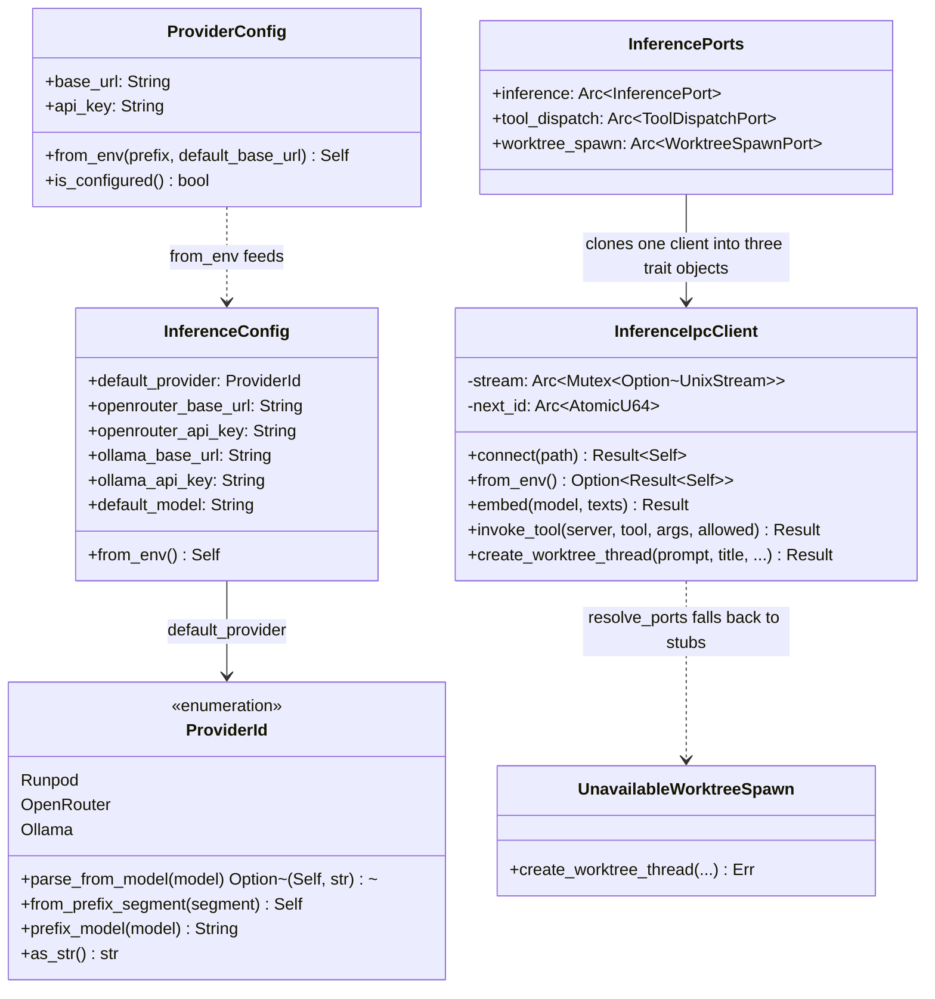

# hkask-inference — Reference

`hkask-inference` is the IPC-bridge facade that lets hKask MCP server child
processes route inference back to zed's `LanguageModelRegistry` over a Unix
socket, instead of holding API keys or speaking HTTP directly. The crate
defines the `ProviderId` enum and `InferenceConfig` struct, the
`InferenceIpcClient` (the single `InferencePort` / `ToolDispatchPort` /
`WorktreeSpawnPort` implementation), the per-port resolvers, the
`resolve_ports()` entry point that shares one connection across all three
ports, and the `openai_compat` response-body redaction utility. There is no
in-process media-provider registry, no direct-HTTP chat path, and no
model-entry type in this crate — those were removed in the IPC-bridge
refactor. Every method of the IPC client is a newline-delimited JSON
request/response over the socket; zed holds the credentials and the guard.

## Source citations

Every row below was re-derived from disk via `grep -n` against the current
source. Symbols removed in the refactor (notably `chat_protocol`,
`openai_compatible_generate[_messages]`, `openai_chat_roundtrip`,
`RouterModelEntry`, `from_model_entry`, `infer_vision_support`,
`DEFAULT_VISION_MODEL`, `InferenceConfig::build_client`,
`InferenceConfig::timeout_secs`/`pool_max_idle`, `MediaOp`, `MediaProvider`,
`ProviderRegistry`, `MediaRouter`, `resolve_skill_exec_port`,
`UnavailableSkillExec`) are intentionally absent — they no longer exist.

### `config.rs`

| Symbol | Location |
|--------|----------|
| `ProviderId` enum | `kask/crates/hkask-inference/src/config.rs:34` |
| `ProviderId::parse_from_model` | `kask/crates/hkask-inference/src/config.rs:59` |
| `ProviderId::from_prefix_segment` | `kask/crates/hkask-inference/src/config.rs:94` |
| `ProviderId::prefix_model` | `kask/crates/hkask-inference/src/config.rs:110` |
| `ProviderId::as_str` | `kask/crates/hkask-inference/src/config.rs:120` |
| `InferenceConfig` struct | `kask/crates/hkask-inference/src/config.rs:135` |
| `impl Default for InferenceConfig` | `kask/crates/hkask-inference/src/config.rs:150` |
| `InferenceConfig::from_env` | `kask/crates/hkask-inference/src/config.rs:172` |
| `resolve_api_key` (private) | `kask/crates/hkask-inference/src/config.rs:211` |
| `resolve_default_provider` (private) | `kask/crates/hkask-inference/src/config.rs:227` |
| `parse_provider_code` (private) | `kask/crates/hkask-inference/src/config.rs:237` |
| `resolve_config_str` (private) | `kask/crates/hkask-inference/src/config.rs:252` |
| `ProviderConfig` struct (`pub(crate)`) | `kask/crates/hkask-inference/src/config.rs:265` |
| `ProviderConfig::from_env` | `kask/crates/hkask-inference/src/config.rs:275` |
| `ProviderConfig::is_configured` | `kask/crates/hkask-inference/src/config.rs:288` |

### `inference_ipc_client.rs`

| Symbol | Location |
|--------|----------|
| `MAX_IPC_LINE_BYTES` (`pub(crate)`) | `kask/crates/hkask-inference/src/inference_ipc_client.rs:67` |
| `IPC_READ_TIMEOUT` (`pub(crate)`) | `kask/crates/hkask-inference/src/inference_ipc_client.rs:76` |
| `read_response_line` (private) | `kask/crates/hkask-inference/src/inference_ipc_client.rs:82` |
| `InferenceIpcClient` struct (`#[derive(Clone)]`) | `kask/crates/hkask-inference/src/inference_ipc_client.rs:173` |
| `InferenceIpcClient::connect` | `kask/crates/hkask-inference/src/inference_ipc_client.rs:184` |
| `InferenceIpcClient::from_env` | `kask/crates/hkask-inference/src/inference_ipc_client.rs:197` |
| `ipc_roundtrip` (private transport skeleton) | `kask/crates/hkask-inference/src/inference_ipc_client.rs:218` |
| `call` (private, generate path) | `kask/crates/hkask-inference/src/inference_ipc_client.rs:301` |
| `call_embed` (private) | `kask/crates/hkask-inference/src/inference_ipc_client.rs:329` |
| `call_list_models` (private) | `kask/crates/hkask-inference/src/inference_ipc_client.rs:381` |
| `InferenceIpcClient::embed` | `kask/crates/hkask-inference/src/inference_ipc_client.rs:369` |
| `InferenceIpcClient::invoke_tool` | `kask/crates/hkask-inference/src/inference_ipc_client.rs:416` |
| `InferenceIpcClient::create_worktree_thread` | `kask/crates/hkask-inference/src/inference_ipc_client.rs:458` |
| `impl InferencePort for InferenceIpcClient` | `kask/crates/hkask-inference/src/inference_ipc_client.rs:496` |
| `impl ToolDispatchPort for InferenceIpcClient` | `kask/crates/hkask-inference/src/inference_ipc_client.rs:620` |
| `impl WorktreeSpawnPort for InferenceIpcClient` | `kask/crates/hkask-inference/src/inference_ipc_client.rs:637` |

### `hkask_inference.rs` (lib root)

| Symbol | Location |
|--------|----------|
| public re-exports (`InferenceConfig`, `ProviderId`, `InferenceIpcClient`) | `kask/crates/hkask-inference/src/hkask_inference.rs:36-37` |
| `IPC_BRIDGE_UNAVAILABLE` const | `kask/crates/hkask-inference/src/hkask_inference.rs:44` |
| `connect_bridge` (private) | `kask/crates/hkask-inference/src/hkask_inference.rs:55` |
| `resolve_inference_port` | `kask/crates/hkask-inference/src/hkask_inference.rs:94` |
| `UnavailableInference` (private) | `kask/crates/hkask-inference/src/hkask_inference.rs:112` |
| `resolve_tool_dispatch_port` | `kask/crates/hkask-inference/src/hkask_inference.rs:189` |
| `UnavailableToolDispatch` (private) | `kask/crates/hkask-inference/src/hkask_inference.rs:201` |
| `resolve_worktree_spawn_port` | `kask/crates/hkask-inference/src/hkask_inference.rs:229` |
| `UnavailableWorktreeSpawn` (`pub(crate)`) | `kask/crates/hkask-inference/src/hkask_inference.rs:240` |
| `InferencePorts` struct (`pub(crate)`) | `kask/crates/hkask-inference/src/hkask_inference.rs:277` |
| `resolve_ports` | `kask/crates/hkask-inference/src/hkask_inference.rs:290` |

### `model_constants.rs`

| Symbol | Location |
|--------|----------|
| `DEFAULT_CLASSIFIER_MODEL` | `kask/crates/hkask-inference/src/model_constants.rs:24` |
| `DEFAULT_EMBEDDING_MODEL` | `kask/crates/hkask-inference/src/model_constants.rs:32` |
| `DEFAULT_OCR_MODEL` | `kask/crates/hkask-inference/src/model_constants.rs:41` |
| `DEFAULT_FALLBACK_MODEL` | `kask/crates/hkask-inference/src/model_constants.rs:46` |
| `DEFAULT_AGENT_MODEL` | `kask/crates/hkask-inference/src/model_constants.rs:50` |
| `classifier_model()` | `kask/crates/hkask-inference/src/model_constants.rs:55` |
| `embedding_model()` | `kask/crates/hkask-inference/src/model_constants.rs:60` |
| `ocr_model()` | `kask/crates/hkask-inference/src/model_constants.rs:65` |

### `openai_compat.rs`

| Symbol | Location |
|--------|----------|
| `ERROR_BODY_MAX_CHARS` (`pub(crate)`) | `kask/crates/hkask-inference/src/openai_compat.rs:16` |
| `SECRET_PREFIXES` (`pub(crate)`) | `kask/crates/hkask-inference/src/openai_compat.rs:24` |
| `sanitize_error_body` | `kask/crates/hkask-inference/src/openai_compat.rs:51` |
| `redact_secret_tokens` (`pub(crate)`) | `kask/crates/hkask-inference/src/openai_compat.rs:66` |

## Class diagram

<!-- DIAGRAM_ALIGNMENT
id: DIAG-INF-REF
verified_date: 2026-08-24
verified_against: kask/crates/hkask-inference/src/config.rs (ProviderId, InferenceConfig, ProviderConfig), kask/crates/hkask-inference/src/inference_ipc_client.rs (InferenceIpcClient), kask/crates/hkask-inference/src/hkask_inference.rs:277 (InferencePorts)
status: VERIFIED
-->

The three unavailable stubs (`UnavailableInference`, `UnavailableToolDispatch`,
`UnavailableWorktreeSpawn`) are the fallbacks `resolve_ports` / the per-port
resolvers return when the bridge is down. `UnavailableWorktreeSpawn` is `pub(crate)`
(so `LazyLocalSwarmRuntime` — also `pub(crate)` — can name the type); the other two
stubs and `InferencePorts` are private/`pub(crate)` because every external call
site goes through the `Arc<dyn …Port>` trait object returned by the per-port
resolvers.

## `ProviderId`

The `ProviderId` enum (`config.rs:34`) identifies the inference provider. The
three variants are `Runpod`, `OpenRouter`, and `Ollama`. Each variant carries a
`#[serde(rename = "XX")]` two-letter serialization tag (`"RP"`, `"OR"`,
`"OM"`). The model-name prefix is registered separately in the `PREFIXES`
const of `parse_from_model` (`config.rs:59`): `"RunPod/"`, `"OpenRouter/"`,
`"ollama/"`.

`parse_from_model` (`config.rs:59`) does strict case-sensitive full-prefix
stripping and returns `Some((provider, stripped_model))` on a match, or `None`
for unrecognized or missing prefix (an empty remainder after stripping also
returns `None`). `from_prefix_segment` (`config.rs:94`) is the lenient
counterpart: it classifies an already-split segment case-insensitively and
accepts short aliases (`"or"`, `"rp"`, `"om"`); unrecognized segments fall back
to `OpenRouter`. `prefix_model` (`config.rs:110`) constructs
`"{as_str}/{model}"`. `as_str` (`config.rs:120`) returns the full provider
name used as the model-string prefix.

## `InferenceConfig`

The `InferenceConfig` struct (`config.rs:135`) holds the base URLs and API
keys for OpenRouter and Ollama, plus the `default_provider` field and
`default_model`. There is **no** `timeout_secs`, `pool_max_idle`, or
`build_client` — those configured the deleted direct-HTTP client and were
removed with it. The `Default` impl (`config.rs:150`) sets
`default_provider` to `OpenRouter`, the cloud base URLs to their public
endpoints, `ollama_base_url` to `http://localhost:11434`, and `default_model`
to `DEFAULT_FALLBACK_MODEL` (`"OpenRouter/z-ai/glm-5.2"`).

`from_env` (`config.rs:172`) resolves each provider via
`ProviderConfig::from_env` (`config.rs:275`), which sanitizes the prefix to
uppercase (removing spaces and dots) and reads `{PREFIX}_BASE_URL` and
`{PREFIX}_API_KEY`. `default_provider` comes from `resolve_default_provider`
(`config.rs:227`), which reads `HKASK_DEFAULT_PROVIDER` and parses it via
`parse_provider_code` (`config.rs:237`). `default_model` falls back to
`DEFAULT_FALLBACK_MODEL` when `HKASK_DEFAULT_MODEL` is unset
(`config.rs:182`).

`ProviderConfig::is_configured` (`config.rs:288`) returns `true` when the API
key is non-empty. `ProviderConfig` is `pub(crate)` — it is an internal
construction helper for `InferenceConfig::from_env`, not part of the public
re-export surface.

## `InferenceIpcClient`

The `InferenceIpcClient` struct (`inference_ipc_client.rs:173`) is
`#[derive(Clone)]`. It holds an `Arc<Mutex<Option<UnixStream>>>` (one request
in flight at a time — the protocol is request-response, not multiplexed) and
an `Arc<AtomicU64>` next-request id shared across clones so one connection can
serve multiple trait objects (see `resolve_ports`).

`connect` (`inference_ipc_client.rs:184`) opens a `UnixStream`;
`from_env` (`inference_ipc_client.rs:197`) reads `HKASK_INFERENCE_SOCKET`
(`INFERENCE_SOCKET_ENV`) and returns `None` if unset or empty, otherwise
`Some(Result<Self>)`.

The private transport skeleton `ipc_roundtrip`
(`inference_ipc_client.rs:218`) serializes an `InferenceRequest`, writes it
as a single line, reads one capped response line via `read_response_line`
(`inference_ipc_client.rs:82`, capped at `MAX_IPC_LINE_BYTES` = 16 MiB
(`inference_ipc_client.rs:67`), `IPC_READ_TIMEOUT` = 120 s
(`inference_ipc_client.rs:76`)), and matches the response `id` to the
request `id`. Any read failure, clean EOF, parse failure, or id mismatch
nulls the cached stream so the next call reconnects instead of retrying on a
dead/half-consumed stream. The private per-method wrappers `call`
(`:301`), `call_embed` (`:329`), and `call_list_models` (`:381`) classify
the `InferenceOutcome` to the right success type and reject mismatched
outcomes with a `Connection` error. The public methods are `embed` (`:369`),
`invoke_tool` (`:416`), and `create_worktree_thread` (`:458`); the chat,
vision, and model-listing paths are exposed through the `InferencePort`
trait impl (`:496`), the tool-dispatch path through `ToolDispatchPort`
(`:620`), and the worktree-spawn path through `WorktreeSpawnPort` (`:637`).

Streaming is not supported over IPC — the server side collects the stream
and returns a single `InferenceResult`. This matches the existing
`LanguageModelInferencePort` pattern and is sufficient for MCP server use
cases (OCR, classification, summarization, etc.).

## Port resolvers

The lib root (`hkask_inference.rs`) provides three per-port resolvers plus the
shared-connection `resolve_ports`. Each resolver calls
`connect_bridge(label)` (`hkask_inference.rs:55`) — the single match+log site —
and, on `None`, returns a socket-named stub.

| Resolver | Location | Fallback |
|----------|----------|----------|
| `resolve_inference_port` | `hkask_inference.rs:94` | `UnavailableInference` (private) |
| `resolve_tool_dispatch_port` | `hkask_inference.rs:189` | `UnavailableToolDispatch` (private) |
| `resolve_worktree_spawn_port` | `hkask_inference.rs:229` | `UnavailableWorktreeSpawn` (`pub(crate)`) |
| `resolve_ports` | `hkask_inference.rs:290` | all three stubs |

`resolve_ports` (`hkask_inference.rs:290`) connects **once** and clones the
single `InferenceIpcClient` into all three trait objects
(`InferencePorts { inference, tool_dispatch, worktree_spawn }`,
`hkask_inference.rs:277`). The shared `Arc`-backed socket and id counter mean
the three objects multiplex on one connection, serialized by the stream
mutex. This avoids the three separate socket connections that calling the
per-port resolvers independently would open. Prefer `resolve_ports` when an
MCP server needs more than one port.

The `UnavailableInference` stub (`hkask_inference.rs:112`) overrides
`generate`, `generate_vision`, `embed`, **and** `list_models` with
socket-named errors so a missing bridge is never read as `Ok(Vec::new())` —
the `.rules` broken-feedback-loop trap (the trait's default `list_models`
returns an empty `Vec`, which a DB outage / missing socket would otherwise
look like). `UnavailableToolDispatch` (`:200`) and `UnavailableWorktreeSpawn`
(`:239`) return a `Connection` error naming the missing socket
(`IPC_BRIDGE_UNAVAILABLE`, `hkask_inference.rs:44`). Tool dispatch and
worktree spawn only exist on the zed side — there is no standalone fallback.

## Model constants

The `model_constants` module is the single source of truth for default model
ids. Every model has a corresponding env var for override; the constants are
compile-time defaults, env vars take precedence.

| Constant | Value | Env override |
|----------|-------|--------------|
| `DEFAULT_CLASSIFIER_MODEL` | `OpenRouter/z-ai/glm-5.2` | `HKASK_CLASSIFIER_MODEL` |
| `DEFAULT_EMBEDDING_MODEL` | `ollama/nomic-embed-text` | `HKASK_EMBEDDING_MODEL` |
| `DEFAULT_OCR_MODEL` | `RunPod/kask-ocr` | `HKASK_OCR_MODEL` |
| `DEFAULT_FALLBACK_MODEL` | `OpenRouter/z-ai/glm-5.2` | `HKASK_DEFAULT_MODEL` |
| `DEFAULT_AGENT_MODEL` | `claude-haiku-4-5-20251001` | — |

The accessor functions `classifier_model()` (`model_constants.rs:55`),
`embedding_model()` (`model_constants.rs:60`), and `ocr_model()`
(`model_constants.rs:65`) resolve env var → default. Per the project rules,
model-name constants must reference these constants, not re-declare literals
across crates.

There is no `DEFAULT_VISION_MODEL`, `DEFAULT_TTS_MODEL`,
`DEFAULT_STT_MODEL`, or `DEFAULT_IMAGE_GEN_MODEL` constant in this module —
those were removed (they had zero callers). Vision, TTS, STT, and
image-generation model overrides are settings fields on
`KaskMediaSettings` / `KaskCorpusSettings`, not compile-time constants here.

## `openai_compat` module

The `openai_compat` module (`openai_compat.rs`) now holds only the
response-body redaction utility — the direct-HTTP chat helpers
(`openai_compatible_generate[_messages]`, `openai_chat_roundtrip`,
`stream_chat_completion`) were deleted with the direct-HTTP chat path.

- `sanitize_error_body(body)` (`openai_compat.rs:51`) redacts secret-shaped
  substrings via `redact_secret_tokens` (`:66`) and truncates to
  `ERROR_BODY_MAX_CHARS` = 200 chars (`:16`, char-boundary safe). It is the
  single shared redaction path used by `hkask-mcp-server`'s
  `classify_http_error` and by `hkask-mcp-research` provider error
  formatting.
- `SECRET_PREFIXES` (`:24`) is the lowercase prefix scan list
  (`"authorization:"`, `"api-key:"`, `"bearer "`, …) matched against the
  lowercased body. Redaction is a prefix scan, not a parser —
  defense-in-depth before the body reaches IPC/log sinks (CWE-209).

## See also

- [hkask-inference How-to](./how-to.md): routing inference through the IPC
  bridge.
- [hkask-inference Tutorial](./tutorial.md): routing your first request.
- [hkask-inference Explanation](./explanation.md): why the IPC bridge is the
  single path.
- [hkask-types Reference](../hkask-types/reference.md): the `InferencePort`,
  `ToolDispatchPort`, and `WorktreeSpawnPort` traits the client implements.

---

[^hexagonal]: Cockburn, A. (2005). *Hexagonal Architecture.* <https://alistair.cockburn.us/hexagonal-architecture/>. The port-trait abstraction that lets the IPC-bridge client and the unavailable stubs be swapped at startup.