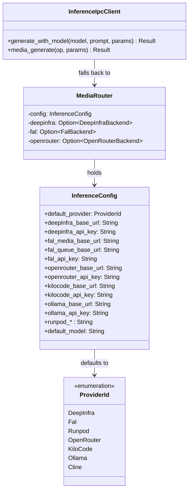

# hkask-inference — Reference

`hkask-inference` provides the MCP-server-local inference routing layer for
hKask. It defines the `ProviderId` enum, the `InferenceConfig` struct, and
two `InferencePort` implementations: `InferenceIpcClient` (chat/vision/embed
via zed's `LanguageModelRegistry` over a Unix socket) and `MediaRouter` (media
generation via a `ProviderRegistry` of `MediaProvider` backends). The crate is
used by MCP-server-internal inference paths; user-facing inference goes
through zed's `LanguageModelRegistry` via `kask_bridge`. Long-term, the
architecture plan replaces this with `InferencePort` over zed's
`LanguageModel`, but keeping it unblocks the MCP servers immediately.

## Source citations

| Symbol | Location |
|--------|----------|
| `ProviderId` enum | `kask/crates/hkask-inference/src/config.rs:38` |
| `InferenceConfig` struct | `kask/crates/hkask-inference/src/config.rs:161` |
| `MediaRouter` struct | `kask/crates/hkask-inference/src/media_router.rs` |
| `InferenceIpcClient` struct | `kask/crates/hkask-inference/src/inference_ipc_client.rs` |
| `DeepInfraBackend` | `kask/crates/hkask-inference/src/deepinfra_backend.rs:25` |
| `FalBackend` | `kask/crates/hkask-inference/src/fal_backend.rs:30` |
| `OpenRouterBackend` | `kask/crates/hkask-inference/src/openrouter_backend.rs:22` |
| `RouterModelEntry` | `kask/crates/hkask-inference/src/hkask_inference.rs:65` |

## Provider model

The `ProviderId` enum (`config.rs:38`) identifies the inference provider. Each
variant carries a serde rename tag (a two-letter serialization code) and a
model-name prefix (registered in the `PREFIXES` const of `parse_from_model`).
The `InferenceConfig` struct (`config.rs:161`) holds the base URLs and API
keys for each provider, plus the `default_provider` field.

Embedding generation is handled by `kask_bridge::LanguageModelEmbeddingPort`
(in `kask/crates/kask_bridge/src/inference.rs`), which resolves credentials
directly from the `INFERENCE_PROVIDERS` table + env var and makes raw
`/embeddings` POSTs. The old `EmbeddingRouter` and `InferenceRouter` structs
have been deleted — they were dead code, never constructed.

<!-- DIAGRAM_ALIGNMENT
id: DIAG-DIA-INF-001
verified_date: 2026-08-03
verified_against: kask/crates/hkask-inference/src/config.rs:38,161; kask/crates/hkask-inference/src/media_router.rs; kask/crates/hkask-inference/src/inference_ipc_client.rs
status: VERIFIED
-->

## InferencePort implementations

This crate provides two `InferencePort` implementations, selected at startup
by `resolve_inference_port()` (`hkask_inference.rs`):

- `InferenceIpcClient` (`inference_ipc_client.rs`) — the primary path in
  zed-kask. Delegates chat, vision, embedding, tool dispatch, and skill
  execution to zed's `LanguageModelRegistry` over a Unix socket
  (`HKASK_INFERENCE_SOCKET`). The zed process holds the API keys and the
  guard; the MCP server child process holds none.
- `MediaRouter` (`media_router.rs`) — the fallback when the IPC socket is
  unavailable. Serves **media generation only** (image/video/speech/
  transcription) via a `ProviderRegistry` of `MediaProvider` backends. Its
  `InferencePort` impl returns a clear `BRIDGE_ERROR` for chat/vision/embed —
  those require the IPC bridge.

## Media provider trait

The `MediaProvider` trait (`provider.rs:87`) defines the media generation
interface: `id()`, `supports(op)`, and `execute(op, params)`. The
`ProviderRegistry` (`provider.rs:114`) holds an ordered list of
`Arc<dyn MediaProvider>` and dispatches each `MediaOp` to the first
supporting provider, falling back to the next on runtime error. The registry
order encodes the preference policy (DeepInfra first for the ops it is
cheapest for, fal.ai fallback).

## Provider backends

Four backend structs are defined, each holding a base URL, API key, and a
shared `reqwest::Client`: `DeepInfraBackend` (`deepinfra_backend.rs:25`),
`FalBackend` (`fal_backend.rs:30`), `OpenRouterBackend`
(`openrouter_backend.rs:22`), and `AtlasCloudBackend`
(`atlascloud_backend.rs:25`). The media backends (`DeepInfraBackend`,
`FalBackend`, `AtlasCloudBackend`) implement `MediaProvider` and are
registered in `MediaRouter::new` — only those whose API key is present are
constructed. Each backend also has inherent `generate` /
`generate_with_messages` / vision methods that call the shared
`openai_compat::openai_compatible_generate[_messages]` helper for direct
OpenAI-compatible chat (the standalone path; zed-kask chat routes through the
IPC bridge instead).

The `ProviderId` enum has seven variants (DeepInfra, fal.ai, RunPod,
OpenRouter, KiloCode, Ollama, Cline), but only four have a backend struct
here. The chat-only providers (KiloCode, Ollama, Cline) and RunPod are routed
by `ProviderId` prefix but their inference is served through the zed IPC
bridge / `LanguageModelRegistry`, not by a backend struct in this crate.
`AtlasCloudBackend` is a media provider that is not a `ProviderId` variant
(media-only, not prefix-routed).

## See also

- [hkask-inference How-to](./how-to.md): configuring a new provider.
- [hkask-types Reference](../hkask-types/reference.md): the `InferencePort`
  trait that wraps this router in the bridge layer.

---

[^hexagonal]: Cockburn, A. (2005). *Hexagonal Architecture.* <https://alistair.cockburn.us/hexagonal-architecture/>. The backend-trait abstraction that allows multiple providers behind a single router.
