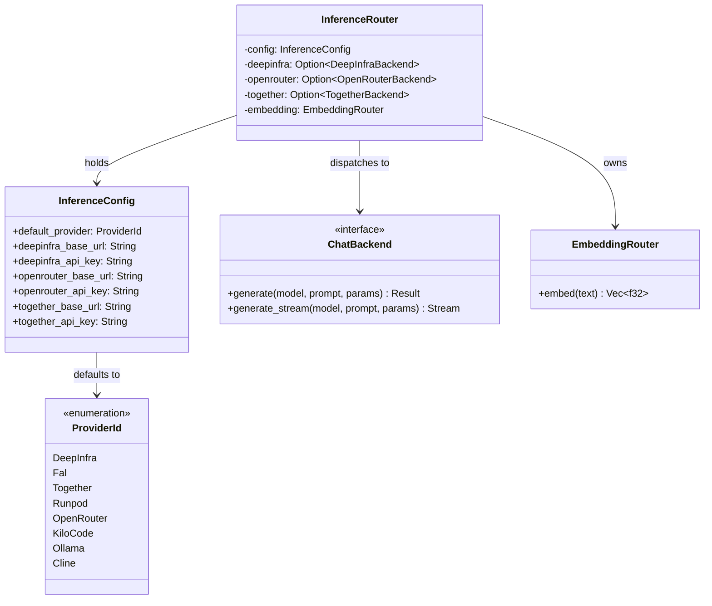

# hkask-inference — Reference

`hkask-inference` provides the inference routing layer for hKask. It defines
the `ProviderId` enum, the `InferenceConfig` struct, and the `InferenceRouter`
that dispatches chat and embedding requests to provider-specific backends. The
crate is used by MCP-server-internal inference paths; user-facing inference
goes through zed's `LanguageModelRegistry` via `kask_bridge`.

## Source citations

| Symbol | Location |
|--------|----------|
| `ProviderId` enum | `kask/crates/hkask-inference/src/config.rs:43` |
| `InferenceConfig` struct | `kask/crates/hkask-inference/src/config.rs:191` |
| `InferenceRouter` struct | `kask/crates/hkask-inference/src/inference_router/mod.rs:52` |
| `ChatBackend` trait | `kask/crates/hkask-inference/src/inference_router/backend.rs:51` |
| `VisionBackend` trait | `kask/crates/hkask-inference/src/inference_router/backend.rs:101` |
| `EmbeddingRouter` | `kask/crates/hkask-inference/src/embedding_router.rs:16` |
| `DeepInfraBackend` | `kask/crates/hkask-inference/src/deepinfra_backend.rs:21` |
| `OpenRouterBackend` | `kask/crates/hkask-inference/src/openrouter_backend.rs:22` |
| `TogetherBackend` | `kask/crates/hkask-inference/src/together_backend.rs:18` |
| `RunpodBackend` | `kask/crates/hkask-inference/src/runpod_backend.rs:16` |
| `KiloCodeBackend` | `kask/crates/hkask-inference/src/kilocode_backend.rs:28` |
| `ClineBackend` | `kask/crates/hkask-inference/src/cline_backend.rs:23` |
| `RouterModelEntry` | `kask/crates/hkask-inference/src/hkask_inference.rs:79` |

## Provider model

The `ProviderId` enum (`config.rs:43`) identifies the inference provider. Each
variant carries a serde rename tag and a model-name prefix. The
`InferenceConfig` struct (`config.rs:191`) holds the base URLs and API keys
for each provider, plus the `default_provider` field.

<!-- DIAGRAM_ALIGNMENT
id: DIAG-DIA-INF-001
verified_date: 2026-07-27
verified_against: kask/crates/hkask-inference/src/config.rs:43,191; kask/crates/hkask-inference/src/inference_router/mod.rs:52; kask/crates/hkask-inference/src/inference_router/backend.rs:51; kask/crates/hkask-inference/src/embedding_router.rs:16
status: VERIFIED
-->

## Backend traits

The `ChatBackend` trait (`backend.rs:51`) defines the chat completion
interface. The `generate` method returns a non-streaming result; the
`generate_stream` method returns an SSE stream. Both return pinned boxed
futures because provider calls are asynchronous.

The `VisionBackend` trait (`backend.rs:101`) extends the interface for
image-input models. Each provider backend implements one or both traits.

## Provider backends

Eight backends are defined: `DeepInfraBackend`
(`deepinfra_backend.rs:21`), `OpenRouterBackend`
(`openrouter_backend.rs:22`), `TogetherBackend` (`together_backend.rs:18`),
`RunpodBackend` (`runpod_backend.rs:16`), `KiloCodeBackend`
(`kilocode_backend.rs:28`), `ClineBackend` (`cline_backend.rs:23`), plus
`FalBackend` and `OllamaBackend` referenced in the router. The
`InferenceRouter` holds an `Option` for each backend, constructing only those
for which API keys are configured.

## See also

- [hkask-inference How-to](./how-to.md): configuring a new provider.
- [hkask-types Reference](../hkask-types/reference.md): the `InferencePort`
  trait that wraps this router in the bridge layer.
- [`kask/docs/explanation/fusion-mode.md`](../../explanation/fusion-mode.md):
  multi-model deliberation that uses this router.

---

[^hexagonal]: Cockburn, A. (2005). *Hexagonal Architecture.* <https://alistair.cockburn.us/hexagonal-architecture/>. The backend-trait abstraction that allows multiple providers behind a single router.
