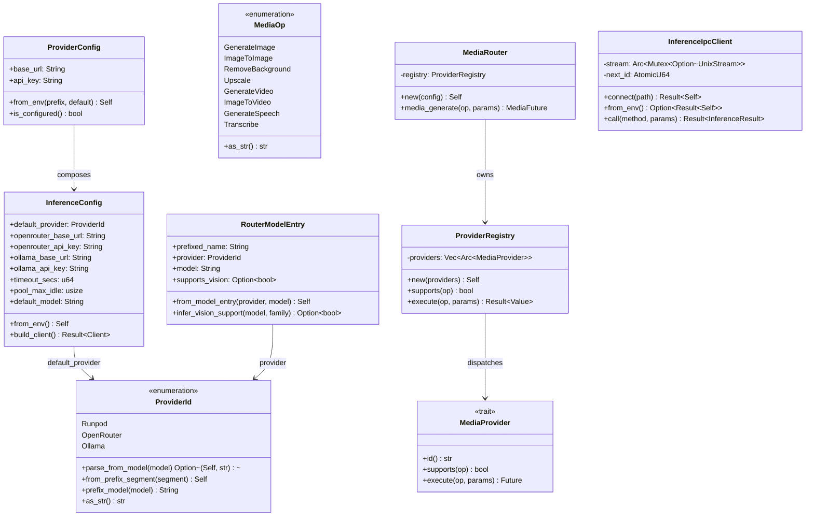

<!-- STALE — predates the hkask-inference refactor (Candidates A/B/C + follow-ups). Symbols cited
below that were REMOVED: `chat_protocol` (module + file), `openai_compatible_generate`,
`openai_compatible_generate_messages`, `openai_chat_roundtrip`, `RouterModelEntry`, `from_model_entry`,
`infer_vision_support`, `DEFAULT_VISION_MODEL`, `InferenceConfig::build_client`, and
`InferenceConfig::timeout_secs`/`pool_max_idle`. `openai_compat` now holds only `sanitize_error_body`/
`redact_secret_tokens`; chat/vision/embed route through the IPC bridge (`InferenceIpcClient`), not direct
HTTP. Line numbers have shifted — consult the source until this doc is regenerated. -->

# hkask-inference — Reference

`hkask-inference` is the MCP-server-local inference abstraction layer for
hKask. It defines the `ProviderId` enum, the `InferenceConfig` struct, the
`MediaOp` / `MediaProvider` / `ProviderRegistry` media-provider abstraction,
and two `InferencePort` implementations: `InferenceIpcClient` (chat/vision/
embed/tools/skills/worktree via zed's `LanguageModelRegistry` over a Unix
socket) and `MediaRouter` (media generation via a `ProviderRegistry` of
`MediaProvider` backends). The crate is used by MCP-server-internal inference
paths; user-facing inference goes through zed's `LanguageModelRegistry` via
`kask_bridge`.

## Source citations

| Symbol | Location |
|--------|----------|
| `ProviderId` enum | `kask/crates/hkask-inference/src/config.rs:33` |
| `ProviderId::parse_from_model` | `kask/crates/hkask-inference/src/config.rs:61` |
| `ProviderId::from_prefix_segment` | `kask/crates/hkask-inference/src/config.rs:97` |
| `ProviderId::prefix_model` | `kask/crates/hkask-inference/src/config.rs:114` |
| `ProviderId::as_str` | `kask/crates/hkask-inference/src/config.rs:124` |
| `InferenceConfig` struct | `kask/crates/hkask-inference/src/config.rs:140` |
| `InferenceConfig::default` | `kask/crates/hkask-inference/src/config.rs:164` |
| `InferenceConfig::from_env` | `kask/crates/hkask-inference/src/config.rs:191` |
| `InferenceConfig::build_client` | `kask/crates/hkask-inference/src/config.rs:231` |
| `resolve_api_key` | `kask/crates/hkask-inference/src/config.rs:263` |
| `resolve_default_provider` | `kask/crates/hkask-inference/src/config.rs:279` |
| `parse_provider_code` | `kask/crates/hkask-inference/src/config.rs:289` |
| `resolve_config_str` | `kask/crates/hkask-inference/src/config.rs:305` |
| `parse_env_numeric` | `kask/crates/hkask-inference/src/config.rs:319` |
| `ProviderConfig` struct | `kask/crates/hkask-inference/src/config.rs:344` |
| `ProviderConfig::from_env` | `kask/crates/hkask-inference/src/config.rs:354` |
| `ProviderConfig::is_configured` | `kask/crates/hkask-inference/src/config.rs:368` |
| `MediaOp` enum | `kask/crates/hkask-inference/src/provider.rs:25` |
| `MediaOp::from_str` | `kask/crates/hkask-inference/src/provider.rs:41` |
| `MediaOp::as_str` | `kask/crates/hkask-inference/src/provider.rs:63` |
| `MediaProvider` trait | `kask/crates/hkask-inference/src/provider.rs:82` |
| `ProviderRegistry` struct | `kask/crates/hkask-inference/src/provider.rs:109` |
| `ProviderRegistry::execute` | `kask/crates/hkask-inference/src/provider.rs:162` |
| `MediaRouter` struct | `kask/crates/hkask-inference/src/media_router.rs:45` |
| `MediaRouter::new` | `kask/crates/hkask-inference/src/media_router.rs:64` |
| `MediaRouter::media_generate` | `kask/crates/hkask-inference/src/media_router.rs:316` |
| `BRIDGE_ERROR` | `kask/crates/hkask-inference/src/media_router.rs:242` |
| `InferenceIpcClient` struct | `kask/crates/hkask-inference/src/inference_ipc_client.rs:99` |
| `InferenceIpcClient::connect` | `kask/crates/hkask-inference/src/inference_ipc_client.rs:109` |
| `InferenceIpcClient::from_env` | `kask/crates/hkask-inference/src/inference_ipc_client.rs:123` |
| `InferenceIpcClient::call` | `kask/crates/hkask-inference/src/inference_ipc_client.rs:132` |
| `MAX_IPC_LINE_BYTES` | `kask/crates/hkask-inference/src/inference_ipc_client.rs:54` |
| `IPC_READ_TIMEOUT` | `kask/crates/hkask-inference/src/inference_ipc_client.rs:63` |
| `RouterModelEntry` struct | `kask/crates/hkask-inference/src/hkask_inference.rs:52` |
| `RouterModelEntry::from_model_entry` | `kask/crates/hkask-inference/src/hkask_inference.rs:79` |
| `RouterModelEntry::infer_vision_support` | `kask/crates/hkask-inference/src/hkask_inference.rs:98` |
| `resolve_inference_port` | `kask/crates/hkask-inference/src/hkask_inference.rs:184` |
| `resolve_tool_dispatch_port` | `kask/crates/hkask-inference/src/hkask_inference.rs:222` |
| `resolve_skill_exec_port` | `kask/crates/hkask-inference/src/hkask_inference.rs:283` |
| `resolve_worktree_spawn_port` | `kask/crates/hkask-inference/src/hkask_inference.rs:337` |
| `UnavailableToolDispatch` | `kask/crates/hkask-inference/src/hkask_inference.rs:252` |
| `UnavailableSkillExec` | `kask/crates/hkask-inference/src/hkask_inference.rs:311` |
| `UnavailableWorktreeSpawn` | `kask/crates/hkask-inference/src/hkask_inference.rs:366` |
| `DEFAULT_CLASSIFIER_MODEL` | `kask/crates/hkask-inference/src/model_constants.rs:23` |
| `DEFAULT_EMBEDDING_MODEL` | `kask/crates/hkask-inference/src/model_constants.rs:26` |
| `DEFAULT_OCR_MODEL` | `kask/crates/hkask-inference/src/model_constants.rs:30` |
| `DEFAULT_FALLBACK_MODEL` | `kask/crates/hkask-inference/src/model_constants.rs:35` |
| `DEFAULT_TTS_MODEL` | `kask/crates/hkask-inference/src/model_constants.rs:38` |
| `DEFAULT_STT_MODEL` | `kask/crates/hkask-inference/src/model_constants.rs:41` |
| `DEFAULT_VISION_MODEL` | `kask/crates/hkask-inference/src/model_constants.rs:44` |
| `DEFAULT_IMAGE_GEN_MODEL` | `kask/crates/hkask-inference/src/model_constants.rs:47` |
| `classifier_model()` | `kask/crates/hkask-inference/src/model_constants.rs:57` |
| `embedding_model()` | `kask/crates/hkask-inference/src/model_constants.rs:62` |
| `ocr_model()` | `kask/crates/hkask-inference/src/model_constants.rs:67` |

## Class diagram

<!-- DIAGRAM_ALIGNMENT
id: DIAG-INF-003
verified_date: 2026-08-13
verified_against: kask/crates/hkask-inference/src/config.rs:33,140,344; kask/crates/hkask-inference/src/provider.rs:25,82,109; kask/crates/hkask-inference/src/media_router.rs:45; kask/crates/hkask-inference/src/inference_ipc_client.rs:99; kask/crates/hkask-inference/src/hkask_inference.rs:52
status: VERIFIED
-->

## `ProviderId`

The `ProviderId` enum (`config.rs:33`) identifies the inference provider. The
three variants are `Runpod`, `OpenRouter`, and `Ollama`. Each
variant carries a `#[serde(rename = "XX")]` two-letter serialization tag
(`"RP"`, `"OR"`, `"OM"`). The model-name prefix is registered
separately in the `PREFIXES` const of `parse_from_model` (`config.rs:64`):
`"RunPod/"`, `"OpenRouter/"`, `"ollama/"`.

`parse_from_model` (`config.rs:61`) does strict case-sensitive full-prefix
stripping and returns `Some((provider, stripped_model))` on a match, or `None`
for unrecognized or missing prefix (empty remainder after stripping also
returns `None`, `config.rs:72`). `from_prefix_segment` (`config.rs:97`) is the
lenient counterpart: it classifies an already-split segment case-insensitively
and accepts short aliases (`"or"`, `"rp"`, `"om"`); unrecognized
segments fall back to `OpenRouter` (`config.rs:103`). `prefix_model`
(`config.rs:114`) constructs `"{as_str}/{model}"`. `as_str` (`config.rs:124`)
returns the full provider name used as the model-string prefix.

## `InferenceConfig`

The `InferenceConfig` struct (`config.rs:140`) holds the base URLs and API
keys for OpenRouter and Ollama, plus the
`default_provider` field, `timeout_secs`, `pool_max_idle`, and
`default_model`. The `Default` impl (`config.rs:164`) sets
`default_provider` to `OpenRouter`, the cloud base URLs to their public
endpoints, `ollama_base_url` to `http://localhost:11434`, `timeout_secs` to
120, `pool_max_idle` to 5, and `default_model` to
`DEFAULT_FALLBACK_MODEL` (`"OpenRouter/z-ai/glm-5.2"`).

`from_env` (`config.rs:191`) resolves each provider via
`ProviderConfig::from_env` (`config.rs:354`), which sanitizes the prefix to
uppercase (removing spaces and dots) and reads `{PREFIX}_BASE_URL` and
`{PREFIX}_API_KEY`.
`default_provider` comes from `resolve_default_provider` (`config.rs:279`),
which reads `HKASK_DEFAULT_PROVIDER` and parses it via `parse_provider_code`
(`config.rs:289`). `timeout_secs` and `pool_max_idle` are parsed via
`parse_env_numeric` (`config.rs:319`), which logs a `hkask.inference` warn
naming the malformed value before falling back to the default.
`default_model` falls back to `DEFAULT_FALLBACK_MODEL` when
`HKASK_DEFAULT_MODEL` is unset (`config.rs:220-221`).

`build_client` (`config.rs:231`) constructs a `reqwest::Client` with the
configured timeout and `pool_max_idle_per_host`. `ProviderConfig::is_configured`
(`config.rs:368`) returns `true` when the API key is non-empty — used by
backends to decide whether to construct.

## `MediaOp` and `MediaProvider`

The `MediaOp` enum (`provider.rs:25`) has eight variants: `GenerateImage`,
`ImageToImage`, `RemoveBackground`, `Upscale`, `GenerateVideo`,
`ImageToVideo`, `GenerateSpeech`, `Transcribe`. `MediaOp::from_str`
(`provider.rs:41`) parses the canonical string names used by
`InferencePort::media_generate` (e.g. `"generate_image"`,
`"remove_background"`); unknown ops return `InferenceError::Connection`.
`MediaOp::as_str` (`provider.rs:63`) is the inverse.

The `MediaProvider` trait (`provider.rs:82`) is `Send + Sync` so providers can
live in an `Arc<dyn MediaProvider>` behind the registry. It has three methods:
`id()` (stable provider id for logging/audit), `supports(op)` (whether this
provider can serve `op`), and `execute(op, params)` (run the op with the
unified `MediaGenerateParams`). No implementations are currently registered
(the former media backends were removed); the trait + registry remain the
generic dispatch infrastructure for providers added in the future.

## `ProviderRegistry`

The `ProviderRegistry` (`provider.rs:109`) holds an ordered
`Vec<Arc<dyn MediaProvider>>`. `supports(op)` (`provider.rs:122`) returns
`true` if any registered provider supports `op`. `execute(op, params)`
(`provider.rs:162`) filters providers by `supports(op)`; if no candidate
supports the op it returns `InferenceError::Connection("no provider
configured for media op: ...")`. When more than one candidate supports the op,
the primary is chosen via the 7-dimension scored engine
(`crate::scoring::select_scored`), which emits a `reg.media.select` span, and
the fallback chain is ordered by descending weighted score. With a single
candidate there is no selection to make — the lone provider is used directly
so single-provider ops don't emit a spurious selection span. On runtime error
the registry falls back to the next provider with a `reg.inference` warn
naming the failed provider; if all fail it returns the last error.

## `MediaRouter`

The `MediaRouter` struct (`media_router.rs:45`) wraps a `ProviderRegistry`.
`MediaRouter::new` (`media_router.rs:64`) builds the registry from the
providers registered in its body — currently none, so the registry is empty
and every media op returns the clear "no provider configured for media op"
error until a backend is registered again. If no providers are
configured, a single warn names the cause
(`media_router.rs:94-100`).

The `InferencePort` impl for `MediaRouter` (`media_router.rs:245`) returns the
`BRIDGE_ERROR` constant (`media_router.rs:242`) for `generate`,
`generate_with_model`, `generate_with_messages`, `generate_stream`,
`generate_vision`, and `embed`; `list_models` returns an empty `Vec`; only
`media_generate` (`media_router.rs:316`) dispatches to the registry. The
convenience methods `generate_image`, `image_to_image`, `remove_background`,
`upscale`, `generate_video`, `image_to_video`, `generate_speech`, and
`transcribe` (`media_router.rs:109-233`) wrap `media_generate` with typed
params.

## `InferenceIpcClient`

The `InferenceIpcClient` struct (`inference_ipc_client.rs:99`) holds an
`Arc<Mutex<Option<UnixStream>>>` (one request in flight at a time — the
protocol is request-response, not multiplexed) and an `AtomicU64` next-request
id. `connect` (`inference_ipc_client.rs:109`) opens a `UnixStream`;
`from_env` (`inference_ipc_client.rs:123`) reads `HKASK_INFERENCE_SOCKET`
(`INFERENCE_SOCKET_ENV`) and returns `None` if unset or empty, otherwise
`Some(Result<Self>)`.

`call` (`inference_ipc_client.rs:132`) serializes an `InferenceRequest`,
writes it as a single line, reads one capped response line via
`read_response_line` (`inference_ipc_client.rs:69`, capped at
`MAX_IPC_LINE_BYTES` = 16 MiB, `IPC_READ_TIMEOUT` = 120 s), and matches the
response `id` to the request `id`. Any read failure, clean EOF, parse failure,
or id mismatch nulls the cached stream (`*guard = None`) so the next call
reconnects instead of retrying on a dead/half-consumed stream. The
`InferenceOutcome` is matched to the request method — a mismatched outcome
(e.g. `Embeddings` for a non-embed request) returns a `Connection` error.

Streaming is not supported over IPC — the server side collects the stream and
returns a single `InferenceResult`. This matches the existing
`LanguageModelInferencePort` pattern and is sufficient for MCP server use
cases (OCR, classification, summarization, etc.).

## `RouterModelEntry`

The `RouterModelEntry` struct (`hkask_inference.rs:52`) is a unified model
entry from any provider, with the provider prefix applied. Fields:
`prefixed_name`, `provider`, `model`, `family`, `parameter_size`,
`quantization_level`, `size_bytes`, and `supports_vision`.
`from_model_entry` (`hkask_inference.rs:79`) constructs an entry from a
provider and model id, inferring vision support via `infer_vision_support`.
`infer_vision_support` (`hkask_inference.rs:98`) checks the model name and
family against a compiled-in allowlist of 21 vision-capable families
(`llava`, `bakllava`, `minicpm-v`, `gemma3`, `llama3.2-vision`, `cogvlm`,
`moondream`, `pixtral`, `florence`, `paligemma`, `qwen2-vl`, `qwen2.5-vl`,
`qwen3-vl`, `qwen-vl`, `internvl`, `phi-3-vision`, `lighton`, `paddleocr`,
`nemotron-parse`, `olmocr`, `deepsec-ocr`) plus any families listed in the
`HKASK_VISION_FAMILIES` env var (comma-separated). Returns `Some(true)` on a
match, `None` otherwise. Runtime-addition via env var avoids recompiles.

## Port resolvers

Four resolver functions in `hkask_inference.rs` select the right port at MCP
server startup. Each tries `InferenceIpcClient::from_env()` first and falls
back to a stub when the socket is unavailable:

| Resolver | Location | Fallback |
|----------|----------|----------|
| `resolve_inference_port` | `hkask_inference.rs:184` | `MediaRouter` (media-only) |
| `resolve_tool_dispatch_port` | `hkask_inference.rs:222` | `UnavailableToolDispatch` |
| `resolve_skill_exec_port` | `hkask_inference.rs:283` | `UnavailableSkillExec` |
| `resolve_worktree_spawn_port` | `hkask_inference.rs:337` | `UnavailableWorktreeSpawn` |

The three `Unavailable*` stubs (`hkask_inference.rs:252`, `:311`, `:366`)
return a clear `Connection` / `Unavailable` error naming the missing socket so
the caller can distinguish "dispatch unavailable" from "tool not found" /
"skill not found" / "worktree spawn not supported." Only
`resolve_inference_port` has a media fallback; the other three have no
standalone equivalent.

## Model constants

The `model_constants` module (`model_constants.rs`) is the single source of
truth for default model ids. Every model has a corresponding env var for
override; the constants are compile-time defaults, env vars take precedence.

| Constant | Value | Env override |
|----------|-------|--------------|
| `DEFAULT_CLASSIFIER_MODEL` | `OpenRouter/z-ai/glm-5.2` | `HKASK_CLASSIFIER_MODEL` |
| `DEFAULT_EMBEDDING_MODEL` | `ollama/nomic-embed-text` | `HKASK_EMBEDDING_MODEL` |
| `DEFAULT_OCR_MODEL` | `RunPod/kask-ocr` | `HKASK_OCR_MODEL` |
| `DEFAULT_FALLBACK_MODEL` | `OpenRouter/z-ai/glm-5.2` | `HKASK_DEFAULT_MODEL` |
| `DEFAULT_VISION_MODEL` | `OpenRouter/Qwen/Qwen3-VL-235B-A22B-Instruct` | — |

The accessor functions `classifier_model()` (`model_constants.rs:57`),
`embedding_model()` (`model_constants.rs:62`), and `ocr_model()`
(`model_constants.rs:67`) resolve env var → default. Per the project rules,
model-name constants must reference these constants, not re-declare literals
across crates.

## See also

- [hkask-inference How-to](./how-to.md): configuring a new provider.
- [hkask-inference Tutorial](./tutorial.md): routing your first request.
- [hkask-inference Explanation](./explanation.md): why the IPC bridge is
  preferred.
- [hkask-types Reference](../hkask-types/reference.md): the `InferencePort`
  trait that both implementations satisfy.

---

[^hexagonal]: Cockburn, A. (2005). *Hexagonal Architecture.* <https://alistair.cockburn.us/hexagonal-architecture/>. The backend-trait abstraction that allows multiple providers behind a single router.
