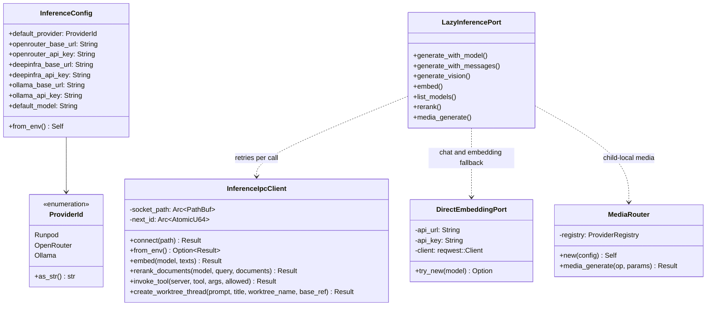

# hkask-inference — Reference

Lookup reference for the current `hkask-inference` surface. Citations use full repository-relative paths and were re-derived from the implementation on 2026-09-15.

## Crate root and modules

The crate root declares eight public modules and re-exports three public types (`kask/crates/hkask-inference/src/hkask_inference.rs:29-43`).

| Module | Purpose | Evidence |
|---|---|---|
| `config` | `InferenceConfig`, `ProviderId`, environment resolution | `kask/crates/hkask-inference/src/config.rs:1-30` |
| `inference_ipc_client` | Unix-socket adapter for inference, tools, and worktrees | `kask/crates/hkask-inference/src/inference_ipc_client.rs:1-48` |
| `media_providers` | DeepInfra and OpenRouter media adapters | `kask/crates/hkask-inference/src/media_providers.rs:60-76`, `kask/crates/hkask-inference/src/media_providers.rs:472-488` |
| `media_router` | Child-local media dispatcher | `kask/crates/hkask-inference/src/media_router.rs:1-12` |
| `model_constants` | Environment bindings and QA model validation | `kask/crates/hkask-inference/src/model_constants.rs:1-24` |
| `openai_compat` | Provider-error body redaction helpers | `kask/crates/hkask-inference/src/openai_compat.rs:1-24` |
| `provider` | Typed media operations and strict provider registry | `kask/crates/hkask-inference/src/provider.rs:1-30` |
| `rerank` | Rerank HTTP support | `kask/crates/hkask-inference/src/rerank.rs:1-20` |

| Root export | Definition |
|---|---|
| `InferenceConfig`, `ProviderId` | `kask/crates/hkask-inference/src/config.rs:34-89` |
| `InferenceIpcClient` | `kask/crates/hkask-inference/src/inference_ipc_client.rs:299-313` |
| `resolve_inference_port()` | `kask/crates/hkask-inference/src/hkask_inference.rs:88-98` |
| `resolve_tool_dispatch_port()` | `kask/crates/hkask-inference/src/hkask_inference.rs:816-830` |
| `resolve_worktree_spawn_port()` | `kask/crates/hkask-inference/src/hkask_inference.rs:860-870` |

## Type relationships

<!-- DIAGRAM_ALIGNMENT
id: DIAG-INF-REF
verified_date: 2026-09-15
verified_against: kask/crates/hkask-inference/src/config.rs:34-135; kask/crates/hkask-inference/src/inference_ipc_client.rs:299-349,425-677; kask/crates/hkask-inference/src/hkask_inference.rs:88-105,155-375,389-490; kask/crates/hkask-inference/src/media_router.rs:9-72
status: VERIFIED
-->

## `ProviderId`

Defined at `kask/crates/hkask-inference/src/config.rs:34-48`.

| Variant | Serde value | `as_str()` |
|---|---|---|
| `Runpod` | `RP` | `RunPod` |
| `OpenRouter` | `OR` | `OpenRouter` |
| `Ollama` | `OM` | `ollama` |

`as_str(&self) -> &'static str` is the enum's only inherent public method (`kask/crates/hkask-inference/src/config.rs:50-64`). Direct chat/embedding provider selection is performed by `DIRECT_EMBEDDING_PROVIDERS`, not by `ProviderId` (`kask/crates/hkask-inference/src/hkask_inference.rs:409-455`).

## `InferenceConfig`

Defined at `kask/crates/hkask-inference/src/config.rs:66-89`.

| Field group | Default/effective source | Evidence |
|---|---|---|
| `default_provider` | `OpenRouter`; `HKASK_DEFAULT_PROVIDER` accepts `RunPod`, `OpenRouter`, `ollama` | `kask/crates/hkask-inference/src/config.rs:91-105`, `kask/crates/hkask-inference/src/config.rs:170-192` |
| OpenRouter URL/key | `https://openrouter.ai/api`; `OPENROUTER_BASE_URL`, `OPENROUTER_API_KEY` | `kask/crates/hkask-inference/src/config.rs:91-100`, `kask/crates/hkask-inference/src/config.rs:119-133`, `kask/crates/hkask-inference/src/config.rs:218-233` |
| DeepInfra URL/key | `https://api.deepinfra.com`; `DEEPINFRA_BASE_URL`, `DEEPINFRA_API_KEY` | `kask/crates/hkask-inference/src/config.rs:79-82`, `kask/crates/hkask-inference/src/config.rs:91-100`, `kask/crates/hkask-inference/src/config.rs:119-133` |
| Ollama URL/key | `http://localhost:11434`; `OLLAMA_BASE_URL`, `OLLAMA_API_KEY` | `kask/crates/hkask-inference/src/config.rs:83-87`, `kask/crates/hkask-inference/src/config.rs:91-100`, `kask/crates/hkask-inference/src/config.rs:119-133` |
| `default_model` | Empty in `Default`; `HKASK_DEFAULT_MODEL` in `from_env` | `kask/crates/hkask-inference/src/config.rs:101-105`, `kask/crates/hkask-inference/src/config.rs:124-133` |

Provider keys are read from the process environment only (`kask/crates/hkask-inference/src/config.rs:139-168`).

## Inference port resolution

`resolve_inference_port()` returns a private `LazyInferencePort` as `Arc<dyn InferencePort>` (`kask/crates/hkask-inference/src/hkask_inference.rs:88-105`).

| Method | IPC available | IPC unavailable | Evidence |
|---|---|---|---|
| `generate`, `generate_with_model`, `generate_with_messages` | IPC generation | Direct OpenAI-compatible chat | `kask/crates/hkask-inference/src/hkask_inference.rs:155-169`, `kask/crates/hkask-inference/src/hkask_inference.rs:210-285` |
| `generate_vision` | IPC vision | `InferenceError::Connection` naming socket | `kask/crates/hkask-inference/src/hkask_inference.rs:172-207` |
| `embed` | IPC embedding | Direct OpenAI-compatible embedding | `kask/crates/hkask-inference/src/hkask_inference.rs:288-309` |
| `list_models` | IPC model list | `InferenceError::Connection` naming socket | `kask/crates/hkask-inference/src/hkask_inference.rs:312-330` |
| `rerank` | IPC rerank | `InferenceError::Connection` naming socket | `kask/crates/hkask-inference/src/hkask_inference.rs:333-355` |
| `media_generate` | Child-local `MediaRouter` | Same child-local path | `kask/crates/hkask-inference/src/hkask_inference.rs:358-375` |

The direct provider descriptors are DeepInfra, OpenRouter, and Ollama (`kask/crates/hkask-inference/src/hkask_inference.rs:409-437`). `DirectEmbeddingPort::try_new` requires a recognized prefix and any required provider key (`kask/crates/hkask-inference/src/hkask_inference.rs:439-490`).

## Typed model failures

| Condition | Error | Evidence |
|---|---|---|
| No explicit chat model and empty `HKASK_DEFAULT_MODEL` | `InferenceError::NotConfigured` | `kask/crates/hkask-inference/src/hkask_inference.rs:123-143`, `kask/crates/hkask-inference/src/hkask_inference.rs:581-597` |
| Explicit zed model override cannot be resolved | `InferenceError::Model`; no default substitution | `kask/crates/kask_bridge/src/inference_chat.rs:579-621`, `kask/crates/kask_bridge/src/inference_chat.rs:674-690` |
| QA model absent from explicit input and `HKASK_QA_GENERATION_MODEL` | `InferenceError::NotConfigured` | `kask/crates/hkask-inference/src/model_constants.rs:50-59` |
| QA model malformed or not provider-qualified | `InferenceError::Model` | `kask/crates/hkask-inference/src/model_constants.rs:60-74` |
| Direct embedding model has no usable provider/credential | `EmbeddingGenerationError::Connection` | `kask/crates/hkask-inference/src/hkask_inference.rs:296-307` |
| Selectable media operation has no configured model | `InferenceError::NotConfigured` | `kask/crates/hkask-inference/src/provider.rs:231-239` |
| Media model/provider identifier is invalid | `InferenceError::Model` | `kask/crates/hkask-inference/src/provider.rs:241-255` |

## `InferenceIpcClient`

The client is cloneable and stores an `Arc<PathBuf>` socket path plus an `Arc<AtomicU64>` request counter (`kask/crates/hkask-inference/src/inference_ipc_client.rs:299-313`).

| API | Behavior | Evidence |
|---|---|---|
| `connect(path)` | Tests reachability, then stores the path | `kask/crates/hkask-inference/src/inference_ipc_client.rs:315-330` |
| `from_env()` | Uses `HKASK_INFERENCE_SOCKET`, then runtime-file fallback | `kask/crates/hkask-inference/src/inference_ipc_client.rs:332-349` |
| `embed(model, texts)` | Rejects empty input, performs `Embed` roundtrip | `kask/crates/hkask-inference/src/inference_ipc_client.rs:453-506` |
| `rerank_documents(model, query, documents)` | Rejects empty documents, performs `Rerank` roundtrip | `kask/crates/hkask-inference/src/inference_ipc_client.rs:537-589` |
| `invoke_tool(server, tool, args, allowed)` | Sends governed tool request and allowlist | `kask/crates/hkask-inference/src/inference_ipc_client.rs:591-634` |
| `create_worktree_thread(...)` | Requests a zed-side worktree thread | `kask/crates/hkask-inference/src/inference_ipc_client.rs:636-676` |

`ipc_roundtrip` serializes one request line, opens a fresh connection, writes and flushes it, reads one capped response line, deserializes it, and verifies the correlation ID (`kask/crates/hkask-inference/src/inference_ipc_client.rs:351-422`). The line cap is 16 MiB (`kask/crates/hkask-inference/src/inference_ipc_client.rs:68-74`); the read deadline is the configured inference timeout plus 30 seconds or a 600-second fallback (`kask/crates/hkask-inference/src/inference_ipc_client.rs:128-199`).[^cwe400]

## Media API

`MediaOp` contains ten operations: image generation/editing, background removal, upscale, video generation, image-to-video, speech generation, transcription, audio chat, and schema-constrained chat (`kask/crates/hkask-inference/src/provider.rs:10-30`). String parsing and canonical names are defined at `kask/crates/hkask-inference/src/provider.rs:32-87`.

`ProviderRegistry::execute` resolves the model from parameters or the operation environment variable, accepts only OpenRouter or DeepInfra provider prefixes for selectable operations, validates provider-local model safety, selects exactly one registered provider, checks support, and executes it (`kask/crates/hkask-inference/src/provider.rs:218-288`). `MediaRouter` builds the available providers from `InferenceConfig` and delegates to that registry (`kask/crates/hkask-inference/src/media_router.rs:14-72`).

## Model environment accessors

| API | Environment variable | Evidence |
|---|---|---|
| `resolve_qa_generation_model` | explicit input, then `HKASK_QA_GENERATION_MODEL` | `kask/crates/hkask-inference/src/model_constants.rs:25-75` |
| `classifier_model` | `HKASK_CLASSIFIER_MODEL` | `kask/crates/hkask-inference/src/model_constants.rs:77-84` |
| `embedding_model` | `HKASK_EMBEDDING_MODEL` | `kask/crates/hkask-inference/src/model_constants.rs:86-93` |
| `ocr_model` | `HKASK_OCR_MODEL` | `kask/crates/hkask-inference/src/model_constants.rs:95-102` |
| `rerank_model` | `HKASK_RERANK_MODEL` | `kask/crates/hkask-inference/src/model_constants.rs:104-113` |

## See also

- [How-to: route and configure inference](./how-to.md)
- [Explanation: bridge-first inference and visible failure](./explanation.md)
- [hkask-types reference](../hkask-types/reference.md)

---

[^hexagonal]: Cockburn, A. (2005). *Hexagonal Architecture.* <https://alistair.cockburn.us/hexagonal-architecture/>.
[^cwe400]: MITRE. (n.d.). *CWE-400: Uncontrolled Resource Consumption.* <https://cwe.mitre.org/data/definitions/400.html>.
