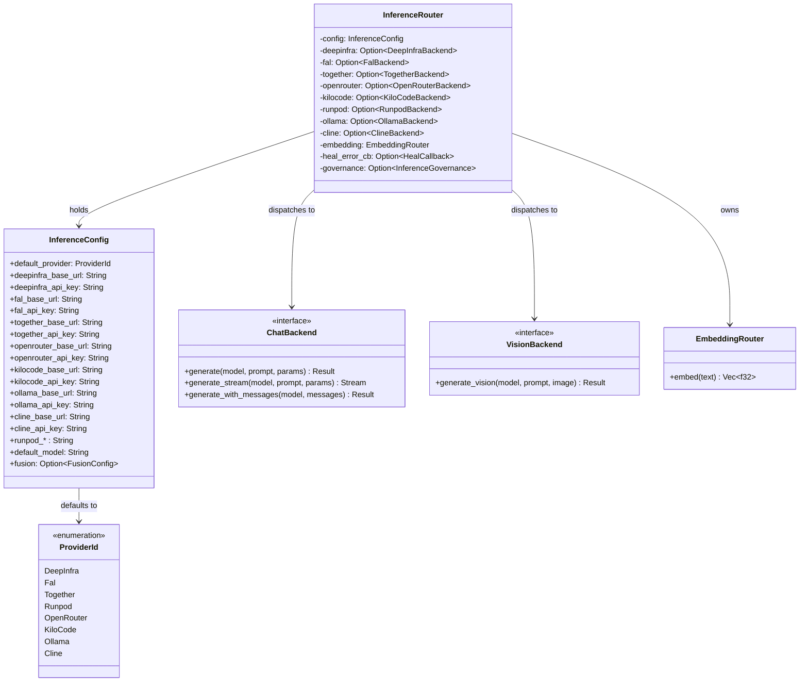

# hkask-inference — Reference

`hkask-inference` provides the MCP-server-local inference routing layer for
hKask. It defines the `ProviderId` enum, the `InferenceConfig` struct, and the
`InferenceRouter` that dispatches chat, vision, and embedding requests to
provider-specific backends. The crate is used by MCP-server-internal inference
paths; user-facing inference goes through zed's `LanguageModelRegistry` via
`kask_bridge`. Long-term, the architecture plan replaces this with
`InferencePort` over zed's `LanguageModel`, but keeping it unblocks the MCP
servers immediately.

## Source citations

| Symbol | Location |
|--------|----------|
| `ProviderId` enum | `kask/crates/hkask-inference/src/config.rs:44` |
| `InferenceConfig` struct | `kask/crates/hkask-inference/src/config.rs:192` |
| `InferenceRouter` struct | `kask/crates/hkask-inference/src/inference_router/mod.rs:52` |
| `ChatBackend` trait | `kask/crates/hkask-inference/src/inference_router/backend.rs:51` |
| `VisionBackend` trait | `kask/crates/hkask-inference/src/inference_router/backend.rs:101` |
| `EmbeddingRouter` | `kask/crates/hkask-inference/src/embedding_router.rs:16` |
| `DeepInfraBackend` | `kask/crates/hkask-inference/src/deepinfra_backend.rs:21` |
| `FalBackend` | `kask/crates/hkask-inference/src/fal_backend.rs:26` |
| `OpenRouterBackend` | `kask/crates/hkask-inference/src/openrouter_backend.rs:22` |
| `TogetherBackend` | `kask/crates/hkask-inference/src/together_backend.rs:18` |
| `RunpodBackend` | `kask/crates/hkask-inference/src/runpod_backend.rs:16` |
| `KiloCodeBackend` | `kask/crates/hkask-inference/src/kilocode_backend.rs:28` |
| `OllamaBackend` | `kask/crates/hkask-inference/src/ollama_backend.rs:51` |
| `ClineBackend` | `kask/crates/hkask-inference/src/cline_backend.rs:23` |
| `RouterModelEntry` | `kask/crates/hkask-inference/src/hkask_inference.rs:79` |

## Provider model

The `ProviderId` enum (`config.rs:44`) identifies the inference provider. Each
variant carries a serde rename tag (a two-letter serialization code) and a
model-name prefix (registered in the `PREFIXES` const of `parse_from_model`).
The `InferenceConfig` struct (`config.rs:192`) holds the base URLs and API
keys for each provider, plus the `default_provider` field.

<!-- DIAGRAM_ALIGNMENT
id: DIAG-DIA-INF-001
verified_date: 2026-07-29
verified_against: kask/crates/hkask-inference/src/config.rs:44,192; kask/crates/hkask-inference/src/inference_router/mod.rs:52-65; kask/crates/hkask-inference/src/inference_router/backend.rs:51,101; kask/crates/hkask-inference/src/embedding_router.rs:16
status: VERIFIED
-->

## Backend traits

The `ChatBackend` trait (`backend.rs:51`) defines the chat completion
interface. The `generate` method returns a non-streaming result; the
`generate_stream` method returns an SSE stream; the
`generate_with_messages` method accepts pre-formed message histories. All
three return pinned boxed futures because provider calls are asynchronous.

The `VisionBackend` trait (`backend.rs:101`) extends the interface for
image-input models with a single `generate_vision` method. Each provider
backend implements one or both traits — see the impl block at
`backend.rs:119` through `backend.rs:425`.

## Provider backends

Eight backends are defined, one per `ProviderId` variant:
`DeepInfraBackend` (`deepinfra_backend.rs:21`), `FalBackend`
(`fal_backend.rs:26`), `OpenRouterBackend` (`openrouter_backend.rs:22`),
`TogetherBackend` (`together_backend.rs:18`), `RunpodBackend`
(`runpod_backend.rs:16`), `KiloCodeBackend` (`kilocode_backend.rs:28`),
`OllamaBackend` (`ollama_backend.rs:51`), and `ClineBackend`
(`cline_backend.rs:23`). The `InferenceRouter` holds an `Option` for each
backend, constructing only those for which `Backend::new` succeeds (i.e.
API keys or base URLs are configured).

## See also

- [hkask-inference How-to](./how-to.md): configuring a new provider.
- [hkask-types Reference](../hkask-types/reference.md): the `InferencePort`
  trait that wraps this router in the bridge layer.
- [`kask/docs/explanation/fusion-mode.md`](../../explanation/fusion-mode.md):
  multi-model deliberation that uses this router.

---

[^hexagonal]: Cockburn, A. (2005). *Hexagonal Architecture.* <https://alistair.cockburn.us/hexagonal-architecture/>. The backend-trait abstraction that allows multiple providers behind a single router.
