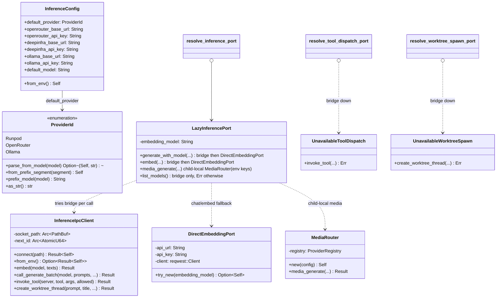

# hkask-inference — Reference

`hkask-inference` is the MCP-server-side inference crate. Its primary path is
the IPC bridge: MCP server child processes route chat, vision, embedding,
batch, tool dispatch, and worktree spawn back to zed's
`LanguageModelRegistry` over a Unix socket (`HKASK_INFERENCE_SOCKET`),
instead of holding API keys. The crate also contains a **lazy fallback
layer** (`LazyInferencePort` → `DirectEmbeddingPort` / standalone
`MediaRouter`, always child-local for media) for servers that start before the socket exists or run
outside zed's governed launch, a **batch API router** (OpenRouter /
DeepInfra), a **pluggable media-provider registry** with strict provider-qualified
selection, and the `openai_compat` response-body redaction utility.

## Source citations

All line numbers re-verified against the current tree on 2026-08-28 via
`grep -n`. Surfaces that earlier doc revisions described — `resolve_ports`,
`InferencePorts`, `UnavailableInference`, the single-`Mutex<UnixStream>`
connection design, and `IPC_READ_TIMEOUT` (120 s) — no longer exist and are
intentionally absent.

### `hkask_inference.rs` (lib root)

| Symbol | Location |
|--------|----------|
| module list (`batch` … `rerank`) | `kask/crates/hkask-inference/src/hkask_inference.rs:29-38` |
| public re-exports (`InferenceConfig`, `ProviderId`, `InferenceIpcClient`) | `kask/crates/hkask-inference/src/hkask_inference.rs:41-42` |
| `IPC_BRIDGE_UNAVAILABLE` const | `kask/crates/hkask-inference/src/hkask_inference.rs:49` |
| `connect_bridge` (private) | `kask/crates/hkask-inference/src/hkask_inference.rs:60` |
| `resolve_inference_port` | `kask/crates/hkask-inference/src/hkask_inference.rs:95` |
| `LazyInferencePort` struct (private) | `kask/crates/hkask-inference/src/hkask_inference.rs:103` |
| `impl InferencePort for LazyInferencePort` | `kask/crates/hkask-inference/src/hkask_inference.rs:126` |
| `DirectEmbeddingPort` struct (private) | `kask/crates/hkask-inference/src/hkask_inference.rs:419` |
| `DirectEmbeddingProvider` descriptor (private) | `kask/crates/hkask-inference/src/hkask_inference.rs:431` |
| `DIRECT_EMBEDDING_PROVIDERS` static | `kask/crates/hkask-inference/src/hkask_inference.rs:441` |
| `DirectEmbeddingPort::try_new` | `kask/crates/hkask-inference/src/hkask_inference.rs:469` |
| `impl InferencePort for DirectEmbeddingPort` | `kask/crates/hkask-inference/src/hkask_inference.rs:513` |
| `resolve_tool_dispatch_port` | `kask/crates/hkask-inference/src/hkask_inference.rs:795` |
| `UnavailableToolDispatch` (private) | `kask/crates/hkask-inference/src/hkask_inference.rs:807` |
| `resolve_worktree_spawn_port` | `kask/crates/hkask-inference/src/hkask_inference.rs:835` |
| `UnavailableWorktreeSpawn` (`pub(crate)`) | `kask/crates/hkask-inference/src/hkask_inference.rs:846` |

### `inference_ipc_client.rs`

| Symbol | Location |
|--------|----------|
| `MAX_IPC_LINE_BYTES` (16 MiB, private) | `kask/crates/hkask-inference/src/inference_ipc_client.rs:74` |
| `read_socket_path_from_file` (private) | `kask/crates/hkask-inference/src/inference_ipc_client.rs:82` |
| `IPC_READ_TIMEOUT_GRACE` (30 s, private) | `kask/crates/hkask-inference/src/inference_ipc_client.rs:117` |
| `IPC_READ_TIMEOUT_FALLBACK` (600 s, private) | `kask/crates/hkask-inference/src/inference_ipc_client.rs:127` |
| `ipc_read_timeout` (private) | `kask/crates/hkask-inference/src/inference_ipc_client.rs:147` |
| `IPC_BATCH_READ_TIMEOUT` (6 h + 60 s, private) | `kask/crates/hkask-inference/src/inference_ipc_client.rs:183` |
| `read_response_line` / `read_response_line_with_timeout` (private) | `kask/crates/hkask-inference/src/inference_ipc_client.rs:190`, `:197` |
| `IpcTransportError` enum (private) | `kask/crates/hkask-inference/src/inference_ipc_client.rs:233` |
| `unexpected_outcome_msg` (private) | `kask/crates/hkask-inference/src/inference_ipc_client.rs:265` |
| `strip_provider_prefix` (private) | `kask/crates/hkask-inference/src/inference_ipc_client.rs:279` |
| `InferenceIpcClient` struct (`#[derive(Clone)]`) | `kask/crates/hkask-inference/src/inference_ipc_client.rs:295` |
| `InferenceIpcClient::connect` | `kask/crates/hkask-inference/src/inference_ipc_client.rs:308` |
| `InferenceIpcClient::from_env` | `kask/crates/hkask-inference/src/inference_ipc_client.rs:330` |
| `ipc_roundtrip` (private transport skeleton) | `kask/crates/hkask-inference/src/inference_ipc_client.rs:352` |
| `call` (private, generate path) | `kask/crates/hkask-inference/src/inference_ipc_client.rs:413` |
| `call_generate_batch` | `kask/crates/hkask-inference/src/inference_ipc_client.rs:448` |
| `call_embed` (private) | `kask/crates/hkask-inference/src/inference_ipc_client.rs:569` |
| `InferenceIpcClient::embed` | `kask/crates/hkask-inference/src/inference_ipc_client.rs:612` |
| `call_list_models` (private) | `kask/crates/hkask-inference/src/inference_ipc_client.rs:624` |
| `InferenceIpcClient::invoke_tool` | `kask/crates/hkask-inference/src/inference_ipc_client.rs:662` |
| `InferenceIpcClient::create_worktree_thread` | `kask/crates/hkask-inference/src/inference_ipc_client.rs:707` |
| `impl InferencePort for InferenceIpcClient` | `kask/crates/hkask-inference/src/inference_ipc_client.rs:748` |
| `impl ToolDispatchPort for InferenceIpcClient` | `kask/crates/hkask-inference/src/inference_ipc_client.rs:909` |
| `impl WorktreeSpawnPort for InferenceIpcClient` | `kask/crates/hkask-inference/src/inference_ipc_client.rs:926` |

### `config.rs`

| Symbol | Location |
|--------|----------|
| `ProviderId` enum | `kask/crates/hkask-inference/src/config.rs:34` |
| `ProviderId::parse_from_model` (`PREFIXES` at `:62`) | `kask/crates/hkask-inference/src/config.rs:59` |
| `ProviderId::from_prefix_segment` | `kask/crates/hkask-inference/src/config.rs:94` |
| `ProviderId::prefix_model` | `kask/crates/hkask-inference/src/config.rs:110` |
| `ProviderId::as_str` | `kask/crates/hkask-inference/src/config.rs:120` |
| `InferenceConfig` struct | `kask/crates/hkask-inference/src/config.rs:135` |
| `impl Default for InferenceConfig` | `kask/crates/hkask-inference/src/config.rs:154` |
| `InferenceConfig::from_env` | `kask/crates/hkask-inference/src/config.rs:179` |
| `resolve_api_key` (private) | `kask/crates/hkask-inference/src/config.rs:220` |
| `resolve_default_provider` (private) | `kask/crates/hkask-inference/src/config.rs:236` |
| `parse_provider_code` (private) | `kask/crates/hkask-inference/src/config.rs:246` |
| `resolve_config_str` (private) | `kask/crates/hkask-inference/src/config.rs:261` |
| `ProviderConfig` struct (`pub(crate)`) | `kask/crates/hkask-inference/src/config.rs:274` |
| `ProviderConfig::from_env` | `kask/crates/hkask-inference/src/config.rs:284` |

There is no `ProviderConfig::is_configured` method in the current tree.

### `model_constants.rs`

| Symbol | Location |
|--------|----------|
| `classifier_model()` / `embedding_model()` / `ocr_model()` / `rerank_model()` | `kask/crates/hkask-inference/src/model_constants.rs` (env-layer accessors; `None` = env var not injected) |

The former `DEFAULT_*_MODEL` constants are deleted. The code defaults live
in the settings `Default` impls (operator ruling 2026-09-04):
`kask_bridge/src/settings.rs` (`KaskModelsSettings::default`, plus
`KaskCorpusSettings::default` for the embedding model) and
`hkask-services-core/src/standalone_settings.rs` (`HkaskSettings::default`).

### `media_router.rs`, `media_providers.rs`, `provider.rs`, `batch.rs`, `openai_compat.rs`

| Symbol | Location |
|--------|----------|
| `MediaRouter` struct | `kask/crates/hkask-inference/src/media_router.rs:10` |
| `MediaRouter::new` | `kask/crates/hkask-inference/src/media_router.rs:26` |
| `DeepInfraMediaProvider` | `kask/crates/hkask-inference/src/media_providers.rs:60` |
| `OpenRouterMediaProvider` | `kask/crates/hkask-inference/src/media_providers.rs:460` |
| `MediaOp` enum (10 ops) | `kask/crates/hkask-inference/src/provider.rs:13` |
| `MediaProvider` trait | `kask/crates/hkask-inference/src/provider.rs:154` |
| `ProviderRegistry` | `kask/crates/hkask-inference/src/provider.rs:180` |
| `ProviderRegistry::execute` | `kask/crates/hkask-inference/src/provider.rs:197` |
| `BatchProvider` enum | `kask/crates/hkask-inference/src/batch.rs:51` |
| `detect_batch_provider` | `kask/crates/hkask-inference/src/batch.rs:89` |
| `BatchResult` | `kask/crates/hkask-inference/src/batch.rs:130` |
| `submit_batch` | `kask/crates/hkask-inference/src/batch.rs:159` |
| `ERROR_BODY_MAX_CHARS` / `SECRET_PREFIXES` | `kask/crates/hkask-inference/src/openai_compat.rs:16`, `:24` |
| `sanitize_error_body` / `redact_secret_tokens` | `kask/crates/hkask-inference/src/openai_compat.rs:51`, `:66` |

## Class diagram

<!-- DIAGRAM_ALIGNMENT
id: DIAG-INF-REF
verified_date: 2026-08-31
verified_against: kask/crates/hkask-inference/src/config.rs:34,135; kask/crates/hkask-inference/src/inference_ipc_client.rs:295; kask/crates/hkask-inference/src/hkask_inference.rs:103,419,807,846; kask/crates/hkask-inference/src/media_router.rs:43
status: VERIFIED
-->

## `ProviderId`

The `ProviderId` enum (`config.rs:34`) has three variants — `Runpod`,
`OpenRouter`, `Ollama` — each with a two-letter serde tag (`"RP"`, `"OR"`,
`"OM"`). The model-name prefixes are registered in the `PREFIXES` const
inside `parse_from_model` (`config.rs:62`): `"RunPod/"`, `"OpenRouter/"`,
`"ollama/"`. `parse_from_model` (`config.rs:59`) does strict case-sensitive
prefix stripping and returns `None` for an unrecognized prefix or an empty
remainder. `from_prefix_segment` (`config.rs:94`) is the lenient
counterpart: case-insensitive, accepts aliases (`"or"`, `"rp"`, `"om"`),
and falls back to `OpenRouter` for unrecognized segments.
`prefix_model` (`config.rs:110`) constructs `"{as_str}/{model}"`;
`as_str` (`config.rs:120`) returns `"RunPod"`, `"OpenRouter"`, or
`"ollama"`.

## `InferenceConfig`

`InferenceConfig` (`config.rs:135`) holds `default_provider`, base
URLs + API keys for **OpenRouter, DeepInfra, and Ollama**, and
`default_model`. The `Default` impl (`config.rs:154`) sets
`default_provider: OpenRouter`, `deepinfra_base_url:
"https://api.deepinfra.com"`, `ollama_base_url: "http://localhost:11434"`,
and `default_model` from `DEFAULT_FALLBACK_MODEL`. `from_env`
(`config.rs:179`) resolves each provider via `ProviderConfig::from_env`
(`config.rs:284`), which uppercases the prefix (removing spaces/dots) and
reads `{PREFIX}_BASE_URL` / `{PREFIX}_API_KEY`. API keys are read **only**
from the environment — `resolve_api_key` (`config.rs:220`) documents why
it must not fall back to the `hkask` keychain namespace (reserved for
sovereignty keys; inference-provider keys are written to the provider's
`api_url` keychain slot via Settings → AI → LLM Providers, never to the
`hkask` keyring).

## `InferenceIpcClient`

`InferenceIpcClient` (`inference_ipc_client.rs:295`) is
`#[derive(Clone)]` and holds only a `socket_path: Arc<PathBuf>` and a
`next_id: Arc<AtomicU64>` shared across clones. It opens a **new
connection per request** (`ipc_roundtrip`, `inference_ipc_client.rs:352`,
connects at `:369`): the server side spawns a task per connection, so
concurrent callers run in parallel rather than serializing behind a
stream lock (module doc, `inference_ipc_client.rs:16-28`).

`connect` (`:308`) verifies reachability with a throwaway connection;
`from_env` (`:330`) reads `HKASK_INFERENCE_SOCKET`
(`INFERENCE_SOCKET_ENV`, `kask/crates/hkask-types/src/inference_ipc.rs:53`)
and falls back to the file `$XDG_RUNTIME_DIR/kask/inference-socket-path`
(`read_socket_path_from_file`, `:82`), written by
`kask_bridge::set_inference_socket_path`
(`kask/crates/kask_bridge/src/inference_socket.rs:24`) so a server
relaunched with a stale `LaunchSpec` still finds the current socket.

Read deadlines are server-aligned: `ipc_read_timeout` (`:147`) reads
`HKASK_INFERENCE_TIMEOUT_SECS`
(`INFERENCE_TIMEOUT_ENV`, `kask/crates/hkask-types/src/inference_ipc.rs:71`)
and returns `server_timeout + 30 s` grace (`IPC_READ_TIMEOUT_GRACE`,
`:117`), so the client strictly outlasts the server and a timed-out
inference produces one timeout, not a `BrokenPipe` pair. Unset or
malformed values fall back to 600 s (`IPC_READ_TIMEOUT_FALLBACK`, `:127`)
with a `tracing::warn!` naming the offending value. Batch roundtrips use
`IPC_BATCH_READ_TIMEOUT` = 6 h + 60 s (`:183`), matching `MAX_BATCH_WAIT`
(`batch.rs:44`). Response lines are capped at 16 MiB
(`MAX_IPC_LINE_BYTES`, `:74`; CWE-400).

Every IPC method shares the `ipc_roundtrip` transport skeleton; transport
failures are `IpcTransportError`s (`:233`) mapped per-method via `From`
impls (`:242`, `:251`), and each method's outcome match is exhaustive —
every `InferenceOutcome` variant is named so adding one is a compile
error at every call site (module doc, `:37-48`). `list_models` (`:838`)
maps `ModelListEntry.name` through `strip_provider_prefix` (`:279`,
first-segment-only) into `ModelEntry { prefixed_name, model }`.

## Lazy fallback layer

`resolve_inference_port` (`hkask_inference.rs:94`) returns a
`LazyInferencePort` (`:102`) — not a resolve-once stub. Each non-media call
re-attempts `InferenceIpcClient::from_env()`; on failure:

- `generate_with_model` / `embed` fall back to `DirectEmbeddingPort`
  (`:337`), which resolves the model's provider prefix against
  `DIRECT_EMBEDDING_PROVIDERS` (`:359` — DeepInfra, OpenRouter, ollama;
  deliberately mirrors `kask_bridge`'s `INFERENCE_PROVIDERS` table because
  `hkask-inference` cannot depend on `kask_bridge` without inverting the
  D8 seam) and calls the OpenAI-compatible `/chat/completions` and
  `/embeddings` endpoints directly with env-var keys.
- `media_generate` bypasses IPC unconditionally, using the child-local
  `MediaRouter` built from `InferenceConfig::from_env()`.
- `generate_vision` returns a clear `Connection` error (no fallback);
  `list_models` and `generate_batch` are bridge-only and return
  socket-named `Connection` errors (`:233`, `:265`).

This eliminates the resolve-once-at-startup problem where a corpus MCP
server started before the IPC socket existed and never re-resolved
(`resolve_inference_port` doc comment, `hkask_inference.rs:86-93`).

## Media routing policy — operator decision 2026-09-06

The selected model is authoritative: `params.model` when present, otherwise
that operation's configured environment model. Selectable operations require
`OpenRouter/<provider-local-model>` or `DeepInfra/<provider-local-model>`.
Full provider names are ASCII case-insensitive; the remainder may contain a
vendor slash and is preserved exactly. Bare models, short aliases (`OR/`,
`DI/`), blank overrides, unknown providers, and whitespace are invalid.

| Operation | Environment model when no override is supplied |
|---|---|
| `generate_image`, `image_to_image` | `HKASK_MEDIA_IMAGE_GEN_MODEL` |
| `generate_speech` | `HKASK_MEDIA_TTS_MODEL` |
| `transcribe` | `HKASK_MEDIA_STT_MODEL` |
| `generate_video`, `image_to_video` | `HKASK_MEDIA_VIDEO_MODEL` |
| `chat_audio` | `HKASK_MEDIA_AUDIO_CHAT_MODEL` |
| `chat_json` | `HKASK_MEDIA_STRUCTURED_PASS_MODEL` |

`ProviderRegistry::execute` resolves once, verifies the named provider is
registered and supports the operation, and calls exactly that provider with
only the provider-local model. No scoring, registration-order selection,
automatic cross-provider retry, or hidden default substitution remains.
The selected provider's errors return unchanged. Missing configuration or a
selected key names its environment variable (`NotConfigured`); invalid
selection is `Model`. Media MCP maps those to `permission_denied` and
`invalid_argument`, respectively; provider 401/403 remains `Auth` →
`permission_denied`.

`remove_background` and `upscale` use the fixed DeepInfra native endpoints
`Bria/remove_background` and `latentconsistency/upscale`. They need
`DEEPINFRA_API_KEY`, not a model env var, and reject model overrides.
OpenRouter does not serve image-to-image or TTS in these adapters;
DeepInfra does not serve `chat_audio` or `chat_json`.

This decision supersedes `d660f3b754` (scoring/automatic fallback) and
`8cc79c797e` (registration-order routing), not `f86cf19a70` (child-local
media). `LazyInferencePort::media_generate` still uses the child-local
`MediaRouter`; foreground media behavior and chat/vision/embed/IPC routes
are unchanged. The router is now media-only, with one inherent
`media_generate` entry point rather than a fake chat `InferencePort` impl.

**Migration:** qualify existing bare/short-alias media model settings and
replay overrides with the intended full provider name; install that
provider's key. Remove overrides from fixed-model operations. Settings
remain the source of defaults; standalone callers must configure the env
model or pass an override. The current STT settings default remains
`OpenRouter/openai/whisper-large-v3-turbo`; image, video, and TTS settings
have no default. No compatibility fallback is provided.

Offline pins: `media_routing_tests` exercises all eight selectable ops,
invalid selections, absent keys, fixed ops, typed failures, real adapter
HTTP payloads, and child-local `LazyInferencePort` with zero IPC calls.
`hkask-mcp-media/src/error.rs` pins real router 401/403 → tool
`permission_denied` and invalid model → `invalid_argument`.

## Batch API

`batch.rs` implements the OpenAI Batch API flow (upload JSONL → create
batch → poll → download) for OpenRouter and DeepInfra
(`BatchProvider`, `batch.rs:51`). `detect_batch_provider` (`batch.rs:89`)
detects eligibility: an `:batch` suffix routes to OpenRouter, a
`DeepInfra/` prefix routes to DeepInfra, and `HKASK_BATCH_PROVIDER`
forces either. `submit_batch` (`batch.rs:159`) waits up to `MAX_BATCH_WAIT`
= 6 h (`:44`) polling every 30 s (`POLL_INTERVAL`, `:47`). `BatchResult`
(`batch.rs:130`) keys results by `custom_id` — failures are kept, not
dropped. The zed side holds the API keys; the MCP server never sees them
(`call_generate_batch` doc, `inference_ipc_client.rs:443-447`).

## Model defaults

Every model has a **code default** (operator ruling 2026-09-04, superseding
the former no-hidden-models spec): the system works out of the box, and the
settings UI / settings.json / env vars override. The defaults live in the
settings `Default` impls — the operator's configured models, verbatim:

| Model | Default | Override |
|-------|---------|----------|
| Default inference model | `OpenRouter/z-ai/glm-5.3` | `kask.models.default_model` / `HKASK_DEFAULT_MODEL` |
| Embedding model | `ollama/qwen3-embedding:0.6b` | `kask.models.embedding_model` → `kask.corpus.embedding_model` / `HKASK_EMBEDDING_MODEL` |
| Classifier model | `OpenRouter/z-ai/glm-5.2` (non-thinking — classifiers need output tokens, not reasoning tokens; glm-5.3-flash cannot disable thinking) | `kask.models.classifier_model` / `HKASK_CLASSIFIER_MODEL` |
| OCR model | `ollama/glm-ocr:latest` | `kask.models.ocr_model` / `HKASK_OCR_MODEL` |
| Rerank model | none (fails visibly naming the setting) | `kask.models.rerank_model` / `HKASK_RERANK_MODEL` |

The env-layer accessors `classifier_model()`, `embedding_model()`,
`ocr_model()`, and `rerank_model()` (`model_constants.rs`) read `HKASK_*`
only — the settings chain injects those env vars into MCP server children
with the resolved (default-or-overridden) values. The embedding default
lives in the corpus settings layer so a models-layer default cannot shadow
`corpus.embedding_model` overrides.

## `openai_compat` module

Only the redaction utility remains here. `sanitize_error_body`
(`openai_compat.rs:51`) redacts secret-shaped substrings via
`redact_secret_tokens` (`:66`) and truncates to 200 chars
(`ERROR_BODY_MAX_CHARS`, `:16`, char-boundary safe). `SECRET_PREFIXES`
(`:24`) scans for `authorization:`, `bearer `, `sk-`, `api_key`, GitHub
PATs, AWS keys, Slack/GitLab tokens, and JWT headers (CWE-209
defense-in-depth). Consumers include the MCP `classify_http_error` helper
(`kask/crates/hkask-mcp-server/src/server/http_helpers.rs:3`).

## Consumers

- `kask/mcp-servers/hkask-mcp-corpus/src/hkask_mcp_corpus.rs:288`,
  `.../hkask-mcp-curator/src/hkask_mcp_curator.rs:1430`,
  `.../hkask-mcp-media/src/hkask_mcp_media.rs:474`,
  `.../hkask-mcp-prediction-markets/src/hkask_mcp_prediction_markets.rs:1545`,
  `.../hkask-mcp-training/src/hkask_mcp_training.rs:370` — call
  `resolve_inference_port()`.
- `kask/mcp-servers/hkask-mcp-swarm/src/local_runtime.rs:186-187` — calls
  `resolve_inference_port()` + `resolve_tool_dispatch_port()`.
- `kask/mcp-servers/hkask-mcp-kata-kanban/src/hkask_mcp_kata_kanban.rs:1743`
  — calls `resolve_worktree_spawn_port()`.
- `kask_bridge` — holds the non-media IPC server (`inference_ipc_server.rs`);
  media dispatch is child-local, not hosted by the bridge.

## See also

- [hkask-inference How-to](./how-to.md): wiring an MCP server to the
  bridge and adding a chat provider.
- [hkask-inference Tutorial](./tutorial.md): routing your first request.
- [hkask-inference Explanation](./explanation.md): why the bridge is the
  primary path and how the fallbacks are shaped.
- [hkask-types Reference](../hkask-types/reference.md): the `InferencePort`
  (`kask/crates/hkask-types/src/ports/inference_port.rs:147`),
  `ToolDispatchPort` (`:97`), and `WorktreeSpawnPort` (`:135`) traits.

---

[^hexagonal]: Cockburn, A. (2005). *Hexagonal Architecture.* <https://alistair.cockburn.us/hexagonal-architecture/>. The port-trait boundary that lets the IPC-bridge client, the lazy fallback, and the unavailable stubs be swapped behind `Arc<dyn …Port>`.
