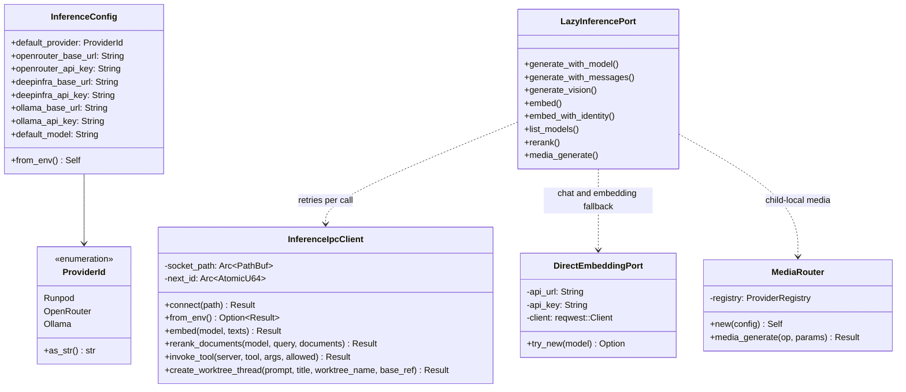
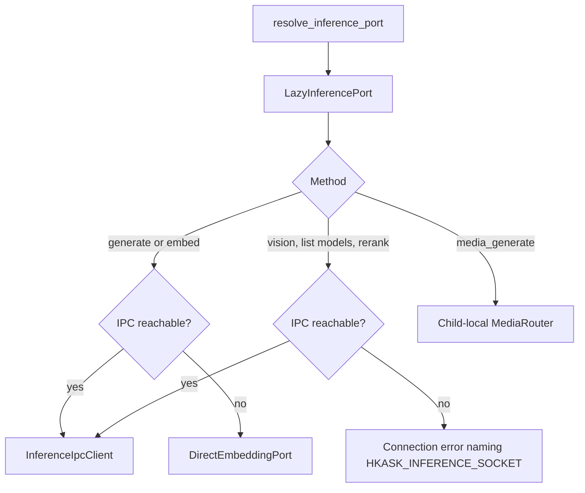
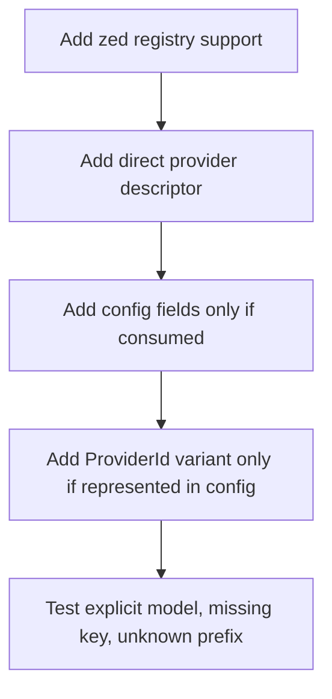

# hkask-inference — Reference

Lookup reference for the current `hkask-inference` surface. Citations use full repository-relative paths and were re-derived from the implementation on 2026-09-28.

## Crate root and modules

The crate root declares nine public modules and re-exports three public types (`kask/crates/hkask-inference/src/hkask_inference.rs:29-42`).

| Module | Purpose | Evidence |
|---|---|---|
| `config` | `InferenceConfig`, `ProviderId`, environment resolution | `kask/crates/hkask-inference/src/config.rs:1-30` |
| `inference_ipc_client` | Unix-socket adapter for inference, tools, and worktrees | `kask/crates/hkask-inference/src/inference_ipc_client.rs:1-48` |
| `media_providers` | DeepInfra and OpenRouter media adapters | `kask/crates/hkask-inference/src/media_providers.rs:60-76`, `kask/crates/hkask-inference/src/media_providers.rs:472-488` |
| `media_router` | Child-local media dispatcher | `kask/crates/hkask-inference/src/media_router.rs:1-12` |
| `model_constants` | Environment bindings and QA model validation | `kask/crates/hkask-inference/src/model_constants.rs:1-24` |
| `openai_compat` | Provider-error body redaction helpers | `kask/crates/hkask-inference/src/openai_compat.rs:1-24` |
| `passage_tagging` | strict model-facing passage-tagging protocol — deployed-template rendering and response correlation | `kask/crates/hkask-inference/src/passage_tagging.rs:1-8,29-63` |
| `provider` | Typed media operations and strict provider registry | `kask/crates/hkask-inference/src/provider.rs:1-30` |
| `rerank` | Rerank HTTP support | `kask/crates/hkask-inference/src/rerank.rs:1-20` |

| Root export | Definition |
|---|---|
| `InferenceConfig`, `ProviderId` | `kask/crates/hkask-inference/src/config.rs:34-89` |
| `InferenceIpcClient` | `kask/crates/hkask-inference/src/inference_ipc_client.rs:299-313` |
| `resolve_inference_port()` | `kask/crates/hkask-inference/src/hkask_inference.rs:88-98` |
| `resolve_tool_dispatch_port()` | `kask/crates/hkask-inference/src/hkask_inference.rs:875-886` |
| `resolve_worktree_spawn_port()` | `kask/crates/hkask-inference/src/hkask_inference.rs:936-947` |

## Type relationships


```mermaid
classDiagram
    class ProviderId {
        <<enumeration>>
        Runpod
        OpenRouter
        Ollama
        +as_str() str
    }
    class InferenceConfig {
        +default_provider: ProviderId
        +openrouter_base_url: String
        +openrouter_api_key: String
        +deepinfra_base_url: String
        +deepinfra_api_key: String
        +ollama_base_url: String
        +ollama_api_key: String
        +default_model: String
        +from_env() Self
    }
    class InferenceIpcClient {
        -socket_path: Arc~PathBuf~
        -next_id: Arc~AtomicU64~
        +connect(path) Result
        +from_env() Option~Result~
        +embed(model, texts) Result
        +rerank_documents(model, query, documents) Result
        +invoke_tool(server, tool, args, allowed) Result
        +create_worktree_thread(prompt, title, worktree_name, base_ref) Result
    }
    class LazyInferencePort {
        +generate_with_model()
        +generate_with_messages()
        +generate_vision()
        +embed()
        +embed_with_identity()
        +list_models()
        +rerank()
        +media_generate()
    }
    class DirectEmbeddingPort {
        -api_url: String
        -api_key: String
        -client: reqwest::Client
        +try_new(model) Option
    }
    class MediaRouter {
        -registry: ProviderRegistry
        +new(config) Self
        +media_generate(op, params) Result
    }

    InferenceConfig --> ProviderId
    LazyInferencePort ..> InferenceIpcClient : retries per call
    LazyInferencePort ..> DirectEmbeddingPort : chat and embedding fallback
    LazyInferencePort ..> MediaRouter : child-local media
```

<!-- DIAGRAM_ALIGNMENT
id: DIAG-INF-REF
verified_date: 2026-09-28
verified_against: kask/crates/hkask-inference/src/config.rs:34-135; kask/crates/hkask-inference/src/inference_ipc_client.rs:299-349,526-750,747-920; kask/crates/hkask-inference/src/hkask_inference.rs:88-105,155-375,411-490; kask/crates/hkask-inference/src/media_router.rs:9-72
status: VERIFIED
-->

## `ProviderId`

Defined at `kask/crates/hkask-inference/src/config.rs:34-48`.

| Variant | Serde value | `as_str()` |
|---|---|---|
| `Runpod` | `RP` | `RunPod` |
| `OpenRouter` | `OR` | `OpenRouter` |
| `Ollama` | `OM` | `ollama` |

`as_str(&self) -> &'static str` is the enum's only inherent public method (`kask/crates/hkask-inference/src/config.rs:50-64`). Direct chat/embedding provider selection is performed by `DIRECT_EMBEDDING_PROVIDERS`, not by `ProviderId` (`kask/crates/hkask-inference/src/hkask_inference.rs:439-461`).

## `InferenceConfig`

Defined at `kask/crates/hkask-inference/src/config.rs:66-89`.

| Field group | Default/effective source | Evidence |
|---|---|---|
| `default_provider` | `OpenRouter`; `HKASK_DEFAULT_PROVIDER` accepts `RunPod`, `OpenRouter`, `ollama` | `kask/crates/hkask-inference/src/config.rs:91-105`, `kask/crates/hkask-inference/src/config.rs:170-192` |
| OpenRouter URL/key | `https://openrouter.ai/api`; `OPENROUTER_BASE_URL`, `OPENROUTER_API_KEY` | `kask/crates/hkask-inference/src/config.rs:91-100`, `kask/crates/hkask-inference/src/config.rs:119-133`, `kask/crates/hkask-inference/src/config.rs:218-233` |
| DeepInfra URL/key | `https://api.deepinfra.com`; `DEEPINFRA_BASE_URL`, `DEEPINFRA_API_KEY` | `kask/crates/hkask-inference/src/config.rs:79-82`, `kask/crates/hkask-inference/src/config.rs:91-100`, `kask/crates/hkask-inference/src/config.rs:119-133` |
| Ollama URL/key | `http://localhost:11434`; `OLLAMA_BASE_URL`, `OLLAMA_API_KEY` | `kask/crates/hkask-inference/src/config.rs:83-87`, `kask/crates/hkask-inference/src/config.rs:91-100`, `kask/crates/hkask-inference/src/config.rs:119-133` |
| `default_model` | Empty in `Default`; `HKASK_DEFAULT_MODEL` in `from_env` | `kask/crates/hkask-inference/src/config.rs:101-105`, `kask/crates/hkask-inference/src/config.rs:124-133` |

Provider keys are read from the process environment only (`kask/crates/hkask-inference/src/config.rs:139-168`).

## Inference port resolution

`resolve_inference_port()` returns a private `LazyInferencePort` as `Arc<dyn InferencePort>` (`kask/crates/hkask-inference/src/hkask_inference.rs:88-105`).

| Method | IPC available | IPC unavailable | Evidence |
|---|---|---|---|
| `generate`, `generate_with_model`, `generate_with_messages` | IPC generation | Direct OpenAI-compatible chat | `kask/crates/hkask-inference/src/hkask_inference.rs:155-169`, `kask/crates/hkask-inference/src/hkask_inference.rs:210-285` |
| `generate_vision` | IPC vision | `InferenceError::Connection` naming socket | `kask/crates/hkask-inference/src/hkask_inference.rs:172-207` |
| `embed` | IPC embedding | Direct OpenAI-compatible embedding | `kask/crates/hkask-inference/src/hkask_inference.rs:288-309` |
| `embed_with_identity` | IPC embedding with provider identity | Direct OpenAI-compatible embedding with identity | `kask/crates/hkask-inference/src/hkask_inference.rs:295-323` |
| `list_models` | IPC model list | `InferenceError::Connection` naming socket | `kask/crates/hkask-inference/src/hkask_inference.rs:312-330` |
| `rerank` | IPC rerank | `InferenceError::Connection` naming socket | `kask/crates/hkask-inference/src/hkask_inference.rs:333-355` |
| `media_generate` | Child-local `MediaRouter` | Same child-local path | `kask/crates/hkask-inference/src/hkask_inference.rs:358-375` |

The direct provider descriptors are DeepInfra, OpenRouter, and Ollama (`kask/crates/hkask-inference/src/hkask_inference.rs:439-461`). `DirectEmbeddingPort::try_new` requires a recognized prefix and any required provider key (`kask/crates/hkask-inference/src/hkask_inference.rs:467-490`).

### Direct chat response evidence

The direct chat path retains the response's `model` rather than substituting
the requested name. Missing model metadata remains an empty port value;
evaluation reports expose it as unreported. Provider-reported cost is selected
from `usage.market_cost`, `usage.cost`, then `usage.estimated_cost` (first finite
nonnegative value), matching the existing D20 compatible-provider precedence.
Cost and token reporting are independent; cost alone does not imply a measured
token total, and missing cost is not zero.

Implementation: `ChatUsage` at `kask/crates/hkask-inference/src/hkask_inference.rs:524-532`,
`usage_from_wire` at `kask/crates/hkask-inference/src/hkask_inference.rs:542-553`, and the
cost selection at `kask/crates/hkask-inference/src/hkask_inference.rs:744-748`.
`direct_chat_preserves_model_and_provider_cost`
(`kask/crates/hkask-inference/src/hkask_inference.rs:995`) exercises the actual HTTP
decoder on a loopback-only fixture with no credentials. Reference precedence:
`crates/language_model_core/src/chat_completion.rs:191-216`.
These are response metadata, not authenticated model identity or a spend cap.

## Typed model failures

| Condition | Error | Evidence |
|---|---|---|
| No explicit chat model and empty `HKASK_DEFAULT_MODEL` | `InferenceError::NotConfigured` | `kask/crates/hkask-inference/src/hkask_inference.rs:123-143`, `kask/crates/hkask-inference/src/hkask_inference.rs:645-657` |
| Explicit zed model override cannot be resolved | `InferenceError::Model`; no default substitution | `kask/crates/kask_bridge/src/inference_chat.rs:579-621`, `kask/crates/kask_bridge/src/inference_chat.rs:700-715` |
| QA model absent from explicit input and `HKASK_QA_GENERATION_MODEL` | `InferenceError::NotConfigured` | `kask/crates/hkask-inference/src/model_constants.rs` |
| QA model malformed or not provider-qualified | `InferenceError::Model` | `kask/crates/hkask-inference/src/model_constants.rs` |
| Direct embedding model has no usable provider/credential | `EmbeddingGenerationError::Connection` | `kask/crates/hkask-inference/src/hkask_inference.rs:296-307` |
| Selectable media operation has no configured model | `InferenceError::NotConfigured` | `kask/crates/hkask-inference/src/provider.rs:231-239` |
| Media model/provider identifier is invalid | `InferenceError::Model` | `kask/crates/hkask-inference/src/provider.rs:241-255` |

## `InferenceIpcClient`

The client is cloneable and stores an `Arc<PathBuf>` socket path plus an `Arc<AtomicU64>` request counter (`kask/crates/hkask-inference/src/inference_ipc_client.rs:299-313`).

| API | Behavior | Evidence |
|---|---|---|
| `connect(path)` | Tests reachability, then stores the path | `kask/crates/hkask-inference/src/inference_ipc_client.rs:315-330` |
| `from_env()` | Uses `HKASK_INFERENCE_SOCKET`, then runtime-file fallback | `kask/crates/hkask-inference/src/inference_ipc_client.rs:332-349` |
| `embed(model, texts)` | Rejects empty input, performs `Embed` roundtrip | `kask/crates/hkask-inference/src/inference_ipc_client.rs:526-580` |
| `rerank_documents(model, query, documents)` | Rejects empty documents, performs `Rerank` roundtrip | `kask/crates/hkask-inference/src/inference_ipc_client.rs:612-655` |
| `invoke_tool(server, tool, args, allowed)` | Sends governed tool request and allowlist | `kask/crates/hkask-inference/src/inference_ipc_client.rs:657-700` |
| `create_worktree_thread(...)` | Requests a zed-side worktree thread | `kask/crates/hkask-inference/src/inference_ipc_client.rs:703-750` |

`ipc_roundtrip` serializes one request line, opens a fresh connection, writes and flushes it, reads one capped response line, deserializes it, and verifies the correlation ID (`kask/crates/hkask-inference/src/inference_ipc_client.rs:351-422`). The line cap is 16 MiB (`kask/crates/hkask-inference/src/inference_ipc_client.rs:68-74`); the read deadline is the configured inference timeout plus 30 seconds or a 600-second fallback (`kask/crates/hkask-inference/src/inference_ipc_client.rs:128-199`).[^cwe400]

## Media API

`MediaOp` contains ten operations: image generation/editing, background removal, upscale, video generation, image-to-video, speech generation, transcription, audio chat, and schema-constrained chat (`kask/crates/hkask-inference/src/provider.rs:10-30`). String parsing and canonical names are defined at `kask/crates/hkask-inference/src/provider.rs:32-87`.

`ProviderRegistry::execute` resolves the model from parameters or the operation environment variable, accepts only OpenRouter or DeepInfra provider prefixes for selectable operations, validates provider-local model safety, selects exactly one registered provider, checks support, and executes it (`kask/crates/hkask-inference/src/provider.rs:218-288`). `MediaRouter` builds the available providers from `InferenceConfig` and delegates to that registry (`kask/crates/hkask-inference/src/media_router.rs:14-72`).

## Model environment accessors

| API | Environment variable | Evidence |
|---|---|---|
| `resolve_qa_generation_model` | explicit input, then `HKASK_QA_GENERATION_MODEL` | `kask/crates/hkask-inference/src/model_constants.rs` |
| `classifier_model` | `HKASK_CLASSIFIER_MODEL` | `kask/crates/hkask-inference/src/model_constants.rs` |
| `embedding_model` | `HKASK_EMBEDDING_MODEL` | `kask/crates/hkask-inference/src/model_constants.rs` |
| `ocr_model` | `HKASK_OCR_MODEL` | `kask/crates/hkask-inference/src/model_constants.rs` |
| `rerank_model` | `HKASK_RERANK_MODEL` | `kask/crates/hkask-inference/src/model_constants.rs` |

## Procedures

Use these recipes to wire an MCP server to the inference bridge, choose a model without hidden substitution, and configure strict media routing. The crate exposes port resolvers rather than provider-specific chat clients (`kask/crates/hkask-inference/src/hkask_inference.rs:41-43`, `kask/crates/hkask-inference/src/hkask_inference.rs:88-105`, `kask/crates/hkask-inference/src/hkask_inference.rs:875-1000`).[^hexagonal]

### Route an MCP server through the lazy inference port

Resolve the inference port once when constructing the server:

```rust
use hkask_inference::resolve_inference_port;

let inference = resolve_inference_port().await;
```

The result is `Arc<dyn hkask_types::InferencePort>`. It does not connect immediately. Calls retry `InferenceIpcClient::from_env()` and use method-specific fallback behavior (`kask/crates/hkask-inference/src/hkask_inference.rs:88-105`, `kask/crates/hkask-inference/src/hkask_inference.rs:155-375`).


```mermaid
flowchart TD
    A[resolve_inference_port] --> B[LazyInferencePort]
    B --> C{Method}
    C -->|generate or embed| D{IPC reachable?}
    D -->|yes| E[InferenceIpcClient]
    D -->|no| F[DirectEmbeddingPort]
    C -->|vision, list models, rerank| G{IPC reachable?}
    G -->|yes| E
    G -->|no| H[Connection error naming HKASK_INFERENCE_SOCKET]
    C -->|media_generate| I[Child-local MediaRouter]
```

<!-- DIAGRAM_ALIGNMENT
id: DIAG-INF-WIRE
verified_date: 2026-09-28
verified_against: kask/crates/hkask-inference/src/hkask_inference.rs:88-105,155-375,389-490
status: VERIFIED
-->

Call the trait method that matches the task. The IPC adapter implements generation, message-preserving generation, vision, embedding (with and without provider identity), reranking, and model listing (`kask/crates/hkask-inference/src/inference_ipc_client.rs:747-920`). Every request uses a fresh socket connection and a correlated response ID (`kask/crates/hkask-inference/src/inference_ipc_client.rs:351-422`).

### Surface a missing default model

For chat generation without an explicit override, configure the visible default:

```sh
export HKASK_DEFAULT_MODEL='OpenRouter/vendor/model'
```

In zed-kask this value normally comes from `kask.models.default_model` and is injected into the child process. `InferenceConfig::from_env()` leaves `default_model` empty when the variable is absent (`kask/crates/hkask-inference/src/config.rs:109-135`). The direct generation path then returns `InferenceError::NotConfigured` with instructions to set the setting or pass an explicit model; it does not select a code constant (`kask/crates/hkask-inference/src/hkask_inference.rs:123-143`, `kask/crates/hkask-inference/src/hkask_inference.rs:645-657`).

When you do pass an explicit model, pass the complete registry name:

```rust
let result = inference
    .generate_with_model(&prompt, &parameters, Some("OpenRouter/vendor/model"), None)
    .await?;
```

If zed's `LanguageModelRegistry` cannot resolve that override, the bridge returns `InferenceError::Model("model_override '…' not found; no default substitution")` (`kask/crates/kask_bridge/src/inference_chat.rs:579-621`, `kask/crates/kask_bridge/src/inference_chat.rs:700-715`). Fix the provider/model configuration; do not retry without the override unless using the default model is the intended user-visible behavior.

### Configure the dedicated QA generation model

Choose either an explicit tool model or the dedicated setting/environment binding:

```sh
export HKASK_QA_GENERATION_MODEL='OpenRouter/vendor/qa-model'
```

Resolve it with:

```rust
let model = hkask_inference::model_constants::resolve_qa_generation_model(requested_model)?;
```

An explicit model wins. With neither source, the resolver returns `InferenceError::NotConfigured`; malformed or unqualified names return `InferenceError::Model`. The resolver never uses the chat default or a training base model (`kask/crates/hkask-inference/src/model_constants.rs`).

### Verify generated QA

There is no dedicated QA verification model: an LLM reviewing another
LLM is circular self-authorization, and the rejected `HKASK_QA_VERIFICATION_MODEL`
binding is deleted (`kask/crates/hkask-inference/src/model_constants.rs`).
Generation emits unverified candidates only, and acceptance is decided by the
corpus server's identity-bound external grounding gate at ingestion
(`kask/mcp-servers/hkask-mcp-corpus/src/services/qa_grounding.rs`) —
evidence citations checked against canonical source chunk bytes — never by a
second model call. Reviewed passage/level decisions are supplied to generation
as a required `prepared-qa-adjudication-v2` manifest.

### Add a direct chat or embedding provider

Bridge-routed model support belongs in zed's model registry. To add standalone direct fallback for another OpenAI-compatible provider:

1. Add a `DirectEmbeddingProvider { id, api_url, env_var }` entry to `DIRECT_EMBEDDING_PROVIDERS` (`kask/crates/hkask-inference/src/hkask_inference.rs:439-461`).
2. Keep the provider descriptor aligned with zed's registry integration; the table comment identifies the table as the embedding-capable SUBSET of `kask_bridge::inference_providers` — not a full mirror: RunPod (endpoint discovery) and KiloCode (chat-only, no embeddings endpoint) are deliberately absent (`kask/crates/hkask-inference/src/hkask_inference.rs:427-437`).
3. If configuration fields are required by other crate features, add them to `InferenceConfig::default` and `InferenceConfig::from_env` together (`kask/crates/hkask-inference/src/config.rs:66-135`).
4. Test an explicit provider-qualified model, a missing credential, and an unknown prefix. `DirectEmbeddingPort::try_new` accepts only a recognized prefix and required credentials (`kask/crates/hkask-inference/src/hkask_inference.rs:467-490`).

`ProviderId` needs a new variant only if the shared configuration must represent that provider. Its public behavior is the `as_str()` match (`kask/crates/hkask-inference/src/config.rs:34-64`); dispatch parsing remains in the direct-provider table or media registry.


```mermaid
flowchart TD
    A[Add zed registry support] --> B[Add direct provider descriptor]
    B --> C[Add config fields only if consumed]
    C --> D[Add ProviderId variant only if represented in config]
    D --> E[Test explicit model, missing key, unknown prefix]
```

<!-- DIAGRAM_ALIGNMENT
id: DIAG-INF-PROVIDER
verified_date: 2026-09-28
verified_against: kask/crates/hkask-inference/src/config.rs:34-135; kask/crates/hkask-inference/src/hkask_inference.rs:421-490; kask/crates/kask_bridge/src/inference_chat.rs:579-621
status: VERIFIED
-->

### Configure strict media routing

For selectable media operations, provide a full model name either in `MediaGenerateParams.model` or the operation's environment setting:

| Operations | Environment setting |
|---|---|
| `generate_image`, `image_to_image` | `HKASK_MEDIA_IMAGE_GEN_MODEL` |
| `generate_speech` | `HKASK_MEDIA_TTS_MODEL` |
| `transcribe`, `chat_audio`, `chat_json` | `HKASK_MEDIA_STT_MODEL` |
| `generate_video`, `image_to_video` | `HKASK_MEDIA_VIDEO_MODEL` |

The mapping is implemented by `MediaOp::model_env` (`kask/crates/hkask-inference/src/provider.rs:56-69`). Use `OpenRouter/<provider-local-model>` or `DeepInfra/<provider-local-model>`. `ProviderRegistry::execute` validates the identifier, selects exactly one registered provider, strips only the provider prefix, verifies operation support, and returns that provider's error unchanged (`kask/crates/hkask-inference/src/provider.rs:218-288`).

`remove_background` and `upscale` are fixed DeepInfra operations; pass no model override (`kask/crates/hkask-inference/src/provider.rs:57-68`, `kask/crates/hkask-inference/src/provider.rs:257-265`). Missing provider configuration returns `InferenceError::NotConfigured` naming the required key (`kask/crates/hkask-inference/src/provider.rs:266-275`).

### Resolve zed-side tool and worktree capabilities

Use the dedicated resolvers only when the server needs those capabilities:

```rust
let tools = hkask_inference::resolve_tool_dispatch_port().await;
let worktrees = hkask_inference::resolve_worktree_spawn_port().await;
```

These resolvers connect during resolution. If the bridge is absent, their stubs return `InferenceError::Connection` naming the missing socket; there is no direct HTTP fallback (`kask/crates/hkask-inference/src/hkask_inference.rs:875-1000`).

## See also

- [Explanation: bridge-first inference and visible failure](./explanation.md)
- [hkask-types reference](../hkask-types/reference.md)

---

[^hexagonal]: Cockburn, A. (2005). *Hexagonal Architecture.* <https://alistair.cockburn.us/hexagonal-architecture/>.
[^cwe400]: MITRE. (n.d.). *CWE-400: Uncontrolled Resource Consumption.* <https://cwe.mitre.org/data/definitions/400.html>.
