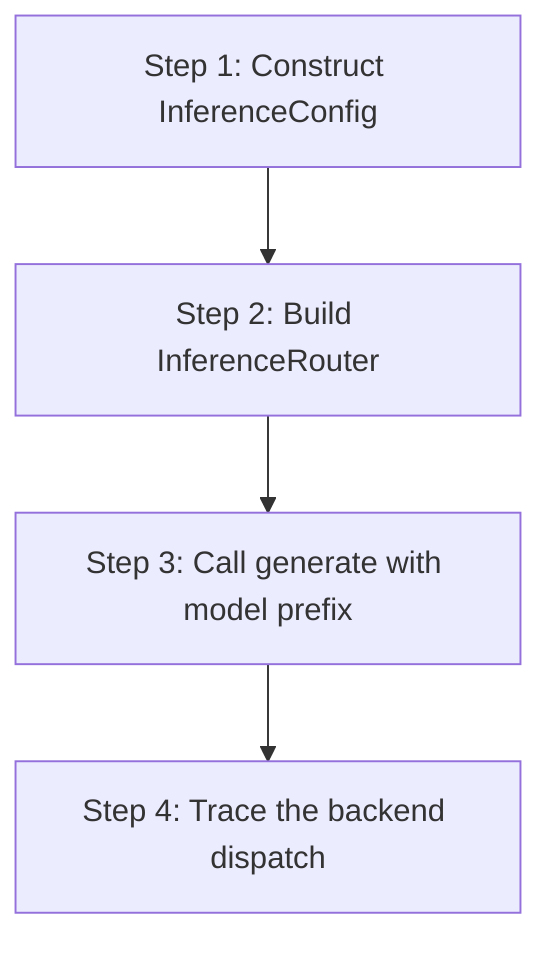

# hkask-inference — Tutorial: Routing Your First Inference Request

This tutorial walks through how an inference request flows from a skill to
a provider backend via the `InferenceRouter`. `hkask-inference` is the
MCP-server-local inference router — it is *not* the primary inference path
for zed-kask user-facing chat (which goes through zed's
`LanguageModelRegistry` via `kask_bridge`). MCP servers that need their
own inference (e.g. a media or skill server) call this router directly.

## Learning path

<!-- DIAGRAM_ALIGNMENT
id: DIAG-DIA-INF-003
verified_date: 2026-07-29
verified_against: kask/crates/hkask-inference/src/config.rs:44,192; kask/crates/hkask-inference/src/inference_router/mod.rs:52,94
status: VERIFIED
-->

## Steps 1-2: Configure and build the router

Construct an `InferenceConfig` (`config.rs:192`) with API keys for the
providers you want to use. The `default_provider` field (`config.rs:195`)
sets the fallback when a model name has no prefix.

Build an `InferenceRouter` (`inference_router/mod.rs:52`) from the config.
The router constructs backends only for providers whose `Backend::new`
returns `Ok` — i.e. those with non-empty API keys or base URLs
(`inference_router/mod.rs:94`). Backends that fail to construct are
`None` and emit a `reg.inference` warning.

## Steps 3-4: Call generate and trace the dispatch

Call `generate` with a model name. If the name has a prefix like
`DeepInfra/`, the router strips the prefix via
`ProviderId::parse_from_model` (`config.rs:86`) and dispatches to the
`DeepInfraBackend`. If no prefix is present, the router uses the
`default_provider`. Unknown prefixes are rejected explicitly by
`looks_like_prefix` (`config.rs:128`) rather than silently routed to the
default.

## See also

- [hkask-inference Reference](./reference.md): class diagram of the router.
- [hkask-inference How-to](./how-to.md): configuring a new provider.

---

[^hexagonal]: Cockburn, A. (2005). *Hexagonal Architecture.* <https://alistair.cockburn.us/hexagonal-architecture/>.
