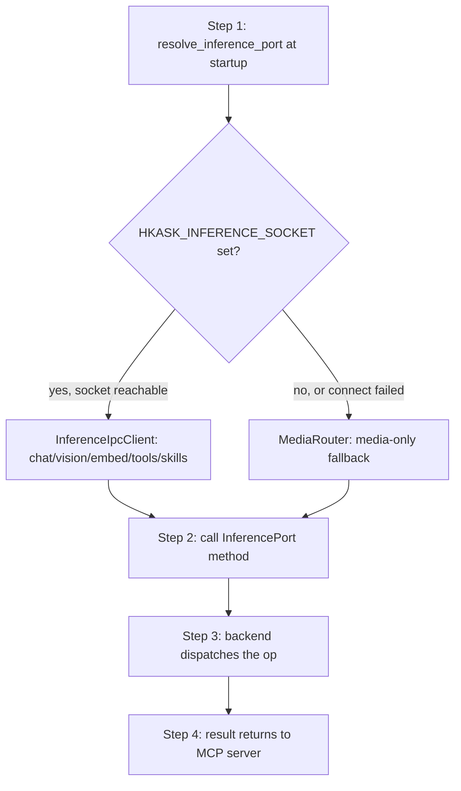

# hkask-inference — Tutorial: Routing Your First Inference Request

This tutorial walks through how an inference request flows from an MCP server
to a backend. `hkask-inference` is the MCP-server-local inference abstraction
layer. It exposes two `InferencePort` implementations selected at startup by
`resolve_inference_port()`:

- `InferenceIpcClient` — the primary path in zed-kask. Delegates chat, vision,
  embedding, tool dispatch, skill execution, and worktree spawn to zed's
  `LanguageModelRegistry` over a Unix socket (`HKASK_INFERENCE_SOCKET`). The
  zed process holds the API keys and the guard; the MCP server child process
  holds none.
- `MediaRouter` — the fallback when the IPC socket is unavailable. Serves
  **media generation only** (image/video/speech/transcription) via a
  `ProviderRegistry` of `MediaProvider` backends. Its `InferencePort` impl
  returns a clear `BRIDGE_ERROR` for chat/vision/embed — those require the IPC
  bridge.

## Learning path

<!-- DIAGRAM_ALIGNMENT
id: DIAG-INF-001
verified_date: 2026-08-13
verified_against: kask/crates/hkask-inference/src/hkask_inference.rs:184-209
status: VERIFIED
-->

## Step 1: Resolve the inference port at startup

An MCP server calls `resolve_inference_port()` (`hkask_inference.rs:184`) once
at startup. The function tries `InferenceIpcClient::from_env()` first; if the
`HKASK_INFERENCE_SOCKET` env var is set and the socket is reachable, it returns
an `Arc<dyn InferencePort>` backed by the IPC bridge client. If the env var is
unset, or the socket connection fails, it falls back to a `MediaRouter`
constructed from `InferenceConfig::from_env()`. Each branch logs at `info` or
`warn` level so the operator can verify the routing from server startup logs.

## Step 2: Call an InferencePort method

With the resolved `Arc<dyn InferencePort>`, the MCP server calls one of the
trait methods defined by `hkask_types::InferencePort`:

- `generate`, `generate_with_model`, `generate_with_messages`, `generate_stream`
  — chat completion.
- `generate_vision` — multimodal image input.
- `embed` — text embeddings.
- `list_models` — enumerate available models.
- `media_generate(op, params)` — media generation (image/video/speech/
  transcription).

On the IPC path, every call is serialized as a newline-delimited JSON
`InferenceRequest` and sent over the Unix socket; the response is a single
`InferenceResponse` line correlated by `id`. On the `MediaRouter` fallback,
chat/vision/embed/list_models return the `BRIDGE_ERROR` constant
(`media_router.rs:242`), and only `media_generate` dispatches to a backend.

## Step 3: Backend dispatches the op

For media calls, `MediaRouter::media_generate` (`media_router.rs:316`) parses
the op string into a `MediaOp` via `MediaOp::from_str` (`provider.rs:41`) and
hands it to `ProviderRegistry::execute` (`provider.rs:162`). The registry
filters its providers by `supports(op)`, selects a primary via the 7-dimension
scored engine when more than one candidate supports the op, and falls back
through the remaining candidates in descending weighted-score order on runtime
error. Each fallback attempt emits a `reg.inference` warn naming the failed
provider.

For chat/vision/embed calls on the IPC path, `InferenceIpcClient::call`
(`inference_ipc_client.rs:132`) writes the request line, reads one capped
response line (`MAX_IPC_LINE_BYTES` = 16 MiB, `IPC_READ_TIMEOUT` = 120 s), and
matches the response `id` to the request `id`. Any read/parse/id-mismatch
failure nulls the cached stream so the next call reconnects instead of
retrying on a dead connection.

## Step 4: Result returns to the MCP server

The `InferenceResult` (or `Vec<Vec<f32>>` for embeddings, or `serde_json::Value`
for media) is returned to the caller. Errors propagate as `InferenceError`
(chat/vision/media) or `EmbeddingGenerationError` (embeddings), with the
`Connection` variant carrying a clear message naming the missing socket or
failed provider so the operator can distinguish "not configured" from
"configured but broken."

## See also

- [hkask-inference Reference](./reference.md): class diagram and backend
  inventory.
- [hkask-inference How-to](./how-to.md): adding a new provider.
- [hkask-inference Explanation](./explanation.md): why the IPC bridge is
  preferred over the standalone `MediaRouter`.

---

[^hexagonal]: Cockburn, A. (2005). *Hexagonal Architecture.* <https://alistair.cockburn.us/hexagonal-architecture/>. The `InferencePort` boundary that allows the IPC bridge and the `MediaRouter` to be swapped at startup.
