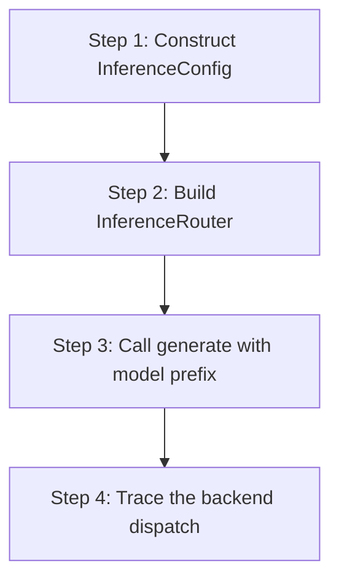

# hkask-inference — Tutorial: Routing Your First Inference Request

This tutorial walks through how an inference request flows from a skill to
a provider backend via the `InferenceRouter`.

## Learning path

<!-- DIAGRAM_ALIGNMENT
id: DIAG-DIA-INF-003
verified_date: 2026-07-27
verified_against: kask/crates/hkask-inference/src/config.rs:43,191; kask/crates/hkask-inference/src/inference_router/mod.rs:52
status: VERIFIED
-->

## Steps 1-2: Configure and build the router

Construct an `InferenceConfig` (`config.rs:191`) with API keys for the
providers you want to use. The `default_provider` field (`config.rs:43`)
sets the fallback when a model name has no prefix.

Build an `InferenceRouter` (`inference_router/mod.rs:52`) from the config.
The router constructs backends only for providers with non-empty API keys.

## Steps 3-4: Call generate and trace the dispatch

Call `generate` with a model name. If the name has a prefix like
`DeepInfra/`, the router strips the prefix and dispatches to the
`DeepInfraBackend`. If no prefix is present, the router uses the
`default_provider`.

## See also

- [hkask-inference Reference](./reference.md): class diagram of the router.
- [hkask-inference How-to](./how-to.md): configuring a new provider.

---

[^hexagonal]: Cockburn, A. (2005). *Hexagonal Architecture.* <https://alistair.cockburn.us/hexagonal-architecture/>.
