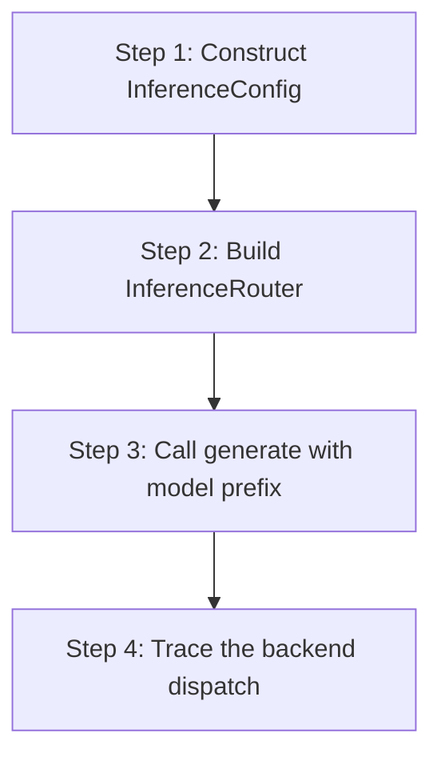

# hkask-inference — Tutorial: Routing Your First Inference Request

This tutorial walks through how a media-generation request flows from an
MCP server to a provider backend via the `MediaRouter`. `hkask-inference`
is the MCP-server-local media router — it is *not* the primary inference
path for zed-kask user-facing chat (which goes through zed's
`LanguageModelRegistry` via `kask_bridge`, reached over the IPC bridge by
`InferenceIpcClient`). MCP servers that need media generation
(image/video/speech/transcription) call this router directly.

## Learning path

<!-- DIAGRAM_ALIGNMENT
id: DIAG-DIA-INF-003
verified_date: 2026-08-01
verified_against: kask/crates/hkask-inference/src/config.rs:42,190; kask/crates/hkask-inference/src/media_router.rs:30,42
status: VERIFIED
-->

## Steps 1-2: Configure and build the router

Construct an `InferenceConfig` (`config.rs:190`) with API keys for the
providers you want to use. The `default_provider` field (`config.rs:193`)
sets the fallback when a model name has no prefix.

Build a `MediaRouter` (`media_router.rs:30`) from the config via
`MediaRouter::new` (`media_router.rs:42`). The router constructs backends
only for providers whose `Backend::new` returns `Ok` — i.e. those with
non-empty API keys or base URLs (`media_router.rs:49`). Backends that
fail to construct are `None` and emit a `reg.inference` warning.

## Steps 3-4: Call generate and trace the dispatch

Call `media_generate` with an op name and params. The `MediaRouter`
dispatches to the `FalBackend` or `DeepInfraBackend` based on the op.
Chat inference is not handled here — it routes through the IPC bridge
(`InferenceIpcClient`) to zed's `LanguageModelRegistry`. Model-name
prefix parsing (`ProviderId::parse_from_model`, `config.rs:84`) and the
fail-fast `looks_like_prefix` check (`config.rs:126`) are still used by
the IPC client for routing chat requests.

## See also

- [hkask-inference Reference](./reference.md): class diagram of the router.
- [hkask-inference How-to](./how-to.md): configuring a new provider.

---

[^hexagonal]: Cockburn, A. (2005). *Hexagonal Architecture.* <https://alistair.cockburn.us/hexagonal-architecture/>.
