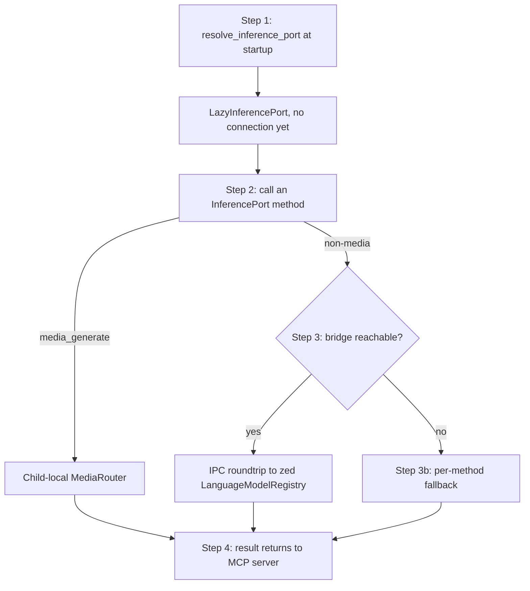

# hkask-inference — Tutorial: Routing Your First Inference Request

This tutorial walks through how an inference request flows from an MCP
server to zed's `LanguageModelRegistry`. `hkask-inference` routes
inference over a Unix socket (`HKASK_INFERENCE_SOCKET`) so the MCP
server child process holds no API keys for bridge-routed calls. The port
you get from `resolve_inference_port()` is a `LazyInferencePort`: it
retries the bridge on every call and falls back to a direct-HTTP port
(chat/embed) or a standalone media router when the bridge is unavailable.

- `InferenceIpcClient` — the bridge transport. One fresh connection per
  request; newline-delimited JSON correlated by `id`. The zed process
  holds the API keys and the guard.
- `LazyInferencePort` — what `resolve_inference_port()` actually returns.
  Bridge-first on non-media calls; per-method fallbacks behind it.
- `DirectEmbeddingPort` — the standalone fallback for `generate`/`embed`:
  OpenAI-compatible HTTP with env-var keys.

## Learning path



<!-- DIAGRAM_ALIGNMENT
id: DIAG-INF-001
verified_date: 2026-08-28
verified_against: kask/crates/hkask-inference/src/hkask_inference.rs:94-292 (resolve_inference_port + LazyInferencePort); kask/crates/hkask-inference/src/inference_ipc_client.rs:330 (from_env), :352 (ipc_roundtrip)
status: VERIFIED
-->

## Step 1: Resolve the inference port at startup

An MCP server calls `resolve_inference_port()`
(`hkask_inference.rs:94`) once at startup:

```rust
use hkask_inference::resolve_inference_port;

let inference = resolve_inference_port().await; // Arc<dyn InferencePort>
```

Unlike the tool-dispatch and worktree-spawn resolvers
(`hkask_inference.rs:713`, `:753`), this resolver does **not** connect at
startup. It wraps the default embedding model
(`model_constants::embedding_model()`, `hkask_inference.rs:95`) in a
`LazyInferencePort` (`:102`) and returns immediately. The bridge is
re-attempted inside every trait-method call — so a server that starts
before zed creates the IPC socket still works once the socket appears
(doc comment, `hkask_inference.rs:86-93`).

## Step 2: Call an InferencePort method

With the resolved `Arc<dyn InferencePort>` (trait:
`kask/crates/hkask-types/src/ports/inference_port.rs:147`), call one of:

- `generate`, `generate_with_model`, `generate_with_messages` — chat
  completion.
- `generate_vision` — multimodal image input (bridge-only).
- `embed` — text embeddings.
- `list_models` — enumerate available models (bridge-only).
- `generate_batch` — OpenAI Batch API via the bridge (bridge-only).
- `media_generate` — image/video/speech/transcription ops.

```rust
let result = inference
    .generate_with_model("Summarize this", &params, Some("OpenRouter/z-ai/glm-5.2"), None)
    .await;
```

## Step 3: The port routes — media locally, other calls bridge first

`media_generate` always uses the child-local `MediaRouter`. Configure a
full `OpenRouter/...` or `DeepInfra/...` model for the operation: only that
provider receives the request, with no automatic cross-provider retry.
Background removal/upscale instead use fixed DeepInfra models and reject
overrides. This is the operator-ratified 2026-09-06 policy; chat routing is
unchanged.

Except for media, each `LazyInferencePort` method tries `InferenceIpcClient::from_env()`
(`inference_ipc_client.rs:330`) first:

- **Bridge reachable** — the call becomes an IPC roundtrip
  (`ipc_roundtrip`, `:352`): serialize an `InferenceRequest`, open a
  fresh connection, write one JSON line, read one capped response line
  (16 MiB limit, `:74`), verify the correlation `id`. zed's
  `LanguageModelRegistry` resolves the provider prefix
  (`OpenRouter/`, `ollama/`, `RunPod/`) in the model name to the
  configured provider and credentials.
- **Bridge unavailable** — the per-method fallback fires:
  - `generate_with_model` / `embed` → `DirectEmbeddingPort`
    (`hkask_inference.rs:337`), which matches the model's prefix against
    `DIRECT_EMBEDDING_PROVIDERS` (`:359`) and calls the OpenAI-compatible
    endpoint directly with an env-var key.
  - `generate_vision`, `list_models`, `generate_batch` → a socket-named
    `Connection` error (`:233`, `:265`) — never an empty success. In
    particular `list_models` returns `Err`, not `Ok(Vec::new())`, so a
    missing bridge is not misread as an empty model registry.

## Step 4: Result returns to the MCP server

The `InferenceResult` (or `Vec<Vec<f32>>` for embeddings,
`Vec<BatchResultEntry>` for batch) is returned to the caller. Errors
propagate as `InferenceError` (chat/vision/media/batch) or
`EmbeddingGenerationError` (embeddings), with the `Connection` variant
carrying a message that names the missing socket or the failed provider —
so the operator can distinguish "not configured" from "configured but
broken."

## See also

- [hkask-inference Reference](./reference.md): class diagram and the full
  citation table.
- [hkask-inference How-to](./how-to.md): wiring an MCP server to the
  bridge and adding a chat provider.
- [hkask-inference Explanation](./explanation.md): why the bridge is the
  primary path, why fallbacks exist, and why the read deadline tracks
  the server.

---

[^hexagonal]: Cockburn, A. (2005). *Hexagonal Architecture.* <https://alistair.cockburn.us/hexagonal-architecture/>. The `InferencePort` boundary that lets the bridge client, the lazy fallbacks, and the stubs be swapped behind one trait object.
