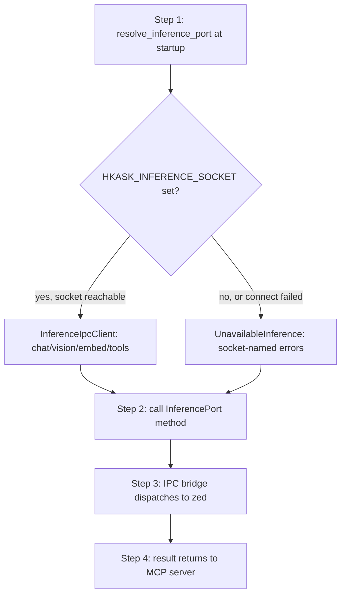

# hkask-inference — Tutorial: Routing Your First Inference Request

This tutorial walks through how an inference request flows from an MCP server
to zed's `LanguageModelRegistry`. `hkask-inference` is an IPC-bridge facade:
the MCP server child process holds no API keys and speaks no HTTP. It calls
`resolve_inference_port()` (or `resolve_ports()`) at startup, which returns
an `InferenceIpcClient`-backed `Arc<dyn InferencePort>` when the Unix socket
(`HKASK_INFERENCE_SOCKET`) is reachable, or a socket-named `Unavailable*` stub
when it is not.

- `InferenceIpcClient` — the single path in zed-kask. Delegates chat, vision,
  embedding, tool dispatch, and worktree spawn to zed's
  `LanguageModelRegistry` over a Unix socket. The zed process holds the API
  keys and the guard; the MCP server child process holds none.
- `UnavailableInference` — the fallback when the IPC socket is unavailable.
  Every method returns a `Connection` error naming the missing socket —
  never an empty success.

## Learning path

<!-- DIAGRAM_ALIGNMENT
id: DIAG-INF-001
verified_date: 2026-08-20
verified_against: kask/crates/hkask-inference/src/hkask_inference.rs:54-102
status: VERIFIED
-->

## Step 1: Resolve the inference port at startup

An MCP server calls `resolve_inference_port()` (`hkask_inference.rs:93`) once
at startup. The function calls `connect_bridge("MCP inference")`
(`hkask_inference.rs:54`), which tries `InferenceIpcClient::from_env()`
(`inference_ipc_client.rs:197`); if `HKASK_INFERENCE_SOCKET` is set and the
socket is reachable, it returns an `Arc<dyn InferencePort>` backed by the IPC
bridge client. If the env var is unset, or the socket connection fails, it
returns an `UnavailableInference` stub. Each branch logs at `info` or `warn`
level so the operator can verify the routing from server startup logs.

Servers that need more than one port should call `resolve_ports()`
(`hkask_inference.rs:289`) instead — it connects once and clones the single
client into `InferencePorts { inference, tool_dispatch, worktree_spawn }`
(`hkask_inference.rs:276`).

## Step 2: Call an InferencePort method

With the resolved `Arc<dyn InferencePort>`, the MCP server calls one of the
trait methods defined by `hkask_types::InferencePort`:

- `generate`, `generate_with_model`, `generate_with_messages`,
  `generate_stream` — chat completion.
- `generate_vision` — multimodal image input.
- `embed` — text embeddings.
- `list_models` — enumerate available models.

Every call is serialized as a newline-delimited JSON `InferenceRequest` and
sent over the Unix socket; the response is a single `InferenceResponse` line
correlated by `id`. On the `UnavailableInference` fallback, every method
returns a `Connection` error naming the missing socket — `list_models`
returns `Err` (not `Ok(Vec::new())`) so a missing bridge is not misread as an
empty model registry.

## Step 3: The IPC bridge dispatches to zed

`InferenceIpcClient` owns the transport skeleton in the private
`ipc_roundtrip` (`inference_ipc_client.rs:218`): it serializes the request,
acquires the stream lock, writes the line + flush, reads one capped response
line, deserializes, and verifies the correlation `id`. On every error branch
the cached stream is nulled so the next call reconnects instead of retrying
on a dead or half-consumed connection. The private per-method wrappers
(`call`, `call_embed`, `call_list_models`) classify the `InferenceOutcome` to
the right success type and reject mismatched outcomes with a `Connection`
error.

zed's `LanguageModelRegistry` resolves the provider prefix
(`OpenRouter/`, `ollama/`, `RunPod/`) in the model name to the configured
provider and credentials. The MCP server does not need to know how zed maps
prefixes to credentials; it just sends a model name.

## Step 4: Result returns to the MCP server

The `InferenceResult` (or `Vec<Vec<f32>>` for embeddings) is returned to the
caller. Errors propagate as `InferenceError` (chat/vision) or
`EmbeddingGenerationError` (embeddings), with the `Connection` variant
carrying a clear message naming the missing socket or failed provider so the
operator can distinguish "not configured" from "configured but broken."

## See also

- [hkask-inference Reference](./reference.md): class diagram and the full
  citation table.
- [hkask-inference How-to](./how-to.md): wiring an MCP server to the bridge
  and adding a chat provider.
- [hkask-inference Explanation](./explanation.md): why the IPC bridge is the
  single path and why the stubs are never silent.

---

[^hexagonal]: Cockburn, A. (2005). *Hexagonal Architecture.* <https://alistair.cockburn.us/hexagonal-architecture/>. The `InferencePort` boundary that lets the IPC-bridge client and the unavailable stub be swapped at startup.