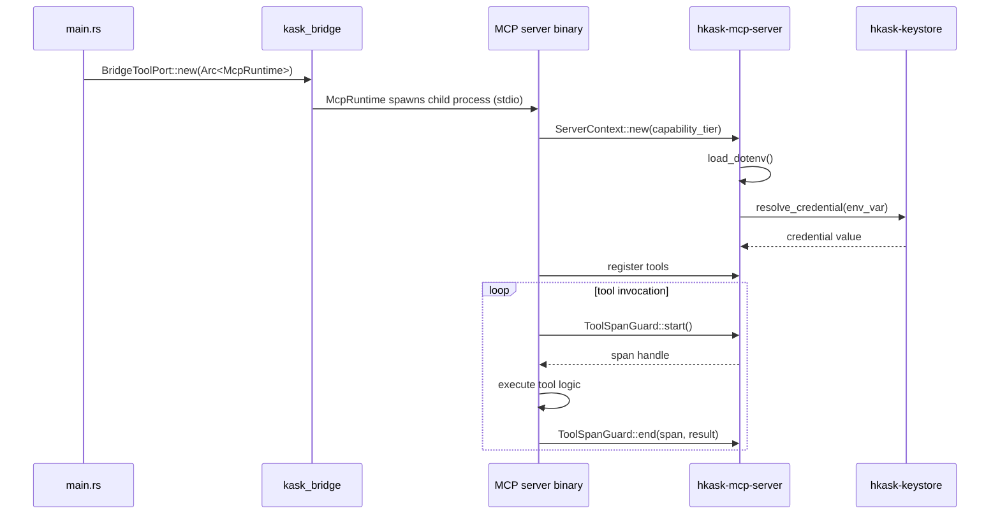

# hkask-mcp-server — Explanation

The MCP server framework exists to standardize how hKask's 10 MCP servers are
built. Without a shared framework, each server would reimplement validation,
credential resolution, span emission, and error handling. The framework
centralizes these concerns so that server authors focus on tool logic, not
infrastructure. The tradeoff is a shared dependency: a change to the framework
affects all 10 servers.

## Source citations

| Symbol | Location |
|--------|----------|
| `ServerContext` | `kask/crates/hkask-mcp-server/src/server/context.rs:123` |
| `ToolSpanGuard` | `kask/crates/hkask-mcp-server/src/server/tool_span.rs:17` |
| `ToolContext` trait | `kask/crates/hkask-mcp-server/src/server/tool_span.rs:215` |
| `resolve_credential` | `kask/crates/hkask-mcp-server/src/server/credentials.rs:54` |
| `validate_identifier` | `kask/crates/hkask-mcp-server/src/server/validation.rs:13` |
| `bootstrap_mcp_server` | _Removed_ — the `HKASK_MCP_HOST` / userpod identity concept was deleted; servers now derive identity from `ServerContext.webid` (resolved from `HKASK_WEBID`). See `kask/crates/hkask-mcp-server/src/server/context.rs:123` and the test comment at `kask/crates/hkask-mcp-server/src/hkask_mcp_server.rs:184`. |

## Launch sequence

Each MCP server is launched as a child process communicating over stdio. The
sequence below shows the launch path from the composition root through the
framework initialization.

<!-- DIAGRAM_ALIGNMENT
id: DIAG-DIA-MCP-002
verified_date: 2026-07-27
verified_against: kask/crates/hkask-mcp-server/src/server/context.rs:123; kask/crates/hkask-mcp-server/src/server/tool_span.rs:17,215; kask/crates/hkask-mcp-server/src/server/credentials.rs:54
status: VERIFIED
-->

## Why stdio transport

The MCP servers use stdio transport rather than HTTP. This is deliberate.
Stdio transport means the server process is a child of the zed-kask process,
which gives the composition root control over the server lifecycle. When
zed-kask exits, the child processes exit. No port allocation is needed, no
daemon management is required, and no network surface is exposed.

The tradeoff is that stdio transport limits the server to a single consumer.
This is acceptable because each MCP server is launched per-project by the
`ContextServerStore`, and the governed dispatch path uses the `McpRuntime`
which launches its own copies.

## Why span guards

The `ToolSpanGuard` (`tool_span.rs:17`) wraps every tool invocation in a
`reg.tool.*` span. The span records the tool name, the start time, the end
time, and the result. This is the P9 feedback-loop requirement: every
governed action must emit an observable span that the Regulation system can
consume.

Without the span guard, tool invocations would be invisible to Regulation.
The guard is a RAII type, so the span is emitted even if the tool panics or
returns an error.

## See also

- [hkask-mcp-server Reference](./reference.md): class diagram of the server
  context, tool context, and validation helpers.
- [`kask/docs/reference/mcp-servers/README.md`](../../reference/mcp-servers/README.md):
  the 10 MCP servers built on this framework.
- [kask_bridge Explanation](../kask_bridge/explanation.md): the composition
  root that launches MCP servers.

---

[^mcp-spec]: Anthropic. (2024). *Model Context Protocol Specification.* <https://modelcontextprotocol.io/specification>. The MCP protocol specification that the stdio transport implements.

[^raii]: Stroustrup, B. (1994). *The Design and Evolution of C++.* Addison-Wesley. <https://www.stroustrup.com/dne.html>. The RAII pattern that the `ToolSpanGuard` uses to guarantee span emission.
