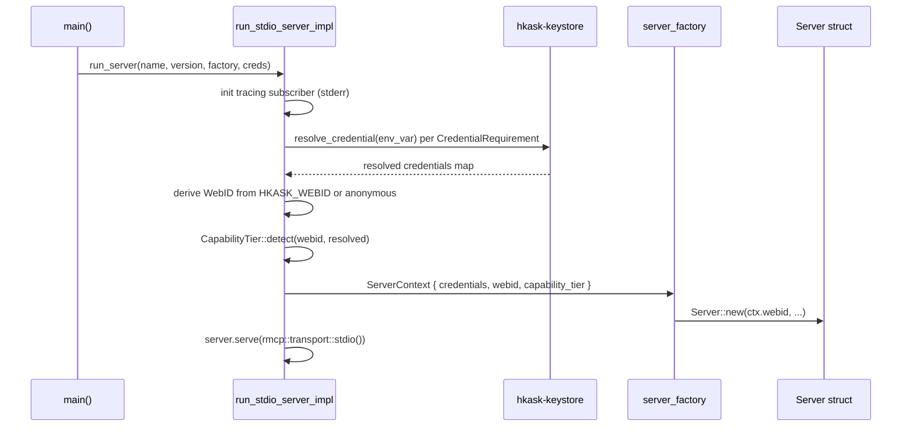

# hkask-mcp-server — Explanation: Why the Framework Looks Like This

This document explains the design decisions behind `hkask-mcp-server`, not
how to use them. The framework is intentionally narrow: it provides bootstrap,
context, span emission, validation, and error classification — and almost
nothing else. Each decision below traces to a concrete constraint in the
codebase.

## Why no ambient authority — identity and credentials flow through `ServerContext`

The framework's central rule is that a server never reads `std::env::var`
directly for identity or secrets. The bootstrap resolves everything and
hands the result to the factory as a `ServerContext` (`transport.rs:19-22`,
`context.rs:133-142`).



<!-- DIAGRAM_ALIGNMENT
id: DIAG-MCPSRV-030
verified_date: 2026-08-13
verified_against: kask/crates/hkask-mcp-server/src/server/transport.rs:84-192
status: VERIFIED
-->

The reason is testability and safety. If a server reads `std::env::var`
directly, tests have to mutate the process environment (which is global and
race-prone), and production code can silently pick up ambient config that
was never declared. By forcing every dep through the constructor, the
framework makes the credential set explicit and the server a pure function
of its `ServerContext`. The factory pattern additionally ensures server
constructors that need credentials only run AFTER credential availability
is confirmed — a missing required credential fails fast with
`McpError::MissingCredentials` before the server struct is even built
(`transport.rs:118-131`).

## Why two operating modes — Embedded vs Standalone

`CapabilityTier::detect` computes three booleans from the resolved WebID
and credentials (`context.rs:91-104`). Two operating modes emerge:

- **Embedded** — the server was launched by the hKask runtime, which injects
  a real WebID via `HKASK_WEBID`. The WebID is non-anonymous, the keystore is
  reachable, persistence is available, and Regulation consumes the `reg.tool`
  spans.
- **Standalone** — the server runs in an IDE with no `HKASK_WEBID`. The
  WebID is anonymous (`WebID::from_persona(b"anonymous")`), the keystore may
  be unavailable, persistence is unavailable, and spans go to stderr via the
  tracing subscriber.

The `embedded` flag is computed by comparing the WebID against the anonymous
persona, not by probing the credential map (`context.rs:79-96`). The reason:
`HKASK_WEBID` is an identity (non-secret), not a credential, and is injected
via `config_env`, not `credentials`. Probing the credential map for it would
conflate identity with secrets and break the anonymous fallback for
standalone IDE use.

There is no `reg_available()` wrapper — it was removed. The `embedded`
field is the capability signal: Regulation spans are meaningful only when
the runtime is there to consume them, so consumers read `embedded` directly.
In standalone mode the spans still emit (via tracing to stderr), so a
developer running the server in an IDE still sees the tool-outcome
telemetry, but the Regulation loop does not act on them.

## Why the `mcp_server!` macro instead of a trait

Every hKask MCP server needs: a `webid: WebID` field, a constructor, and a
`ToolContext` impl that returns `&self.webid`. The `mcp_server!` macro
generates all three from a single declaration (`hkask_mcp_server.rs:128-181`).

The alternative — a trait with a default impl — would require the struct to
forward to a helper, and the `webid` field would still have to be declared
by hand. The macro is shorter, the generated code is uniform across servers,
and `impl_tool_context!` is reusable on its own for servers that cannot use
the full macro (`hkask_mcp_server.rs:102-111`).

The macro is deliberately not a derive: a derive would need a helper
attribute crate and would couple the framework to the proc-macro toolchain.
A `macro_rules!` macro is hygienic, compiles in the same crate, and is
debuggable with `cargo expand`.

## Why `ToolSpanGuard` is RAII

The guard emits a `reg.tool` span on `Drop` if neither `ok` nor `error` was
called (`tool_span.rs:119-134`). This is the safety net for the case where a
tool panics or early-returns without finishing the span — the operator still
sees a `dropped` span with the tool name and duration, rather than a silent
gap in the telemetry.

```mermaid
stateDiagram-v2
    [*] --> Created: ToolSpanGuard::new
    Created --> Ok: span.ok(output)
    Created --> Error: span.error(kind, output)
    Created --> Dropped: Drop without ok/error
    Ok --> [*]: span emitted, outcome=ok
    Error --> [*]: span emitted, outcome=error
    Dropped --> [*]: span emitted, outcome=dropped (warning)
```

<!-- DIAGRAM_ALIGNMENT
id: DIAG-MCPSRV-031
verified_date: 2026-08-20
status: VERIFIED
-->

The `emitted` flag prevents double-emission: `ok`/`error`/`finish` set it to
`true` before emitting, so `Drop` sees the flag and skips
(`tool_span.rs:62, 81, 122`).

## Why `execute_tool_semantic` warns on `None` ontology

`execute_tool_semantic` accepts `Option<&'static str>` for the ontology
concept. When the caller passes `None`, it emits a `tracing::warn!` naming
the tool (`tool_span.rs:212-220`). This is an algedonic signal — a registered
tool that lacks an ontology anchor is visible at runtime, not silently
producing an untagged span.

The reason is the S1→S5 feedback channel. The Regulation loop routes
feedback by ontology type; an untagged span is a blind spot. Rather than
silently emitting an untagged span (which the loop would ignore), the
framework makes the gap loud so a maintainer adds an arm to the server's
`ontology_anchor` fn. The concept must be a `&'static str` from
`hkask-bridge-ontology` so the type system prevents arbitrary debug strings
from masquerading as ontology concepts (`tool_span.rs:36-55`).

## Why two error layers — `McpError` and `McpToolError`

The framework has two distinct error types because the two failure domains
have different audiences.

- `McpError` (`error.rs:17-37`) is for server-level failures: missing
  credentials, storage, transport. The audience is the operator starting the
  server. These errors stop the server before it serves a single request.
- `McpToolError` (`error.rs:48-54`) is for tool-level failures: a tool was
  invoked and the invocation failed with a semantic classification. The
  audience is the MCP client (and the agent behind it). These errors are
  serialized into the MCP wire format and returned as the tool result.

`McpToolError` carries a `kind: McpErrorKind` so the client can branch on the
classification (`not_found`, `permission_denied`, `rate_limited`, …) rather
than parsing a free-text message. The wire format is pinned by golden-string
pinned by the `to_json_string` implementation (`error.rs:127-129`) itself —
the former golden-string tests at `server/mod.rs:106-140` were removed with
the `mod.rs` rename; the only tests in the crate are the SSRF unit tests in
`security.rs`.

## Why per-variant error mappers instead of `internal(format!(...))`

The framework ships four canonical mappers: `map_io_error`, `map_join_error`,
`map_infra_error`, `map_memory_store_error` (`validation.rs:82-162`). Each
maps specific source-error variants to caller-fixable `McpToolError` kinds
(`not_found`, `permission_denied`, `unavailable`) rather than flattening
everything to `internal`.

The reason is client experience. If a user supplies a missing path, the
client should see `not_found` (caller-fixable: supply the right path), not
`internal` (which reads as a server bug). The blanket
`McpToolError::internal(format!("...: {e}"))` pattern mis-classifies
caller-fixable errors as Internal and hides transient connection failures
behind a generic message. The mappers are the canonical way to avoid that.

## Why path containment is enforced in the framework, not the tool

`contain_for_read`, `contain_for_write`, and `read_capped` canonicalize a
caller-supplied path and reject anything that escapes the process cwd
(`validation.rs:222-282`). The containment is in the framework, not left to
each tool, because the threat model is uniform: every tool that reads or
writes a caller-supplied path has the same CWE-22/CWE-73/CWE-200/CWE-400
exposure. Centralizing the check means a tool author cannot forget it.

`contain_for_write` canonicalizes leniently (the target may not exist yet)
while `contain_for_read` requires the target to exist
(`validation.rs:222-247`). The asymmetry matches the two operations: a write
target is created by the write, a read target must already be there.
`read_capped` adds a metadata size check before the read to bound memory
(`validation.rs:261-282`), with `MAX_READ_BYTES = 32 MiB` as the default
(`validation.rs:166`).

## Why URL validation has two modes

`validate_tool_url_with_dns` is the strict default for untrusted URLs: it
runs sync scheme/credential/literal-IP checks then resolves the hostname and
rejects private/loopback resolved IPs (`security.rs:240`).
`validate_tool_url_permissive` allows private IPs and loopback
(`security.rs:251`). Both wrappers live in `security.rs`, not `validation.rs`.

The reason is that not every URL is untrusted. A user-curated RSS
subscription list may legitimately point at `http://localhost:4000/feed.xml`
(a self-hosted aggregator). Forcing the strict check there would break a
real workflow. The permissive variant is opt-in and documented as
unsuitable for arbitrary untrusted input (`security.rs:42-50`).

A TOCTOU between DNS resolution and the downstream `reqwest` connect (DNS
rebinding) remains; closing that requires a custom reqwest connector that
re-checks the resolved IP at connect time (see the `validate_url_with_dns`
doc comment, `security.rs:138-203`). The framework documents the gap rather
than pretending the check is complete.

## Why `AnyJsonValue` is re-exported from `hkask-types`

`AnyJsonValue` and `find_boolean_schema_positions` are re-exported from
`hkask_types::tool_schema` at the lib root (`hkask_mcp_server.rs:36`). The
canonical implementation lives in `hkask-types` so pure domain crates (e.g.
`hkask-condenser`) can use them without depending on `hkask-mcp-server`, which
drags in `rmcp`, `reqwest`, `hkask-keystore`, `hkask-storage`, and
`tracing-subscriber` as transitive deps. The dedicated `tool_schema` module
file was inlined as a `pub use` here — the `tool_schema::` path had no
external users.

The reason is dependency hygiene. Tool input schemas accepting arbitrary
JSON need a type that `schemars` renders as a proper open-ended schema (not
the bare `true` that `serde_json::Value` produces, which breaks
strict-schema providers). Putting that type in `hkask-types` keeps the
dependency graph acyclic and lets domain crates stay light.

## Why DB paths follow `mcp/{server_id}/{purpose}.db`

Per D28, MCP server database paths follow the `mcp/{server_id}/{purpose}.db`
pattern. The framework does not hardcode the path — it reads whatever env
var the server declares (typically `HKASK_DB_PATH`) from the credentials map
(`context.rs:165-174`). The path convention is enforced by the runtime that
sets the env var, not by the framework, so a server stays agnostic to where
its database lives and the runtime can relocate databases without touching
server code.

`ServerContext::open_database` falls back to an in-memory database when the
env var is unset (`context.rs:172`), so a server runs in standalone mode
without persistence and in embedded mode with a real database, all from the
same code path.

## Source citations

| Claim | File:line |
|-------|-----------|
| No ambient authority, factory pattern | `kask/crates/hkask-mcp-server/src/server/transport.rs:19-22` |
| `ServerContext` carries all deps | `kask/crates/hkask-mcp-server/src/server/context.rs:133-142` |
| Missing required credential fails fast | `kask/crates/hkask-mcp-server/src/server/transport.rs:118-131` |
| `CapabilityTier::detect` computes three booleans | `kask/crates/hkask-mcp-server/src/server/context.rs:91-104` |
| `embedded` compares WebID to anonymous persona | `kask/crates/hkask-mcp-server/src/server/context.rs:79-96` |
| `reg_available` returns `embedded` | `kask/crates/hkask-mcp-server/src/server/context.rs:128-130` |
| `mcp_server!` macro generates struct + ctor + ToolContext | `kask/crates/hkask-mcp-server/src/hkask_mcp_server.rs:128-181` |
| `impl_tool_context!` reusable standalone | `kask/crates/hkask-mcp-server/src/hkask_mcp_server.rs:102-111` |
| `ToolSpanGuard::Drop` emits dropped span | `kask/crates/hkask-mcp-server/src/server/tool_span.rs:119-134` |
| `emitted` flag prevents double-emission | `kask/crates/hkask-mcp-server/src/server/tool_span.rs:63, 82, 121` |
| `execute_tool_semantic` warns on `None` ontology | `kask/crates/hkask-mcp-server/src/server/tool_span.rs:212-220` |
| Ontology concept must be `&'static str` | `kask/crates/hkask-mcp-server/src/server/tool_span.rs:36-55` |
| `McpError` server-level audience | `kask/crates/hkask-mcp-server/src/server/error.rs:13-37` |
| `McpToolError` tool-level audience | `kask/crates/hkask-mcp-server/src/server/error.rs:48-54` |
| Wire-format golden-string tests | `kask/crates/hkask-mcp-server/src/server/mod.rs:106-140` |
| Per-variant error mappers | `kask/crates/hkask-mcp-server/src/server/validation.rs:82-162` |
| Path containment in framework | `kask/crates/hkask-mcp-server/src/server/validation.rs:222-282` |
| `MAX_READ_BYTES` default | `kask/crates/hkask-mcp-server/src/server/validation.rs:166` |
| Two URL validation modes | `kask/crates/hkask-mcp-server/src/server/validation.rs:303-324` |
| `UrlValidationConfig::permissive` rationale | `kask/crates/hkask-mcp-server/src/security.rs:42-50` |
| TOCTOU DNS rebinding caveat | `kask/crates/hkask-mcp-server/src/server/validation.rs:289-294` |
| `AnyJsonValue` re-export rationale | `kask/crates/hkask-mcp-server/src/tool_schema.rs:1-18` |
| `open_database` in-memory fallback | `kask/crates/hkask-mcp-server/src/server/context.rs:165-174` |
