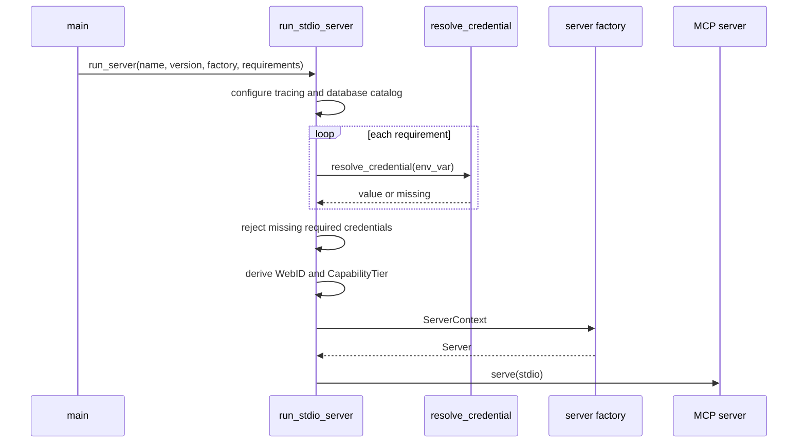

# hkask-mcp-server — Explanation: Why the Framework Is Narrow

`hkask-mcp-server` centralizes construction context, typed tool outcomes, input safety, credential resolution, and stdio bootstrap. It intentionally leaves domain behavior in each MCP server. This keeps the common layer small enough to enforce cross-server invariants without becoming a second application runtime (`kask/crates/hkask-mcp-server/src/hkask_mcp_server.rs:3-11`, `kask/crates/hkask-mcp-server/src/server.rs:22-48`).

## Why construction flows through `ServerContext`

`run_stdio_server` resolves declared credentials and identity before it calls the server factory (`kask/crates/hkask-mcp-server/src/server/transport.rs:68-118`). The factory receives `ServerContext { credentials, webid, capability_tier }` (`kask/crates/hkask-mcp-server/src/server/context.rs:126-135`). This makes the server's declared dependencies visible and prevents constructors from running before required credentials have been checked.



<!-- DIAGRAM_ALIGNMENT
id: DIAG-MCPSRV-030
verified_date: 2026-09-15
verified_against: kask/crates/hkask-mcp-server/src/hkask_mcp_server.rs:37-54; kask/crates/hkask-mcp-server/src/server/transport.rs:42-129; kask/crates/hkask-mcp-server/src/server/context.rs:126-135
status: VERIFIED
-->

The boundary is not a claim that no framework code reads environment variables. Bootstrap and credential helpers must read launch configuration (`kask/crates/hkask-mcp-server/src/server/transport.rs:50-60`, `kask/crates/hkask-mcp-server/src/server/transport.rs:91-103`; `kask/crates/hkask-mcp-server/src/server/credentials.rs:25-59`). The design claim is narrower: domain server construction receives resolved dependencies through context rather than independently inventing resolution chains.

## Why capability detection is descriptive

`CapabilityTier::detect` reports three observed startup properties: whether the WebID is non-anonymous, whether the keychain responds, and whether resolved credentials include `HKASK_DB_PASSPHRASE` (`kask/crates/hkask-mcp-server/src/server/context.rs:56-74`, `kask/crates/hkask-mcp-server/src/server/context.rs:76-123`). It does not authorize tools. The fields let a server describe embedded identity, keychain reachability, and persistence configuration without hiding how those conclusions were reached.

Persistence detection uses the shared database passphrase, not a database-path variable (`kask/crates/hkask-mcp-server/src/server/context.rs:97-107`). Database opening remains explicit: `ServerContext::open_database` uses the named path from the credential map or creates an in-memory database when the path is absent (`kask/crates/hkask-mcp-server/src/server/context.rs:137-164`).

## Why `mcp_server!` is a macro

Every server needs a WebID field, a constructor, and `ToolContext::webid`. `mcp_server!` emits those pieces together, while `impl_tool_context!` remains available for an existing struct (`kask/crates/hkask-mcp-server/src/hkask_mcp_server.rs:78-96`, `kask/crates/hkask-mcp-server/src/hkask_mcp_server.rs:98-165`). A `macro_rules!` expansion avoids a proc-macro crate and makes the generated shape uniform.

The macro does not register tools or a server globally. Tool discovery remains rmcp's responsibility, and the canonical built-in server registry remains in `kask_bridge` (`kask/crates/hkask-mcp-server/src/hkask_mcp_server.rs:13-17`).

## Why `execute_tool` preserves typed errors

`execute_tool` accepts business logic returning `Result<Value, McpToolError>` and itself returns `Result<String, McpToolError>` (`kask/crates/hkask-mcp-server/src/server/tool_span.rs:145-170`). Successful values are serialized as `{"content": value}` (`kask/crates/hkask-mcp-server/src/server/tool_span.rs:62-74`). Errors remain `Err`, so rmcp sets `is_error: true`, emits the human message as text, and puts `{"error", "kind"}` in structured content (`kask/crates/hkask-mcp-server/src/server/error.rs:130-155`).

This avoids in-band error sniffing. A client can use protocol error state and the `McpErrorKind` value rather than parse prose. The Model Context Protocol explicitly distinguishes error tool results from successful content.[^mcp]

## Why `ToolSpanGuard` uses RAII

The private guard records start time and caller identity. `ok` and `error` mark it emitted; `Drop` emits `dropped` when neither completion method ran (`kask/crates/hkask-mcp-server/src/server/tool_span.rs:9-30`, `kask/crates/hkask-mcp-server/src/server/tool_span.rs:32-60`, `kask/crates/hkask-mcp-server/src/server/tool_span.rs:92-106`). RAII ensures abnormal control flow still leaves an observability signal, following Rust's scope-bound cleanup model.[^drop]

```mermaid
stateDiagram-v2
    [*] --> Created: ToolSpanGuard::new
    Created --> Ok: finish(Ok(value))
    Created --> Error: finish(Err(error))
    Created --> Dropped: Drop before finish
    Ok --> [*]: outcome=ok
    Error --> [*]: outcome=error, error_kind set
    Dropped --> [*]: outcome=dropped
```

<!-- DIAGRAM_ALIGNMENT
id: DIAG-MCPSRV-031
verified_date: 2026-09-15
verified_against: kask/crates/hkask-mcp-server/src/server/tool_span.rs:9-119,145-170
status: VERIFIED
-->

The emitted `reg.tool` event has exactly five structured fields: `tool`, `outcome`, `duration_ms`, `error_kind`, and `caller` (`kask/crates/hkask-mcp-server/src/server/tool_span.rs:108-119`).

## Why child telemetry and production recording are separate

The `reg.tool` event is written to child stderr for observability. The framework states that zed's context-server client does not feed that event into the Regulation loop; production outcomes are recorded at client-side dispatch by `McpRuntime::invoke` and `ContextServerTool::run` (`kask/crates/hkask-mcp-server/src/server/tool_span.rs:123-139`).

That separation gives each side the information it actually owns. The server knows duration, typed local failure, and caller identity. The client knows whether dispatch was admitted and how the invocation participates in the host's regulation cycle.

## Why there are two error layers

`McpError` represents server startup and infrastructure failures: missing required credentials, database passphrase, storage, infrastructure, and transport (`kask/crates/hkask-mcp-server/src/server/error.rs:11-42`). `McpToolError` represents a completed tool dispatch with a typed `McpErrorKind` and message (`kask/crates/hkask-mcp-server/src/server/error.rs:44-51`).

The split matches two recovery scopes:

- startup failures are handled by the operator or launcher;
- tool failures are returned to the MCP client, which can react to `not_found`, `invalid_argument`, `permission_denied`, `rate_limited`, `failed_precondition`, `unavailable`, or `internal` (`kask/crates/hkask-mcp-server/src/server/error.rs:53-127`).

Canonical error mappers preserve caller-fixable and transient categories instead of flattening them to `internal` (`kask/crates/hkask-mcp-server/src/server/validation.rs:71-163`).

## Why path and URL safety live in the framework

Caller-controlled files and URLs present the same threat classes in every server. Shared helpers therefore enforce them once:

- path validation rejects control characters and parent traversal (`kask/crates/hkask-mcp-server/src/server/validation.rs:36-69`);
- containment permits only the process working directory, hKask data directory, or artifact directory after canonicalization (`kask/crates/hkask-mcp-server/src/server/validation.rs:253-328`);
- capped reads check metadata size before reading (`kask/crates/hkask-mcp-server/src/server/validation.rs:472-498`);
- strict URL validation checks syntax and literal addresses, then resolves DNS and checks every result (`kask/crates/hkask-mcp-server/src/security.rs:185-266`, `kask/crates/hkask-mcp-server/src/security.rs:334-354`).

These controls address path traversal, arbitrary file access, resource exhaustion, and server-side request forgery.[^cwe22][^cwe918] Connect-time consumers can pair literal URL validation with `validate_resolved_addresses` to close the DNS resolve-to-connect gap (`kask/crates/hkask-mcp-server/src/security.rs:366-395`).

## Why arbitrary JSON has a dedicated type

The root re-exports `AnyJsonValue` and `find_boolean_schema_positions` from `hkask_types::tool_schema` (`kask/crates/hkask-mcp-server/src/hkask_mcp_server.rs:29-35`). `AnyJsonValue` gives schema-generating tool inputs an explicit open JSON shape instead of relying on a bare `serde_json::Value` schema. Keeping the type in `hkask-types` lets non-MCP domain crates use it without depending on the server framework.

## See also

- [Tutorial: build your first MCP server](./tutorial.md)
- [How-to: common server tasks](./how-to.md)
- [Reference: current API surface](./reference.md)

---

[^mcp]: Model Context Protocol. (2025). *Tools.* <https://modelcontextprotocol.io/specification/2025-06-18/server/tools>.
[^drop]: The Rust Project Developers. (n.d.). *std::ops::Drop.* <https://doc.rust-lang.org/std/ops/trait.Drop.html>.
[^cwe22]: MITRE. (n.d.). *CWE-22: Improper Limitation of a Pathname to a Restricted Directory.* <https://cwe.mitre.org/data/definitions/22.html>.
[^cwe918]: MITRE. (n.d.). *CWE-918: Server-Side Request Forgery.* <https://cwe.mitre.org/data/definitions/918.html>.
