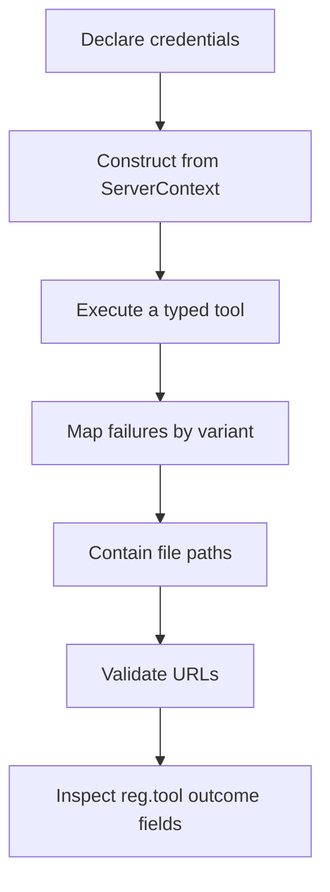

# hkask-mcp-server — How-to: Common Server Tasks

Use these independent recipes when extending an hKask MCP server. Each recipe points to the current public entry point and its implementation.

## Task map



<!-- DIAGRAM_ALIGNMENT
id: DIAG-MCPSRV-010
verified_date: 2026-09-15
verified_against: kask/crates/hkask-mcp-server/src/server/context.rs:9-53,126-190; kask/crates/hkask-mcp-server/src/server/tool_span.rs:108-170; kask/crates/hkask-mcp-server/src/server/validation.rs:5-169,253-328,472-498; kask/crates/hkask-mcp-server/src/security.rs:334-395
status: VERIFIED
-->

## Declare required and optional credentials

```rust
use hkask_mcp_server::CredentialRequirement;

let requirements = vec![
    CredentialRequirement::required("SERVICE_API_KEY", "Service API key"),
    CredentialRequirement::optional("SERVICE_CACHE_PATH", "Persistent cache path"),
];
```

`required` and `optional` set the `required` field to `true` and `false`, respectively (`kask/crates/hkask-mcp-server/src/server/context.rs:24-53`). Bootstrap resolves every requirement and rejects the complete missing-required set before calling the factory (`kask/crates/hkask-mcp-server/src/server/transport.rs:68-89`).

API keys resolve from environment variables. `HKASK_DB_PASSPHRASE` alone uses the dedicated hKask keystore resolver (`kask/crates/hkask-mcp-server/src/server/credentials.rs:8-59`).

## Open a database from `ServerContext`

```rust
let database = ctx.open_database("SERVICE_DB_PATH")?;
```

When the named path exists in `ctx.credentials`, the helper resolves the shared passphrase and opens that database. When the path is absent, it opens an in-memory database (`kask/crates/hkask-mcp-server/src/server/context.rs:137-164`).

For custom DDL:

```rust
let database = ctx.open_database_with_extensions(
    "SERVICE_DB_PATH",
    "CREATE TABLE IF NOT EXISTS items (id TEXT PRIMARY KEY);",
)?;
```

The extension-aware path has the same persistent/in-memory split (`kask/crates/hkask-mcp-server/src/server/context.rs:166-190`). For tools that resolve the passphrase after startup, call the root-exported `resolve_db_passphrase(&ctx.credentials)`; missing configuration is `McpToolError::permission_denied` and names the env/keychain sources (`kask/crates/hkask-mcp-server/src/server/credentials.rs:61-104`).

## Execute a tool and preserve typed errors

```rust
use hkask_mcp_server::{McpToolError, execute_tool};
use serde_json::json;

async fn status(&self) -> Result<String, McpToolError> {
    execute_tool(self, "status", async {
        Ok(json!({"ready": true}))
    })
    .await
}
```

The future must return `Result<serde_json::Value, McpToolError>`. `execute_tool` returns `Result<String, McpToolError>` (`kask/crates/hkask-mcp-server/src/server/tool_span.rs:145-170`). A successful value becomes a `{"content": value}` JSON string (`kask/crates/hkask-mcp-server/src/server/tool_span.rs:62-74`). A failure remains a typed error; rmcp marks it with `is_error: true` and includes `{"error", "kind"}` as structured content (`kask/crates/hkask-mcp-server/src/server/error.rs:130-155`).

Use the constructor that matches the recovery action:

```rust
return Err(McpToolError::not_found("record does not exist"));
```

Constructors cover `internal`, `not_found`, `invalid_argument`, `unavailable`, `permission_denied`, `rate_limited`, and `failed_precondition` (`kask/crates/hkask-mcp-server/src/server/error.rs:53-127`).

## Validate an identifier or path string

For identifiers:

```rust
use hkask_mcp_server::validate_identifier;

validate_identifier("session_id", &session_id, 256)?;
```

Allowed characters are alphanumeric, `_`, `.`, `-`, and `:`; empty and overlong inputs fail as `invalid_argument` (`kask/crates/hkask-mcp-server/src/server/validation.rs:5-34`).

For path syntax:

```rust
use hkask_mcp_server::validate_path;

validate_path("output", &output_path, 4096)?;
```

`validate_path` rejects empty/overlong values, control characters, and parent-directory components (`kask/crates/hkask-mcp-server/src/server/validation.rs:36-69`). Syntax validation does not replace containment.

## Contain and read caller-supplied files

```rust
use hkask_mcp_server::{MAX_READ_BYTES, contain_for_write, read_capped};

let destination = contain_for_write(&output_path)?;
let input = read_capped(&input_path, MAX_READ_BYTES)?;
```

`contain_for_read` and `contain_for_write` accept paths only under the process working directory, hKask data directory, or artifact directory after canonicalization (`kask/crates/hkask-mcp-server/src/server/validation.rs:253-328`). Writes may target a not-yet-created path; reads require an existing path. `read_capped` checks metadata length before reading (`kask/crates/hkask-mcp-server/src/server/validation.rs:472-498`). The default cap is 32 MiB (`kask/crates/hkask-mcp-server/src/server/validation.rs:165-169`).[^cwe22]

If the tool needs the environment-configurable cap, use `hkask_mcp_server::server::resolve_max_read_bytes()` (`kask/crates/hkask-mcp-server/src/server/validation.rs:171-201`). It warns on zero or malformed values and falls back to `MAX_READ_BYTES`.

## Validate an untrusted URL

For a normal tool input:

```rust
use hkask_mcp_server::validate_tool_url_with_dns;

validate_tool_url_with_dns(&url).await?;
```

This root-exported helper checks scheme, embedded credentials, literal destination addresses, and all DNS-resolved addresses (`kask/crates/hkask-mcp-server/src/security.rs:217-266`, `kask/crates/hkask-mcp-server/src/security.rs:341-354`).[^cwe918]

For a user-curated local URL, opt into the permissive helper:

```rust
use hkask_mcp_server::validate_tool_url_permissive;

validate_tool_url_permissive(&feed_url)?;
```

It permits private and loopback addresses and must not gate arbitrary untrusted input (`kask/crates/hkask-mcp-server/src/security.rs:48-62`, `kask/crates/hkask-mcp-server/src/security.rs:356-364`).

A redirect policy or connect-time validating resolver can use the public `server` module:

```rust
hkask_mcp_server::server::validate_tool_url_literal(&redirect_url)?;
hkask_mcp_server::server::validate_resolved_addresses(hostname, &addresses)?;
```

The first performs synchronous strict checks without DNS; the second validates the exact resolved addresses used for connection (`kask/crates/hkask-mcp-server/src/security.rs:366-395`).

## Classify HTTP and infrastructure errors

`classify_http_error` is available through the public `server` module:

```rust
return Err(hkask_mcp_server::server::classify_http_error(
    "service",
    status,
    &body,
));
```

It sanitizes the body and maps HTTP statuses to tool error kinds (`kask/crates/hkask-mcp-server/src/server/http_helpers.rs:1-27`).

For non-HTTP failures, use the root exports:

- `map_io_error`: file-not-found and permission failures remain caller-fixable (`kask/crates/hkask-mcp-server/src/server/validation.rs:71-90`);
- `map_join_error`: cancellation becomes `unavailable`, panic becomes `internal` (`kask/crates/hkask-mcp-server/src/server/validation.rs:92-104`);
- `map_infra_error`: not-found and database connection variants retain their categories (`kask/crates/hkask-mcp-server/src/server/validation.rs:106-129`);
- `map_memory_store_error`: memory/storage variants delegate to the same classification policy (`kask/crates/hkask-mcp-server/src/server/validation.rs:131-163`).

## Inspect `reg.tool` telemetry

Every `execute_tool` call emits one event on success or typed error. If its private guard is dropped before completion, `Drop` emits `dropped` (`kask/crates/hkask-mcp-server/src/server/tool_span.rs:32-60`, `kask/crates/hkask-mcp-server/src/server/tool_span.rs:92-106`).

Filter tracing output for target `reg.tool` and inspect these fields:

| Field | Value |
|---|---|
| `tool` | tool name passed to `execute_tool` |
| `outcome` | `ok`, `error`, or `dropped` |
| `duration_ms` | elapsed wall-clock milliseconds |
| `error_kind` | typed `McpErrorKind` string, empty otherwise |
| `caller` | server `ToolContext.webid()` |

The event definition is `kask/crates/hkask-mcp-server/src/server/tool_span.rs:108-119`. It is child-process observability; production Regulation outcome recording occurs in host dispatch paths (`kask/crates/hkask-mcp-server/src/server/tool_span.rs:123-139`).

## See also

- [Tutorial: build your first MCP server](./tutorial.md)
- [Explanation: why the framework is narrow](./explanation.md)
- [Reference: current API surface](./reference.md)

---

[^cwe22]: MITRE. (n.d.). *CWE-22: Improper Limitation of a Pathname to a Restricted Directory.* <https://cwe.mitre.org/data/definitions/22.html>.
[^cwe918]: MITRE. (n.d.). *CWE-918: Server-Side Request Forgery.* <https://cwe.mitre.org/data/definitions/918.html>.
