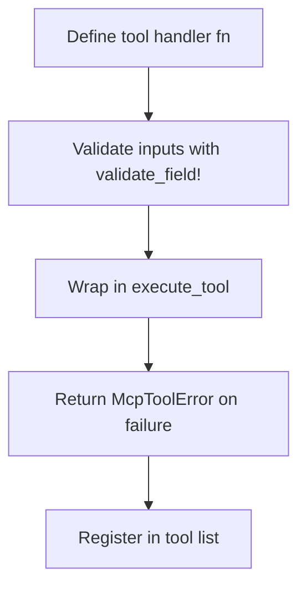

# hkask-mcp-server — How-to: Register a New Tool

This guide shows how to add a new tool to an existing MCP server built on
the `hkask-mcp-server` framework. Tools are async functions that return
`Result<Value, McpToolError>`; the framework wraps them in span guards
and handles error serialization.

## Source citations

| Symbol | Location |
|--------|----------|
| `execute_tool` | `kask/crates/hkask-mcp-server/src/server/tool_span.rs:249` |
| `execute_tool_semantic` | `kask/crates/hkask-mcp-server/src/server/tool_span.rs:266` |
| `ToolSpanGuard` | `kask/crates/hkask-mcp-server/src/server/tool_span.rs:17` |
| `ToolContext` trait | `kask/crates/hkask-mcp-server/src/server/tool_span.rs:216` |
| `validate_identifier` | `kask/crates/hkask-mcp-server/src/server/validation.rs:13` |
| `validate_path` | `kask/crates/hkask-mcp-server/src/server/validation.rs:43` |
| `validate_tool_url` | `kask/crates/hkask-mcp-server/src/server/validation.rs:82` |
| `McpToolError` | `kask/crates/hkask-mcp-server/src/server/error.rs:49` |
| `validate_field!` macro | `kask/crates/hkask-mcp-server/src/hkask_mcp_server.rs:75` |

## Procedure

<!-- DIAGRAM_ALIGNMENT
id: DIAG-DIA-MCP-004
verified_date: 2026-07-29
verified_against: kask/crates/hkask-mcp-server/src/server/tool_span.rs:17,216,249; kask/crates/hkask-mcp-server/src/server/validation.rs:13,43,82; kask/crates/hkask-mcp-server/src/server/error.rs:49; kask/crates/hkask-mcp-server/src/hkask_mcp_server.rs:75
status: VERIFIED
-->

### Step 1: Define the tool handler

Write an async function that takes the tool arguments as
`serde_json::Value` (or a typed `Parameters<T>` request) and returns
`Result<serde_json::Value, McpToolError>` (`error.rs:49`).

### Step 2: Validate inputs

Validate all inputs using the validation helpers. Use the
`validate_field!` macro (`hkask_mcp_server.rs:75`) for identifier fields
— it wraps `validate_identifier` (`validation.rs:13`) and returns early
on error. `validate_identifier` allows alphanumeric, `_`, `.`, `-`, and `:`
characters up to a max length. Use `validate_path` (`validation.rs:43`)
for filesystem paths (rejects `..` traversal and control chars) and
`validate_tool_url` (`validation.rs:82`) for URLs (http/https only, SSRF
protection).

### Step 3: Wrap in execute_tool

Wrap the handler body in `execute_tool` (`tool_span.rs:249`) or
`execute_tool_semantic` (`tool_span.rs:266`) for ontology-tagged spans.
These construct a `ToolSpanGuard` (`tool_span.rs:17`) internally, emit a
`reg.tool.*` span on completion, and call `record_tool_outcome` on the
`ToolContext` for semantic memory recording.

### Step 4: Return McpToolError on failure

Return `McpToolError` (`error.rs:49`) on validation or execution failure.
Use the constructor helpers: `McpToolError::invalid_argument(...)`,
`McpToolError::not_found(...)`, `McpToolError::permission_denied(...)`,
etc. The guard serializes the error to a JSON-RPC response automatically.

### Step 5: Register in the tool list

Register the tool name, description, and parameter schema in the server's
tool list (via the `#[tool(description = "...")]` attribute or the rmcp
tool registration mechanism).

## See also

- [hkask-mcp-server Reference](./reference.md): class diagram of the
  framework.
- [hkask-mcp-server Tutorial](./tutorial.md): your first MCP server.

---

[^mcp-spec]: Anthropic. (2024). *Model Context Protocol Specification.* <https://modelcontextprotocol.io/specification>.
