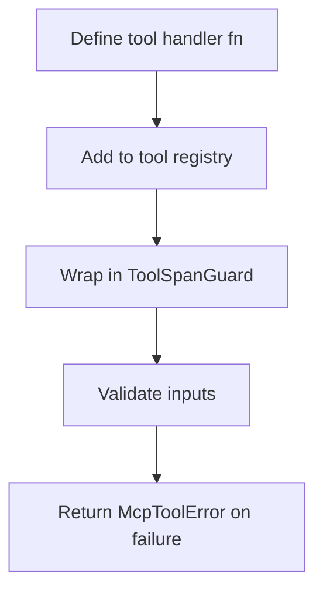

# hkask-mcp-server — How-to: Register a New Tool

This guide shows how to add a new tool to an existing MCP server built on
the `hkask-mcp-server` framework.

## Source citations

| Symbol | Location |
|--------|----------|
| `ToolSpanGuard` | `kask/crates/hkask-mcp-server/src/server/tool_span.rs:17` |
| `ToolContext` trait | `kask/crates/hkask-mcp-server/src/server/tool_span.rs:215` |
| `validate_identifier` | `kask/crates/hkask-mcp-server/src/server/validation.rs:13` |
| `McpToolError` | `kask/crates/hkask-mcp-server/src/server/error.rs:46` |

## Procedure

<!-- DIAGRAM_ALIGNMENT
id: DIAG-DIA-MCP-004
verified_date: 2026-07-27
verified_against: kask/crates/hkask-mcp-server/src/server/tool_span.rs:17,215; kask/crates/hkask-mcp-server/src/server/validation.rs:13; kask/crates/hkask-mcp-server/src/server/error.rs:46
status: VERIFIED
-->

### Step 1: Define the tool handler

Write an async function that takes the tool arguments as
`serde_json::Value` and returns `Result<serde_json::Value, McpToolError>`.

### Step 2: Add to the tool registry

Register the tool name, description, and parameter schema in the server's
tool list. The name must pass `validate_identifier` (`validation.rs:13`).

### Step 3: Wrap in ToolSpanGuard

Construct a `ToolSpanGuard` (`tool_span.rs:17`) at the start of the
handler. The guard emits a `reg.tool.*` span when it is dropped.

### Step 4: Validate inputs and return errors

Validate all inputs using the validation helpers. Return
`McpToolError` (`error.rs:46`) on validation failure.

## See also

- [hkask-mcp-server Reference](./reference.md): class diagram of the
  framework.
- [hkask-mcp-server Tutorial](./tutorial.md): your first MCP server.

---

[^mcp-spec]: Anthropic. (2024). *Model Context Protocol Specification.* <https://modelcontextprotocol.io/specification>.
