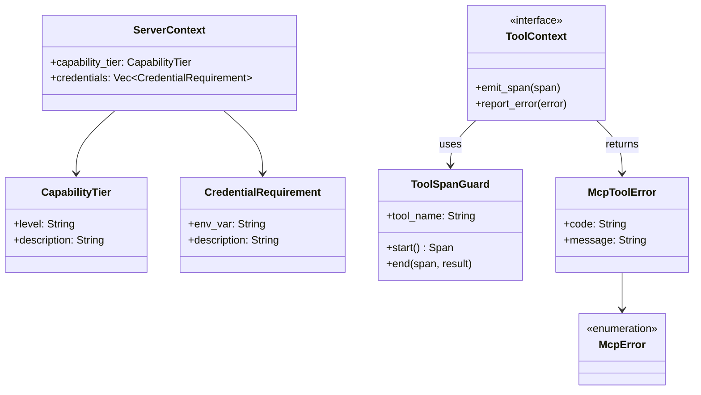

# hkask-mcp-server — Reference

`hkask-mcp-server` provides the shared framework for all 10 hKask MCP servers.
It defines the `ServerContext`, `ToolContext`, `ToolSpanGuard`, validation
helpers, credential resolution, and error types that every MCP server uses.
The framework enforces tool-name validation, path validation, URL validation,
and `reg.tool.*` span emission around every tool invocation.

## Source citations

| Symbol | Location |
|--------|----------|
| `ServerContext` | `kask/crates/hkask-mcp-server/src/server/context.rs:123` |
| `CapabilityTier` | `kask/crates/hkask-mcp-server/src/server/context.rs:67` |
| `CredentialRequirement` | `kask/crates/hkask-mcp-server/src/server/context.rs:14` |
| `ToolContext` trait | `kask/crates/hkask-mcp-server/src/server/tool_span.rs:215` |
| `ToolSpanGuard` | `kask/crates/hkask-mcp-server/src/server/tool_span.rs:17` |
| `tool_internal_error` | `kask/crates/hkask-mcp-server/src/server/tool_span.rs:292` |
| `validate_identifier` | `kask/crates/hkask-mcp-server/src/server/validation.rs:13` |
| `validate_path` | `kask/crates/hkask-mcp-server/src/server/validation.rs:43` |
| `validate_tool_url` | `kask/crates/hkask-mcp-server/src/server/validation.rs:82` |
| `validate_tool_url_permissive` | `kask/crates/hkask-mcp-server/src/server/validation.rs:99` |
| `McpError` enum | `kask/crates/hkask-mcp-server/src/server/error.rs:17` |
| `McpToolError` | `kask/crates/hkask-mcp-server/src/server/error.rs:46` |
| `classify_http_error` | `kask/crates/hkask-mcp-server/src/server/http_helpers.rs:35` |
| `load_dotenv` | `kask/crates/hkask-mcp-server/src/server/credentials.rs:18` |
| `resolve_credential` | `kask/crates/hkask-mcp-server/src/server/credentials.rs:54` |

## Server framework model

The `ServerContext` (`context.rs:123`) is the shared state that every MCP
server holds. It carries the `CapabilityTier` (`context.rs:67`) and the
`CredentialRequirement` (`context.rs:14`) declarations. The `ToolContext`
trait (`tool_span.rs:215`) provides the interface that tool implementations
use to emit spans and report errors.

<!-- DIAGRAM_ALIGNMENT
id: DIAG-DIA-MCP-001
verified_date: 2026-07-27
verified_against: kask/crates/hkask-mcp-server/src/server/context.rs:123,67,14; kask/crates/hkask-mcp-server/src/server/tool_span.rs:215,17; kask/crates/hkask-mcp-server/src/server/error.rs:17,46
status: VERIFIED
-->

## Validation helpers

Four validation functions enforce input safety. `validate_identifier`
(`validation.rs:13`) checks that a name is alphanumeric with underscores and
within a length limit. `validate_path` (`validation.rs:43`) checks that a path
does not escape its intended directory. `validate_tool_url`
(`validation.rs:82`) checks that a URL uses an allowed scheme and host.
`validate_tool_url_permissive` (`validation.rs:99`) allows a broader set of
URLs for tools that need to fetch arbitrary web content.

## Credential resolution

The `load_dotenv` function (`credentials.rs:18`) loads environment variables
from a `.env` file. The `resolve_credential` function (`credentials.rs:54`)
resolves a credential by environment variable name, falling back to the
hkask-keystore if the environment variable is not set.

## Error handling

The `McpToolError` struct (`error.rs:46`) carries a code and message. The
`McpError` enum (`error.rs:17`) classifies errors by category. The
`classify_http_error` function (`http_helpers.rs:35`) maps HTTP status codes
to `McpToolError` instances. The `tool_internal_error` function
(`tool_span.rs:292`) constructs an internal-error response with span context.

## See also

- [hkask-mcp-server Explanation](./explanation.md): sequence diagram of MCP
  server launch.
- [`kask/docs/reference/mcp-servers/README.md`](../../reference/mcp-servers/README.md):
  the 10 MCP servers that use this framework.
- [hkask-capability Reference](../hkask-capability/reference.md): the
  `ToolPort` trait that governs tool dispatch.

---

[^mcp-spec]: Anthropic. (2024). *Model Context Protocol Specification.* <https://modelcontextprotocol.io/specification>. The MCP protocol that this framework implements.
