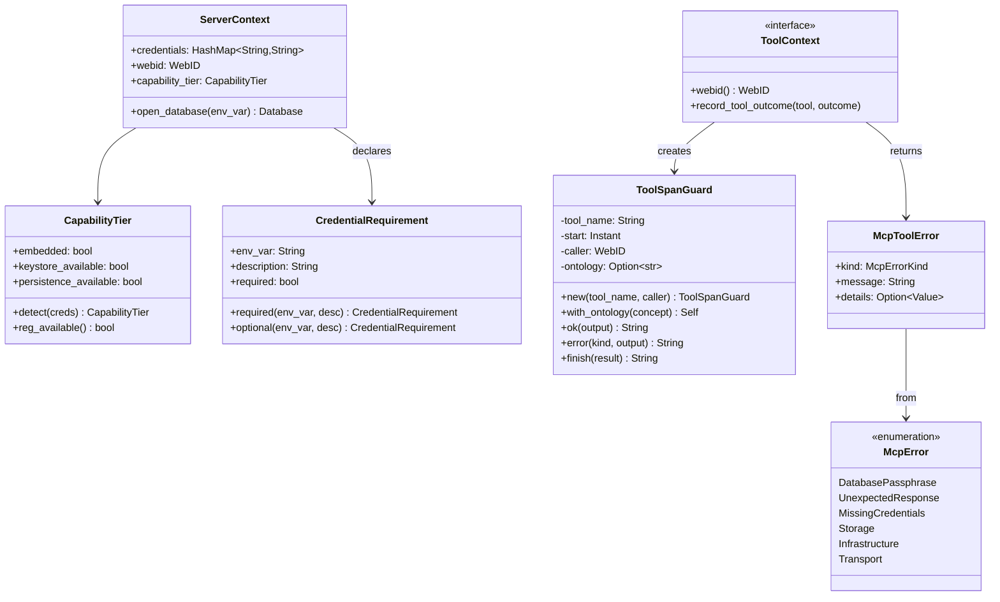

# hkask-mcp-server — Reference

`hkask-mcp-server` provides the shared framework for all hKask MCP servers.
It defines the `ServerContext`, `ToolContext`, `ToolSpanGuard`, validation
helpers, credential resolution, and error types that every MCP server uses.
The framework enforces tool-name validation, path validation, URL validation,
and `reg.tool.*` span emission around every tool invocation. Servers run
standalone over stdio, deriving agent identity from `ServerContext.webid`.

## Source citations

| Symbol | Location |
|--------|----------|
| `ServerContext` | `kask/crates/hkask-mcp-server/src/server/context.rs:123` |
| `CapabilityTier` | `kask/crates/hkask-mcp-server/src/server/context.rs:67` |
| `CredentialRequirement` | `kask/crates/hkask-mcp-server/src/server/context.rs:14` |
| `ToolContext` trait | `kask/crates/hkask-mcp-server/src/server/tool_span.rs:216` |
| `ToolSpanGuard` | `kask/crates/hkask-mcp-server/src/server/tool_span.rs:17` |
| `execute_tool` | `kask/crates/hkask-mcp-server/src/server/tool_span.rs:249` |
| `execute_tool_semantic` | `kask/crates/hkask-mcp-server/src/server/tool_span.rs:266` |
| `tool_internal_error` | `kask/crates/hkask-mcp-server/src/server/tool_span.rs:295` |
| `validate_identifier` | `kask/crates/hkask-mcp-server/src/server/validation.rs:13` |
| `validate_path` | `kask/crates/hkask-mcp-server/src/server/validation.rs:43` |
| `validate_tool_url` | `kask/crates/hkask-mcp-server/src/server/validation.rs:82` |
| `validate_tool_url_permissive` | `kask/crates/hkask-mcp-server/src/server/validation.rs:99` |
| `McpError` enum | `kask/crates/hkask-mcp-server/src/server/error.rs:17` |
| `McpToolError` | `kask/crates/hkask-mcp-server/src/server/error.rs:49` |
| `classify_http_error` | `kask/crates/hkask-mcp-server/src/server/http_helpers.rs:35` |
| `load_dotenv` | `kask/crates/hkask-mcp-server/src/server/credentials.rs:18` |
| `resolve_credential` | `kask/crates/hkask-mcp-server/src/server/credentials.rs:54` |
| `run_server` | `kask/crates/hkask-mcp-server/src/hkask_mcp_server.rs:30` |
| `run_stdio_server` | `kask/crates/hkask-mcp-server/src/server/transport.rs:33` |
| `mcp_server!` macro | `kask/crates/hkask-mcp-server/src/hkask_mcp_server.rs:127` |

## Server framework model

The `ServerContext` (`context.rs:123`) is the shared state that every MCP
server holds. It carries the resolved `credentials` map, the `webid`
(resolved from `HKASK_WEBID`, falling back to anonymous), and the
`capability_tier`. The `CapabilityTier` (`context.rs:67`) is detected at
startup from the resolved credentials — it is not configured. The
`CredentialRequirement` (`context.rs:14`) declares what a server needs.
The `ToolContext` trait (`tool_span.rs:216`) provides `webid()` for span
attribution and `record_tool_outcome()` for semantic memory recording.

<!-- DIAGRAM_ALIGNMENT
id: DIAG-DIA-MCP-001
verified_date: 2026-07-29
verified_against: kask/crates/hkask-mcp-server/src/server/context.rs:14,67,123; kask/crates/hkask-mcp-server/src/server/tool_span.rs:17,216; kask/crates/hkask-mcp-server/src/server/error.rs:17,49
status: VERIFIED
-->

## Validation helpers

Four validation functions enforce input safety. `validate_identifier`
(`validation.rs:13`) checks that a name is non-empty, within a max length,
and contains only alphanumeric, `_`, `.`, `-`, or `:` characters.
`validate_path` (`validation.rs:43`) checks that a path is non-empty,
within a max length, contains no NUL/control characters, and has no
parent-directory (`..`) traversal. `validate_tool_url` (`validation.rs:82`)
checks that a URL uses http/https with SSRF protection (delegates to
`security::validate_url` with the default strict config).
`validate_tool_url_permissive` (`validation.rs:99`) allows private IPs
and loopback for user-curated URL lists (e.g. RSS subscriptions).

## Credential resolution

The `load_dotenv` function (`credentials.rs:18`) loads environment variables
from the nearest `.env` file without mutating the process environment. The
`resolve_credential` function (`credentials.rs:54`) routes known credential
names (e.g. `HKASK_DB_PASSPHRASE`, `HKASK_OCAP_SECRET`) through the proper
hkask keystore resolvers; for unrecognized names, it falls back to keychain
lookup by env var name and then environment variable lookup.

## Error handling

The `McpToolError` struct (`error.rs:49`) carries a `kind: McpErrorKind`,
a `message: String`, and an optional `details: Value`. The `McpError` enum
(`error.rs:17`) classifies server-level failures: `DatabasePassphrase`,
`UnexpectedResponse`, `MissingCredentials`, `Storage`, `Infrastructure`,
and `Transport`. The `classify_http_error` function (`http_helpers.rs:35`)
maps HTTP status codes to `McpToolError` instances (e.g. 401/403 →
`permission_denied`, 404 → `not_found`). The `tool_internal_error`
function (`tool_span.rs:295`) constructs an internal-error response with
span context.

## Server launch

Servers are launched by calling `run_server` (`hkask_mcp_server.rs:30`),
which delegates to `run_stdio_server` (`transport.rs:33`). The bootstrap
resolves credentials, derives the WebID from `HKASK_WEBID` (falling back
to anonymous with a warning), detects the `CapabilityTier`, constructs the
`ServerContext`, calls the server factory, and serves via rmcp stdio
transport. There is no daemon — each server is a standalone child process.

## See also

- [hkask-mcp-server Explanation](./explanation.md): sequence diagram of MCP
  server launch.
- [`kask/docs/reference/mcp-servers/README.md`](../../reference/mcp-servers/README.md):
  the MCP servers that use this framework.
- [hkask-capability Reference](../hkask-capability/reference.md): the
  `ToolPort` trait that governs tool dispatch.

---

[^mcp-spec]: Anthropic. (2024). *Model Context Protocol Specification.* <https://modelcontextprotocol.io/specification>. The MCP protocol that this framework implements.
