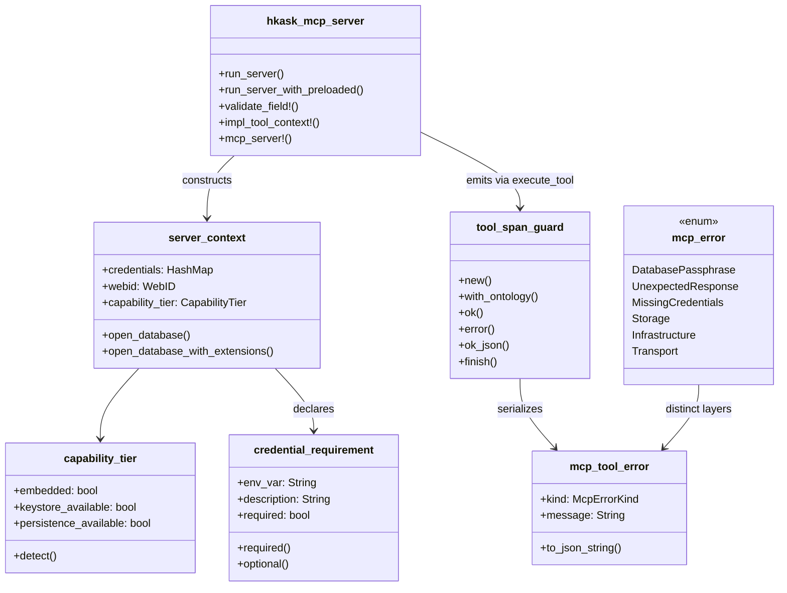

# hkask-mcp-server — Reference: API Surface

A lookup reference for the public types, functions, macros, and error
variants exported by `hkask-mcp-server`. Every entry cites the file:line
where it is defined so you can read the implementation directly. All
citations were re-derived from disk via `grep -n`.

## Module map



<!-- DIAGRAM_ALIGNMENT
id: DIAG-MCPSRV-020
verified_date: 2026-08-20
verified_against: kask/crates/hkask-mcp-server/src/hkask_mcp_server.rs:19-37
status: VERIFIED
-->

## Public re-exports

The crate root re-exports the public surface from `server/` and re-exports
`AnyJsonValue` / `find_boolean_schema_positions` directly from
`hkask_types::tool_schema` (`hkask_mcp_server.rs:19-37`). There is no
`tool_schema` module file in this crate — it was inlined as a `pub use` at the
lib root because the `tool_schema::` path had no external users.

| Symbol | Source |
|--------|--------|
| `CapabilityTier`, `CredentialRequirement`, `ServerContext` | `server/context.rs` |
| `McpError`, `McpToolError` | `server/error.rs` |
| `ToolContext`, `ToolSpanGuard`, `execute_tool`, `execute_tool_semantic` | `server/tool_span.rs` |
| `run_stdio_server`, `run_stdio_server_with_preloaded` | `server/transport.rs` |
| `load_dotenv`, `parse_env_warn`, `resolve_credential`, `resolve_db_passphrase` | `server/credentials.rs` |
| `classify_http_error` | `server/http_helpers.rs` |
| `MAX_READ_BYTES`, `resolve_max_read_bytes`, `contain_for_read`, `contain_for_write`, `read_capped` | `server/validation.rs` |
| `map_infra_error`, `map_io_error`, `map_join_error`, `map_memory_store_error` | `server/validation.rs` |
| `validate_identifier`, `validate_path` | `server/validation.rs` |
| `validate_tool_url_with_dns`, `validate_tool_url_permissive` | `security.rs` |
| `AnyJsonValue`, `find_boolean_schema_positions` | `hkask_types::tool_schema` (re-export at `hkask_mcp_server.rs:36`) |

The `server` module lives at `src/server.rs` (not `src/server/mod.rs` — the
`.rules` ban on `mod.rs`). Leaf files remain under `src/server/`:
`context.rs`, `credentials.rs`, `error.rs`, `http_helpers.rs`, `tool_span.rs`,
`transport.rs`, `validation.rs`. All SSRF validation lives in
`src/security.rs` (`pub(crate)`), with the two public wrappers
`validate_tool_url_with_dns` / `validate_tool_url_permissive` re-exported
through `server.rs`.

## Entry points

### `run_server` — `hkask_mcp_server.rs:43`

```rust
pub async fn run_server<S, F>(
    name: &str,
    version: &str,
    factory: F,
    credentials: Vec<CredentialRequirement>,
) -> Result<(), McpError>
where
    S: rmcp::ServiceExt<rmcp::RoleServer>,
    S: rmcp::Service<rmcp::RoleServer>,
    F: FnOnce(ServerContext) -> Result<S, McpError>,
```

Canonical entry point. Delegates to `run_stdio_server`. `#[must_use]`.

### `run_server_with_preloaded` — `hkask_mcp_server.rs:59`

Like `run_server` but accepts a `HashMap<String, String>` of pre-resolved
`.env` credentials. Preloaded values take precedence over `resolve_credential`
(`transport.rs:60-79`).

## Server context

### `ServerContext` — `context.rs:123-131`

```rust
pub struct ServerContext {
    pub credentials: HashMap<String, String>,
    pub webid: hkask_types::WebID,
    pub capability_tier: CapabilityTier,
}
```

No ambient authority — all deps injected here (`context.rs:122`).

| Method | Signature | File:line |
|--------|-----------|-----------|
| `open_database` | `(&self, db_env_var: &str) -> Result<Database, McpError>` | `context.rs:151-160` |
| `open_database_with_extensions` | `(&self, db_env_var: &str, extensions: &str) -> Result<Database, McpError>` | `context.rs:168-183` |
| `resolve_db_credential` (private) | `(&self) -> Result<String, McpError>` | `context.rs:139-143` |

### `CapabilityTier` — `context.rs:67-74`

```rust
pub struct CapabilityTier {
    pub embedded: bool,
    pub keystore_available: bool,
    pub persistence_available: bool,
}
```

Two operating modes: **Embedded** (hKask runtime, non-anonymous WebID,
keystore reachable, persistence available, Regulation consumes spans) and
**Standalone** (IDE, anonymous WebID, keystore may be unavailable,
persistence unavailable, spans go to stderr) (`context.rs:61-65`).

| Method | Behavior | File:line |
|--------|----------|-----------|
| `detect` | `embedded` = WebID ≠ anonymous; `persistence_available` = credentials contain `HKASK_DB_PATH`; `keystore_available` = sentinel keychain probe | `context.rs:91-104` |
| `probe_keystore` (private) | Lightweight keychain read; `Ok`/`NotFound` → true, `Platform` → false | `context.rs:111-119` |

There is **no** `reg_available()` method — it was removed. The `embedded`
field is the capability signal; consumers read it directly rather than
through a wrapper.

### `CredentialRequirement` — `context.rs:14-22`

```rust
pub struct CredentialRequirement {
    pub env_var: String,
    pub description: String,
    pub required: bool,
}
```

| Constructor | `required` value | File:line |
|--------------|------------------|-----------|
| `required(env_var, description)` | `true` | `context.rs:32-38` |
| `optional(env_var, description)` | `false` | `context.rs:47-53` |

## Tool execution

### `ToolContext` trait — `tool_span.rs:165-168`

```rust
pub trait ToolContext {
    fn webid(&self) -> &hkask_types::WebID;
}
```

Implemented for free by the `mcp_server!` macro via `impl_tool_context!`
(`hkask_mcp_server.rs:106-114`).

### `ToolSpanGuard` — `tool_span.rs:10-17`

RAII guard that emits a `reg.tool` span on drop. Fields: `tool_name`,
`start: Instant`, `caller: WebID`, `emitted: bool`, `ontology: Option<&'static str>`.

| Method | Effect | File:line |
|--------|--------|-----------|
| `new(tool_name, caller)` | Records start time | `tool_span.rs:25-33` |
| `with_ontology(concept)` | Tags span with a domain concept (builder) | `tool_span.rs:51-54` |
| `ok(output)` | Emits `ok` span, returns output | `tool_span.rs:61-73` |
| `error(kind, output)` | Emits `error` span with kind, returns output | `tool_span.rs:80-92` |
| `ok_json(value)` | Serializes `{"content": value}` inline, then `ok(...)` | `tool_span.rs:100-105` |
| `finish(result)` | `Ok` → `ok_json`, `Err` → `error(…)` | `tool_span.rs:113-118` |
| `Drop` | If not emitted, emits a `dropped` warning span | `tool_span.rs:121-135` |

`ok_json` now serializes the `{"content": value}` MCP tool-result envelope
inline with `serde_json::to_string(&serde_json::json!({"content": value}))`
(`tool_span.rs:100-105`) — there is no `McpToolOutput` wrapper type anymore;
it was inlined.

### `execute_tool` — `tool_span.rs:187-195`

```rust
pub async fn execute_tool<C: ToolContext>(
    ctx: &C,
    tool_name: &str,
    fut: impl Future<Output = Result<Value, McpToolError>>,
) -> String
```

Creates a `ToolSpanGuard`, awaits `fut`, calls `span.finish(result)`. Returns
the MCP wire-format JSON string.

### `execute_tool_semantic` — `tool_span.rs:205-225`

Like `execute_tool` but accepts an `Option<&'static str>` ontology concept.
`None` emits a `tracing::warn!` naming the tool — the algedonic signal that a
registered tool lacks an ontology anchor (`tool_span.rs:215-222`).

### `emit_tool_span` (private) — `tool_span.rs:141-150`

Emits a `tracing::info!` at target `reg.tool` with `tool`, `outcome`,
`duration_ms`, `error_kind`, `caller`, `ontology` fields.

## Error types

### `McpError` — `error.rs:16-36`

Server-level failures. Replaces `anyhow::Error` in all public APIs
(`error.rs:11-14`).

| Variant | Carries | File:line |
|---------|--------|-----------|
| `DatabasePassphrase(String)` | `{0} set but HKASK_DB_PASSPHRASE missing` | `error.rs:17-18` |
| `UnexpectedResponse { context, detail }` | Unexpected downstream response | `error.rs:20-21` |
| `MissingCredentials { missing }` | Comma-joined missing env vars | `error.rs:23-26` |
| `Storage` (`#[from] DatabaseError`) | Storage-layer failure | `error.rs:28-29` |
| `Infrastructure` (`#[from] InfrastructureError`) | Infra failure | `error.rs:31-32` |
| `Transport(Box<RmcpError>)` | rmcp transport failure | `error.rs:34-35` |

`From<rmcp::RmcpError>` boxes the error (`error.rs:38-42`).

### `McpToolError` — `error.rs:48-51`

```rust
pub struct McpToolError {
    pub kind: McpErrorKind,
    pub message: String,
}
```

Structured tool-dispatch error with semantic classification. `kind` is
`hkask_types::McpErrorKind`. There is **no** `details` field — it was removed.

| Constructor | `McpErrorKind` | File:line |
|-------------|---------------|-----------|
| `new(kind, message)` | given | `error.rs:60-65` |
| `internal(message)` | `Internal` | `error.rs:71-73` |
| `not_found(message)` | `NotFound` | `error.rs:79-81` |
| `invalid_argument(message)` | `InvalidArgument` | `error.rs:87-89` |
| `unavailable(message)` | `Unavailable` | `error.rs:95-97` |
| `permission_denied(message)` | `PermissionDenied` | `error.rs:103-105` |
| `rate_limited(message)` | `RateLimited` | `error.rs:111-113` |
| `failed_precondition(message)` | `FailedPrecondition` | `error.rs:119-121` |

There is **no** `timeout()` constructor — it was removed.

`to_json_string()` returns `{"error": <message>, "kind": <kind display>}`
(`error.rs:127-129`). The wire format is pinned by the implementation
itself (the only tests in the crate are the SSRF unit tests in `security.rs`;
the former golden-string tests at `server/mod.rs:106-140` were removed with
the `mod.rs` rename).

## Validation helpers

### Identifier and path validation

| Function | Signature | File:line |
|----------|-----------|-----------|
| `validate_identifier` | `(name, value, max_len) -> Result<(), McpToolError>` | `validation.rs:13` |
| `validate_path` | `(name, value, max_len) -> Result<(), McpToolError>` | `validation.rs:43` |

### Path containment

| Function | Behavior | File:line |
|----------|----------|-----------|
| `contain_for_read(path)` | Canonicalize, reject escapes from cwd (target must exist) | `validation.rs:287` |
| `contain_for_write(path)` | Canonicalize leniently, reject escapes (target may not exist) | `validation.rs:280` |
| `read_capped(path, max_bytes)` | `contain_for_read` + size check + read | `validation.rs:296` |
| `MAX_READ_BYTES` | `32 * 1024 * 1024` (32 MiB) | `validation.rs:168` |
| `resolve_max_read_bytes` | Reads `HKASK_MCP_MAX_READ_BYTES` env var (u64 bytes) | `validation.rs:176` |

### URL validation (SSRF)

The SSRF wrappers live in `security.rs`, not `validation.rs`. They wrap the
`pub(crate)` `validate_url` / `validate_url_with_dns` and adapt
`SecurityError` to `McpToolError`.

| Function | Behavior | File:line |
|----------|----------|-----------|
| `validate_tool_url_with_dns(url)` | Async; sync checks + DNS resolve, reject private/loopback | `security.rs:240` |
| `validate_tool_url_permissive(url)` | Sync; allow private IPs and loopback | `security.rs:251` |

Underlying `pub(crate)` surface in `security.rs`:

| Symbol | File:line |
|--------|-----------|
| `SecurityError` enum | `security.rs:13` |
| `UrlValidationConfig` struct (`default()` strict, `permissive()`) | `security.rs:38` |
| `parse_url_for_ssrf` | `security.rs:74` |
| `validate_url` | `security.rs:111` |
| `validate_url_with_dns` | `security.rs:152` |
| `is_private_ip` | `security.rs:204` |

`security.rs` carries a `#[cfg(test)] mod tests` block with 9 SSRF unit tests
(`security.rs:256-353`) covering scheme rejection, embedded-credential
rejection, IPv6 bracket handling, literal private/loopback rejection, and
permissive-mode allowance.

### Error mappers

| Function | Source error | File:line |
|----------|-------------|-----------|
| `map_io_error` | `std::io::Error` | `validation.rs:82` |
| `map_join_error` | `tokio::task::JoinError` | `validation.rs:98` |
| `map_infra_error` | `InfrastructureError` | `validation.rs:114` |
| `map_memory_store_error` | `MemoryStoreError` | `validation.rs:139` |

## HTTP helpers

### `classify_http_error` — `http_helpers.rs:15`

```rust
pub fn classify_http_error(service: &str, status: reqwest::StatusCode, body: &str) -> McpToolError
```

Status → kind: `401/403 → permission_denied`, `404 → not_found`,
`422 → invalid_argument`, `429 → rate_limited`, `502/503 → unavailable`,
other 5xx → `unavailable`, else → `internal` (`http_helpers.rs:18-26`). Body
is sanitized via `sanitize_error_body` (`http_helpers.rs:16`, from
`hkask_inference::openai_compat`). There is **no** `McpToolOutput` type in
this module — it was removed.

## Credential resolution

### `resolve_credential` — `credentials.rs:56`

Routes known credential names through the proper hkask keystore resolvers;
falls back to keychain lookup by env var name, then environment variable
(`credentials.rs:56-86`).

| `env_var` | Resolution | File:line |
|-----------|-----------|-----------|
| `HKASK_DB_PASSPHRASE` | `hkask_keystore::keychain::resolve_db_passphrase_string` | `credentials.rs:59` |
| other | `Keychain::retrieve_by_key` → `std::env::var` | `credentials.rs:61-86` |

### `resolve_db_passphrase` — `credentials.rs:106`

The canonical 2-tier `HKASK_DB_PASSPHRASE` resolution helper:
`ctx.credentials.get("HKASK_DB_PASSPHRASE")` →
`resolve_credential("HKASK_DB_PASSPHRASE")` (env → keychain). All DB-consuming
MCP servers must use this helper, not inline re-implementations
(`credentials.rs:92-114`).

### `load_dotenv` — `credentials.rs:20`

Walks up from cwd looking for the nearest `.env` file, returns its
key-value pairs without mutating the process environment. Deprecated in
favor of the OS keychain (`credentials.rs:20-44`).

### `parse_env_warn` — `credentials.rs:152`

Reads a numeric env var, falling back to `default` with a `warn!` naming the
malformed value on parse failure (`credentials.rs:152`).

## Macros

### `validate_field!` — `hkask_mcp_server.rs:88-94`

```rust
validate_field!(span, "session_id", &session_id, 256);
```

Expands to `if let Err(e) = validate_identifier(...) { return span.error(e.kind, e.to_json_string()); }`.

### `impl_tool_context!` — `hkask_mcp_server.rs:106-114`

Generates `impl ToolContext for $type { fn webid(&self) -> &WebID { &self.webid } }`.

### `mcp_server!` — `hkask_mcp_server.rs:132-184`

Generates a struct with a mandatory `webid: WebID` field plus custom fields,
a `new()` constructor, and a `ToolContext` impl. Two variants: with custom
fields (`:132-162`) and no custom fields (`:164-183`).

## Tool schema helpers

### `AnyJsonValue` and `find_boolean_schema_positions` — `hkask_mcp_server.rs:36`

Re-exported from `hkask_types::tool_schema` at the lib root. The canonical
implementation lives in `hkask-types` so pure domain crates can use them
without depending on `hkask-mcp-server` (which drags in `rmcp`, `reqwest`,
`hkask-keystore`, `hkask-storage`, `tracing-subscriber`). The dedicated
`tool_schema` module file was inlined as a `pub use` here — the
`tool_schema::` path had no external users.

## Source citations

| Claim | File:line |
|-------|-----------|
| Public re-export list | `kask/crates/hkask-mcp-server/src/hkask_mcp_server.rs:19-37` |
| `ServerContext` struct | `kask/crates/hkask-mcp-server/src/server/context.rs:123-131` |
| `CapabilityTier` struct + detect | `kask/crates/hkask-mcp-server/src/server/context.rs:67-104` |
| `CredentialRequirement` constructors | `kask/crates/hkask-mcp-server/src/server/context.rs:32-53` |
| `ToolSpanGuard` methods | `kask/crates/hkask-mcp-server/src/server/tool_span.rs:19-118` |
| `ToolSpanGuard::Drop` | `kask/crates/hkask-mcp-server/src/server/tool_span.rs:121-135` |
| `emit_tool_span` private | `kask/crates/hkask-mcp-server/src/server/tool_span.rs:141-150` |
| `McpError` variants | `kask/crates/hkask-mcp-server/src/server/error.rs:16-42` |
| `McpToolError` constructors | `kask/crates/hkask-mcp-server/src/server/error.rs:48-129` |
| `UrlValidationConfig` strict/permissive | `kask/crates/hkask-mcp-server/src/security.rs:38-62` |
| SSRF unit tests | `kask/crates/hkask-mcp-server/src/security.rs:256-353` |
| `AnyJsonValue` re-export | `kask/crates/hkask-mcp-server/src/hkask_mcp_server.rs:30-36` |