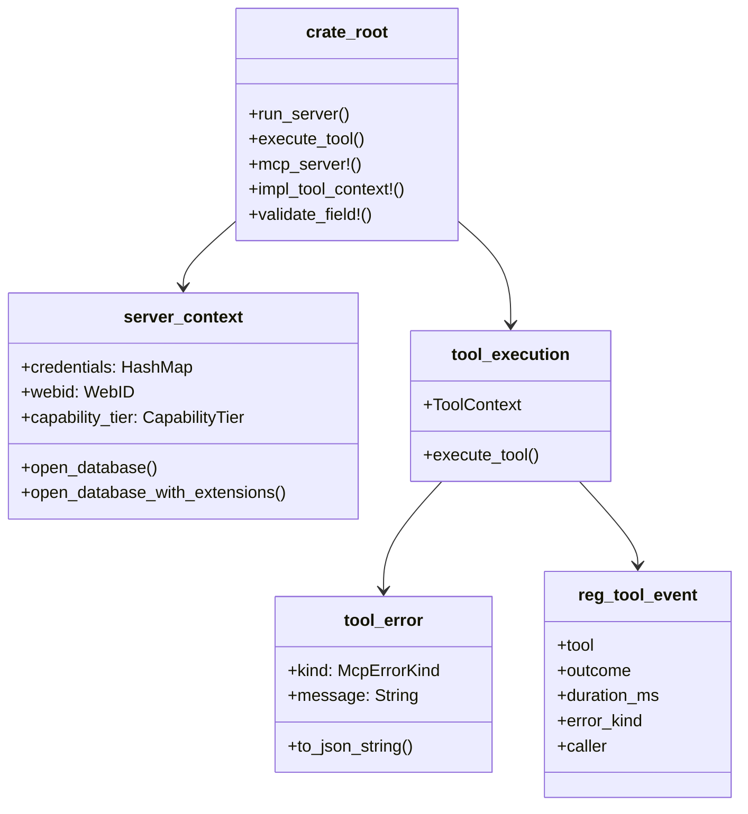

# hkask-mcp-server — Reference: API Surface

Lookup reference for the current public types, functions, and macros exported by `hkask-mcp-server`. Citations use full repository-relative paths and were re-derived from the implementation on 2026-09-15.

## Module and export map

The crate declares private `security` and public `server` modules (`kask/crates/hkask-mcp-server/src/hkask_mcp_server.rs:10-11`). The `server` facade declares seven private implementation modules and re-exports their public APIs (`kask/crates/hkask-mcp-server/src/server.rs:22-48`).



<!-- DIAGRAM_ALIGNMENT
id: DIAG-MCPSRV-020
verified_date: 2026-09-15
verified_against: kask/crates/hkask-mcp-server/src/hkask_mcp_server.rs:10-35,37-165; kask/crates/hkask-mcp-server/src/server.rs:22-48; kask/crates/hkask-mcp-server/src/server/tool_span.rs:108-170; kask/crates/hkask-mcp-server/src/server/error.rs:44-155
status: VERIFIED
-->

### Root re-exports

Defined at `kask/crates/hkask-mcp-server/src/hkask_mcp_server.rs:19-35`.

| Export | Implementation |
|---|---|
| `CapabilityTier`, `CredentialRequirement`, `ServerContext` | `kask/crates/hkask-mcp-server/src/server/context.rs:9-190` |
| `McpError` | `kask/crates/hkask-mcp-server/src/server/error.rs:11-42` |
| `ToolContext`, `execute_tool` | `kask/crates/hkask-mcp-server/src/server/tool_span.rs:123-170` |
| `parse_env_warn`, `resolve_credential`, `resolve_db_passphrase` | `kask/crates/hkask-mcp-server/src/server/credentials.rs:8-144` |
| `run_stdio_server` | `kask/crates/hkask-mcp-server/src/server/transport.rs:9-129` |
| `validate_identifier`, `validate_path` | `kask/crates/hkask-mcp-server/src/server/validation.rs:5-69` |
| `validate_tool_url_permissive`, `validate_tool_url_with_dns` | `kask/crates/hkask-mcp-server/src/security.rs:341-364` |
| `MAX_READ_BYTES`, `contain_for_read`, `contain_for_write`, `read_capped` | `kask/crates/hkask-mcp-server/src/server/validation.rs:165-169`, `kask/crates/hkask-mcp-server/src/server/validation.rs:315-328`, `kask/crates/hkask-mcp-server/src/server/validation.rs:472-498` |
| `map_infra_error`, `map_io_error`, `map_join_error`, `map_memory_store_error` | `kask/crates/hkask-mcp-server/src/server/validation.rs:71-163` |
| `AnyJsonValue`, `find_boolean_schema_positions` | `kask/crates/hkask-types/src/tool_schema.rs:55-59`, `kask/crates/hkask-types/src/tool_schema.rs:135-139` |

`McpToolError` and additional helpers remain available through the public `server` module (`kask/crates/hkask-mcp-server/src/server.rs:32-48`).

### `server` module re-exports

| Export | Facade location |
|---|---|
| `validate_resolved_addresses`, `validate_tool_url_literal`, `validate_tool_url_permissive`, `validate_tool_url_with_dns` | `kask/crates/hkask-mcp-server/src/server.rs:32-35` |
| `CapabilityTier`, `CredentialRequirement`, `ServerContext` | `kask/crates/hkask-mcp-server/src/server.rs:36` |
| `parse_env_warn`, `resolve_credential`, `resolve_db_passphrase` | `kask/crates/hkask-mcp-server/src/server.rs:37` |
| `McpError`, `McpToolError` | `kask/crates/hkask-mcp-server/src/server.rs:38` |
| `classify_http_error` | `kask/crates/hkask-mcp-server/src/server.rs:39` |
| `ToolContext`, `execute_tool` | `kask/crates/hkask-mcp-server/src/server.rs:40` |
| `run_stdio_server` | `kask/crates/hkask-mcp-server/src/server.rs:41` |
| `MAX_READ_BYTES`, containment/read helpers, `resolve_max_read_bytes` | `kask/crates/hkask-mcp-server/src/server.rs:42-44` |
| error mappers and input validators | `kask/crates/hkask-mcp-server/src/server.rs:45-48` |

## Entry points and macros

### `run_server`

```rust
pub async fn run_server<S, F>(
    name: &str,
    version: &str,
    factory: F,
    credentials: Vec<CredentialRequirement>,
) -> Result<(), McpError>
```

Delegates to `run_stdio_server`; generic bounds require an rmcp server service and a one-shot `ServerContext` factory (`kask/crates/hkask-mcp-server/src/hkask_mcp_server.rs:37-54`).

### `validate_field!`

Expands to `validate_identifier`; on error it returns `Err($span.error(e))` (`kask/crates/hkask-mcp-server/src/hkask_mcp_server.rs:56-76`). It is intended only where the caller owns a compatible span/guard expression.

### `impl_tool_context!`

Implements `ToolContext` for a type containing `webid: WebID` (`kask/crates/hkask-mcp-server/src/hkask_mcp_server.rs:78-96`).

### `mcp_server!`

Generates a WebID-bearing server struct, constructor, and `ToolContext` implementation. The custom-field expansion is at `kask/crates/hkask-mcp-server/src/hkask_mcp_server.rs:115-145`; the fieldless expansion is at `:147-165`.

## Server construction types

### `CredentialRequirement`

```rust
pub struct CredentialRequirement {
    pub env_var: String,
    pub description: String,
    pub required: bool,
}
```

Definition: `kask/crates/hkask-mcp-server/src/server/context.rs:9-22`.

| Constructor | Effect | Evidence |
|---|---|---|
| `required(env_var, description)` | `required = true` | `kask/crates/hkask-mcp-server/src/server/context.rs:24-38` |
| `optional(env_var, description)` | `required = false` | `kask/crates/hkask-mcp-server/src/server/context.rs:40-53` |

### `CapabilityTier`

```rust
pub struct CapabilityTier {
    pub embedded: bool,
    pub keystore_available: bool,
    pub persistence_available: bool,
}
```

Definition: `kask/crates/hkask-mcp-server/src/server/context.rs:56-74`.

`detect(webid, resolved_credentials)` sets `embedded` from comparison with the anonymous persona, `persistence_available` from the presence of `HKASK_DB_PASSPHRASE`, and `keystore_available` from a keychain probe (`kask/crates/hkask-mcp-server/src/server/context.rs:76-123`).

### `ServerContext`

```rust
pub struct ServerContext {
    pub credentials: HashMap<String, String>,
    pub webid: hkask_types::WebID,
    pub capability_tier: CapabilityTier,
}
```

Definition: `kask/crates/hkask-mcp-server/src/server/context.rs:126-135`.

| Method | Return | Evidence |
|---|---|---|
| `open_database(db_env_var)` | persistent database or in-memory fallback | `kask/crates/hkask-mcp-server/src/server/context.rs:149-164` |
| `open_database_with_extensions(db_env_var, extensions)` | persistent/in-memory database with DDL | `kask/crates/hkask-mcp-server/src/server/context.rs:166-190` |

## Tool execution

### `ToolContext`

```rust
pub trait ToolContext {
    fn webid(&self) -> &hkask_types::WebID;
}
```

Definition: `kask/crates/hkask-mcp-server/src/server/tool_span.rs:123-143`.

### `execute_tool`

```rust
pub async fn execute_tool<C: ToolContext>(
    ctx: &C,
    tool_name: &str,
    fut: impl Future<Output = Result<Value, McpToolError>>,
) -> Result<String, McpToolError>
```

Creates a private `ToolSpanGuard`, awaits the future, and finishes the guard with the typed result (`kask/crates/hkask-mcp-server/src/server/tool_span.rs:145-170`).

Success is a JSON string containing the MCP `{"content": value}` envelope (`kask/crates/hkask-mcp-server/src/server/tool_span.rs:62-74`). Failure remains `Err(McpToolError)`.

### `reg.tool` event

`emit_tool_span` emits an info event at target `reg.tool`, message `REG` (`kask/crates/hkask-mcp-server/src/server/tool_span.rs:108-119`).

| Field | Type/values |
|---|---|
| `tool` | string |
| `outcome` | `ok`, `error`, `dropped` |
| `duration_ms` | `u64` |
| `error_kind` | `McpErrorKind` display string or empty string |
| `caller` | WebID display string or empty string |

`ok` and `error` emission paths are at `kask/crates/hkask-mcp-server/src/server/tool_span.rs:32-60`; the `dropped` path is at `:92-106`. The child event is stderr observability, while production outcome recording occurs in client dispatch paths (`kask/crates/hkask-mcp-server/src/server/tool_span.rs:123-139`).

## Error types

### `McpError`

Server-level enum defined at `kask/crates/hkask-mcp-server/src/server/error.rs:11-42`.

| Variant | Payload |
|---|---|
| `DatabasePassphrase` | `String` |
| `UnexpectedResponse` | `{ context: String, detail: String }` |
| `MissingCredentials` | `{ missing: String }` |
| `Storage` | `hkask_storage::DatabaseError` |
| `Infrastructure` | `hkask_types::InfrastructureError` |
| `Transport` | boxed `rmcp::RmcpError` |

### `McpToolError`

```rust
pub struct McpToolError {
    pub kind: McpErrorKind,
    pub message: String,
}
```

Definition and constructors: `kask/crates/hkask-mcp-server/src/server/error.rs:44-127`.

| Constructor | Kind |
|---|---|
| `new` | caller-supplied |
| `internal` | `Internal` |
| `not_found` | `NotFound` |
| `invalid_argument` | `InvalidArgument` |
| `unavailable` | `Unavailable` |
| `permission_denied` | `PermissionDenied` |
| `rate_limited` | `RateLimited` |
| `failed_precondition` | `FailedPrecondition` |

`to_json_string()` returns `{"error": message, "kind": kind}` (`kask/crates/hkask-mcp-server/src/server/error.rs:122-127`). Its rmcp conversion sets `is_error`, text content, and structured content (`kask/crates/hkask-mcp-server/src/server/error.rs:130-155`).

## Credential APIs

| API | Behavior | Evidence |
|---|---|---|
| `resolve_credential(env_var)` | API/config values from env; shared DB passphrase via keystore resolver | `kask/crates/hkask-mcp-server/src/server/credentials.rs:8-59` |
| `resolve_db_passphrase(credentials)` | credential map, then canonical passphrase chain; typed permission failure | `kask/crates/hkask-mcp-server/src/server/credentials.rs:61-104` |
| `parse_env_warn(key, default)` | parse env value; warn and default on malformed value | `kask/crates/hkask-mcp-server/src/server/credentials.rs:106-144` |

## Validation APIs

### Identifiers and paths

| API | Behavior | Evidence |
|---|---|---|
| `validate_identifier` | non-empty, bounded, alphanumeric plus `_ . - :` | `kask/crates/hkask-mcp-server/src/server/validation.rs:5-34` |
| `validate_path` | non-empty, bounded, no control chars or parent traversal | `kask/crates/hkask-mcp-server/src/server/validation.rs:36-69` |
| `contain_for_write` | canonicalize leniently under an allowed root | `kask/crates/hkask-mcp-server/src/server/validation.rs:315-321` |
| `contain_for_read` | canonicalize existing target under an allowed root | `kask/crates/hkask-mcp-server/src/server/validation.rs:323-328` |
| `read_capped` | contain, stat, enforce cap, read | `kask/crates/hkask-mcp-server/src/server/validation.rs:472-498` |
| `MAX_READ_BYTES` | 32 MiB | `kask/crates/hkask-mcp-server/src/server/validation.rs:165-169` |
| `resolve_max_read_bytes` | `HKASK_MCP_MAX_READ_BYTES`, warn/default on invalid | `kask/crates/hkask-mcp-server/src/server/validation.rs:171-201` |

Allowed roots are the process current directory, hKask data directory, and hKask artifacts directory (`kask/crates/hkask-mcp-server/src/server/validation.rs:253-313`).[^cwe22]

### URL safety

| API | Behavior | Evidence |
|---|---|---|
| `validate_tool_url_with_dns` | strict syntax/literal checks plus DNS address validation | `kask/crates/hkask-mcp-server/src/security.rs:341-354` |
| `validate_tool_url_permissive` | allows private and loopback addresses | `kask/crates/hkask-mcp-server/src/security.rs:356-364` |
| `validate_tool_url_literal` | strict synchronous literal-address checks, no DNS | `kask/crates/hkask-mcp-server/src/security.rs:366-380` |
| `validate_resolved_addresses` | strict policy over exact connection addresses | `kask/crates/hkask-mcp-server/src/security.rs:382-395` |

The strict policy rejects non-HTTP(S) schemes, embedded credentials, loopback, private, and unspecified destinations, including mapped/embedded IPv4 forms (`kask/crates/hkask-mcp-server/src/security.rs:65-183`, `kask/crates/hkask-mcp-server/src/security.rs:185-266`).[^cwe918]

### Error mappers

| API | Source | Evidence |
|---|---|---|
| `map_io_error` | `std::io::Error` | `kask/crates/hkask-mcp-server/src/server/validation.rs:71-90` |
| `map_join_error` | `tokio::task::JoinError` | `kask/crates/hkask-mcp-server/src/server/validation.rs:92-104` |
| `map_infra_error` | `InfrastructureError` | `kask/crates/hkask-mcp-server/src/server/validation.rs:106-129` |
| `map_memory_store_error` | `MemoryStoreError` | `kask/crates/hkask-mcp-server/src/server/validation.rs:131-163` |
| `classify_http_error` | HTTP status/body | `kask/crates/hkask-mcp-server/src/server/http_helpers.rs:1-27` |

## Tool-schema helpers

`AnyJsonValue` and `find_boolean_schema_positions` are re-exported from `hkask_types::tool_schema` at the crate root (`kask/crates/hkask-mcp-server/src/hkask_mcp_server.rs:29-35`). Use `AnyJsonValue` for tool inputs that intentionally accept arbitrary JSON.

## See also

- [Tutorial: build your first MCP server](./tutorial.md)
- [How-to: common server tasks](./how-to.md)
- [Explanation: why the framework is narrow](./explanation.md)

---

[^cwe22]: MITRE. (n.d.). *CWE-22: Improper Limitation of a Pathname to a Restricted Directory.* <https://cwe.mitre.org/data/definitions/22.html>.
[^cwe918]: MITRE. (n.d.). *CWE-918: Server-Side Request Forgery.* <https://cwe.mitre.org/data/definitions/918.html>.
