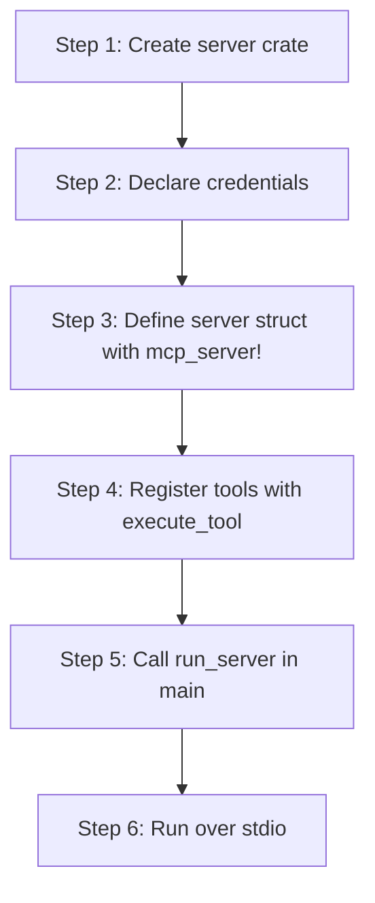

# hkask-mcp-server — Tutorial: Build Your First MCP Server

This tutorial walks through creating an hKask MCP server from an empty crate
to a running stdio binary. You will learn the framework's entry point, the
`mcp_server!` macro, tool registration, and Regulation span emission. Servers
run standalone over stdio and derive agent identity from `ServerContext.webid`
(resolved from `HKASK_WEBID`, falling back to anonymous).

The framework's contract is narrow: a server is a struct with a `webid` field,
a set of `#[tool]` methods, and a call to `run_server`. Everything else —
credential resolution, WebID derivation, capability detection, tracing
subscriber setup — is handled by the bootstrap in `transport.rs`.

## Learning path



<!-- DIAGRAM_ALIGNMENT
id: DIAG-MCPSRV-001
verified_date: 2026-08-13
verified_against: kask/crates/hkask-mcp-server/src/hkask_mcp_server.rs:40-69
status: VERIFIED
-->

## Step 1: Create the server crate

An hKask MCP server is a binary crate that depends on `hkask-mcp-server` and
`rmcp`. The crate's `main.rs` calls `run_server` directly — there is no
shared bootstrap binary and no plugin registry to register with. The
canonical MCP server registry lives in `kask_bridge::mcp_servers::BUILT_IN_MCP_SERVERS`
(id + binary + description); do not re-introduce a parallel list in your
crate, it drifts (see the warning at `hkask_mcp_server.rs:13-17`).

Your `Cargo.toml` needs:

```toml
[dependencies]
hkask-mcp-server = { path = "../../hkask-mcp-server" }
rmcp = { version = "0.1", features = ["server", "macros"] }
tokio = { version = "1", features = ["full"] }
serde_json = "1"
```

## Step 2: Declare credential requirements

Credentials are declared, not ambient. A server lists the env vars it needs
via `CredentialRequirement`, and the bootstrap resolves them through the
hkask keystore chain (`.env` → keychain → env var) before the server struct
is constructed. The factory pattern ensures server constructors that need
credentials only run AFTER credential availability is confirmed
(`transport.rs:19-22`).

```rust
use hkask_mcp_server::CredentialRequirement;

let credentials = vec![
    CredentialRequirement::required(
        "HKASK_GITHUB_TOKEN",
        "GitHub personal access token for the issues tool",
    ),
    CredentialRequirement::optional(
        "HKASK_DB_PATH",
        "Path to the server's SQLite database (in-memory fallback if unset)",
    ),
];
```

`required` returns a `CredentialRequirement` with `required = true`
(`context.rs:32-38`); `optional` returns one with `required = false`
(`context.rs:47-53`). If a required credential is missing, the bootstrap
returns `McpError::MissingCredentials` and the server never starts
(`transport.rs:118-131`).

## Step 3: Define the server struct

The `mcp_server!` macro generates a struct with a mandatory `webid` field
plus your domain-specific fields, a `new()` constructor, and a `ToolContext`
impl. This is the standard pattern for all hKask MCP servers
(`hkask_mcp_server.rs:113-127`).

```rust
use hkask_mcp_server::mcp_server;
use std::collections::HashMap;

mcp_server!(struct IssuesServer {
    github_token: String,
});
```

This expands to a struct with `webid, github_token`, a `new(webid, github_token)`
constructor, and `impl ToolContext for IssuesServer` (which exposes `webid()`
for Regulation span attribution). The macro has a no-custom-fields variant too
(`hkask_mcp_server.rs:162-180`).

The `webid` field is `hkask_types::WebID` and is the agent identity for
capability tokens and ownership (`hkask_mcp_server.rs:142-143`).

## Step 4: Register tools with `execute_tool`

Each tool is an `async fn` annotated with rmcp's `#[tool]` attribute. The
tool body returns `Result<serde_json::Value, McpToolError>`; the framework
wraps it in a `ToolSpanGuard` that emits a `reg.tool` span on drop
(`tool_span.rs:185-193`).

```rust
use hkask_mcp_server::{execute_tool, McpToolError, validate_field};
use rmcp::{tool, model::Parameters};
use serde_json::json;

impl IssuesServer {
    #[tool(description = "List open issues for a repository")]
    async fn list_issues(
        &self,
        params: Parameters<ListIssuesRequest>,
    ) -> Result<String, McpToolError> {
        execute_tool(self, "list_issues", async {
            let req = params.as_json()?;

            // Validate inputs — the validate_field! macro returns early on error
            // (hkask_mcp_server.rs:84-91)
            // validate_field!(span, "owner", &owner, 256);

            // ... business logic ...
            Ok(json!({"issues": []}))
        }).await
    }
}
```

`execute_tool` creates the span, awaits your future, and calls `span.finish(result)`
which routes `Ok` → `ok_json` and `Err` → `error(kind, …)` (`tool_span.rs:111-116`).
The returned `String` is the MCP wire-format JSON.

For tools that participate in ontology-aware feedback routing, use
`execute_tool_semantic` with a `&'static str` concept from `hkask-bridge-ontology`
(e.g. `pko:ChangeOfStatus`). Passing `None` emits a `tracing::warn!` naming the
tool — the algedonic signal that a registered tool lacks an ontology anchor
(`tool_span.rs:203-223`).

## Step 5: Call `run_server` in `main`

`run_server` is the canonical entry point. It delegates to
`run_stdio_server`, which sets up the tracing subscriber, resolves
credentials, derives the WebID, detects the capability tier, constructs
the `ServerContext`, calls your factory, and serves over rmcp stdio
(`hkask_mcp_server.rs:35-52`, `transport.rs:84-192`).

```rust
#[tokio::main]
async fn main() -> anyhow::Result<()> {
    hkask_mcp_server::run_server(
        "hkask-mcp-issues",
        env!("CARGO_PKG_VERSION"),
        |ctx| Ok(IssuesServer::new(
            ctx.webid,
            ctx.credentials.get("HKASK_GITHUB_TOKEN").cloned().unwrap_or_default(),
        )),
        credentials,
    ).await?;
    Ok(())
}
```

The factory closure receives a `ServerContext` with `credentials`,
`webid`, and `capability_tier` (`context.rs:134-142`). There is no ambient
authority via `std::env::var` — all deps are injected here
(`transport.rs:19-22`).

## Step 6: Run over stdio

The server speaks MCP over stdin/stdout. Logs go to stderr via the
tracing subscriber initialized in `run_stdio_server_impl`
(`transport.rs:95-101`). The hKask runtime (or any MCP client) spawns the
binary and communicates over stdio; the server blocks on
`running.waiting().await` until the client disconnects
(`transport.rs:187-191`).

To test locally, point an MCP client at the binary. Set `HKASK_WEBID` to a
valid UUID for P12-compliant attribution; if unset, the server starts with
an anonymous identity and logs a warning (`transport.rs:148-166`).

## What you learned

- The framework's entry point is `run_server` → `run_stdio_server`
  (`hkask_mcp_server.rs:40-52`).
- Credentials are declared via `CredentialRequirement` and resolved before
  the server struct is constructed (`context.rs:13-22`, `transport.rs:103-131`).
- The `mcp_server!` macro generates the struct, constructor, and
  `ToolContext` impl (`hkask_mcp_server.rs:128-181`).
- Tools return `Result<Value, McpToolError>`; `execute_tool` emits the
  Regulation span and serializes the result (`tool_span.rs:185-193`).
- Agent identity comes from `ServerContext.webid`, resolved from
  `HKASK_WEBID` → anonymous (`transport.rs:133-166`).

## Source citations

| Claim | File:line |
|-------|-----------|
| `run_server` delegates to `run_stdio_server` | `kask/crates/hkask-mcp-server/src/hkask_mcp_server.rs:40-52` |
| `run_server_with_preloaded` variant | `kask/crates/hkask-mcp-server/src/hkask_mcp_server.rs:56-69` |
| Canonical registry lives in `kask_bridge` | `kask/crates/hkask-mcp-server/src/hkask_mcp_server.rs:13-17` |
| `mcp_server!` macro expansion | `kask/crates/hkask-mcp-server/src/hkask_mcp_server.rs:128-181` |
| `validate_field!` macro | `kask/crates/hkask-mcp-server/src/hkask_mcp_server.rs:84-91` |
| `impl_tool_context!` macro | `kask/crates/hkask-mcp-server/src/hkask_mcp_server.rs:102-111` |
| `CredentialRequirement::required` / `optional` | `kask/crates/hkask-mcp-server/src/server/context.rs:32-53` |
| `ServerContext` fields | `kask/crates/hkask-mcp-server/src/server/context.rs:134-142` |
| Bootstrap: tracing, credentials, webid, serve | `kask/crates/hkask-mcp-server/src/server/transport.rs:84-192` |
| `execute_tool` framework function | `kask/crates/hkask-mcp-server/src/server/tool_span.rs:185-193` |
| `execute_tool_semantic` with ontology warn | `kask/crates/hkask-mcp-server/src/server/tool_span.rs:203-223` |
| `ToolSpanGuard::finish` result routing | `kask/crates/hkask-mcp-server/src/server/tool_span.rs:111-116` |
