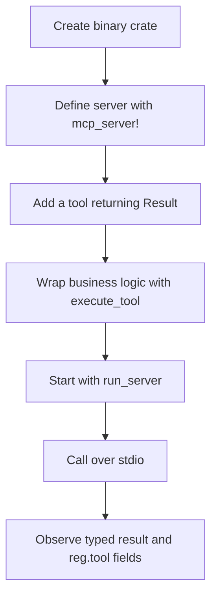

# hkask-mcp-server — Tutorial: Build Your First MCP Server

This tutorial builds a minimal stdio MCP server that returns a typed tool result and emits `reg.tool` outcome telemetry. The framework follows the Model Context Protocol server pattern—advertise tools, accept calls, and return protocol-native results—while adding hKask construction context and error classification.[^mcp]

By the end, you will have a server struct generated by `mcp_server!`, one `#[tool]` method wrapped by `execute_tool`, and a `main` function using `run_server` (`kask/crates/hkask-mcp-server/src/hkask_mcp_server.rs:37-54`, `kask/crates/hkask-mcp-server/src/hkask_mcp_server.rs:98-165`).

## Learning path



<!-- DIAGRAM_ALIGNMENT
id: DIAG-MCPSRV-001
verified_date: 2026-09-15
verified_against: kask/crates/hkask-mcp-server/src/hkask_mcp_server.rs:37-54,98-165; kask/crates/hkask-mcp-server/src/server/tool_span.rs:145-170; kask/crates/hkask-mcp-server/src/server/transport.rs:32-129
status: VERIFIED
-->

## Step 1: Create the binary crate

Add the framework, rmcp macros, Tokio, and JSON dependencies using versions already selected by the workspace. New hKask crates declare their library or binary paths explicitly according to the repository's Cargo conventions.

The canonical built-in server registry lives in `kask_bridge`, not in this crate. `hkask-mcp-server` keeps an explicit warning against introducing a second registry (`kask/crates/hkask-mcp-server/src/hkask_mcp_server.rs:13-17`).

## Step 2: Define the server

Create a server with no custom fields:

```rust
use hkask_mcp_server::mcp_server;

mcp_server!(struct EchoServer;);
```

The macro generates:

- `EchoServer { pub webid: hkask_types::WebID }`;
- `EchoServer::new(webid)`;
- a `ToolContext` implementation returning that WebID.

The no-field expansion is defined at `kask/crates/hkask-mcp-server/src/hkask_mcp_server.rs:147-165`. The variant at `:115-145` accepts domain-specific fields.

## Step 3: Define a request and tool

Use an rmcp parameter type and return `Result<String, McpToolError>`:

```rust
use hkask_mcp_server::{McpToolError, execute_tool, validate_identifier};
use rmcp::{model::Parameters, tool};
use serde::Deserialize;
use serde_json::json;

#[derive(Debug, Deserialize, schemars::JsonSchema)]
struct EchoRequest {
    message: String,
}

impl EchoServer {
    #[tool(description = "Echo a validated message")]
    async fn echo(
        &self,
        Parameters(request): Parameters<EchoRequest>,
    ) -> Result<String, McpToolError> {
        execute_tool(self, "echo", async move {
            validate_identifier("message", &request.message, 256)?;
            Ok(json!({"echo": request.message}))
        })
        .await
    }
}
```

`validate_identifier` rejects empty, overlong, or disallowed identifier text with `McpToolError::invalid_argument` (`kask/crates/hkask-mcp-server/src/server/validation.rs:5-34`). For free-form text, use validation appropriate to that content rather than this identifier-specific helper.

`execute_tool` creates a private `ToolSpanGuard`, awaits the business future, and returns `Result<String, McpToolError>` (`kask/crates/hkask-mcp-server/src/server/tool_span.rs:145-170`). On success, the string contains `{"content": <value>}` (`kask/crates/hkask-mcp-server/src/server/tool_span.rs:62-74`). On failure, the original typed error is returned so rmcp marks the response as an error and places `{"error", "kind"}` in `structured_content` (`kask/crates/hkask-mcp-server/src/server/error.rs:130-155`).

## Step 4: Start the server

```rust
#[tokio::main]
async fn main() -> Result<(), hkask_mcp_server::McpError> {
    hkask_mcp_server::run_server(
        "hkask-mcp-echo",
        env!("CARGO_PKG_VERSION"),
        |ctx| Ok(EchoServer::new(ctx.webid)),
        vec![],
    )
    .await
}
```

`run_server` delegates to `run_stdio_server` (`kask/crates/hkask-mcp-server/src/hkask_mcp_server.rs:37-54`). The bootstrap:

1. initializes tracing to stderr;
2. configures the database catalog;
3. resolves declared credentials;
4. derives `HKASK_WEBID` or an anonymous WebID;
5. detects the capability tier;
6. calls the factory and serves rmcp over stdio.

The sequence is implemented at `kask/crates/hkask-mcp-server/src/server/transport.rs:42-129`.

## Step 5: Add a required credential

Declare requirements in `main` and consume only the resolved `ServerContext` map:

```rust
use hkask_mcp_server::CredentialRequirement;

let requirements = vec![CredentialRequirement::required(
    "ECHO_API_KEY",
    "API key used by the echo backend",
)];
```

Required and optional constructors are defined at `kask/crates/hkask-mcp-server/src/server/context.rs:24-53`. Missing required values are collected before construction and returned as `McpError::MissingCredentials` (`kask/crates/hkask-mcp-server/src/server/transport.rs:68-89`). API keys are read from the process environment; only `HKASK_DB_PASSPHRASE` uses the dedicated keystore chain (`kask/crates/hkask-mcp-server/src/server/credentials.rs:8-59`).

For this tutorial's fieldless server, leave `vec![]`. A real server can pass `ctx.credentials` values into custom fields generated by the other `mcp_server!` variant.

## Step 6: Run and observe

Launch the binary from an MCP client over stdio. Protocol messages use stdin/stdout; framework logs use stderr (`kask/crates/hkask-mcp-server/src/server/transport.rs:42-48`, `kask/crates/hkask-mcp-server/src/server/transport.rs:124-129`).

Each completed invocation emits a tracing event at target `reg.tool` with:

- `tool`;
- `outcome` (`ok`, `error`, or `dropped`);
- `duration_ms`;
- `error_kind` (empty unless the outcome is `error`);
- `caller`.

Those fields are emitted at `kask/crates/hkask-mcp-server/src/server/tool_span.rs:108-119`. The child event is observability output; production Regulation outcome recording occurs in the client-side dispatch paths, not by consuming this stderr event (`kask/crates/hkask-mcp-server/src/server/tool_span.rs:123-139`).

If `HKASK_WEBID` is missing or invalid, startup uses the anonymous persona and warns; otherwise the parsed identity is attached to the server and tool telemetry (`kask/crates/hkask-mcp-server/src/server/transport.rs:91-117`).

## What you learned

- `mcp_server!` generates the standard WebID-bearing server shape.
- `execute_tool` preserves typed errors and serializes successful content.
- `run_server` performs credential, identity, capability, and stdio setup.
- `reg.tool` reports the actual execution outcome fields listed above.

## Next steps

- [How-to: common server tasks](./how-to.md)
- [Reference: current API surface](./reference.md)
- [Explanation: framework design](./explanation.md)

---

[^mcp]: Model Context Protocol. (2025). *Tools.* <https://modelcontextprotocol.io/specification/2025-06-18/server/tools>.
