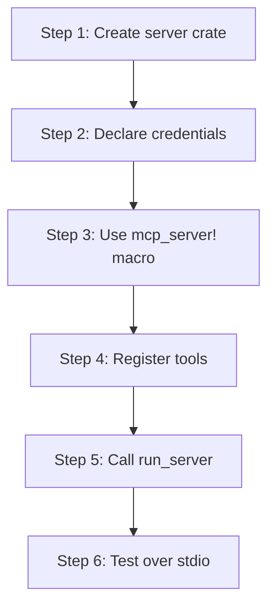

# hkask-mcp-server — Tutorial: Your First MCP Server

This tutorial walks through creating a new MCP server using the
`hkask-mcp-server` framework. You will learn the server structure, tool
registration, and span emission. Servers run standalone over stdio and
derive agent identity from `ServerContext.webid` (resolved from
`HKASK_WEBID`, falling back to anonymous).

## Learning path

<!-- DIAGRAM_ALIGNMENT
id: DIAG-DIA-MCP-003
verified_date: 2026-07-29
verified_against: kask/crates/hkask-mcp-server/src/server/context.rs:123; kask/crates/hkask-mcp-server/src/hkask_mcp_server.rs:30,127; kask/crates/hkask-mcp-server/src/server/tool_span.rs:17,216
status: VERIFIED
-->

## Steps 1-2: Create the crate and declare credentials

Create a new crate under `kask/mcp-servers/hkask-mcp-<name>/`. Add
`hkask-mcp-server` as a dependency. Declare the credentials your server
needs as `Vec<CredentialRequirement>` (`context.rs:14`). Each requirement
has an `env_var`, a `description`, and a `required: bool` flag — optional
credentials allow degraded operation.

## Step 3: Use the mcp_server! macro

Use the `mcp_server!` macro (`hkask_mcp_server.rs:127`) to generate the
server struct. The macro generates a mandatory `webid: WebID` field plus
any domain-specific fields you declare, a `new()` constructor, and a
`ToolContext` impl via `impl_tool_context!`. The macro does *not*
generate a `daemon` field — servers are standalone processes.

## Step 4: Register tools

Register each tool with its name, description, and parameter schema. Wrap
each tool invocation via `execute_tool` (`tool_span.rs:249`) or
`execute_tool_semantic` (`tool_span.rs:266`) to emit `reg.tool.*` spans
automatically. The `ToolContext` trait (`tool_span.rs:216`) provides
`webid()` for span attribution and `record_tool_outcome()` for semantic
memory recording.

## Step 5: Call run_server

In your `main.rs`, call `run_server` (`hkask_mcp_server.rs:30`) with the
server name, version, a factory closure that constructs the server from a
`ServerContext`, and the credential requirements. This delegates to
`run_stdio_server` (`transport.rs:33`), which resolves credentials, derives
the WebID, constructs the `ServerContext` (`context.rs:123`), and serves
via rmcp stdio transport.

## Step 6: Test over stdio

Run the server binary and send MCP protocol messages over stdin/stdout.
Verify the tool responses and the span emissions (spans go to stderr in
standalone mode, or are consumed by Regulation in embedded mode).

## See also

- [hkask-mcp-server Reference](./reference.md): class diagram of the
  framework.
- [hkask-mcp-server How-to](./how-to.md): registering a new tool.
- [`kask/docs/reference/mcp-servers/README.md`](../../reference/mcp-servers/README.md).

---

[^mcp-spec]: Anthropic. (2024). *Model Context Protocol Specification.* <https://modelcontextprotocol.io/specification>.
