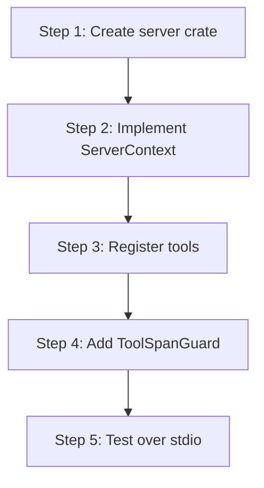

# hkask-mcp-server — Tutorial: Your First MCP Server

This tutorial walks through creating a new MCP server using the
`hkask-mcp-server` framework. You will learn the server structure, tool
registration, and span emission.

## Learning path

<!-- DIAGRAM_ALIGNMENT
id: DIAG-DIA-MCP-003
verified_date: 2026-07-27
verified_against: kask/crates/hkask-mcp-server/src/server/context.rs:123; kask/crates/hkask-mcp-server/src/server/tool_span.rs:17,215
status: VERIFIED
-->

## Steps 1-2: Create the crate and implement ServerContext

Create a new crate under `kask/mcp-servers/hkask-mcp-<name>/`. Add
`hkask-mcp-server` as a dependency. Construct a `ServerContext`
(`context.rs:123`) with the appropriate `CapabilityTier` and
`CredentialRequirement`.

## Steps 3-4: Register tools and add span guards

Register each tool with its name, description, and parameter schema. Wrap
each tool invocation in a `ToolSpanGuard` (`tool_span.rs:17`) to emit
`reg.tool.*` spans. Implement the `ToolContext` trait (`tool_span.rs:215`)
for span and error handling.

## Step 5: Test over stdio

Run the server binary and send MCP protocol messages over stdin/stdout.
Verify the tool responses and the span emissions.

## See also

- [hkask-mcp-server Reference](./reference.md): class diagram of the
  framework.
- [hkask-mcp-server How-to](./how-to.md): registering a new tool.
- [`kask/docs/reference/mcp-servers/README.md`](../../reference/mcp-servers/README.md).

---

[^mcp-spec]: Anthropic. (2024). *Model Context Protocol Specification.* <https://modelcontextprotocol.io/specification>.
