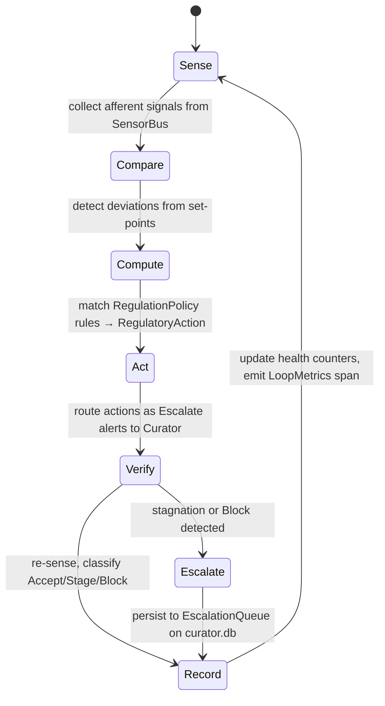
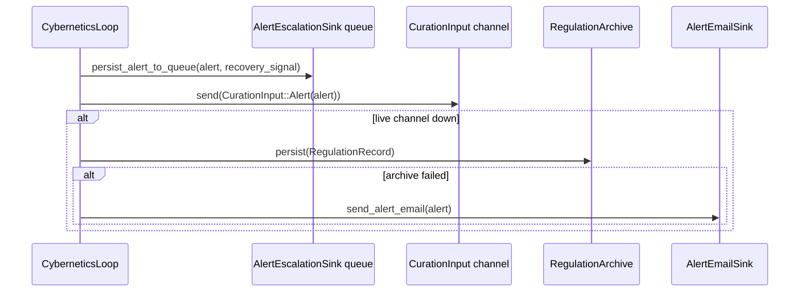
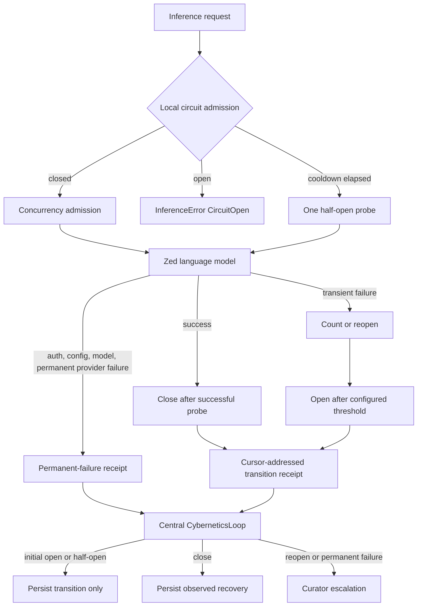

# hkask-regulation — Explanation

The Regulation system is hKask's cybernetic nervous system. It implements a
homeostatic loop that senses agent behavior, compares it against set-points,
computes corrective actions, routes them as alerts, and verifies the impact.
The design follows the Conant-Ashby Good Regulator theorem: the regulator
must model the system it regulates[^conant-ashby]. The `RegulationLedger`
(`kask/crates/hkask-regulation/src/runtime.rs:498-500`) is that model — it accumulates the regulation-health
counters, holds the `VarietyMonitor`, and exposes health snapshots that the
`MetacognitionLoop` senses.

## Ratified observation and advice contract — core-review D4

**Decision provenance:** after the weekly-review recommendation was presented,
the operator instructed the agent on 2026-09-04 to proceed with all seven
remaining core-review tasks. That session explicitly treated the instruction as
confirmation of D4; the continuation prompt preserves that ruling. Seven days
is the confirmed post-action review horizon, **not a weekly sensing cadence**.

Current variety/outcome samples expire after the existing one-minute window
(`OBSERVATION_WINDOW_SECS`) even without another write. Historical EMA remains
separate. Sensors return healthy observations as well as deviations; unavailable
sensing returns no sample. Memory's four metrics are registered independently,
so one deficit cannot hide another condition's recovery.

`CyberneticsLoop::tick` reconciles durable conditions through
`BridgeAlertEscalationSink`. Only a fresh finite matching observation meeting the
**original** threshold can resolve the observed row. Partial improvement,
missing/stale evidence, and invalid trigger metadata do not resolve it. Context
updates and row resolution use compare-and-swap; repeated alerts preserve the
original trigger and operator acknowledgement.

`curator_advice_mark_applied` records a confirmed human action and note once;
repeat acknowledgement does not reset its window. `curator_advice_reviews`
includes resolved advice. At seven days the persisted review distinguishes
`recovered`, `improved`, `no_improvement`, and `insufficient_evidence`; before
application/window completion it reports `awaiting_action`/`observation_window`.
Early condition recovery does not end observation of applied advice.

Acceptance means no unacceptable worsening. `observed_progress_score` means
improved/verified observations; only observed improvement resets stagnation.
Neither establishes causation: review `causal_attribution` and metacognitive
outcome trust remain unverified. `RegulationHealth::acceptance_rate` is absent
with no samples, not fabricated success. No autonomous actuator is added.

## Source citations

| Symbol | Location |
|--------|----------|
| `CyberneticsLoop` struct | `kask/crates/hkask-regulation/src/cybernetics_loop.rs:142-152` |
| `CyberneticsLoop::tick` | `kask/crates/hkask-regulation/src/cybernetics_loop.rs:646-656` |
| `CyberneticsLoop::route_action_as_alert` | `kask/crates/hkask-regulation/src/cybernetics_loop/cycle.rs:540-544` |
| `CyberneticsLoop::verify_impact` | `kask/crates/hkask-regulation/src/cybernetics_loop/cycle.rs:686-690` |
| `CyberneticsLoop::persist_alert_to_queue` | `kask/crates/hkask-regulation/src/cybernetics_loop/cycle.rs:63-67` |
| `RegulationLedger` | `kask/crates/hkask-regulation/src/runtime.rs:498-500` |
| `RegulationLedger::record_cycle_outcome` | `kask/crates/hkask-regulation/src/runtime.rs:576-580` |
| `VarietyMonitor` | `kask/crates/hkask-regulation/src/runtime.rs:380-382` |
| `MetacognitionLoop::run` | `kask/crates/hkask-regulation/src/metacognition.rs:279-283` |
| `MetacognitionLoop::tick` | `kask/crates/hkask-regulation/src/metacognition.rs:338-342` |
| `EscalationAlert` | `kask/crates/hkask-regulation/src/metacognition.rs:107` |
| `EscalationTrigger` enum | `kask/crates/hkask-regulation/src/metacognition.rs:117` |
| `ProposedAction` | `kask/crates/hkask-regulation/src/regulation_policy.rs:85` |
| `RegulationPolicy::decide` | `kask/crates/hkask-regulation/src/regulation_policy.rs:379` |
| `RuntimeAlert` | `kask/crates/hkask-regulation/src/algedonic.rs:41` |
| `AlertSeverity` enum | `kask/crates/hkask-regulation/src/algedonic.rs:30` |
| `Dampener::should_dampen_directive` | `kask/crates/hkask-regulation/src/dampener.rs:181` |
| `StagnationDetector` | `kask/crates/hkask-regulation/src/dampener.rs:231` |
| `CallCapManager::charge_metered` | `kask/crates/hkask-regulation/src/energy.rs:174-178` |
| `InferenceResilienceSource` | `kask/crates/hkask-regulation/src/inference_resilience.rs:59-80` |
| Local inference circuit | `kask/crates/kask_bridge/src/inference_resilience.rs:10-58,73-199` |
| `CurationInput` enum | `kask/crates/hkask-regulation/src/loops/core.rs:756-759` |

## Runtime topology

Regulation is process-global in the editor, not instantiated per panel or MCP
server. The composition root creates one shared `RegulationLedger`, one
`CyberneticsLoop`, and one governed `McpRuntime`; agent-path MCP outcomes, skill
outcomes, and operator feedback all write to that ledger
(`crates/zed/src/main.rs:772-896,907-1012`). The 11 MCP servers remain child
processes over stdio (`kask/crates/hkask-mcp/src/runtime.rs:4-12,445-455`).

This topology separates two time scales: local admission control can reject a
request immediately, while the central loop observes receipts, records durable
outcomes, and escalates only conditions that local control cannot close. That is
the viable-system distinction between operational regulation and policy
oversight.[^beer]

## The homeostatic loop

The `CyberneticsLoop` (`cybernetics_loop.rs:146`) drives the five-phase
cycle. Each phase's output is observable: afferent signals from sense,
deviations from compare, actions from compute, and verified impacts from
verify — the last aggregated into the ledger's health counters by
`record_cycle_outcome` (`runtime.rs:526`).

<!-- DIAGRAM_ALIGNMENT
id: DIAG-REG-005
verified_date: 2026-09-15
verified_against: kask/crates/hkask-regulation/src/cybernetics_loop.rs:142-152,646-656; kask/crates/hkask-regulation/src/cybernetics_loop/cycle.rs:63-67,140-144,305-309,409-413,448-452,540-544,686-690; kask/crates/hkask-regulation/src/runtime.rs:498-500,576-580
status: VERIFIED
-->

## Why five phases

The five phases (sense, compare, compute, act, verify) map to the classical
cybernetic feedback loop. The sense phase (`cycle.rs:253`) first drains the
curator-directive inbox via `process_inbox()` (`cybernetics_loop.rs:697`),
then collects observable signals from the `SensorBus`
(`sensor_provider.rs:39`). The compare phase (`cycle.rs:248`) checks each
signal against its set-point via `Deviation::from_signal`
(`loops/signals.rs:256`). The compute phase (`cycle.rs:350`) matches
`Deviation`s against `RegulationRule`s in `RegulationPolicy::default()`
(`regulation_policy.rs:119`), producing `ProposedAction`s
(`regulation_policy.rs:85`) that `build_regulation_action`
(`cycle.rs:1080`) converts into `RegulatoryAction`s.

The act phase executes the selected central disposition: `Notify` records
an observation and `Escalate` uses the durable human-review path. Fast
inference resilience is a nested local loop at the dispatch boundary; its
transition receipts return through `InferenceResilienceSource`. The verify
phase handles separately submitted evidence-bearing rollout checks.

The separation of compare and compute is deliberate. Merging them would
conflate detection (what changed) with response (what to do). Keeping them
separate allows the metacognition loop to evaluate whether the responses
are actually improving the system, which is the Good Regulator
requirement.

## The escalation sequence

When `route_action_as_alert` (`cycle.rs:510`) converts a
`RegulatoryAction` to a `RuntimeAlert`, it routes through three tiers.
The sequence below shows the path for a Critical alert when the live
channel is connected.

<!-- DIAGRAM_ALIGNMENT
id: DIAG-REG-006
verified_date: 2026-09-15
verified_against: kask/crates/hkask-regulation/src/cybernetics_loop/cycle.rs:63-67,540-544; kask/crates/hkask-regulation/src/algedonic.rs; kask/crates/hkask-regulation/src/loops/core.rs:756-759
status: VERIFIED
-->

The escalation queue is the **primary** durable path — every escalated
alert is written there unconditionally (`persist_alert_to_queue` at
`cycle.rs:147`), so the Curator/user can review pending alerts via the
`curator_escalations` MCP tool and resolve/dismiss them with an audit
trail. The `RegulationArchive` remains as a secondary fallback for restart
durability when the live channel is down. Email fires as notification
(archive succeeded) or last resort (archive failed).

## Why inference resilience is local

Inference admission, deadlines, provider outcomes, and circuit state share one
runtime owner in `kask_bridge`. The local controller is therefore a deep module:
it hides semaphore mechanics and circuit synchronization behind admission,
completion, and one cursor-consistent observation contract
(`kask/crates/kask_bridge/src/inference_resilience.rs:10-58,73-199,202-275`).
This is the circuit-breaker pattern applied at the boundary that can actually
stop work, rather than represented as an unwired central action label.[^nygard]

<!-- DIAGRAM_ALIGNMENT
id: DIAG-REG-007
verified_date: 2026-09-15
verified_against: kask/crates/kask_bridge/src/inference_resilience.rs:73-199,202-275; kask/crates/kask_bridge/src/inference_chat.rs:206-239,623-628,1065-1088; kask/crates/hkask-regulation/src/cybernetics_loop/cycle.rs:168-303
status: VERIFIED
-->

The defaults are three consecutive transient failures and a 30-second open
interval, declared in `KaskGeneralSettings::default`
(`kask/crates/kask_bridge/src/settings.rs:121-136`) and passed into the live port
at `crates/zed/src/main.rs:3169-3174`. Open circuits reject new work; when the
interval expires, exactly one probe enters half-open state. A successful probe
closes; a transient probe failure reopens
(`kask/crates/kask_bridge/src/inference_resilience.rs:73-135`).

| Condition | Local behavior | Central return path |
|---|---|---|
| Healthy full utilization | No circuit event; concurrency remains bounded | Snapshot reports in-flight/max values; no outage is inferred |
| Admission capacity exhausted | Existing `InferenceError::Overloaded` | Counted separately from circuit state |
| Timeout, connection failure, or provider failure classified transient | Counts toward opening; open state returns `CircuitOpen` | Ordered transition receipts |
| Successful half-open probe | Circuit closes | `reg.inference.observed_recovery`, with causal attribution explicitly unverified |
| Failed half-open probe | Circuit reopens | One evidence-bearing Curator escalation before cursor acknowledgement |
| Authorization, configuration, model, or permanent provider failure | No synthetic retry/throttle | Typed permanent-failure receipt and Curator escalation |
| Per-agent call-cap depletion | Existing per-agent refusal only | Targeted cap telemetry; never a global inference throttle |

The central consumer sorts intervention and permanent-failure receipts by one
shared id sequence. It advances its cursor only after persistence or escalation
succeeds; gaps stop acknowledgement, and the bridge prunes only events at or
below the acknowledged cursor on the next observation
(`kask/crates/hkask-regulation/src/cybernetics_loop/cycle.rs:178-296`;
`kask/crates/kask_bridge/src/inference_resilience.rs:151-172`). Initial circuit
open and half-open transitions remain local records. Reopening and permanent
failures escalate; closing records observed recovery without claiming that the
controller caused it (`cycle.rs:213-285`).

Automatic behavior is limited to bounded, reversible, non-spending admission
control. Credential repair, model selection, spending, and policy changes remain
operator decisions. The unsupported central throttle/circuit/calibration action
labels were removed rather than retained as fictional regulatory variety.

## The two-level meta-loop

The `MetacognitionLoop` (`metacognition.rs:172`) is the Curator's governance
mechanism. It runs sense→compare→compute→act cycles on a background task
(`run()` at `metacognition.rs:258`, default 30s tick via
`DEFAULT_TICK_INTERVAL` at `metacognition.rs:42`). Each cycle senses the
`RegulationLedger`'s health, variety, and observation acceptance; compares against
thresholds (variety deficit > 100, critical alerts > 3, acceptance <
0.5 — `metacognition.rs:45-51`); and decides whether to escalate,
calibrate, or do nothing.

This is the two-level meta-loop stability guarantee: if the Cybernetics
Loop itself becomes unstable (e.g., alert cascade), the MetacognitionLoop
detects it via `HealthSnapshot` (`metacognition.rs:88`) and intervenes with
`EscalationAlert`s (`metacognition.rs:107`). The authority DAG is
Curation → Cybernetics → {Inference, Memory} (`loops.rs:19-20`) — no
sideways edges, authority flows downward.

## Dampening and stagnation

The Curation→Cybernetics→Curation feedback cycle can produce repeated
identical directives. `Dampener` (`dampener.rs:100`) prevents this with two
layers: per-fingerprint dedup (same variant+target within 60s is
suppressed) and override cooldown (after any metacognitive override, ALL
subsequent overrides are suppressed for 120s). The single
`parking_lot::Mutex` lock eliminates the TOCTOU race between the two
checks (`dampener.rs:181`).

`StagnationDetector` applies only to evidence-bearing rollout observations.
Repeated lack of observed progress can raise a latched plateau escalation;
it no longer substitutes action labels that have no executable handler.

## The call cap as energy homeostasis

The per-agent call cap (`energy.rs`) is the honest replacement for a
gas hold-settle ritual. One unit = one governed tool invocation. Each
agent has a hard ceiling per regulation tick; the cap resets to the
ceiling each tick via `reset_all_caps()` (`cybernetics_loop.rs:689`).

`CallCapManager::charge_metered` (`energy.rs:176`) is the tool-dispatch
path's entry point. An unregistered agent is auto-registered at
`DEFAULT_RUNAWAY_CALL_CEILING` (10,000, `energy.rs:26`) — a missing
registration is a wiring omission, not an authorization decision. The
single refusal is `CallMeterOutcome::CeilingReached`. Curation can override
an agent's ceiling (`apply_override` at `energy.rs:231`), clear the
override (`clear_override` at `energy.rs:257`), or credit calls (`credit`
at `energy.rs:198`); an override survives per-tick resets until cleared
(`reset_all` re-applies the override ceiling, `energy.rs:216-225`).

Call-cap exhaustion is detected directly before the per-tick reset and emits
a targeted warning for that agent. It is not aggregated into a global
inference throttle signal.

## See also

- [hkask-regulation Tutorial](./tutorial.md): reading a regulation cycle.
- [hkask-regulation How-to](./how-to.md): adding a new sensor.
- [hkask-regulation Reference](./reference.md): class diagram and
  set-points reference.

---

[^conant-ashby]: Conant, R. C., & Ashby, W. R. (1970). *Every good regulator of a control system must be a model of that system.* International Journal of Systems Science, 1(2), 89–97. <https://www.tandfonline.com/doi/abs/10.1080/00207727008902020>.
[^ashby]: Ashby, W. R. (1956). *An Introduction to Cybernetics.* Chapman & Hall. <https://archive.org/details/introductiontocy00ashb>.
[^beer]: Beer, S. (1979). *The Heart of Enterprise.* John Wiley & Sons. The VSM correspondence (Loop 5 = S4 Intelligence, Loop 6 = S3 Control) follows Beer's Viable System Model.

[^nygard]: Nygard, M. T. (2018). *Release It!* (2nd ed.). Pragmatic Bookshelf. The circuit-breaker and bulkhead patterns ground the bounded local inference controller.
