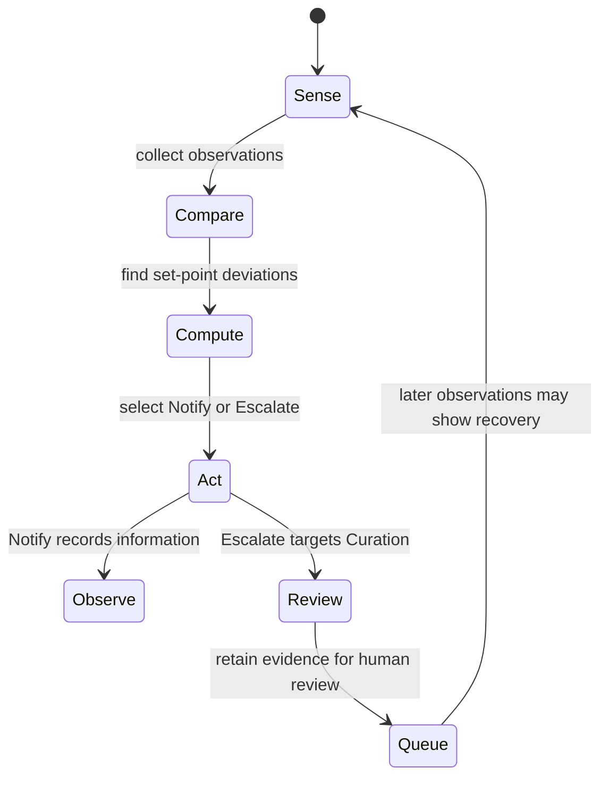
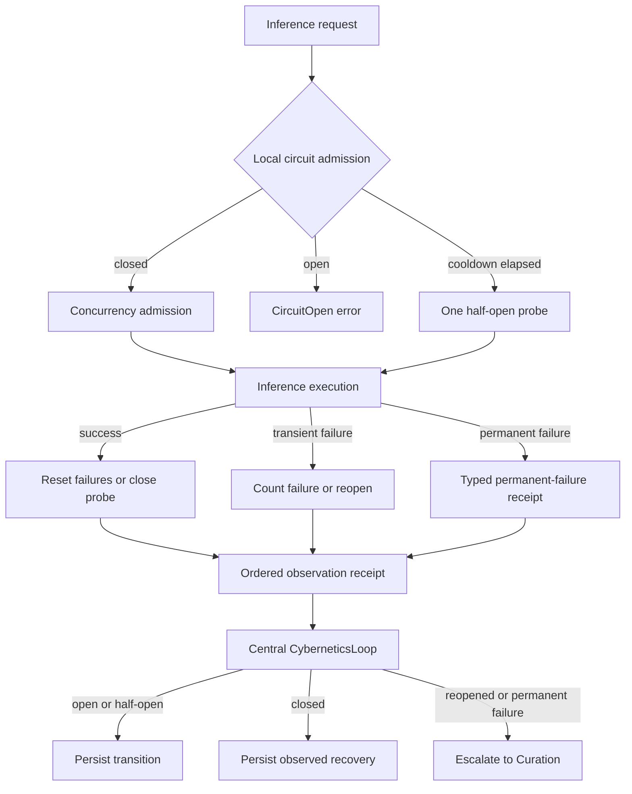
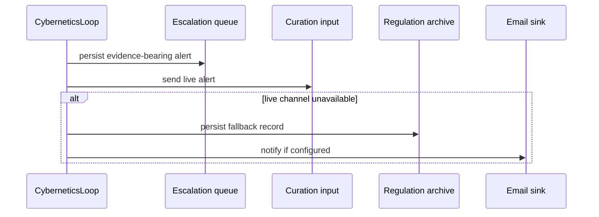

# hkask-regulation — Explanation

`hkask-regulation` is hKask's process-global cybernetic nervous system. It senses
runtime conditions, compares observations with set-points, selects a disposition,
routes evidence, and records outcomes. The `RegulationLedger` retains the model
that the regulator uses to evaluate system health, which follows the Conant–Ashby
requirement that an effective regulator embody a model of the system it
regulates.[^conant-ashby] The ledger and its current health surfaces are defined at
`kask/crates/hkask-regulation/src/runtime.rs:498-609`.

## Why the central loop advises rather than impersonates an actuator

The central action vocabulary is deliberately smaller than the system's complete
response vocabulary. `ActionType` contains only `Escalate` and `Notify` at
`kask/crates/hkask-regulation/src/loops/actions.rs:141-148`. `Notify` records an
informational observation; `Escalate` is accepted only when its target is Curation
and then follows the evidence-bearing review path
(`kask/crates/hkask-regulation/src/cybernetics_loop/cycle.rs:538-558`).

Automatic control belongs beside the resource it can actually govern. The central
loop therefore does not claim generic throttle, circuit-break, calibration,
energy-adjustment, pruning, or substitution dispositions. Keeping detection,
advice, and enforcement distinct prevents an action label from being mistaken for
implemented control.

<!-- DIAGRAM_ALIGNMENT
id: DIAG-REG-005
verified_date: 2026-09-16
verified_against: kask/crates/hkask-regulation/src/cybernetics_loop/cycle.rs:306-447,450-536,538-680; kask/crates/hkask-regulation/src/loops/actions.rs:141-160
status: VERIFIED
-->

The separation also preserves the distinction between observation and causation.
Inference recovery records explicitly carry `"causal_attribution": "unverified"`
at `kask/crates/hkask-regulation/src/cybernetics_loop/cycle.rs:230-250`; seeing a
condition improve does not prove that advice caused the improvement.

## Why inference resilience is local

Inference admission and circuit state live at the Zed-facing inference boundary,
where work can actually be admitted or rejected. The bridge controller owns the
closed/open/half-open state machine, concurrency admission, completion receipts,
and cancellation cleanup
(`kask/crates/kask_bridge/src/inference_resilience.rs:10-58,73-199,202-275`).
`hkask-regulation` exposes a Zed-free observation contract—snapshot, ordered
intervention receipts, permanent-failure receipts, and a cursor—through
`InferenceResilienceSource`
(`kask/crates/hkask-regulation/src/inference_resilience.rs:8-80`). This is the
circuit-breaker pattern placed at the boundary that can stop work.[^nygard]

<!-- DIAGRAM_ALIGNMENT
id: DIAG-REG-007
verified_date: 2026-09-16
verified_against: kask/crates/kask_bridge/src/inference_resilience.rs:10-58,73-199,202-275; kask/crates/hkask-regulation/src/inference_resilience.rs:8-80; kask/crates/hkask-regulation/src/cybernetics_loop/cycle.rs:150-303
status: VERIFIED
-->

The central consumer merges both receipt streams, sorts by the shared event ID,
refuses to acknowledge gaps, and advances its cursor only after the event is
retained or escalated
(`kask/crates/hkask-regulation/src/cybernetics_loop/cycle.rs:178-210,213-296`).
Initial open and half-open transitions remain observations. A close records
observed recovery. A reopen or a typed permanent failure escalates to Curation.
This folds inference resilience into Regulation without inventing an unhandled
central action.

## Why harness-summary acknowledgment follows queue admission

The rollout harness writes ordered `harness_summary` events to the shared event
store. `HarnessRegressionMonitor` scans those events and offers each material
pass-rate regression to `CyberneticsLoop::submit_rollout_impact_check`. The
monitor owns its cursor: a summary that requires an impact check is acknowledged
only after the bounded queue returns `RolloutImpactSubmission::Accepted`.
`QueueFull` preserves both the queue and the monitor cursor at the accepted
contiguous prefix, while any event-store query failure preserves the cursor from
before the poll (`kask/crates/kask_bridge/src/rollout_event_bridge.rs`).

This acknowledgment is admission, not a verdict. The next Regulation tick drains
accepted checks into `verify_impact`; metric assessment and event-store verdict
write-back remain separate later phases
(`kask/crates/hkask-regulation/src/cybernetics_loop.rs`). The production 60-second
scheduler invokes the same behavior-tested `poll_once` operation rather than
assigning a scan cursor before submission (`crates/zed/src/main.rs`).

## Why escalation has several sinks

Escalation is an algedonic channel: it carries a condition that operational
regulation cannot close to policy-level human review, matching Beer's distinction
between operational control and policy oversight.[^beer]

<!-- DIAGRAM_ALIGNMENT
id: DIAG-REG-006
verified_date: 2026-09-16
verified_against: kask/crates/hkask-regulation/src/cybernetics_loop/cycle.rs:574-680; kask/crates/hkask-regulation/src/algedonic.rs:58-102; kask/crates/hkask-regulation/src/loops/core.rs:789-794
status: VERIFIED
-->

The queue is the primary durable review path and is attempted before live delivery
(`kask/crates/hkask-regulation/src/cybernetics_loop/cycle.rs:574-617`). The live
Curation channel is next; the Regulation archive and email sink are fallbacks when
that channel is unavailable
(`kask/crates/hkask-regulation/src/cybernetics_loop/cycle.rs:619-680`). A pending
condition suppresses duplicate delivery rather than flooding every sink.

## Why call caps are separate from inference resilience

`CallCapManager` bounds governed tool invocations per agent, while inference
resilience bounds inference admission. Exhausted call caps are observed before the
per-tick reset and produce a targeted warning for that agent
(`kask/crates/hkask-regulation/src/cybernetics_loop/cycle.rs:450-509`). They never
become a global inference throttle. This separation keeps a local agent's depleted
budget from reducing capacity for unrelated agents.

## See also

- [How to add a Regulation sensor](./how-to.md)
- [hkask-regulation reference](./reference.md)

---

[^conant-ashby]: Conant, R. C., & Ashby, W. R. (1970). *Every good regulator of a control system must be a model of that system.* International Journal of Systems Science, 1(2), 89–97. <https://www.tandfonline.com/doi/abs/10.1080/00207727008902020>.
[^beer]: Beer, S. (1979). *The Heart of Enterprise.* John Wiley & Sons.
[^nygard]: Nygard, M. T. (2018). *Release It!* (2nd ed.). Pragmatic Bookshelf.
