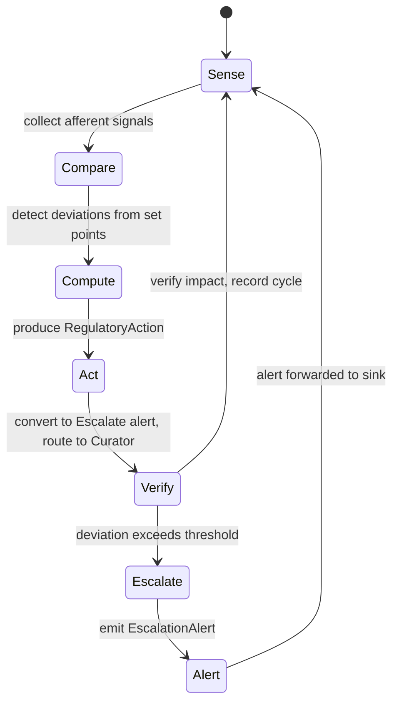

# hkask-regulation — Explanation

The Regulation system is hKask's cybernetic nervous system. It implements a
homeostatic loop that senses agent behavior, compares it against set points,
computes corrective actions, acts on them, and verifies the impact. The design
follows the Conant-Ashby Good Regulator theorem: the regulator must model the
system it regulates. The `RegulationLedger` is that model — it records every
`RegulationCycleEntry`, holds the `VarietyMonitor`, and exposes health
snapshots that the `MetacognitionLoop` senses.

## Source citations

| Symbol                                       | Location                                                   |
| -------------------------------------------- | ---------------------------------------------------------- |
| `RegulationCycleEntry` (captures all phases) | `kask/crates/hkask-regulation/src/runtime.rs:343`          |
| `RegulationLedger`                           | `kask/crates/hkask-regulation/src/runtime.rs:423`          |
| `CyberneticsLoop`                            | `kask/crates/hkask-regulation/src/cybernetics_loop.rs:75`  |
| `MetacognitionLoop::run`                     | `kask/crates/hkask-regulation/src/metacognition.rs:212`    |
| `MetacognitionLoop::tick`                    | `kask/crates/hkask-regulation/src/metacognition.rs:223`    |
| `VarietyMonitor`                             | `kask/crates/hkask-regulation/src/runtime.rs:276`          |
| `EscalationAlert`                            | `kask/crates/hkask-regulation/src/metacognition.rs:103`    |
| `EscalationTrigger` enum                     | `kask/crates/hkask-regulation/src/metacognition.rs:113`    |
| `ProposedAction` struct                      | `kask/crates/hkask-regulation/src/regulation_policy.rs:27` |
| `RuntimeAlert`                               | `kask/crates/hkask-regulation/src/algedonic.rs:37`         |
| `AlertSeverity` enum                         | `kask/crates/hkask-regulation/src/algedonic.rs:26`         |

## The homeostatic loop

The `CyberneticsLoop` (`cybernetics_loop.rs:79`) drives the five-phase cycle.
Each phase produces data that the `RegulationCycleEntry` (`runtime.rs:343`)
captures: afferent signals from sense, deviations from compare, actions from
compute, and verified impacts from verify.

<!-- DIAGRAM_ALIGNMENT
id: DIAG-DIA-REG-002
verified_date: 2026-08-06
verified_against: kask/crates/hkask-regulation/src/runtime.rs:343,405; kask/crates/hkask-regulation/src/cybernetics_loop.rs:75; kask/crates/hkask-regulation/src/metacognition.rs:103,113,212,223; kask/crates/hkask-regulation/src/regulation_policy.rs:27
status: VERIFIED
-->

## Why five phases

The five phases (sense, compare, compute, act, verify) map to the classical
cybernetic feedback loop. The sense phase collects observable spans from the
agent's tool invocations and skill executions. The compare phase checks the
collected signals against set points stored in `set_points.rs`. The compute
phase matches `Deviation`s against `RegulationRule`s in `regulation_policy.rs`,
producing `ProposedAction` records (`regulation_policy.rs:27`) that
`CyberneticsLoop::build_regulation_action` converts into `RegulatoryAction`s.
The act phase converts all actions to Escalate alerts routed to the
Curator/human (the loop is a sensor+advisor, not an actuator — see the
[Reference](./reference.md) § "Efferent action dispatch" for the rationale).
The verify phase records the impact and feeds it back to the next sense phase.

The separation of compare and compute is deliberate. Merging them would
conflate detection (what changed) with response (what to do). Keeping them
separate allows the metacognition loop to evaluate whether the responses
are actually improving the system, which is the Good Regulator requirement.

This crate no longer holds a second, per-tool-invocation gate. A `runtime_policy`
module once sat alongside the compute phase, deciding whether an individual _tool
call_ was allowed, blocked, escalated to a human, or logged. It was deleted on
2026-08-12 together with the FIDES taint labels it consumed, because both of its
inputs were constants: no tool was ever labelled anything but `Pure`, and the
untrusted-input flag read context markers the write path had stopped emitting, so
its one prohibition could never fire. `RegulatoryAction` from the compute phase is
now the only decision output this crate produces.

Defense **Layer 5 (information flow control) is absent by decision**, recorded the
same way Layer 3 (instruction hierarchy) is under RR-0010: de-advertised rather
than deployed. The governing entry is
`kask/security/regressions/RR-0053.yaml`, rewritten as an absence check that
forbids re-introducing an inert gate and states the bar a real one must clear.
See [`guard-taint-pipeline.md`](../../architecture/guard-taint-pipeline.md) for
the full rationale.

## The escalation path

When the verify phase detects a deviation that exceeds the algedonic
threshold, the loop transitions to the Escalate state. The
`MetacognitionLoop` (`metacognition.rs:212` for `run`, `:223` for `tick`)
senses a `HealthSnapshot` from the ledger, runs `compare` against
`MetacognitionConfig` thresholds, and emits an `EscalationAlert`
(`metacognition.rs:103`) with an `EscalationTrigger`
(`metacognition.rs:113`) indicating the cause.

The alert flows to the `AlertSink` trait (`metacognition.rs:78`) and, for
critical severities, to the `AlertEmailSink` trait (`algedonic.rs:54`). The
`AlertSeverity` enum (`algedonic.rs:26`) has three levels: `Info`,
`Warning`, and `Critical`. Only `Critical` triggers email escalation —
there is no `Emergency` level.

## Variety monitoring

The `VarietyMonitor` (`runtime.rs:276`) tracks tool and template diversity
per domain via `VarietyTracker` counters. When the variety deficit (expected
minus actual distinct states) exceeds the threshold held in
`AlgedonicManager` (`algedonic.rs`), the monitor flags a variety deficit.
This is a P9 concern: a system that uses only one tool or one template is
brittle, because it lacks the variety to handle novel situations (Ashby's
Law of Requisite Variety).

The variety monitor feeds into the compare phase. A variety deficit is a
deviation from the set point, which triggers the compute phase to produce a
corrective action (typically an `Escalate` action targeting the Curation
loop, per the `VarietyDeficit`/`AboveSetPoint` rule in `regulation_policy.rs`).

## Cybernetic loop health

The `CyberneticsLoop` tracks `LoopMetrics` (delay, gain, fidelity) updated
on each `tick`. These are the five cybernetic feedback-loop properties:

- **Polarity** — negative feedback: a deviation above the set point produces
  a corrective (throttle/escalate) action, not an amplifying one.
- **Delay** — `LoopMetrics::delay_ms` measures sense→act latency; high delay
  degrades stability (oscillation risk).
- **Gain** — `LoopMetrics::gain` measures the corrective action's effect
  size; too low → sluggish, too high → overshoot.
- **Closure** — the verify phase closes the loop by recording impact and
  feeding it back to sense; without it the loop is open-loop.
- **Fidelity** — `LoopMetrics::fidelity_score` measures how accurately the
  ledger's model reflects the regulated system (Good Regulator requirement).

## See also

- [hkask-regulation Reference](./reference.md): class diagram of the ledger,
  cybernetics loop, metacognition loop, call cap, and alert types.
- [hkask-types Explanation](../hkask-types/explanation.md): how the guard
  layer wraps the inference port, which the Regulation loop monitors.
- [`kask/docs/architecture/core/PRINCIPLES.md`](../../architecture/core/PRINCIPLES.md):
  P9 (feedback loops) and the Good Regulator theorem.

---

[^conant-ashby]: Conant, R. C., & Ashby, W. R. (1970). _Every good regulator of a control system must be a model of that system._ International Journal of Systems Science, 1(2), 89-97. <https://www.tandfonline.com/doi/abs/10.1080/00207727008902020>. The Good Regulator theorem: the Regulation system must model the system it regulates, which is why the `RegulationLedger` records every cycle entry.

[^wiener-cybernetics]: Wiener, N. (1948). _Cybernetics: Or Control and Communication in the Animal and the Machine._ MIT Press. The foundational cybernetic feedback loop that the five-phase cycle implements.
