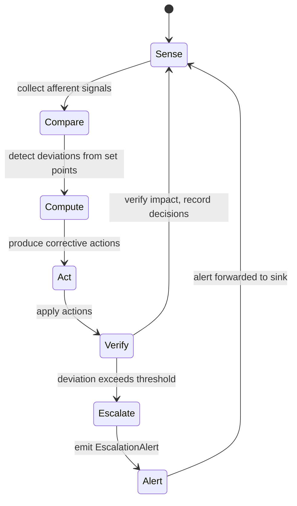

# hkask-regulation — Explanation

The Regulation system is hKask's cybernetic nervous system. It implements a
homeostatic loop that senses agent behavior, compares it against set points,
computes corrective actions, acts on them, and verifies the impact. The design
follows the Conant-Ashby Good Regulator theorem: the regulator must model the
system it regulates. The `RegulationLedger` is that model.

## Source citations

| Symbol | Location |
|--------|----------|
| `RegulationCycleEntry` (captures all phases) | `kask/crates/hkask-regulation/src/runtime.rs:343` |
| `RegulationLedger` | `kask/crates/hkask-regulation/src/runtime.rs:405` |
| `CyberneticsLoop` | `kask/crates/hkask-regulation/src/cybernetics_loop.rs:79` |
| `MetacognitionLoop::run` | `kask/crates/hkask-regulation/src/metacognition.rs:214` |
| `VarietyMonitor` | `kask/crates/hkask-regulation/src/runtime.rs:276` |
| `EscalationAlert` | `kask/crates/hkask-regulation/src/metacognition.rs:103` |
| `EscalationTrigger` enum | `kask/crates/hkask-regulation/src/metacognition.rs:113` |
| `PolicyVerdict` enum | `kask/crates/hkask-regulation/src/runtime_policy.rs:14` |
| `RuntimeAlert` | `kask/crates/hkask-regulation/src/algedonic.rs:37` |
| `AlertSeverity` enum | `kask/crates/hkask-regulation/src/algedonic.rs:26` |

## The homeostatic loop

The `CyberneticsLoop` (`cybernetics_loop.rs:79`) drives the five-phase cycle.
Each phase produces data that the `RegulationCycleEntry` (`runtime.rs:343`)
captures: afferent signals from sense, deviations from compare, actions from
compute, and verified impacts from verify.

<!-- DIAGRAM_ALIGNMENT
id: DIAG-DIA-REG-002
verified_date: 2026-07-27
verified_against: kask/crates/hkask-regulation/src/runtime.rs:343,405; kask/crates/hkask-regulation/src/cybernetics_loop.rs:79; kask/crates/hkask-regulation/src/metacognition.rs:103,113; kask/crates/hkask-regulation/src/runtime_policy.rs:14
status: VERIFIED
-->

## Why five phases

The five phases (sense, compare, compute, act, verify) map to the classical
cybernetic feedback loop. The sense phase collects observable spans from the
agent's tool invocations and skill executions. The compare phase checks the
collected signals against set points stored in `set_points.rs`. The compute
phase produces `ProposedAction` records that the `RuntimePolicy` trait
(`runtime_policy.rs:47`) evaluates into `PolicyVerdict` decisions. The act
phase applies the verdict (allow, deny, or throttle). The verify phase
records the impact and feeds it back to the next sense phase.

The separation of compare and compute is deliberate. Merging them would
conflate detection (what changed) with response (what to do). Keeping them
separate allows the metacognition loop to evaluate whether the responses
are actually improving the system, which is the Good Regulator requirement.

## The escalation path

When the verify phase detects a deviation that exceeds the algedonic
threshold, the loop transitions to the Escalate state. The
`MetacognitionLoop` (`metacognition.rs:214`) evaluates the health snapshot
and emits an `EscalationAlert` (`metacognition.rs:103`) with an
`EscalationTrigger` (`metacognition.rs:113`) indicating the cause.

The alert flows to the `AlertSink` trait (`metacognition.rs:78`) and, for
critical severities, to the `AlertEmailSink` trait (`algedonic.rs:54`). The
`AlertSeverity` enum (`algedonic.rs:26`) has four levels: `Info`,
`Warning`, `Critical`, and `Emergency`. Only `Critical` and `Emergency`
trigger email escalation.

## Variety monitoring

The `VarietyMonitor` (`runtime.rs:276`) tracks tool and template diversity.
When the variety count drops below the threshold stored in
`reg_variety_checkpoint`, the monitor flags a variety deficit. This is a
P9 concern: a system that uses only one tool or one template is brittle,
because it lacks the variety to handle novel situations.

The variety monitor feeds into the compare phase. A variety deficit is a
deviation from the set point, which triggers the compute phase to produce a
corrective action (typically a recommendation to diversify tool usage).

## See also

- [hkask-regulation Reference](./reference.md): class diagram of the ledger,
  metacognition loop, wallet, and alert types.
- [hkask-types Explanation](../hkask-types/explanation.md): how the guard
  layer wraps the inference port, which the Regulation loop monitors.
- [`kask/docs/architecture/core/PRINCIPLES.md`](../../architecture/core/PRINCIPLES.md):
  P9 (feedback loops) and the Good Regulator theorem.
- [`kask/docs/reference/regulation-spans.md`](../../reference/regulation-spans.md):
  cross-cutting span catalog (stale; this document supersedes for the loop
  mechanism).

---

[^conant-ashby]: Conant, R. C., & Ashby, W. R. (1970). *Every good regulator of a control system must be a model of that system.* International Journal of Systems Science, 1(2), 89-97. <https://www.tandfonline.com/doi/abs/10.1080/00207727008902020>. The Good Regulator theorem: the Regulation system must model the system it regulates, which is why the `RegulationLedger` records every cycle entry.

[^wiener-cybernetics]: Wiener, N. (1948). *Cybernetics: Or Control and Communication in the Animal and the Machine.* MIT Press. The foundational cybernetic feedback loop that the five-phase cycle implements.
