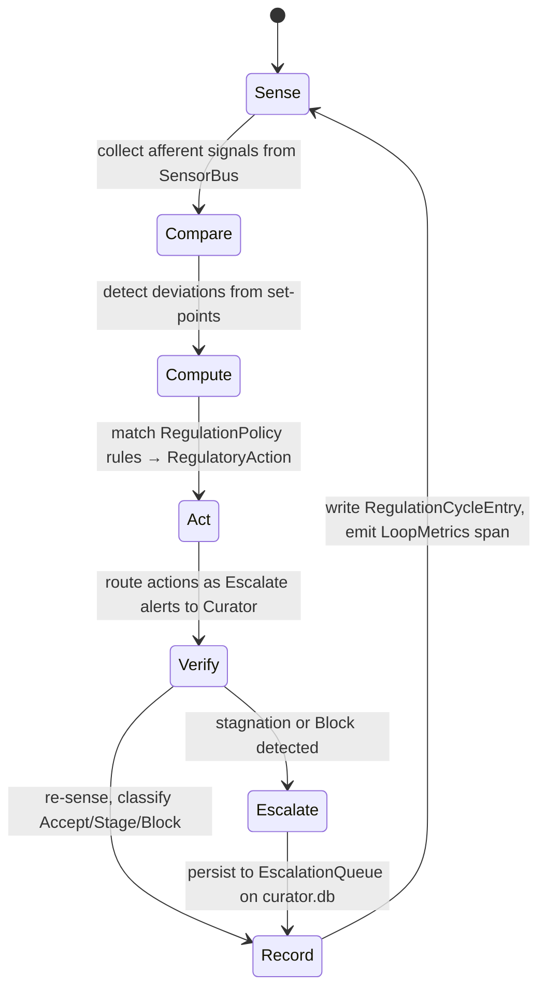
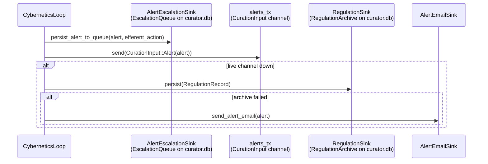

# hkask-regulation — Explanation

The Regulation system is hKask's cybernetic nervous system. It implements a
homeostatic loop that senses agent behavior, compares it against set-points,
computes corrective actions, routes them as alerts, and verifies the impact.
The design follows the Conant-Ashby Good Regulator theorem: the regulator
must model the system it regulates[^conant-ashby]. The `RegulationLedger`
(`runtime.rs:480`) is that model — it records every `RegulationCycleEntry`,
holds the `VarietyMonitor`, and exposes health snapshots that the
`MetacognitionLoop` senses.

## Source citations

| Symbol | Location |
|--------|----------|
| `CyberneticsLoop` struct | `kask/crates/hkask-regulation/src/cybernetics_loop.rs:146` |
| `CyberneticsLoop::tick` | `kask/crates/hkask-regulation/src/cybernetics_loop.rs:721` |
| `CyberneticsLoop::route_action_as_alert` | `kask/crates/hkask-regulation/src/cybernetics_loop/cycle.rs:510` |
| `CyberneticsLoop::verify_impact` | `kask/crates/hkask-regulation/src/cybernetics_loop/cycle.rs:684` |
| `CyberneticsLoop::persist_alert_to_queue` | `kask/crates/hkask-regulation/src/cybernetics_loop/cycle.rs:147` |
| `RegulationLedger` | `kask/crates/hkask-regulation/src/runtime.rs:480` |
| `RegulationCycleEntry` | `kask/crates/hkask-regulation/src/runtime.rs:406` |
| `VarietyMonitor` | `kask/crates/hkask-regulation/src/runtime.rs:319` |
| `MetacognitionLoop::run` | `kask/crates/hkask-regulation/src/metacognition.rs:258` |
| `MetacognitionLoop::tick` | `kask/crates/hkask-regulation/src/metacognition.rs:327` |
| `EscalationAlert` | `kask/crates/hkask-regulation/src/metacognition.rs:107` |
| `EscalationTrigger` enum | `kask/crates/hkask-regulation/src/metacognition.rs:117` |
| `ProposedAction` | `kask/crates/hkask-regulation/src/regulation_policy.rs:85` |
| `RegulationPolicy::decide` | `kask/crates/hkask-regulation/src/regulation_policy.rs:379` |
| `RuntimeAlert` | `kask/crates/hkask-regulation/src/algedonic.rs:41` |
| `AlertSeverity` enum | `kask/crates/hkask-regulation/src/algedonic.rs:30` |
| `Dampener::should_dampen_directive` | `kask/crates/hkask-regulation/src/dampener.rs:181` |
| `StagnationDetector` | `kask/crates/hkask-regulation/src/dampener.rs:231` |
| `CallCapManager::charge_metered` | `kask/crates/hkask-regulation/src/energy.rs:176` |
| `CurationInput` enum | `kask/crates/hkask-regulation/src/loops/core.rs:789` |

## The homeostatic loop

The `CyberneticsLoop` (`cybernetics_loop.rs:146`) drives the five-phase
cycle. Each phase produces data that the `RegulationCycleEntry`
(`runtime.rs:406`) captures: afferent signals from sense, deviations from
compare, actions from compute, and verified impacts from verify.

<!-- DIAGRAM_ALIGNMENT
id: DIAG-REG-005
verified_date: 2026-08-31
verified_against: kask/crates/hkask-regulation/src/cybernetics_loop.rs:146,721; kask/crates/hkask-regulation/src/cybernetics_loop/cycle.rs:253,248,350,408,684,510,147; kask/crates/hkask-regulation/src/runtime.rs:406,480; kask/crates/hkask-regulation/src/regulation_policy.rs:85,379
status: VERIFIED
-->

## Why five phases

The five phases (sense, compare, compute, act, verify) map to the classical
cybernetic feedback loop. The sense phase (`cycle.rs:253`) first drains the
curator-directive inbox via `process_inbox()` (`cybernetics_loop.rs:697`),
then collects observable signals from the `SensorBus`
(`sensor_provider.rs:39`). The compare phase (`cycle.rs:248`) checks each
signal against its set-point via `Deviation::from_signal`
(`loops/signals.rs:256`). The compute phase (`cycle.rs:350`) matches
`Deviation`s against `RegulationRule`s in `RegulationPolicy::default()`
(`regulation_policy.rs:119`), producing `ProposedAction`s
(`regulation_policy.rs:85`) that `build_regulation_action`
(`cycle.rs:1080`) converts into `RegulatoryAction`s.

The act phase (`cycle.rs:408`) converts all actions to `Escalate` alerts
routed to the Curator/human — the loop is a sensor+advisor, not an actuator
(see [Reference](./reference.md) § "Efferent action dispatch"). The verify
phase (`cycle.rs:684`) records the impact and feeds it back to the next
sense phase.

The separation of compare and compute is deliberate. Merging them would
conflate detection (what changed) with response (what to do). Keeping them
separate allows the metacognition loop to evaluate whether the responses
are actually improving the system, which is the Good Regulator
requirement.

## The escalation sequence

When `route_action_as_alert` (`cycle.rs:510`) converts a
`RegulatoryAction` to a `RuntimeAlert`, it routes through three tiers.
The sequence below shows the path for a Critical alert when the live
channel is connected.

<!-- DIAGRAM_ALIGNMENT
id: DIAG-REG-006
verified_date: 2026-08-31
verified_against: kask/crates/hkask-regulation/src/cybernetics_loop/cycle.rs:147,510; kask/crates/hkask-regulation/src/algedonic.rs:84,58; kask/crates/hkask-regulation/src/loops/core.rs:789
status: VERIFIED
-->

The escalation queue is the **primary** durable path — every escalated
alert is written there unconditionally (`persist_alert_to_queue` at
`cycle.rs:147`), so the Curator/user can review pending alerts via the
`curator_escalations` MCP tool and resolve/dismiss them with an audit
trail. The `RegulationArchive` remains as a secondary fallback for restart
durability when the live channel is down. Email fires as notification
(archive succeeded) or last resort (archive failed).

## Why the loop is a sensor+advisor, not an actuator

A design decision recorded in `route_action_as_alert` (`cycle.rs:510`)
makes the cybernetics loop an advisor, not an actuator. All computed
actions are converted to `Escalate` alerts routed to the Curator/human.
Actions that would have been direct efferent signals (`Throttle`,
`CircuitBreak`, `AdjustEnergyBudget`, etc.) carry an `efferent_action`
field in the alert data so the Curator sees what the loop would have done
— but the actuator is not wired (`cycle.rs:531-538`) logs "efferent not
wired").

This preserves user sovereignty: the human decides whether to apply the
recommended action. The loop senses, compares, computes, and recommends;
it does not act unilaterally. The only autonomous action is
`reset_all_caps()` (`cybernetics_loop.rs:689`) at the start of each tick's
act phase (`cycle.rs:409`), which resets every agent's call cap to its
ceiling — this is a bookkeeping operation, not a regulatory intervention.

`Notify` actions are skipped entirely (`cycle.rs:513-521`) — they are
observational ("no action required, positive signal"). Converting them to
Critical alerts would be a variety inversion: a positive signal (e.g., a
storage-usage observation) would generate a critical alert, polluting the
escalation queue with non-actionable noise.

## The two-level meta-loop

The `MetacognitionLoop` (`metacognition.rs:172`) is the Curator's governance
mechanism. It runs sense→compare→compute→act cycles on a background task
(`run()` at `metacognition.rs:258`, default 30s tick via
`DEFAULT_TICK_INTERVAL` at `metacognition.rs:42`). Each cycle senses the
`RegulationLedger`'s health, variety, and effectiveness; compares against
thresholds (variety deficit > 100, critical alerts > 3, effectiveness <
0.5 — `metacognition.rs:45-51`); and decides whether to escalate,
calibrate, or do nothing.

This is the two-level meta-loop stability guarantee: if the Cybernetics
Loop itself becomes unstable (e.g., alert cascade), the MetacognitionLoop
detects it via `HealthSnapshot` (`metacognition.rs:88`) and intervenes with
`EscalationAlert`s (`metacognition.rs:107`). The authority DAG is
Curation → Cybernetics → {Inference, Memory} (`loops.rs:19-20`) — no
sideways edges, authority flows downward.

## Dampening and stagnation

The Curation→Cybernetics→Curation feedback cycle can produce repeated
identical directives. `Dampener` (`dampener.rs:100`) prevents this with two
layers: per-fingerprint dedup (same variant+target within 60s is
suppressed) and override cooldown (after any metacognitive override, ALL
subsequent overrides are suppressed for 120s). The single
`parking_lot::Mutex` lock eliminates the TOCTOU race between the two
checks (`dampener.rs:181`).

`StagnationDetector` (`dampener.rs:231`) catches a different failure mode:
the regulator converging to a wrong attractor. When the same (metric,
action) pair is rejected for `substitution_after` cycles (default 2),
`try_substitute` (`cycle.rs:31`) walks the substitution ladder
(`regulation_policy.rs:589`) to find an untried alternative. When it hits
the per-metric stagnation threshold (default 5), a regulatory-plateau
alert fires — the regulator's model has converged to a wrong attractor,
which is a Conant-Ashby violation.

## The call cap as energy homeostasis

The per-agent call cap (`energy.rs`) is the honest replacement for a
gas hold-settle ritual. One unit = one governed tool invocation. Each
agent has a hard ceiling per regulation tick; the cap resets to the
ceiling each tick via `reset_all_caps()` (`cybernetics_loop.rs:689`).

`CallCapManager::charge_metered` (`energy.rs:176`) is the tool-dispatch
path's entry point. An unregistered agent is auto-registered at
`DEFAULT_RUNAWAY_CALL_CEILING` (10,000, `energy.rs:26`) — a missing
registration is a wiring omission, not an authorization decision. The
single refusal is `CallMeterOutcome::CeilingReached`. Curation can override
an agent's ceiling (`apply_override` at `energy.rs:231`), clear the
override (`clear_override` at `energy.rs:257`), or credit calls (`credit`
at `energy.rs:198`); an override survives per-tick resets until cleared
(`reset_all` re-applies the override ceiling, `energy.rs:216-225`).

The `EnergyBudgetSensor` (`sensor_provider.rs:79`) reads the usage ratio
for its throttle set-point, closing the loop between the call cap and the
regulation policy.

## See also

- [hkask-regulation Tutorial](./tutorial.md): reading a regulation cycle.
- [hkask-regulation How-to](./how-to.md): adding a new sensor.
- [hkask-regulation Reference](./reference.md): class diagram and
  set-points reference.

---

[^conant-ashby]: Conant, R. C., & Ashby, W. R. (1970). *Every good regulator of a control system must be a model of that system.* International Journal of Systems Science, 1(2), 89–97. <https://www.tandfonline.com/doi/abs/10.1080/00207727008902020>.
[^ashby]: Ashby, W. R. (1956). *An Introduction to Cybernetics.* Chapman & Hall. <https://archive.org/details/introductiontocy00ashb>.
[^beer]: Beer, S. (1979). *The Heart of Enterprise.* John Wiley & Sons. The VSM correspondence (Loop 5 = S4 Intelligence, Loop 6 = S3 Control) follows Beer's Viable System Model.
